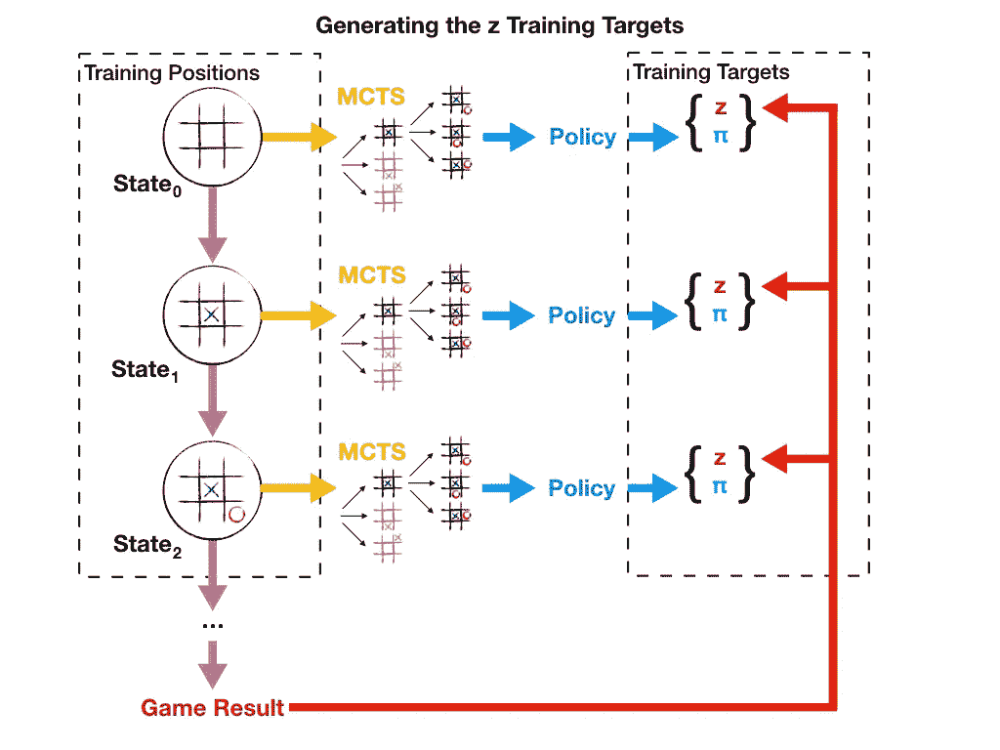
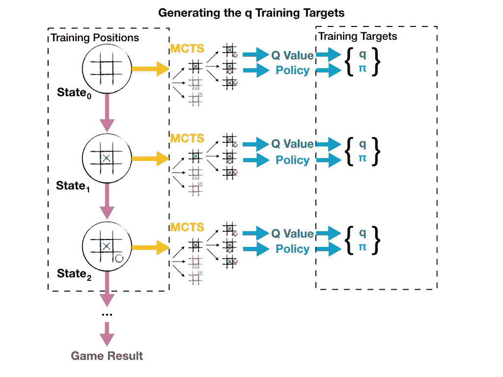
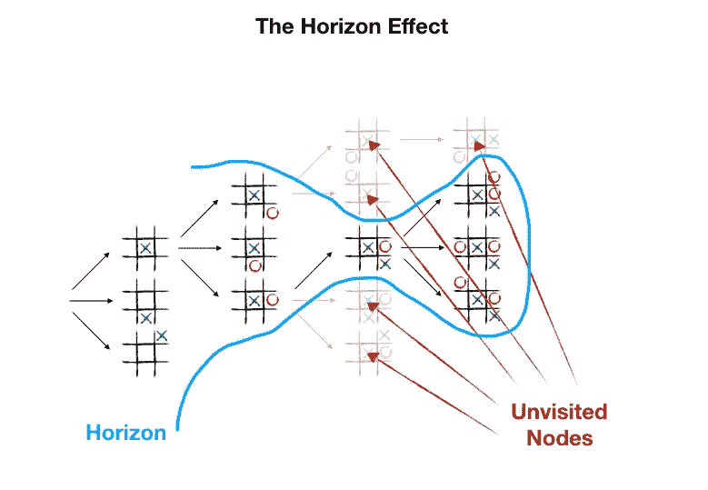
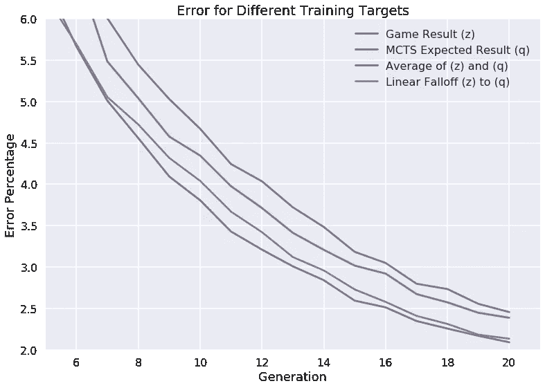

# AlphaZero 的教训(第四部分):提高培训目标

> 原文：<https://medium.com/oracledevs/lessons-from-alphazero-part-4-improving-the-training-target-6efba2e71628?source=collection_archive---------0----------------------->

这是我们关于实施 AlphaZero 的经验教训系列的第四部分。查看 [*第一部分*](/oracledevs/lessons-from-implementing-alphazero-7e36e9054191)*[*第二部分*](/oracledevs/lessons-from-alphazero-connect-four-e4a0ae82af68) *，* [*第三部分*](/oracledevs/lessons-from-alphazero-part-3-parameter-tweaking-4dceb78ed1e5) *。**

*我们 AlphaZero 方法中的一项创新涉及网络价值输出的目标。我们已经为网络的价值输出找到了一个替代的训练目标，它优于 AlphaZero 方法。*

## *培训目标审查*

*原始论文为神经网络指定了两个输出:策略输出和值输出。预测当前游戏位置中的最佳移动的策略输出对照由 **π、**表示的值进行训练，该值是基于自玩期间由 MCTS 搜索累积的访问计数的概率分布。预测游戏结果的值输出对照值 **z** 进行训练，该值是从当前玩家的角度看自玩游戏的结果。换句话说，如果当前玩家最终赢得了对位置进行采样的游戏，则用于训练的 **z** 值将为+1，而如果当前玩家输掉了游戏，则 **z** 值将为-1。平局的比赛得分为 0。如果此描述令人困惑，下图可能会有所帮助:*

**

*让我们解开在 AlphaZero 自玩过程中使用 **z** 生成训练目标的过程。从一个空棋盘开始(玩家 1 移动)，游戏进行如下:*

1.  *从当前状态运行 800 次模拟。*
2.  *根据当前状态的子节点的访问计数生成策略。*
3.  *概率上根据策略下一步棋，产生一个新的状态。*
4.  *为对手执行以上两步。*
5.  *重复，直到游戏结束。游戏结果在{-1，0，1}。*

*在游戏结束时，每个州都被贴上了政策和游戏结果的标签(注意要否定参与人 2 要移动的位置的值)。神经网络的两个输出对照该策略( **π** )和博弈结果( **z** )进行训练。如果 MCTS 模拟部分仍然模糊，这里有一个非常详细的解释。*

## *另一个培训目标*

*训练价值输出还有另一个潜在的目标。在 MCTS 搜索过程中，每个节点通过备份步骤累积游戏的预期结果。这个值被称为节点的 **Q** 值，简单地说就是 **W** / **N** ，其中 **W** 是在模拟过程中沿着树向上传播的总分数，而 **N** 是对节点的访问次数。搜索树的根节点代表游戏中的当前位置，因此它的 **Q** 代表游戏从该位置的预期结果。当我们保存基于访问计数的 **π** 值时，我们也可以将这个根节点的 **Q** 值保存为 **q** ，并根据 **q** 而不是 **z** 来训练网络。使用 **q** 生成训练目标的过程如下所示:*

**

*生成这个训练目标的自演步骤与上面列出的五个步骤完全相同。唯一的区别是游戏结束时的标签过程。不是使用游戏结果，而是用策略和根节点的 Q 值来标记每个状态。针对该策略( **π** )和 Q 值( **q** )训练神经网络的两个输出。*

*类似的目标被用于[深度学习和树搜索的快速和慢速思考](https://arxiv.org/abs/1705.08439)，有一个关键的区别。他们的 MCTS 使用完整播放，而 AlphaZero 使用截断策略，直接备份来自神经网络预测的值，而不是为每次模拟播放游戏。作者建议这个训练目标是一个很好的代表 **z** ，但是需要一个更小的数据集才是有意义的。*

***z 和 q 的区别***

*当使用 **z** 或 **q** 进行训练时，我们试图将从 MCTS 学到的信息编码到网络中，但这两种方法之间存在有意义的差异。针对 z 的训练试图通过将决赛中的所有模拟浓缩为一个单独的离散值来编码游戏的预期结果:赢、输或平。相比之下，针对 **q** 的训练试图仅使用当前位置的 800 次模拟将游戏的预期结果编码为连续值。*

*基于这些描述， **z** 似乎更胜一筹，但是使用 **z** 有一个很大的缺点:每场比赛只有一个结果，并且这个结果会受到随机性的严重影响。例如:想象一下，在游戏的早期，网络采取了正确的行动，但后来却选择了次优的行动，输掉了游戏。在这种情况下， **z** 将为-1，并且训练将错误地将低分与该位置相关联。*

*有了足够的训练数据，人们会希望这些错误被正确的比赛所掩盖。不幸的是，完全根除错误是不可能的，因为网络由于其概率策略而在自玩期间进行探索。我们推测这是在 30 次移动后降低温度对 AlphaZero 如此重要的原因之一。否则，游戏快结束时移动选择的随机性会损害 **z** 的准确性。*

*训练对抗 **q** 不会遭遇随机性问题。网络最终输了比赛也没关系。如果模拟给出一个好的移动结果，网络将针对一个正值进行训练。从某种意义上来说，你可以把 **q** 看作是 800 个自我游戏的平均值而不是一个。这些“游戏”是网络的猜测，因此它们不像 800 个真实的 **z** 值那样准确，但它们可以通过一组小得多的自玩游戏实现比 **z** 值更高的一致性。*

**

*不幸的是， **q** 并不是一个完美的解决方案。它可能会遭受一种叫做“T20 地平线效应”的东西。当模拟返回肯定结果，但是存在刚好超出搜索范围的致命响应，即在 800 次模拟期间没有被访问时，这可能发生。另外 **q** 对于最初几代训练中的早期移动有些无意义，因为网络不知道如何评估位置。在这种情况下， **q** 保持接近 0，可能需要许多代的时间，输出值才会变得有意义。*

***测试新目标***

*我们从上面的分析中得出的结论是, **z** 和 **q** 都有工作的潜力，但是每个都有独特的缺点。根据经验，我们可以使用 **q** 而不是 **z** 来成功训练一个网络。其实对于 Connect Four 这样的短游戏，对 **q** 训练比对 **z** 训练效果略好。但是，我们能利用我们的理解来显著改进 AlphaZero 的方法吗？*

*我们的实验表明，我们可以通过一起使用 **q** 和 **z** 来获得更好的结果。组合 **q** 和 **z** 的一种方法是对每个示例位置进行平均，并使用该平均值来训练网络。这似乎带来了两者的好处: **z** 有助于抵消 **q** 的视界效应，而 **q** 有助于抵消 **z** 的随机性。另一个有希望的方法是从针对 **z** 的训练开始，但是经过几代之后线性下降到 **q** 。*

*在训练 Connect Four 的早期周期中，平均和衰减的表现一样好。最终，衰减法能够实现比平均法略低的误差百分比。与单独使用 **z** 或 **q** 相比，这两种方法的训练速度都有显著提高。下面您可以看到我们的 Connect Four 模型的前 20 代使用四个目标中的每一个所实现的错误百分比的图表。在线性衰减的情况下，我们开始对第一代使用 100% **z** ，到第 20 代过渡到 100% **q** 。*

**

*我们已经开始尝试使用 **q** 和 **z** 来训练更长时间的游戏，到目前为止，结果看起来很有希望。看到这种方法被应用到更大的 AlphaZero 项目中会很有趣，比如 Leela Chess Zero。*

*第 5 部分现已推出。*