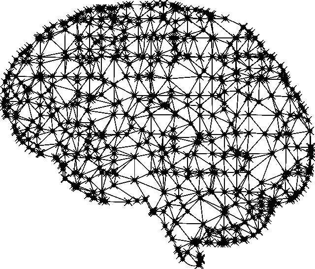

# 实施 AlphaZero 的经验教训

> 原文：<https://medium.com/oracledevs/lessons-from-implementing-alphazero-7e36e9054191?source=collection_archive---------0----------------------->

DeepMind 的 [AlphaZero 出版物](https://arxiv.org/abs/1712.01815)是棋盘游戏强化学习(RL)的一个里程碑。该算法在国际象棋、shogi 和 go 中实现了超人的性能，每个游戏都有不到 24 小时的自我游戏，除了规则之外，几乎没有使用任何专业或硬编码的游戏知识。

我们认为以新的方式复制和扩展他们的结果是有益的，在这个过程中发现各种选择如何影响算法的性能。机器学习作为一个整体只是慢慢地被放在坚实的理论基础上，所以探索新的方向通常会有很多收获。

本文是我们分享探索过程中收集的见解的系列文章中的第一篇。

对于这第一篇文章，我们将只给出一个未经修改的 AlphaZero 算法的概述。我们不会让你自己去阅读这篇论文，而是尝试用一种相对来说是 RL 新手也能理解的方式来展示它，链接到外部资源以获得更多细节。

在高层次上，它使用由深度残差神经网络(或“ResNet”)支持的修改的蒙特卡罗树搜索(MCTS)。AlphaZero 与自己对弈，每一方选择 MCTS 选定的棋步。这些自己玩的游戏的结果被用于不断改进 ResNet。自我游戏和 ResNet 训练同时进行，相互促进。

让我们打开包装，从 ResNet 开始。

# **神经网络**

[ResNet 架构](https://arxiv.org/abs/1512.03385)是一种训练深度网络的流行方式，通常用于图像识别。对于 AlphaZero 的网络，输入是板状态，有两个输出:

1.  头寸的估计**值** (v)，范围从 1(赢)到-1(输)。
2.  用于进行每个下一个可能动作的先验概率的向量。

网络被随机初始化。在一些自我游戏发生后，训练数据包括从玩的游戏中随机选择的棋盘位置，以(棋盘状态、游戏结果、来自 MCTS 的儿童访问计数)的形式。

# MCTS

[这个视频](https://www.youtube.com/watch?v=UXW2yZndl7U)很好地展示了标准 MCTS。为了在给定棋盘位置的情况下选择一步棋，我们要重复 800 次下面的算法。我们构建了一个树，最初只有一个节点(代表当前的板状态)。

1.  从根节点开始(当前板状态)。走向在利用当前信息和探索新动作之间给出最佳权衡的孩子(由 UCB1 公式形式化)。递归直到你碰到一个叶子节点。
2.  如果这是第一次访问该节点，执行一个卷展栏:随机模拟移动直到游戏结束，然后使用游戏结果更新从叶到根的所有节点的值。
3.  如果是第二次访问，展开它(即创建它的子对象)，访问+展示其中一个。
4.  没有第三次访问，因为它不再是叶节点。

在 AlphaZero 中，滚动由从神经网络获取预测代替，UCB1 由 PUCT(多项式上置信树)代替。算法看起来是这样的:

1.  从根开始。走向得分最高的孩子。递归直到你碰到一个叶子节点。
2.  在第一次访问时，调用神经网络获取(1)估计的游戏分数(或*值*、 **v** )和(2)访问每个孩子的建议概率( **p** )，以用于 PUCT。创建孩子，但不要访问他们。
3.  没有第二次访问。

# 把它绑在一起

MCTS 迭代 800 次后，通过选择被访问最多的孩子来选择一步棋。然后另一方用同样的方法玩。这种情况一直持续到游戏结束。在这一点上，游戏中的每个棋盘位置都标有游戏分数，并且儿童访问计数。这些样本被添加到 ResNet 的训练集中。随着 ResNet 的训练，它被用于随后的 MCTS 自我发挥。

这种在 MCTS 自弹自唱和 ResNet 培训之间的来回是非常强大的。ResNet 有助于归纳从 MCTS 学到的知识，而 self-play 使用这些归纳的知识来更深入地学习游戏。正如我们在论文中看到的，这使得 AlphaZero 基本上胜过了所有现有的算法——其中最好的算法是在各自游戏大师的帮助下精心手工调整的。

这是对 AlphaZero 培训的一个非常粗略的概述。我们已经忽略了过多的细节，我们将在接下来的几集里探讨。

敬请期待！

*零件*[*2*](/oracledevs/lessons-from-alphazero-connect-four-e4a0ae82af68)*[*3*](/oracledevs/lessons-from-alphazero-part-3-parameter-tweaking-4dceb78ed1e5)*[*4*](/oracledevs/lessons-from-alphazero-part-4-improving-the-training-target-6efba2e71628)*[*5*](/oracledevs/lessons-from-alpha-zero-part-5-performance-optimization-664b38dc509e)*，以及* [*6*](/oracledevs/lessons-from-alpha-zero-part-6-hyperparameter-tuning-b1cfcbe4ca9a) *现已出。****