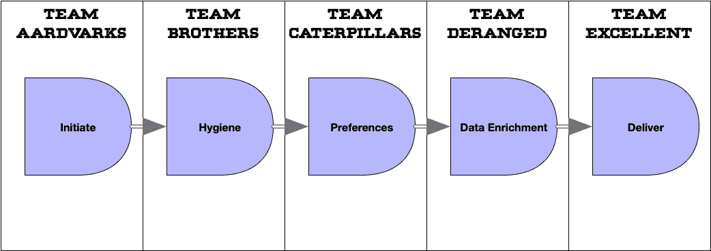
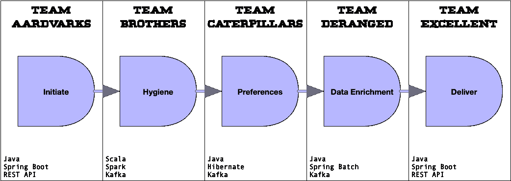
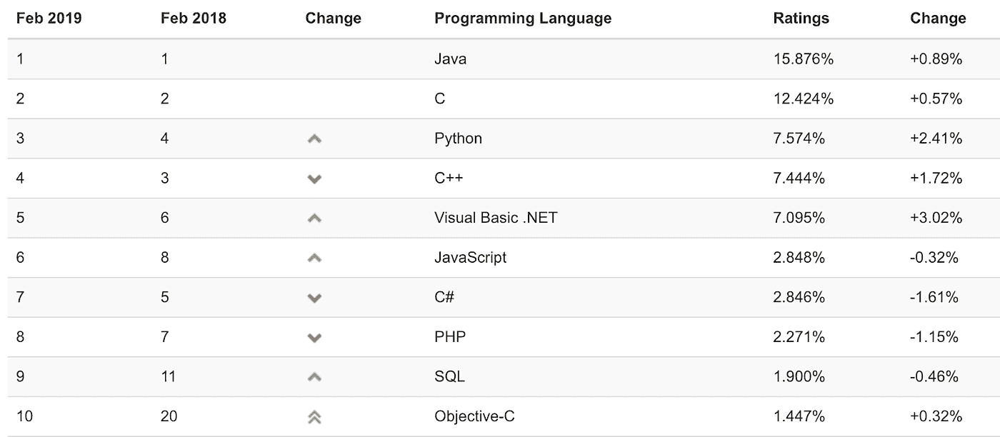

# 我如何为我的团队选择合适的编程语言？

> 原文：<https://medium.com/capital-one-tech/lessons-from-the-leadership-trenches-how-do-i-choose-the-right-programming-language-for-my-team-36222aa78b38?source=collection_archive---------2----------------------->

## 领导层的经验教训

这个系列将让我与你分享一些历史和经历。20 多年来，我一直在开发领域进进出出。作为 Capital One 的一名杰出工程师，我现在的角色是在实际操作的战术开发和战略工作之间上下移动。我的知识是新的，相当广泛，我想与你分享一些想法和观察，以帮助你从一个信息灵通的平台作出决定。

今天，我想写一篇关于技术领导力和帮助你的团队为给定的问题选择正确的编程语言的文章。在一个假想的场景中，假设我们必须构建一个新的 RESTful API 来管理对关系数据库的访问。我们有能力用几乎任何现代编程语言编写这个应用程序。有些团队可能选择 Java，有些可能选择 Go，有些可能喜欢 Python，有些顽固分子可能想用 C 语言(为了性能！).让我们来看看如何合理地做出选择的决定。

# 完全自由与规定的使用

在过去 20 年的软件开发中，发生了很多变化；软件开发的容易程度不是其中之一。今天，我们的工具带中有大量的工具可供使用。然而…

> *“权力越大，责任越大。”——*[*本叔*](https://en.wikipedia.org/wiki/Uncle_Ben)

那么，在为一个新的 web 应用程序选择正确的编程语言时，应该从哪里开始呢？只要在谷歌上搜索“开源网络应用框架”，你就会看到几十种语言的版本。那么如何决定使用哪一个呢？尤其是当在使用一个你知道的*和一个你能学会的*之间做出决定时*会有如此高的风险影响？*

比方说，你用 Python Flask 应用程序开发一个 API，太棒了！你考虑过现在你的团队需要 Python 后端开发人员和 JavaScript 前端开发人员吗？这并不可怕，因为这是一个非常传统的团队设置，但是你会考虑用 JavaScript / Node 构建一个后端吗？JS？

> “在我年轻的时候，我的堆栈的每一层都有一种可行的语言…我对此很满意！”许多干瘪的老开发者都有这种感觉

我在许多组织工作过。每一种都有不同的方法来选择项目使用哪种编程语言。我写这篇文章的目的是帮助你，一个组织中的领导者，当你有机会指导你的团队使用哪种语言时，采取一种立场。让我们通过一些例子来选择合适的编程语言。我们将研究高学习曲线和高效语言(如 C ),并将其与低学习曲线但潜在低效的语言(如 Python)进行比较。

当我们考虑这个范围时，领导者应该考虑努力取得平衡，把工作的各个方面都考虑进去。

# 标准开发语言

让我们从程序员可能使用的语言开始。如果你是一个小商店，你很可能只有一个开发人员，或者是一个由专业人员组成的团队来构建你的应用程序。规模越大，就越有可能有大量的开发团队来解决过多的问题。

> “Jefe，什么是过剩？”— [埃尔瓜坡，三个朋友](https://en.wikiquote.org/wiki/%C2%A1Three_Amigos!)

***文章的其余部分，我们还是站在企业开发或者大型软件商店的立场上来谈吧。*** 我的一般流程是假设你的公司环境看起来像我在 20 年的科技生涯中工作过的大多数大公司一样——有一群开发团队，团队有技术领导，团队被分配一两个功能来工作。

让我用一个真实的例子——我在 Capital One 支持的团队通过数字渠道为我们的客户发送信息。我们每年发送数十亿条信息。可以想象，这是一个相当大的数据处理微服务管道。为了传达信息，我们要遵守法规，尊重顾客的偏好，还要考虑其他卫生方面的活动。管道的简化版本如下所示:

有了这个管道，无论是一系列跨 Kafka/RabbitMQ 提供的微服务([消息总线](/capital-one-tech/stateless-and-dumb-microservices-on-a-message-bus-be78bca93ccb)上的无状态和哑微服务)还是一系列链接的 API，这个流程中都有一堆组件必须执行*以便*传递消息。

在典型的企业方式中，我们有很多团队在这个过程中工作，还有我们平台支持的其他团队。自然地，团队会“拥有”某些组件，但是我们完全支持和鼓励开源/内包开发模式。此外，任何人都可以通过适当的代码审查和拉请求来跟踪/隔离变更。

# BYOL！(自带语言)

现在，让我用一个 ***假想*** 的例子。我的团队已经建立了一个新的平台，它遵循类似的数据管道，但在编程语言和框架方面有一些开发人员的自由。在这个平台上，工程师可以选择 Scala 而不是 Java，或者 Python。每个团队发挥各自的优势，决定用哪种语言或框架编写应用程序。它看起来像下面的东西。

看那个！这是专业工具和代码的完美结合，创造了奇迹。这太棒了！

直到它不再存在的那一天。

就像在我们想象的场景中，团队兄弟，团队清理“卫生”步骤中的数据，都赢得了彩票，发出了通知，并提前退休。没什么大不了的。这只是管道的另一个组成部分，对吗？他们使用 Scala、Spark 和 Kafka 构建了自己的步骤，但我相信其他四个团队的 Java 工程师可以在一夜之间学会。见鬼，Scala 不可能有那么大的不同，对吧？JVM 语言就是 JVM 语言。它们都会编译！

不对。在这种情况下，我们将开始看到生产率急剧下降。Scala 应用程序的性能将开始下降。我们将无法像过去那样快速集成新功能。最终，除非我们雇佣一些 Scala 工程师，否则我们需要完全重写它。

在这个假想的例子中，Scala 是合适的语言吗？

那是..直到它不是。

数据管道设计很好，Scala 非常适合工作负载，Spark Streaming 能够处理大量引用文件的吞吐量。实现是正确的，但是专业语言的问题出现了，因为它影响了*的可维护性*。

在我们想象的例子中，数据清理团队中了大奖，退出了，剩下的团队中没有人知道 Scala。如果函数有任何问题，就必须有人学习足够的 Scala 来更新应用程序。如果这不可行——因为如果你不熟悉 Scala/Spark 的工作方式，更大的更新会有更大的风险——那么你将不得不完全重写它。你可能认为你可以雇佣更多的工程师来涵盖你必须支持的利基语言，但是正如我将在下面展示的，如果你没有使用主流/标准开发语言，这可能比你想象的要难。

# 那么，我们如何选择正确的语言呢？

纵观您的组织，问自己一些问题:

**“如果你是团队的一员，整个团队能支持这种语言吗？”**

*   *如果不是，可能不是正确答案。我总是担心球队中了彩票，决定明天不出现。*

**“如果你是一个大型项目的一部分，项目中的其他团队能支持这种语言吗？”**

*   *如果它是适合工作的语言，需要什么样的投资来培训其他团队如何维护应用程序。*

**“你为什么使用‘新’语言？”**

*   如果你用它来学习，太棒了！但是找到合适大小的任务来尝试一种新的语言，并且放弃使用它来完成任务关键的组件，直到团队完全跟上速度。

**“用例是否倾向于特定的语言结构(功能的、过程的、面向对象的)？”**

*   *流数据可能倾向于过程化，而“商业”应用程序(如 web 应用程序)可能受益于面向对象的语言。*

“雇佣新的开发人员来开发这种语言有多容易？”

*   *当你的明星开发人员赢得彩票后，在公开市场上用其他人代替她会很容易吗？*

看下面的图表。 [TIOBE](https://www.tiobe.com/tiobe-index/) 每年都会整理出一份最受欢迎的编程语言清单。

Top 10 languages from the TIOBE Index, Feb 2019

一门语言能排在这个列表的最前面，假设有很多开发人员在使用这门语言可能是公平的。这将使开发人员更容易适应不同的任务，并允许您在团队发展或更换人员时雇佣新的开发人员。流行度是一个可以用来选择编程语言的标准，但是哪种语言最适合哪种项目呢？下面的内容并不是规定给每个人的，但是当你考虑你的语言选择时，它是一个起点。

## 网络应用

Java—Spring Boot
Python—Django
Javascript—node . js

## REST APIs

Java—Spring Boot
Python—Flask
Javascript—node . js

## 流式数据微服务

Python — pySpark
Scala — Spark

## 数据分析

python-SciPy，Pandas
Java-ml lib，H20

## 桌面应用程序

c#—WPF UWP
斯威夫特—可可

## 移动的

swift-iOS
Kotlin-Android

# 结论

现代软件开发是复杂的，尤其是在开源开发和开发者自由的时代。软件开发人员往往患有闪亮物件综合症，当我们建立一个新项目时，我们希望尝试一些新的和前沿的东西。有时这些动机是好的(合适的工具，合适的工作)，有时它们可能被更多的短期利益所驱动。这取决于我们，我们组织的领导者，来帮助我们的团队平衡他们的决策。

我绝不是提倡你在你的团队中强制推行一种通用的技术解决方案或编程语言。相反，我希望这篇文章能帮助你认识到，当我们构建软件时，需要考虑利弊；尤其是那些有希望拥有一个非常长的、多产的生命周期的软件。

*披露声明:2020 资本一。观点是作者个人的观点。除非本帖中另有说明，否则 Capital One 不隶属于所提及的任何公司，也不被这些公司认可。使用或展示的所有商标和其他知识产权是其各自所有者的财产。*