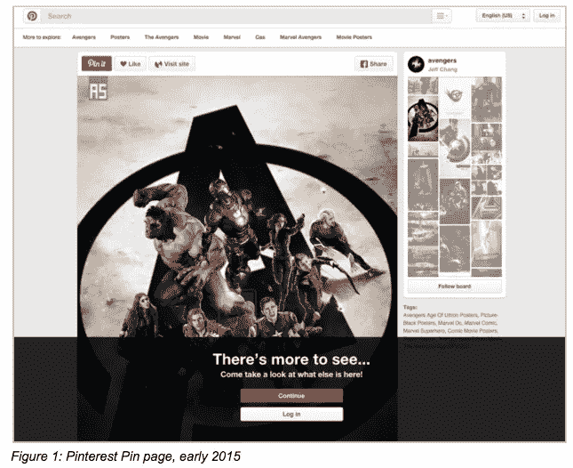
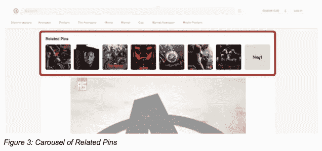
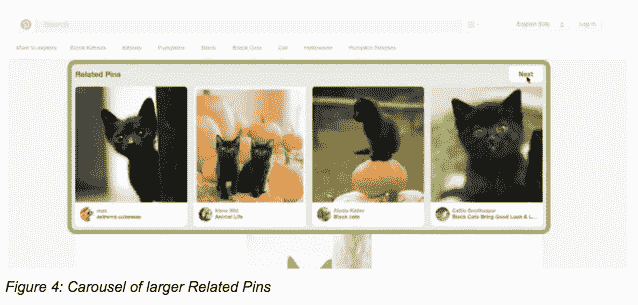
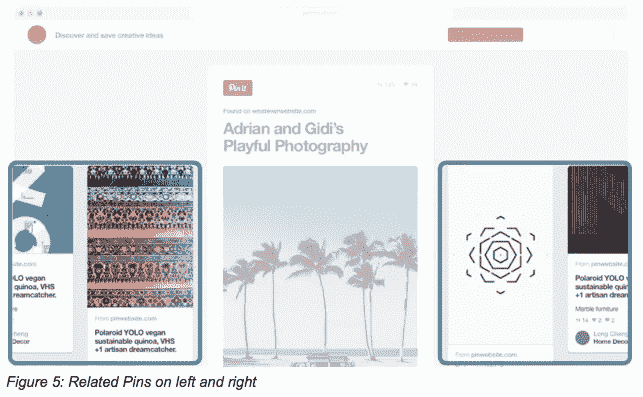
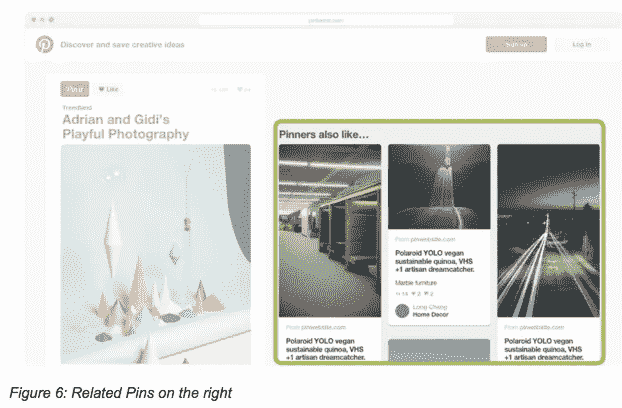
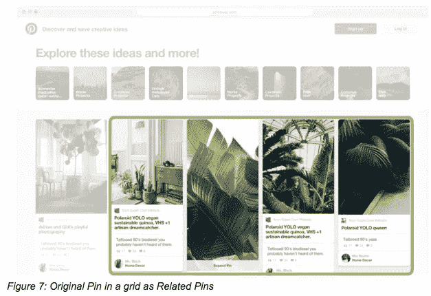
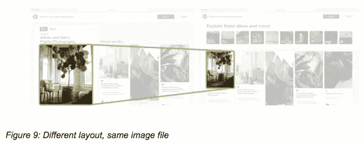

# 成长工程的教训:我们如何从 Pin 登录页面加倍注册

> 原文：<https://medium.com/pinterest-engineering/lessons-in-growth-engineering-how-we-doubled-sign-ups-from-pin-landing-pages-1c0bc400cdb9?source=collection_archive---------2----------------------->

张信哲| Pinterest 工程师，成长

增长黑客圈的一个热门话题是提高登陆页面的转化率。每个人都看过那些“让你的转化率提高三倍的 10 个技巧”的文章，里面充斥着一般的技巧(例如，增加 CTA 的规模)和承诺收益，这些收益通常最多也就很小。我们没有尝试那些一般的策略，而是通过做一件事来加倍页面转化率和增加 SEO 流量:利用数据来更好地了解潜在的 Pinners。

## 改进 Pin 登录页面

提高登录页面转化率的第一步是选择正确的页面。虽然“Pin 页面”(从另一个网站点击 Pin 的登录页面)是我们流量最高的页面之一，但它的转换比其他登录页面差，所以我们在它身上投入了更多的资源。起初，我们没有太多关于页面的哪些部分能有效说服新用户注册的数据，所以我们尝试了一种更简单、更直观的页面布局。

在 [A/B 实验](https://engineering.pinterest.com/blog/building-pinterest%E2%80%99s-ab-testing-platform)中测试了这一新设计后，我们了解到与之前的版本(即控制)相比，它并没有增加注册。也很难从这个设计中吸取经验，因为它与以前的任何版本都不一样。是因为我们把右边的板子换成了相关的引脚吗？是因为滚动后我们没有显示那么多内容吗？在这种情况下，我们了解到通过采取较小的步骤，我们可以从每个新版本中学到更多。

因此，我们尝试了一个更类似于控件的新版本，我们允许 Pinner 在页面顶部的相关 pin 转盘中滑动。

这个版本也表现不佳，但只是略有下降。数据显示，很少有人点击相关的大头针，可能是因为它们很小，很难区分。

接下来，我们尝试将相关的图钉变大，并添加属性，使它们看起来更像普通图钉。

这是一次成功！我们看到了与的大量互动，这导致了更多的注册。我们的假设是，这个版本更好，因为它说明了 Pinterest 上的相关内容，进而显示了注册的价值。我们发布了这个版本，它成为了未来实验中的对照。

然而，我们想看看我们是否能在 Pin 页面上更好地转换 Pinners。因为相关的大头针看起来对新用户很有吸引力，所以我们想通过将它们添加到大头针左右两边通常空白的地方来进一步突出它们。

我们惊讶地发现，这个版本的表现与控制相同。在我们的下一次迭代中，我们尝试了一些更简单的方法，相关的管脚只在管脚的右边。

我们很兴奋地得知这个版本击败了新的控制。但是，我们想做得更好。我们研究了用户行为事件跟踪漏斗，发现那些点击主要大头针(从而转到外部网站)的人几乎没有转化，但那些点击相关大头针(并落在那个大头针的特写镜头上)的人转化率要高得多。因此，我们将主要大头针的大小缩小到与相关大头针相同，并在页面上给相关大头针网格更多的空间。

这个迭代是一个巨大的成功，比之前的控制多了 25 %(这是在之前版本的基础上增加的！).与我们的第一个 Pin 页面相比，这次迭代的转换速度是以前的两倍。我们的第一反应是立即发布，但是我们研究了搜索引擎优化实验，发现流量下降了 10%。(相关帖子: [SEO 实验框架](https://engineering.pinterest.com/blog/demystifying-seo-experiments)。)如果我们发布了这个 Pin 页面，我们会获得净收益(注册人数的增加超过了流量损失)，但我们希望做得更好。

## 转换和搜索引擎优化

当对任何从搜索引擎获得大量流量的页面进行转换时，你必须考虑 SEO 效应。例如，如果一个实验增加了 20%的注册量，但是减少了 50%的流量，结果就是净注册量的损失。

对于这个实验，我们通过各种垂直领域对流量进行了细分，如 web 流量、图像流量和子域流量，并在图像搜索中看到了最大的流量下降。我们比较了两种设计中的图像，发现最大的不同是我们缩小了图像的尺寸。从以前的实验中，我们知道当我们改变页面上的图像时，即使只是大小，图像搜索流量也会受到影响，因为搜索引擎必须重新搜索数十亿的页面。我们运行了另一个 SEO 实验，我们使用了和以前一样的大尺寸图像文件，但是将它缩小到适合较小的 Pin。

这一变化将流量差异从-10%增加到+10%，尽管设计在视觉上看起来是一样的。这种新布局不仅增加了转化率，还增加了页面的流量。这些效应相互叠加，创造了更大的净注册收益。

## 主要经验教训

通过快速和深思熟虑的迭代，我们能够实现双倍的页面转换并增加 SEO 流量。以下是我们一路走来学到的重要经验:

1.  通过分析来自实验的事件跟踪漏斗数据，了解更多关于用户的信息。
2.  使用过去的实验学习来推动新的迭代，而不是尝试“随机”的想法。最好有一个有数据支持的假设，来解释为什么每个新设计会表现得更好。
3.  你迭代的越快，你学习和看到收获的速度就越快。
4.  如果你正致力于转换一个从搜索引擎获得大量流量的页面，运行一个 SEO 实验和一个转换实验是必须的。即使你增加了转化率，你也可能会看到一个流量损失，导致整体净注册损失。

如果你对成长工程感兴趣并且喜欢尝试，请[加入我们的团队](https://careers.pinterest.com/careers/engineering)！

*鸣谢:这些项目是用户获取团队中工程、项目管理和设计部门的共同努力。*