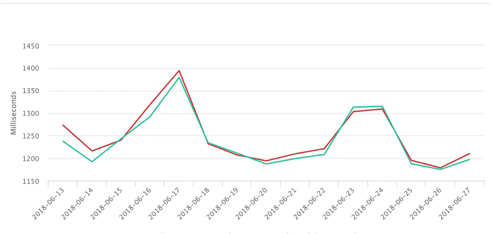
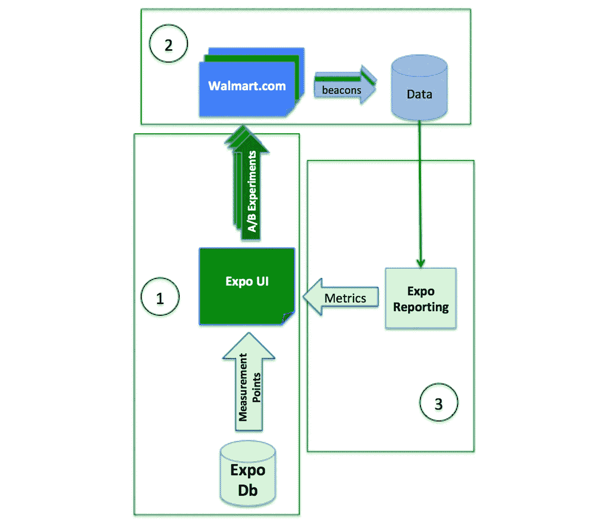

# 在沃尔玛实验室开发 A/B 实验工具的经验教训

> 原文：<https://medium.com/walmartglobaltech/lessons-learned-developing-an-a-b-experimentation-tool-at-walmart-labs-4000b8bab5d?source=collection_archive---------2----------------------->


Photo credit: [Claire05](https://pixabay.com/en/success-challenge-mountain-summit-3521937/)

# 度量挑战

今年，专为沃尔玛应用和网站打造的 A/B 实验平台 Expo 已经成熟了五年。随着这个里程碑而来的是许多挑战，设计一个平台来支持如此大规模的操作和团队数量。在我们工具的早期设计中，我们错过了构建一些基本的好的设计原则。

对于某个特定的功能，我们没有预测该功能在未来会变成什么样，也没有从一个足够灵活的设计开始，来适应未来的发展。作为这种早期设计的结果，这个特性成为了更大的挑战之一，迫使我们在过去几年中经历了许多大小规模的重新设计。这个特性就是*指标*。

为了了解我们是否可以避免，或者至少最小化，大规模的指标重新设计，我们需要首先了解沃尔玛当时的软件环境。我们将在“事物的本来面目”一节中讨论这个问题，因为我们在这个特性的早期设计中进行了自我反思。在深入了解我们做错了什么之前，我需要先解释一下沃尔玛的*指标*到底是什么。



One Metric from Expo

# 韵律学

我是博览会的前端技术负责人。我的团队为沃尔玛的内部用户提供了在各种沃尔玛应用程序和网站上创建、运行和监控实验的界面。

指标是我们工具的核心基础之一，也是工作方式不可或缺的一部分。使用 A/B 测试，您需要能够跟踪用户何时访问页面，或者用户何时接触到页面的不同变体。我们称这种跟踪为*度量*，我们使用这种度量来报告页面的修改版本或变体相对于该页面的默认版本或控件的执行情况。

> 度量与测量点与信标

metric*这个词在过去引起了很多混乱，尤其是在 Expo 团队内部。这是因为根据你处于实验生命周期的哪个阶段，一个指标会有不同的名称。让我首先澄清我们在沃尔玛使用的一些术语，并概述这些术语所处的阶段。*

## 定义

*   **Beacon** 是由来自 Walmart.com 的不同组件在各种页面加载或用户操作下发送的数据对象。
*   **Expo 使用测量点**来跟踪和报告实验的执行情况。信标是一种由测量点评估的数据。
*   **指标**通常是一些数字计数或百分比，显示在报告图形或图表中，提供对实验性能的深入了解。度量是基于测量点的。

A/B 实验有两个需要的主要指标:分配的和合格的。

*   **分配的**是访问沃尔玛应用程序或网站的用户，他们被分配到一个运行实验中(控制或变化)。
*   **合格的**用户已经被分配到一个正在运行的实验中，并且已经访问或看到包含不同变体或处理的页面或元素。

现在，让我们从高层次上看一下这些术语在不同实验阶段的流程。



Expo Metric Flow

在阶段 1 中，设置实验并配置测量点。一旦实验准备就绪，我们就开始它，这意味着它已经为实时流量做好了准备。访问 Walmart.com 的客户)进行分配。在第二阶段，客户被分配到实验和用户体验(例如点进数据)是通过信标捕获的。在第三阶段，用户数据被分析并以指标的形式报告给 Expo！

## 行动和背景

在 Walmart.com 的上下文中，测量点是映射到信标属性的东西。一个信标有许多相关的属性，其中之一是*动作*。*动作*属性与发出信标的页面相关。这意味着有一个事件，在本例中是一个页面加载事件，触发了对信标服务 API 的调用。比如首页有一个“首页”的动作。

在某些情况下，我们可能需要更多关于这个事件的背景知识。信标对象还有一个名为 *context* 的属性。主页上的*上下文*属性简单来说就是*主页*。在其他情况下，*上下文*属性可能更能描述触发它的事件，而不是与动作直接相关。

在 Expo 的早期设计阶段，这两个属性，主要是*动作*属性，构成了工具如何理解测量点和度量的基础。

# 事情的方式

当我四年前加入 Expo 团队时，我们对测量点的定义非常简单。开发各种页面和组件的应用团队将为他们的信标定义*动作*和*上下文*。我们的 Expo 团队将更新我们的工具，以支持新的测量点和指标。这个世界很简单，定义也很明确。

当 UI 需要从时间序列数据库中读取报告数据时，它使用定义好的带有*动作*和*上下文*的指标。当 UI 需要填充测量点下拉字段时，值为*动作*和*上下文*。在我们的整个 UI 中，这两个属性是围绕度量点和度量标准的大部分代码的基础。由于这种早期采用的和简单化的指标定义，UI 和服务中围绕指标的许多早期设计都是围绕*动作*和*上下文*属性硬编码的。

## 一个难以解决的问题

就像软件开发人员的世界中任何硬编码的东西一样，变化意味着新的构建。当每隔几个月才偶尔需要新的度量标准时，这种现实是可以接受的。做一个新的构建并不太麻烦。但是当我们开始在每个 sprint 中收到大量的新指标请求时，它就从一个烦人的任务变成了侵蚀我们生产速度的任务。

下面是几年前我们的服务和 UI 代码的快照。下面的服务代码将*动作*定义为类型安全枚举，Expo 使用这些动作来映射带有信标的测量点。

Service code: Action enumerations

下面是 UI 如何定义要在各种仪表板和实时监视器中显示的指标。

UI code: hard coded Metric

您可以从这段代码中看到，当需要添加新的度量点时，我们必须在服务和 UI 中进行代码更改，为每一个发布新的构建，并进行部署。(你可能在想，也许他们自私地将工作保障嵌入了他们的工具中？)

> 工作保障=每个开发者的梦想？

## 基于配置的解决方案

几年前，我想出了一个设计来解决我们的硬编码问题的前端 UI 部分(是的，我们几年前就部分解决了这个问题，对不起，工作安全)。当时，由于外部系统调用我们的服务，我们没有选项(或足够高的优先级)来重新设计服务枚举代码。我开发的这个解决方案的一部分是基于配置的指标定义模型。这个模型是一个单一的多用途 JSON 结构，由 UI 以下列方式使用:

*   在实验设置表中填充要报告的指标的多选下拉列表(参见分配的中的**定义)**
*   在实验设置表中填充要鉴定的指标的多选下拉列表(参见**鉴定**的定义)
*   用于从三个不同的报告源获取由这些指标生成的分析数据:一个时间序列数据库(kairos)、索引 mapreduced NoSql 数据库(Couchbase)和一个旧的内部流处理系统(mupd8)
*   来自不同报告来源的指标的实时仪表板显示
*   24 小时监控指标数据显示，能够显示来自不同报告源的数据
*   实验结果报告能够显示来自不同报告源的数据

这个解决方案的核心部分是我所谓的“度量定义”模型。这个模型允许我们定义一个度量标准，这个相同的对象可以用于 UI 中上面列出的所有区域。

下面是该模型中定义的一个指标的示例。这个指标是一个名为 *TV View* 的虚构页面，它向访问过沃尔玛网站、被分配到一个实验并导航到这个电视页面的人报告计数。在该模型中，我们拥有与如何**从不同的报告源获取该指标的**数据以及如何**在不同的报告表中显示该指标的**数据相关的属性。

Metric Definition model (JSON)

您可以从示例中看到有许多重复的属性。这个模型被有意设计成一个 Frankenstein 对象，一个由许多其他对象合并而成的 JSON 对象。设计这个模型的目标是提供一个单一的配置点来添加一个新的指标，同时保持使用这些对象的大部分现有代码不变。另一种选择是重构使用这些数据的许多不同的复杂代码。在设计这个特性时，我们权衡了重构的时间和工作量，并决定其成本远远大于使用这个度量定义解决方案的成本。

这个解决方案在过去的几年里非常有效。因为指标定义是基于配置的，这意味着它不需要对 UI 进行代码更改或部署。当我们需要新的指标或者有新的租户想要使用我们的工具时，开发团队很容易添加新的配置，并且对新指标的请求不会频繁到中断我们的日常工作。

> 随着事情的发展，事情也在演变

随着事情的发展，需要一种更精确的方法来确定度量标准。简单的双属性模型(动作和上下文)已经不足以对事件进行更深入的报告。很快就出现了允许实验者挖掘信标对象中这些复杂属性的需求，这样就可以对它们进行鉴定和报告。我们找到了一种动态定义这些指标的方法，而不是不断增长的静态测量点集。

## 事情是这样的

在开发基于配置的解决方案几年后，我们的 Expo 工具看起来非常不同。在过去的一年里，我们的团队设计了一个“智能测量点”，我们已经申请了**专利**。这种设计对于服务中的测量点不再有固定的枚举。测量点是使用一种动态查询表达式语言来识别的(详细内容我将留给我的一个更有能力的队友在以后的文章中讲述)。现在，我只给出一个高层次的概述。

## 静态到动态

大多数实验仍然在 Expo 中设置，测量点配置在这两个原始属性上:动作(a)和上下文(ctx)。它仍然受支持，可以写成如下查询表达式。

```
query_map[‘a’]==’pageview’ and query_map[‘ctx’] == ‘tvpage’
```

然而，这种查询表达式语言的真正强大之处在于，它允许我们深入复杂的信标对象，并匹配更精确的属性。下面是来自 Walmart.com 的电视页面的部分信号。关于这一点，我说部分信标是因为我删除了大约 90%的信标数据来展示一个简单的例子。

```
https://beaconserver/beacon?bla={"bla1":{"i":"123","j":"TV"}}&a=pageview&ctx=tvpage
```

与上述信标匹配的相应查询表达式如下所示。

```
query_map['ctx'] == 'tvpage' and query_map['a'] == 'pageview' and query_map['bla'].indexOf('bla1')>0 and query_map['bla1'].indexOf('i')>0 and (c:extract(query_map['i'],'bla1.i') == '123' or c:extract(query_map['j'],'bla1.j') == 'TV')
```

您可以看到 URL 参数“bla”有一个对象值。在这个对象中，我们希望匹配一组特定的 id，在上面的例子中是“123”或“TV”。

正如您所看到的，挖掘信标对象的查询表达式可能会变得非常棘手。搜索索引匹配，通过关键字、逻辑表达式等提取数据。我向您保证，实现这一点的底层代码同样复杂且经过深思熟虑。该团队在构建这一强大功能方面做得非常出色，这不是一项小任务。

# 小吃和外卖

如果我们在建设世博会的早期阶段就投入了所有这些努力，我们仍有可能把事情搞砸。试图预测五年后的未来行为，尤其是软件行为，可能是个坏主意(试图预测未来人类行为同样糟糕)。此外，在过去五年中，所有前期的设计工作对于 99%的用例来说都是过度设计的。这并不是说智能测量点的早期采用没有达到一定的水平。

## 展望

在设计阶段，一个好的做法是展望未来，如果需要进行重大的重新设计，要意识到成本和影响。但是也要注意不要过度设计。我们有很多功能，我们过度设计了这些功能，但最终却没有用例。

> 设计可以变成自动驾驶汽车的三轮车

## 灵活设计

确保你的初始设计足够灵活，可以让进化发生，也就是说，在你的设计包含枚举的任何时候都要小心。当时我们有充分的理由在我们的服务中构建枚举，主要是为了对外部系统如何使用 API 施加限制。回过头来看，我们本可以用不需要修改代码来添加新动作的方式来实现这些限制。这样的设计能帮助我们更轻松地发展到智能测量点吗？这同样适用于我们 UI 的早期设计，并考虑基于配置的设计，而不是硬编码标准。

## 考虑

当设计影响应用程序基本元素的主要功能时，您应该考虑以下几点:

1.  随着平台的发展，当前设计的最大难点是什么？
2.  提前做一个更加面向未来的设计的成本和权衡是什么？
3.  未来进行重大重新设计的预计成本和工作量是多少？

## 结论

在过去的五年里，世博会走过了漫长的道路。它已经发展了很多，作为沃尔玛的一个平台，每一次都变得越来越成熟。它帮助沃尔玛推出了一些最大的变化，例如 2018 年 5 月推出的网站最新改版。需求将继续发展(希望对我们来说*度量*现在已经完成了发展)。没有什么高超的、经得起未来考验的设计会遏制进化，尤其是在软件领域。你最好的工具是在你的设计中预先考虑周到，并尽量减少你可能将自己硬编码到一个盒子里的方式。