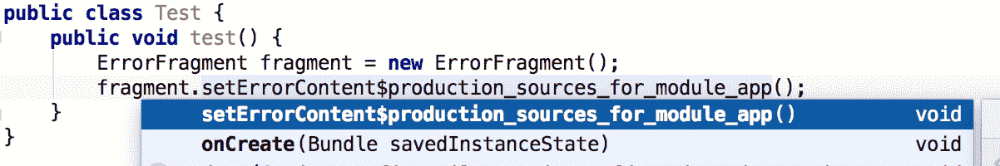
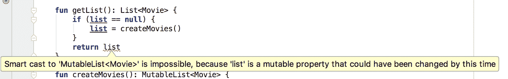

# 使用 Android Studio 转换到 Kotlin 的经验教训

> 原文：<https://medium.com/androiddevelopers/lessons-learned-while-converting-to-kotlin-with-android-studio-f0a3cb41669?source=collection_archive---------2----------------------->

## **使用 Android Studio 提升您的 Kotlin 转换能力**


当我使用 Android Studio 中的[将 Java 文件转换为 Kotlin](https://developer.android.com/kotlin/get-started.html#convert-to-kotlin-code) 工具将一个简单的应用程序从 Java 转换为 Kotlin 时，我很兴奋终于尝试了流行语言 Kotlin。我尝试了一下，这是我转换这个项目的故事。

我很快发现 Android Studio 中的工具可以完美地转换我的大部分 Java 类。有几个地方需要清理，我从转换中学到了一些新的关键字！

我将与你分享这些见解:

*   ***长*** s 变成了 ***int*** s
*   *lateinit* 关键字
*   *内部*关键字
*   伴随物体
*   清理范围
*   惰性装载
*   解构

在我们开始之前，如果你对 Kotlin 代码背后实际发生的事情有疑问，你可以在 Android Studio 中通过进入 ***工具→ Kotlin →显示 Kotlin 字节码*** 来检查它。

## 渴望

我几乎错过了第一个变化，因为它是如此之小。转换器神奇地将我的一个类中的一个 ***long*** 常量换成一个 ***int*** 并在每次使用时将其强制转换回一个 ***long*** 。呀！

```
**companion object** {
    **private val TIMER_DELAY** = 3000
}//...handler.postDelayed(**{
    //...
}**, **TIMER_DELAY**.toLong())
```

好消息是什么？它通过使用 ***val*** 关键字来识别常量。

坏消息呢？在我的整个活动中有不必要的铸造，我期待科特林的类型安全比它更先进。

我以为科特林的类型安全比这聪明。可能转换器还不够智能？

解决这个问题很简单；我只需要在变量声明的末尾添加一个“L”(类似于 Java)。

```
**companion object** {
    **private val TIMER_DELAY** = 3000L
}//...handler.postDelayed(**{
    //...
}**, **TIMER_DELAY**)
```

## 迟做比不做好

Kotlin 最大的特性之一，[空安全](https://kotlinlang.org/docs/reference/null-safety.html)，旨在消除空引用的危险。这是由一个类型系统完成的，该系统区分可以保存 null 的引用(可为 null 的引用)和不能保存 null 的引用(非 null 引用)。

大多数时候你希望你的引用是非空的，这样你就不会遇到 NPE(空指针异常)。

但是，在某些情况下，空引用可能会有所帮助，例如，从 onClick()事件(如 AsyncTask)初始化变量。有几种方法可以处理空引用:

1.  好老的 *if* 语句在访问一个属性之前检查空引用(你应该习惯于那些来自编写 Java 的)。
2.  一个很酷的[安全呼叫接线员](https://kotlinlang.org/docs/reference/null-safety.html#safe-calls)(语法*？。*)，它会在后台为您执行空值检查。如果对象是空引用，则返回空(不是空指针异常)。不再有那些讨厌的 *if* 语句。
3.  使用 ***强制返回一个 *NullPointerException* ！！*** 运算符。因此，您基本上正在编写熟悉的 Java 代码，需要执行步骤 1。

确切地知道哪种模式实施空安全并不容易，因此转换器默认采用最简单的解决方案(选项 3 ),并让开发人员以最适合其用例的方式处理空安全。

我意识到让我的 Kotlin 代码抛出一个空指针异常与这种语言的好处背道而驰，所以我深入研究，看看是否有比我已经发现的更好的东西。

我发现了强大的关键词 ***lateinit*** 。使用 ***lateinit*** ，Kotlin 允许你在构造函数被调用后[初始化非空属性](https://kotlinlang.org/docs/reference/properties.html#late-initialized-properties)，所以我正在远离空属性。

这意味着我得到了上面选项 2 的好处(*？。*语法)而不必写多余的“？."。我只是处理方法，就好像它们从来不是空的，没有样板文件检查，并且使用我习惯使用的相同语法。

使用 ***lateinit*** 是移除 ***的简单方法！！*** 运算符来自你的 Kotlin 代码。有关如何移除 ***的更多提示！！*** 操作符并清理你的代码，查看[大卫·瓦夫拉的帖子](https://android.jlelse.eu/how-to-remove-all-from-your-kotlin-code-87dc2c9767fb?gi=26743d7b8c09)。

## 内部的内部

因为我一次转换一个类，所以我对转换后的 Kotlin 类如何与剩余的 Java 类一起工作很感兴趣。

我听说 Kotlin 已经完成了 Java 互操作性，所以我希望它不会有明显的变化。

在 Kotlin 中，片段中有一个公共方法转换成了一个 [***内部***](https://kotlinlang.org/docs/reference/visibility-modifiers.html) 函数。在 Java 中，该方法没有任何[访问修饰符](https://docs.oracle.com/javase/tutorial/java/javaOO/accesscontrol.html)，所以它是包私有的。

```
**public class** ErrorFragment extends Fragment {
    void setErrorContent() **{
        //...
    }** }
```

转换器识别出没有访问修饰符，并认为通过对[访问可见性](https://kotlinlang.org/docs/reference/java-to-kotlin-interop.html#visibility)应用 ***内部*** 关键字，它应该只在模块/包内可见。

```
**class** ErrorFragment : Fragment() {
    **internal fun** setErrorContent() {
        *//...*
    **}** }
```

这个新关键字是什么意思？查看反编译的字节码，我们很快看到方法名从 *setErrorContent()* 变为*set error content $ production _ sources _ for _ module _ app()*。

```
**public final void** setErrorContent$production_sources_for_module_app() {
   **//...**
}
```

好消息是，在其他 Kotlin 类中，我们只需要知道原始方法名。

```
**mErrorFragment**.setErrorContent()
```

科特林将为我们翻译成幕后生成的名字。再次查看反编译的代码，我们看到了翻译。

```
// Accesses the ErrorFragment instance and invokes the actual method
ErrorActivity.*access$getMErrorFragment$p*(ErrorActivity.**this**)
    .setErrorContent$production_sources_for_module_app();
```

Kotlin 为我们处理了方法名的更改，但是其他 Java 类呢？

从 Java 类中，您不能调用*error fragment . set error content()*，因为那个“内部”方法实际上并不存在(方法名已经改变)。

正如我们在 Android Studio 的智能感知框中看到的那样，setErrorContent() 方法对 Java 类不再可见，所以您必须使用生成的(笨拙的)方法名。



尽管 Kotlin 和 Java 可以很好地协同工作，但是当从 Java 类调用 Kotlin 类时，围绕 *internal* 关键字可能会出现一些意外的行为。

如果您计划分阶段迁移到 Kotlin，请记住这一点。

## 伴侣会使事情复杂化

Kotlin 不允许[公共静态变量/方法](https://kotlinlang.org/docs/reference/classes.html#companion-objects)，这是我们通常在 Java 中习惯的。相反，它有一个[伴随对象](https://kotlinlang.org/docs/reference/object-declarations.html#companion-objects)的概念，处理 Java 中的静态和接口行为。

如果您在一个 [Java 类](https://kotlinlang.org/docs/reference/java-to-kotlin-interop.html#static-fields)中创建一个常量并将其转换为 Kotlin，转换器不会意识到 ***static final*** 变量是打算用作常量的，这会导致 Kotlin 和 Java 之间奇怪的互操作性。

当你在 Java 中需要一个常量时，你创建一个静态的最终变量:

```
**public class** DetailsActivity **extends** Activity {
    **public static final** String ***SHARED_ELEMENT_NAME*** = **"hero"**;
    **public static final** String ***MOVIE*** = **"Movie"**;

    *//...*

}
```

在转换之后，你会看到它们在一个同伴类中结束。

```
**class** DetailsActivity : Activity() {

    **companion object** {
        **val SHARED_ELEMENT_NAME** = **"hero"
        val MOVIE** = **"Movie"** }

    **//...**
}
```

当被其他 Kotlin 类使用时，它的工作方式与您预期的一样。

```
**val** intent = Intent(*context*, DetailsActivity::**class**.*java*)
intent.putExtra(DetailsActivity.**MOVIE**, item)
```

然而，因为 Kotlin 将常量转换成它自己的伴生类，所以从 Java 类访问常量**并不直观。**

```
intent.putExtra(DetailsActivity.**Companion.getMOVIE()**, item)
```

当我们反编译 Kotlin 类时，我们看到我们的常量变成私有的，并通过一个配套的包装类公开。

```
**public final class** DetailsActivity **extends** Activity {
   @NotNull
   **private static final** String ***SHARED_ELEMENT_NAME*** = **"hero"**;
   @NotNull
   **private static final** String ***MOVIE*** = **"Movie"**;
   **public static final** DetailsActivity.Companion ***Companion*** = **new** DetailsActivity.Companion((DefaultConstructorMarker)**null**); **//...**

   **public static final class** Companion {
      @NotNull
      **public final** String getSHARED_ELEMENT_NAME() {
         **return** DetailsActivity.***SHARED_ELEMENT_NAME***;
      }

      @NotNull
      **public final** String getMOVIE() {
         **return** DetailsActivity.***MOVIE***;
      }

      **private** Companion() {
      }

      *// $FF: synthetic method* **public** Companion(DefaultConstructorMarker $constructor_marker) {
         **this**();
      }
   }
}
```

这使得我们的 Java 代码比它需要的更复杂。

好消息是，我们可以通过在同伴类中使用 [***const***](https://kotlinlang.org/docs/reference/properties.html#compile-time-constants) 关键字来修复这些问题，并获得我们想要的行为。

```
**class** DetailsActivity : Activity() {

    **companion object** {
        **const val SHARED_ELEMENT_NAME** = **"hero"
        const val MOVIE** = **"Movie"** }

    **//...**
}
```

现在当我们看反编译的代码时，我们看到了我们的常量！

遗憾的是，我们最终仍然创建了一个空的伴生类实例。😔

```
**public final class** DetailsActivity **extends** Activity {
   @NotNull
   **public static final** String ***SHARED_ELEMENT_NAME*** = **"hero"**;
   @NotNull
   **public static final** String ***MOVIE*** = **"Movie"**;
   **public static final** DetailsActivity.Companion ***Companion*** = **new** DetailsActivity.Companion((DefaultConstructorMarker)**null**); //... **public static final class** Companion {
      **private** Companion() {
      }

      *// $FF: synthetic method* **public** Companion(DefaultConstructorMarker $constructor_marker) {
         **this**();
      }
   }
}
```

我们现在可以像预期的那样在 Java 类中访问常量了！

```
intent.putExtra(DetailsActivity.**MOVIE**, item)
```

注意这只适用于[原语和字符串](https://kotlinlang.org/docs/reference/properties.html#compile-time-constants)。关于非原语的更多信息，请查看 [@JvmField](https://kotlinlang.org/docs/reference/java-to-kotlin-interop.html#instance-fields) 和 [Kotlin 的隐藏成本](/@BladeCoder/exploring-kotlins-hidden-costs-part-1-fbb9935d9b62)。


## **循环受到限制*直到* Kotlin 对其进行改进**

默认情况下，Kotlin 使用 0 转换范围内的循环..N-1 个界限，这可能很难保持，因为有可能引入[一个误差](https://en.wikipedia.org/wiki/Off-by-one_error)。

例如，在我的代码中，有一个嵌套的 *for* 循环，为网格中的每一行/每一列添加卡片；相当典型的 Android *用于*循环。

```
**for** (**int** i = 0; i < **NUM_ROWS**; i++) {
    //...
    **for** (**int** j = 0; j < **NUM_COLS**; j++) {
        //...
    }
    //...
}
```

转换非常简单。

```
**for** (i **in** 0..**NUM_ROWS** - 1) {
    //...
    **for** (j **in** 0..**NUM_COLS** - 1) {
        //...
    }
    //...
}
```

转换后，代码对 Java 开发人员来说可能看起来很陌生，就像是用 Ruby 或 Python 编写的一样。

在阅读了丹·卢的博客后，看来科特林的 range 函数默认是包含的。但是，当我读到 Kotlin 的[靶场特点](https://kotlinlang.org/docs/reference/ranges.html)时，我看到他们的靶场特点极其先进和灵活。

我们可以通过利用 Kotlin 的一些很酷的特性来简化转换后的代码，使其更具可读性。

```
**for** (i **in** 0 *until* **NUM_ROWS**) {
    //...
    **for** (j **in** 0 *until* **NUM_COLS**) {
        //...
    }
    //...
}
```

*until* 函数使我们的循环具有排他性，并且更易于阅读。再也不用担心那个尴尬的负一了！

# 高级技巧的有用提示

## 感觉有点懒

有时延迟加载成员变量是有益的。假设您有一个管理数据列表的单例类。你不需要每次都创建列表，所以我们经常发现自己成为了一个[懒惰的获取者](https://en.wikipedia.org/wiki/Lazy_initialization#Java)。与以下内容类似的模式。

```
**public static** List<Movie> getList() {
    **if** (*list* == **null**) {
        *list* = *createMovies*();
    }
    **return** *list*;
}
```

在转换器尝试转换这种模式后，代码将无法编译，因为它使*列表*不可变，然而 *createMovies()* 的返回类型是可变的*。当方法签名期望不可变对象时，编译器不允许返回可变对象。*



这是一个非常强大的委托加载对象的模式，所以 Kotlin 包含了一个函数， [lazy](https://kotlinlang.org/docs/reference/delegated-properties.html#lazy) ，以方便延迟加载。通过使用 *lazy* 函数，代码现在可以编译了。

```
**val list**: List<Movie> **by** *lazy* **{** *createMovies*()
**}**
```

由于最后一行是返回的对象，我们现在可以很容易地创建一个对象，用较少的样板代码进行惰性加载！

**死亡和毁灭**

如果你熟悉在 [javascript](https://developer.mozilla.org/en-US/docs/Web/JavaScript/Reference/Operators/Destructuring_assignment) 中析构一个数组或对象，那么[析构声明](https://kotlinlang.org/docs/reference/multi-declarations.html)会感觉非常熟悉。

在 Java 中，我们使用对象并一直传递它们。然而，有时我们只需要一个对象的一些属性，却没有花时间将这些属性提取到变量中。

对于大量的属性，从 getter 访问属性更容易。例如:

```
**final** Movie movie = (Movie) getActivity()
        .getIntent().getSerializableExtra(DetailsActivity.***MOVIE***);

// Access properties from getters
mMediaPlayerGlue.setTitle(movie.getTitle());
mMediaPlayerGlue.setArtist(movie.getDescription());
mMediaPlayerGlue.setVideoUrl(movie.getVideoUrl());
```

然而，Kotlin 提供了一个强大的析构函数声明，通过缩短将每个属性分配给自己的变量的样板代码，简化了对对象属性的访问。

```
**val** (_, title, description, _, _, videoUrl) = *activity* .*intent*.getSerializableExtra(DetailsActivity.**MOVIE**) **as** Movie

// Access properties via variables **mMediaPlayerGlue**.setTitle(title)
**mMediaPlayerGlue**.setArtist(description)
**mMediaPlayerGlue**.setVideoUrl(videoUrl)
```

毫不奇怪，反编译的代码是意料之中的，其中的 *componentX()* 方法引用了我们数据类中的 getters。

```
Serializable var10000 = **this**.getActivity().getIntent().getSerializableExtra(**"Movie"**);
Movie var5 = (Movie)var10000;
String title = var5.component2();
String description = var5.component3();
String videoUrl = var5.component6();
```

转换器很聪明，通过析构模型对象来简化代码。然而，我推荐阅读关于 [lambdas with destruction](https://kotlinlang.org/docs/reference/multi-declarations.html#destructuring-in-lambdas-since-11) 。在 Java 8 中，将 lambda 函数的参数放在括号中用于多个参数是很常见的。在科特林，**这可以解释为析构函数。**

**结论**

在 Android Studio 中使用转换工具是我学习 Kotlin 之旅的一个很好的起点。然而，看到产生的一些代码迫使我更深入地挖掘 Kotlin，以找到编写代码的更好方法。

我很高兴在转换后有人提醒我要校对。否则，我会编写一些不容易理解的 Kotlin 代码！话说回来，我的 Java 代码也好不了多少。😊

如果你想了解更多关于 Kotlin 的入门知识，请查看[这篇博文](https://developer.android.com/kotlin/get-started.html)，并观看: