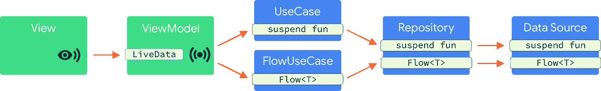

# 在 Android Dev Summit 2019 应用程序中使用协程流的经验教训

> 原文：<https://medium.com/androiddevelopers/lessons-learnt-using-coroutines-flow-4a6b285c0d06?source=collection_archive---------1----------------------->


Illustration by [Virginia Poltrak](https://twitter.com/vpoltrack)

这篇文章是关于我们在[Android Dev Summit(ADS)2019 app](https://play.google.com/store/apps/details?id=com.google.samples.apps.adssched)中使用`[Flow](https://kotlin.github.io/kotlinx.coroutines/kotlinx-coroutines-core/kotlinx.coroutines.flow/-flow/)`时发现的最佳实践；刚刚被[开源的](https://github.com/google/iosched/tree/adssched)。请继续阅读，了解我们应用的每一层是如何处理数据流的。

ADS 应用架构遵循[推荐的应用架构指南](https://developer.android.com/jetpack/docs/guide#recommended-app-arch)，增加了一个领域层(用例),有助于分离关注点，保持类小、集中、可重用和可测试:



Architecture of the ADS 2019 app

像许多安卓应用一样，ADS 应用从网络或缓存中缓慢加载数据；我们发现这是`Flow`的完美用例。对于一次性操作，[暂停功能](/androiddevelopers/coroutines-on-android-part-iii-real-work-2ba8a2ec2f45)更合适。有两个主要的提交来重构应用程序以使用协程。[第一次提交](https://github.com/google/iosched/pull/333/commits/5f5115e21f1cb008b1a6c1d6130104a86f20904b)迁移单次操作，而[第二次提交](https://github.com/google/iosched/pull/333/commits/643e531d00884291d79c6742601e2bd53b9f2ee4)迁移到数据流。

在本文中，您可以找到我们重构应用所遵循的原则，从在架构的所有层中使用`[LiveData](https://developer.android.com/topic/libraries/architecture/livedata)`到仅使用`LiveData`在视图和视图模型之间进行通信，以及在用例和架构的较低层使用协程。

# 1.更喜欢将流公开为流(而不是通道)

在协程中有两种方法可以处理数据流:一种是`[Flow](https://kotlin.github.io/kotlinx.coroutines/kotlinx-coroutines-core/kotlinx.coroutines.flow/-flow/)` [API](https://kotlin.github.io/kotlinx.coroutines/kotlinx-coroutines-core/kotlinx.coroutines.flow/-flow/) 另一种是`[Channel](https://kotlinlang.org/docs/reference/coroutines/channels.html)` [API](https://kotlinlang.org/docs/reference/coroutines/channels.html) 。频道是一种同步原语，而`Flow`是为数据流建模而构建的:它是订阅数据流的工厂。然而，通道可以用来支持一个`Flow`，我们将在后面看到。

> 更喜欢公开流，因为它比通道给你更多的灵活性，更明确的契约和操作符

由于终端操作符的性质，流自动关闭数据流，终端操作符触发数据流的执行，并根据生产者端的所有流操作成功或异常地完成。因此，你不能(几乎同样容易地)泄露生产者方面的资源。这对于通道来说更容易做到:如果`Channel`没有正确关闭，制作方可能不会清理大量资源。

应用程序的数据层负责提供数据，通常通过从数据库读取或从互联网获取。例如[这里有一个公开用户事件数据流的数据源接口](https://github.com/google/iosched/blob/adssched/shared/src/main/java/com/google/samples/apps/iosched/shared/data/userevent/UserEventDataSource.kt):

```
interface UserEventDataSource {
  fun getObservableUserEvent(userId: String): **Flow**<UserEventResult>
}
```

# 2.如何在你的 Android 应用架构中使用 Flow

## 用例与存储库

View/ViewModel 和 DataSource 之间的层(即我们的用例中的 UseCase 和 Repository)通常需要在 ViewModel 层使用之前组合来自多个查询的数据或转换数据。就像 [Kotlin 序列](https://kotlinlang.org/docs/reference/sequences.html)，`Flow`支持大量的操作符来转换你的数据。已经有大量的[操作符可用](https://kotlin.github.io/kotlinx.coroutines/kotlinx-coroutines-core/kotlinx.coroutines.flow/-flow/#extension-functions)，或者您可以创建自己的转换(例如使用`[transform](https://kotlin.github.io/kotlinx.coroutines/kotlinx-coroutines-core/kotlinx.coroutines.flow/transform.html)`操作符)。然而，`Flow`在许多操作符上公开了 suspend lambdas，通常不需要定制转换来完成复杂的任务，只需从你的`Flow`内部调用 suspend 函数即可。

在我们的 ADS 示例中，我们希望将`UserEventResult`与[存储库层](https://github.com/google/iosched/blob/adssched/shared/src/main/java/com/google/samples/apps/iosched/shared/data/userevent/DefaultSessionAndUserEventRepository.kt)中的会话数据结合起来。我们使用`[map](https://kotlin.github.io/kotlinx.coroutines/kotlinx-coroutines-core/kotlinx.coroutines.flow/map.html)`操作符将 suspend lambda 应用于从 DataSource 检索的`Flow`的每个值:

## 视图模型

当使用`LiveData`执行 UI ↔视图模型通信时，视图模型层应使用终端操作符(例如`[collect](https://kotlin.github.io/kotlinx.coroutines/kotlinx-coroutines-core/kotlinx.coroutines.flow/-flow/collect.html)`、`[first](https://kotlin.github.io/kotlinx.coroutines/kotlinx-coroutines-core/kotlinx.coroutines.flow/first.html)`或`[toList](https://kotlin.github.io/kotlinx.coroutines/kotlinx-coroutines-core/kotlinx.coroutines.flow/to-list.html)`)消费来自数据层的数据流。

*参见完整代码* [*此处*](https://github.com/google/iosched/blob/adssched/mobile/src/main/java/com/google/samples/apps/iosched/ui/sessiondetail/SessionDetailViewModel.kt) *。*

如果你正在将一个`Flow`转换成一个`LiveData`，你可以使用来自 [androidX 生命周期 LiveData ktx 库](https://mvnrepository.com/artifact/androidx.lifecycle/lifecycle-livedata-ktx?repo=google)的`[Flow.asLiveData()](https://developer.android.com/reference/kotlin/androidx/lifecycle/package-summary#aslivedata)`扩展函数。这非常方便，因为它将共享一个对`Flow`的底层订阅，并将基于观察者的生命周期来管理订阅。此外，`LiveData`还为后来者保持最新的值，并在配置改变时保持订阅活动。查看这段简单的代码，它展示了如何使用扩展函数:

```
class SimplifiedSessionDetailViewModel(
  private val loadUserSessionUseCase: LoadUserSessionUseCase,
  ...
): ViewModel() { val sessions = loadUserSessionUseCase(sessionId)**.asLiveData()**}
```

*免责声明:*上面的代码片段不是 app 的一部分；这是代码的简化版本，展示了如何使用`Flow.asLiveData()`。

# 3.何时使用广播信道或流作为实现细节

回到数据源实现，我们如何实现上面公开的`getObservableUserEvent`函数？该团队考虑了两种替代实现:构建器或 API。每个服务于不同用例。

## 何时使用流量

`Flow`是一股*寒流*。冷流是一个数据源，它的*生成器*将为每个开始使用事件的侦听器执行，从而在每个订阅上创建一个新的数据流。一旦消费者停止监听或生产者块结束，数据流将自动关闭。

> *当数据生产需要开始/停止以匹配观察者时,*流是一个很好的选择

您可以使用`[flow](https://kotlin.github.io/kotlinx.coroutines/kotlinx-coroutines-core/kotlinx.coroutines.flow/-flow/index.html)`构建器发出有限或无限数量的元素。

```
val oneElementFlow: Flow<Int> = flow {
  // producer block starts here, stream starts
  emit(1)
  // producer block finishes here, stream will be closed
}val unlimitedElementFlow: Flow<Int> = flow {
  // producer block starts here, stream starts
  while(true) {
    // Do calculations
    emit(result)
    delay(100)
  }
  // producer block finishes here, stream will be closed
}
```

Flow 倾向于用于昂贵的任务，因为它通过协程取消提供自动清理。注意，这种取消是合作性的，从不挂起的流也永远不会被取消:在我们的例子中，因为`[delay](https://kotlin.github.io/kotlinx.coroutines/kotlinx-coroutines-core/kotlinx.coroutines/delay.html)`是一个检查取消的挂起函数，当订户停止侦听时，`Flow`将停止并清理资源。

## 何时使用广播频道

一个`Channel`是一个[并发原语](https://kotlinlang.org/docs/reference/coroutines/channels.html)，用于协同程序之间的通信。一个`[BroadcastChannel](https://kotlin.github.io/kotlinx.coroutines/kotlinx-coroutines-core/kotlinx.coroutines.channels/-broadcast-channel/)`是一个具有组播能力的`[Channel](https://kotlinlang.org/docs/reference/coroutines/channels.html)`的实现。

在某些情况下，您可能希望在数据源层中使用`BroadcastChannel`的实现:

> *当生产者和消费者具有不同的生命周期或彼此完全独立运行时，使用 BroadcastChannel】*

当你想让生产者遵循不同的生命周期，并把当前的结果传播给任何听众时，API 是最合适的。这样，生成器就不需要在每次新的侦听器开始使用事件时都启动。

您仍然可以向调用者公开一个`Flow`，他们不需要知道这是如何实现的。您可以使用扩展函数`[BroadcastChannel.asFlow()](https://kotlin.github.io/kotlinx.coroutines/kotlinx-coroutines-core/kotlinx.coroutines.flow/as-flow.html)`将一个`BroadcastChannel`公开为一个`Flow`。

但是，关闭那个`Flow`不会取消订阅。在使用`BroadcastChannel`的时候，你要照顾到它的生命周期。他们不知道是否有监听器，并且将保持资源存活直到`BroadcastChannel`被取消或关闭。确保不再需要时关闭`BroadcastChannel`。此外，请记住，关闭的通道不能再次激活，您需要创建一个新的实例。

如何使用`BroadcastChannel` API 的例子可以在下一节找到。

## 放弃

部分`Flow`和`Channel`API 仍处于实验阶段，它们可能会改变。在某些情况下，您目前可能会使用频道，但未来的建议可能会改为使用`Flow`。具体来说，`[StateFlow](https://github.com/Kotlin/kotlinx.coroutines/pull/1354)`和 Flow 的`[share](https://github.com/Kotlin/kotlinx.coroutines/issues/1261)` [操作符](https://github.com/Kotlin/kotlinx.coroutines/issues/1261)的建议可能会在未来减少`Channel`的使用。

# 4.将数据流基于回调的 API 转换为协同例程

多个库已经支持数据流操作的协同程序，包括 [Room](https://developer.android.com/jetpack/androidx/releases/room) 。对于那些没有的，你可以将任何基于回调的 API 转换成协程程序。

## 流程实施

如果您想转换一个基于流回调的 API 来使用`Flow`，您可以使用`[channelFlow](https://kotlin.github.io/kotlinx.coroutines/kotlinx-coroutines-core/kotlinx.coroutines.flow/channel-flow.html)`函数(还有`[callbackFlow](https://kotlin.github.io/kotlinx.coroutines/kotlinx-coroutines-core/kotlinx.coroutines.flow/callback-flow.html)`，它共享相同的实现)。`channelFlow`创建一个`Flow`的实例，其元素被发送到一个`Channel`。这允许我们提供在不同的上下文中运行或并发运行的元素。

在下面的示例中，我们希望将从回调中获得的元素发送到`Flow`:

1.  用`channelFlow`构建器创建一个流程，它注册一个对第三方库的回调。
2.  将从回调中收到的所有项目发送到`Flow`。
3.  当订阅者停止监听时，我们使用[suspend fun](https://kotlin.github.io/kotlinx.coroutines/kotlinx-coroutines-core/kotlinx.coroutines.channels/await-close.html)将订阅取消注册到 API。

*参见完整代码* [*此处*](https://github.com/google/iosched/blob/adssched/shared/src/main/java/com/google/samples/apps/iosched/shared/data/userevent/FirestoreUserEventDataSource.kt) *。*

## 广播频道实现

对于我们跟踪 Firestore 用户认证的数据流，我们使用了`BroadcastChannel` API，因为我们想要注册一个遵循不同生命周期的认证监听器，并将当前结果广播给正在监听的任何人。

要将回调 API 转换成`BroadcastChannel`，你需要比使用`Flow`多一点的代码。您可以创建一个类，将`BroadcastChannel`的实例保存在一个变量中。在初始化过程中，像以前一样注册向`BroadcastChannel`发送元素的回调:

*参见全码* [*此处*](https://github.com/google/iosched/blob/adssched/mobile/src/main/java/com/google/samples/apps/iosched/shared/data/signin/datasources/FirebaseAuthStateUserDataSource.kt) *。*

# 5.测试技巧

为了**测试流程转换**(正如我们在用例层和存储库层中所做的那样)，您可以使用`flow`构建器来返回假数据。例如:

```
/* Copyright 2019 Google LLC.
   SPDX-License-Identifier: Apache-2.0 */object FakeUserEventDataSource : UserEventDataSource {
  override fun getObservableUserEvents(userId: String) = **flow** {
    emit(UserEventsResult(userEvents))
  }
}class DefaultSessionAndUserEventRepositoryTest {
  @Test
  fun observableUserEvents_areMappedCorrectly() = runBlockingTest {
    // Prepare repo
    val userEvents = repository
          .getObservableUserEvents("user", true)**.first()**
    // Assert user events
  }
}
```

为了**成功测试流程**的实现，一个好主意是使用`[take](https://kotlin.github.io/kotlinx.coroutines/kotlinx-coroutines-core/kotlinx.coroutines.flow/take.html)`操作符从流程中获取一些项目，使用`[toList](https://kotlin.github.io/kotlinx.coroutines/kotlinx-coroutines-core/kotlinx.coroutines.flow/to-list.html)`操作符作为终端操作符来获取列表中的结果。请参见以下测试中的示例:

```
class AnotherStreamDataSourceImplTest {
  @Test
  fun `Test happy path`() = runBlockingTest {
    // Prepare subject
    val result = subject.flow**.take(1).toList()**
    // Assert expected result
  }
}
```

`take`操作员非常适合在你拿到物品后关闭`Flow`。每次测试后不关闭一个已启动的`Flow`(或`BroadcastChannel`)将会泄漏内存，并创建一个脆弱且不一致的测试套件。

**注意:**如果用一个`BroadcastChannel`来完成 DataSource 的实现，上面的代码是不够的。你必须管理它的生命周期，确保在测试前启动`BroadcastChannel`，在测试结束后关闭它。如果没有，你会泄漏内存。您可以在另一个流样本中看到类似的[测试。](https://github.com/manuelvicnt/MathCoroutinesFlow/blob/master/app/src/test/java/com/manuelvicnt/coroutinesflow/fibonacci/impl/NeverEndingFibonacciProducerTest.kt#L38)

测试协程的最佳实践也适用于此。如果您在测试代码中创建了一个新的协程，那么您可能希望在测试线程中执行它，以便确定性地执行您的测试。请在[测试协程 ADS 2019 讲座](https://youtu.be/KMb0Fs8rCRs?t=416)中查看更多相关信息。

# 摘要

*   我更喜欢向消费者公开`Flow`而不是`Channel`，因为`Flow`提供了所有明确的契约和操作符。
*   有了`Flow`，生产者块将在每次有新的监听器时被执行，数据流的生命周期将被自动处理**。**
*   使用`BroadcastChannel`，你可以共享生产者，但是你必须自己管理它的生命周期。
*   考虑将基于回调的 API 转换为协程，以便在应用程序中更好、更习惯地集成 API。
*   通过使用`[take](https://kotlin.github.io/kotlinx.coroutines/kotlinx-coroutines-core/kotlinx.coroutines.flow/take.html)`和`[toList](https://kotlin.github.io/kotlinx.coroutines/kotlinx-coroutines-core/kotlinx.coroutines.flow/to-list.html)`操作符，轻松测试流的实现。