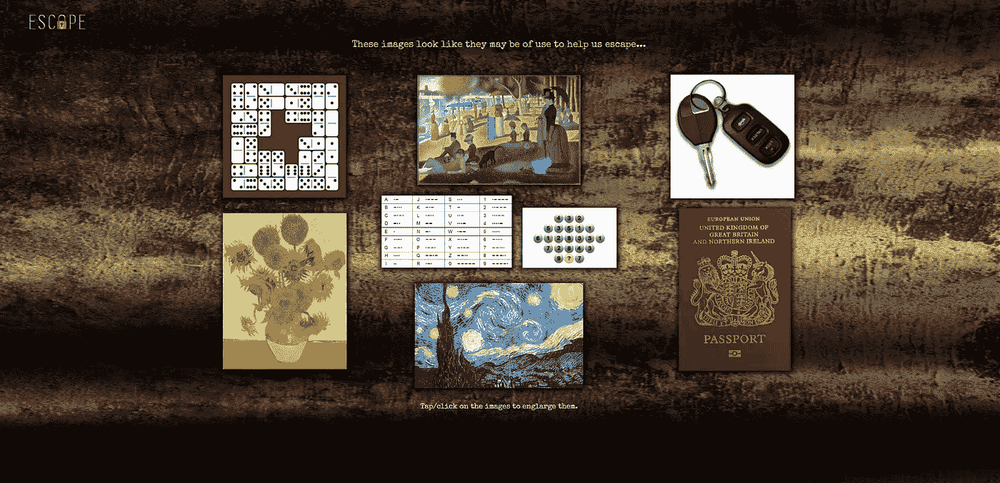

# 让游戏开始——在虚拟环境中建立客户关系

> 原文：<https://medium.com/version-1/let-the-games-begin-building-customer-relationships-in-a-virtual-setting-6de8da6b7506?source=collection_archive---------2----------------------->

在过去的几个月里，许多人都错过了面对面的交流。在与你将密切合作的客户建立关系时，你不能让这一点阻止你。出于这个原因，我们最近举行了一次虚拟活动，来自版本 1 和哈罗理事会的人都参加了活动。您可以在这里找到我们最近宣布的与哈罗理事会签订的关键 IT 支持合同。

为了帮助建立团队之间的关系，我们希望做一些让他们聚在一起的事情，这些事情既有趣又与工作无关。虚拟活动有这么多不同的选择，很难选择哪一个是适合你的，以及与哪家公司合作。我们选择了虚拟逃生室，因为这允许它包容所有人，并且只需要每个参与者的最低要求——一台电脑和一部手机。

晚上开始时，每个人都参加了一个电话会议，会上向他们解释了游戏以及他们需要做什么。然后他们被分成更小的团队，由版本 1 和哈罗理事会的员工组成。这就是竞争力的来源，是时候让游戏开始了。

每个人都下载了一个游戏自带的移动应用程序，并必须选择他们的队长。使用应用程序中的摄像头，参与者需要扫描网页上提供的图像，然后帮助他们获得需要回答的问题和线索。他们必须通过虚拟逃生室的三个阶段，同时需要成功完成一系列问题和挑战。

这是一个非常直观易用的平台，让团队保持参与，同时也让他们在过程中获得乐趣。游戏结束并宣布获胜者后，每个人都可以作为一个整体留在通话中，以便进行进一步的对话，继续相互了解。

与将要共事的客户建立关系始终是创造良好工作环境的重要一步，但当您远程工作且项目中的个人从未见过面时，这一步就更加重要了。这一事件使我们能够在 2020 年 11 月版本 1 接管服务之前开始建立这些关系。

我们非常喜欢举办这次活动，并期待着与哈罗理事会的每个人合作！

为了这个虚拟密室，我们经历了 [AOK 事件](https://www.aokevents.com/)。我很想知道您还通过哪些方式与客户建立虚拟关系！

**关于作者**

*Emily Owen 是 IT 服务提供商* [***版本 1***](https://www.version1.com/) *的活动经理，专注于为客户举办活动，对技术充满热情。*