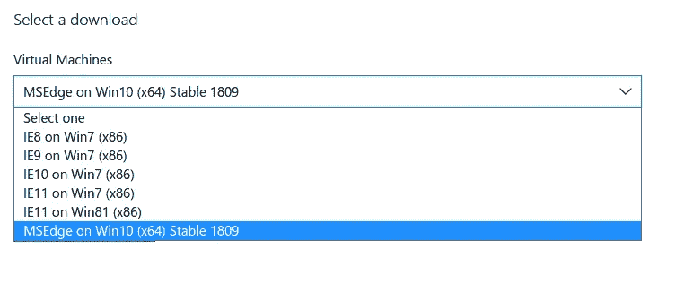
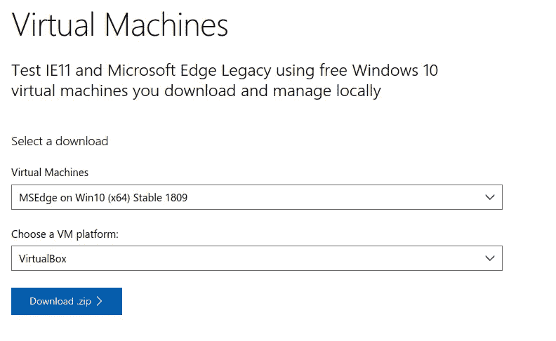
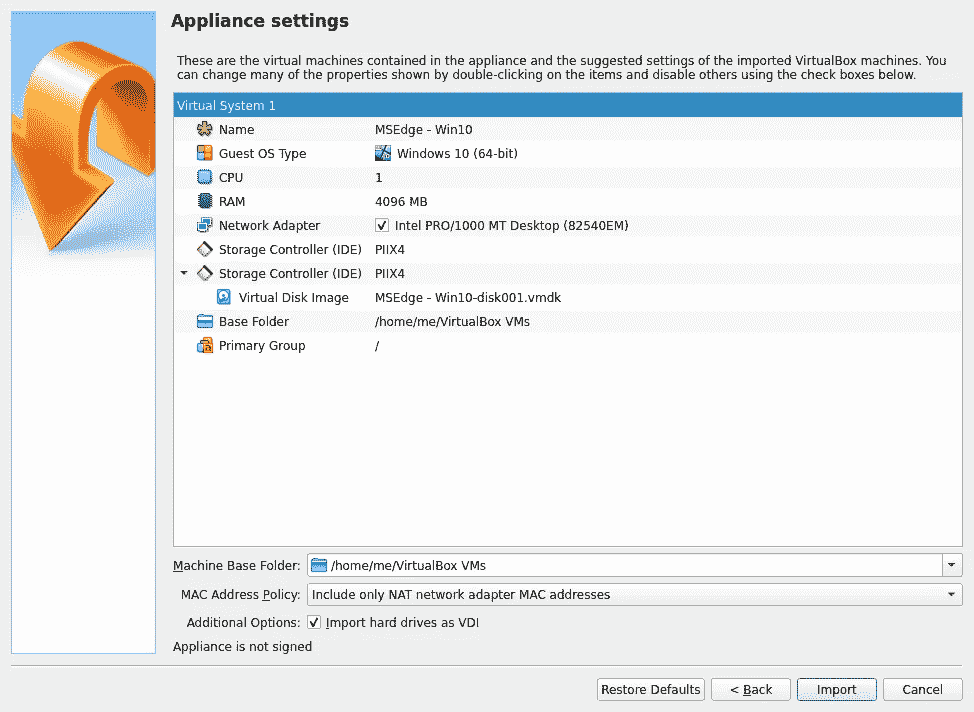
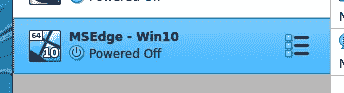
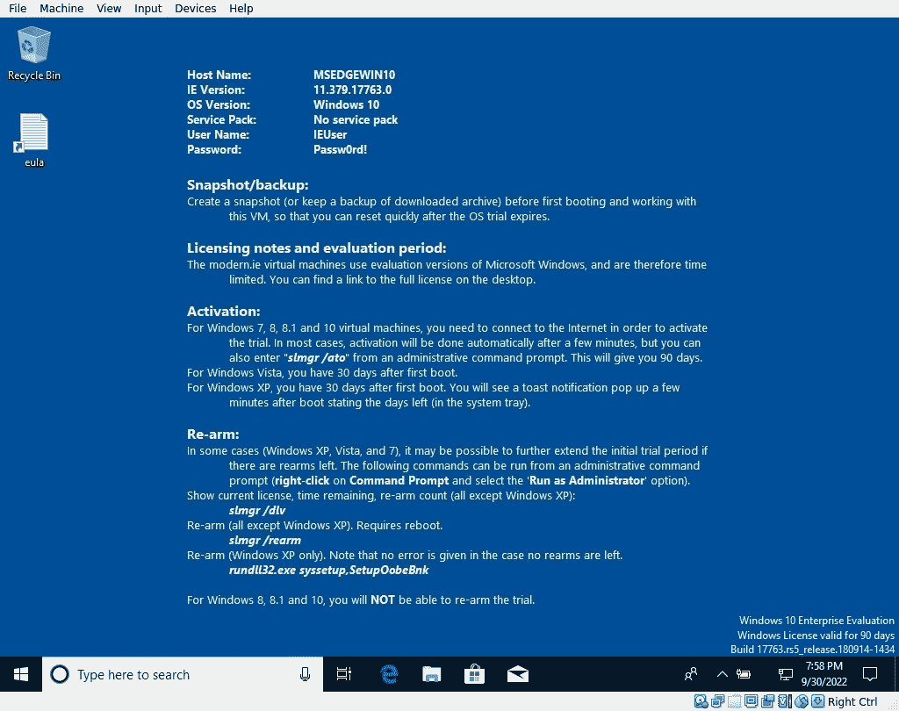
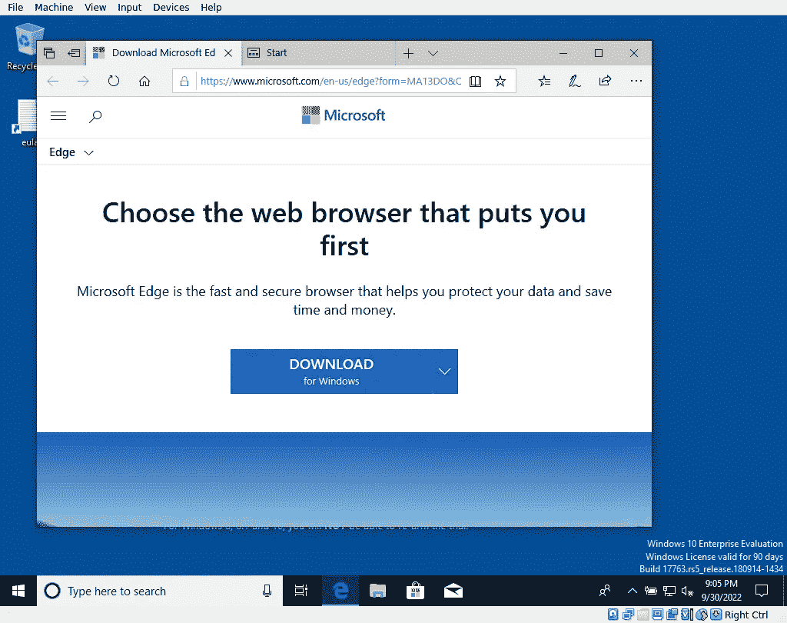
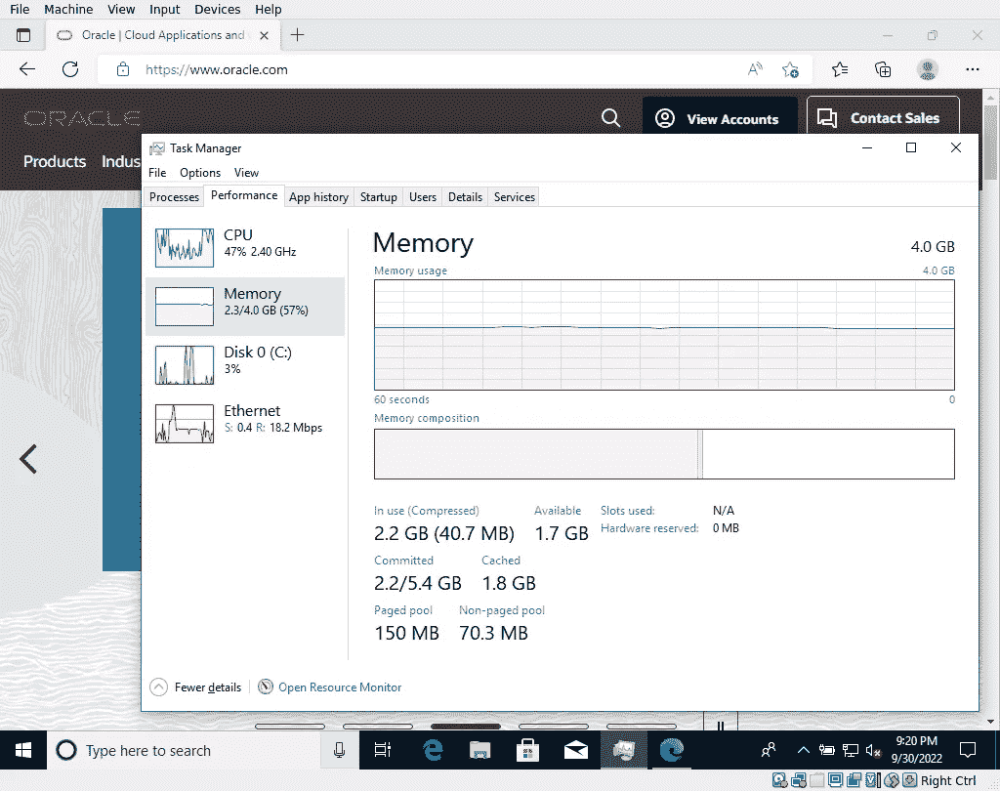
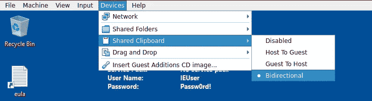

# 让 VirtualBox 为您带来优势

> 原文：<https://medium.com/oracledevs/let-virtualbox-give-you-the-edge-e543f51a8d4?source=collection_archive---------0----------------------->


对于您的下一个 web 应用程序，您现在可以使用各种用于 Oracle VirtualBox 的免费 Windows 虚拟机设备来测试 Internet Explorer 和 Microsoft Edge Legacy 上的兼容性。

现在你可以下载 Linux 版的 Edge 浏览器，但是如果你有兴趣开发更早版本的 Edge 浏览器(或者 Internet Explorer ),那么你也需要更早版本的 Windows 系统。

因此，微软使得在早期的 Windows 操作系统上安装 Edge(或 Internet Explorer)变得容易(而且免费)。

> **注意:这些虚拟机将在 90 天后到期**。

让我们开始吧。

## 从下载开始

从微软这里下载免费的虚拟机设备:

[https://developer . Microsoft . com/en-us/Microsoft-edge/tools/VMs/](https://developer.microsoft.com/en-us/microsoft-edge/tools/vms/)

选择应用程序和相应的操作系统。



现在选择虚拟机平台为 VirtualBox。



从这里，我可以点击下载按钮或使用命令行下载文件。

我将使用命令行，因为我使用的是 Linux 主机。

```
wget https://az792536.vo.msecnd.net/vms/VMBuild_20190311/VirtualBox/MSEdge/MSEdge.Win10.VirtualBox.zip
```

的。zip 文件将是 6.7GB。

现在，一旦文件下载完成，解压缩。

```
unzip MSEdge.Win10.VirtualBox.zip
```

您将提取一个名为“MSEdge — Win10.ova”的 VirtualBox 设备文件。

## 导入文件以创建设备

在这里，您只需要导入文件来创建虚拟机设备。默认设置如下:



默认情况下，CPU 只使用一个内核，但这足以在虚拟机中使用一个网站。

完成后，该设备将在 VirtualBox 管理器中列出，如下所示:



## 启动设备

现在启动它。出现提示时，会要求您输入名为 IEUser 的用户的密码。密码如下:Passw0rd！



## 安装 Edge 浏览器

从状态栏打开默认浏览器，系统会邀请您安装 Edge 浏览器。



下载后，您可以打开任务管理器。

任务管理器将指示虚拟机的资源利用率。



最后，不要忘记启用剪贴板，以便您可以在主机和虚拟机之间进行复制和粘贴。



*Paul Guerin 出席了一些世界领先的甲骨文会议，包括甲骨文 2013 年世界开放大会。自 2015 年以来，他的工作一直是 IOUG 最佳实践技巧小册子以及 AUSOUG、Oracle Technology Network、Quest 和 Oracle Developers (Medium)出版物的主题。2019 年，他被授予 My Oracle 支持社区最有价值贡献者。他将继续参与 Oracle ACE 计划。*