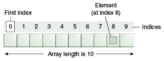

# 什么是阵列？

> 原文：<https://medium.com/quick-code/lets-answer-what-are-arrays-3ac49a4d70e0?source=collection_archive---------0----------------------->

## 让我们回答第二个问题

## 让我们揭开阵列的神秘面纱。


Photo by [Luca Bravo](https://unsplash.com/@lucabravo?utm_source=medium&utm_medium=referral) on [Unsplash](https://unsplash.com?utm_source=medium&utm_medium=referral)

数组是一种数据结构，它将一堆相似类型的数据存储在一个连续的内存位置。这意味着可以在整数索引的帮助下遍历数组元素。



A visualization for Arrays. *Picture source:* ***Oracle***.

每种数据类型占用特定数量的内存。其中一些值是:

```
+----------------+----------------------------+
| **Data types**     | **Memory Occupied(in Bit)**    |
+----------------+----------------------------+
| Boolean        | 1                          |
| Byte           | 8                          |
| Char           | 16                         |
| Short          | 16                         |
| Int            | 32                         |
| Long           | 64                         |
| Float          | 32                         |
| Double         | 64                         |
+----------------+----------------------------+
```

> 在 C 和 C++中，Char 的大小是 8 位，而在 Java 中是 16 位，因为 C 和 C++使用 ASCII 格式，而 Java 使用 Unicode 格式。

**各元素地址计算**

每个元素的地址计算公式是

```
**Address of nth element = Base Address +(n-1)*(size of data type)** 
where 
n is the element you want the address for. 
Base address is the address of element at first element
and size of data type refers to memory occupied by the data type.
```

何时使用数组:

*   当**命令**的数据要紧的时候。
*   当**知道元素个数**且**元素个数固定**时。
*   当**元素的类型相似时**。数组只能保存一种数据类型。

> 注意:在大多数语言中，索引从 0 开始，但在某些语言中，索引从 1 开始。因此，循环的所有限制都将相应改变。
> 
> 数组是最基本的数据结构之一，可以用来实现其他数据结构，如队列、堆栈、堆等。

**对数组的基本操作**

以下是可以在阵列上执行的一些基本操作:

> 在 Java 中，数组由名为 ArrayList 的类抽象。使用这个类是有益的，因为它提供了各种函数，并帮助您编写更好的代码。

**穿越**

遍历意味着打印数据结构的所有元素。

**分拣**

有多种方法对数组进行排序。一些最流行的数组排序方式有冒泡排序、选择排序、合并排序、快速排序、基数排序、堆排序、桶排序等等。排序将在另一篇文章中讨论，因为这是一个非常大的话题。

**搜索**

搜索数组中是否存在元素。如果它存在，它将返回索引，否则将返回-1

**倒车**

颠倒数组的顺序。这意味着最后一个元素将被第一个元素替换。

有更多的操作，如插入，删除，检查它是否是回文等。它们将在后续文章中介绍。

如果您错过了上一篇关于“数据结构导论”的文章，请继续关注更多的文章。一定要看看。本文链接为。