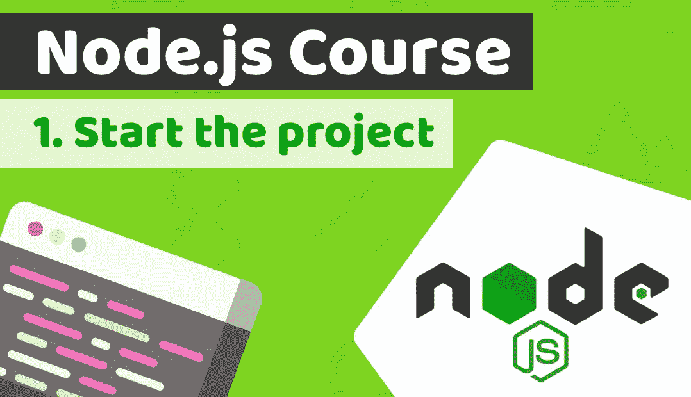

# 让我们用 Node.js、Nest.js、Sequalize 和 PostgreSQL 构建一个银行应用后端——node . js 课程:第 1 课

> 原文：<https://medium.com/duomly-blockchain-online-courses/lets-build-a-banking-app-backend-with-node-js-4283ee8b4aba?source=collection_archive---------0----------------------->

[Duomly — Programming Online Courses](https://www.duomly.com)

本文原载于[https://www . blog . duomly . com/node-js-course-with-building-a-fin tech-banking-app-lesson-1-start-the-project](https://www.blog.duomly.com/node-js-course-with-building-a-fintech-banking-app-lesson-1-start-the-project)

在之前的一周，我和我的朋友开始建立一个分为两个课程的项目——用 Golang 开发[后端，用](https://www.blog.duomly.com/golang-course-with-building-a-fintech-banking-app-lesson-1-start-the-project/)开发[前端……](https://www.blog.duomly.com/angular-course-building-a-banking-application-with-tailwind-css-lesson-1-start-the-project/)