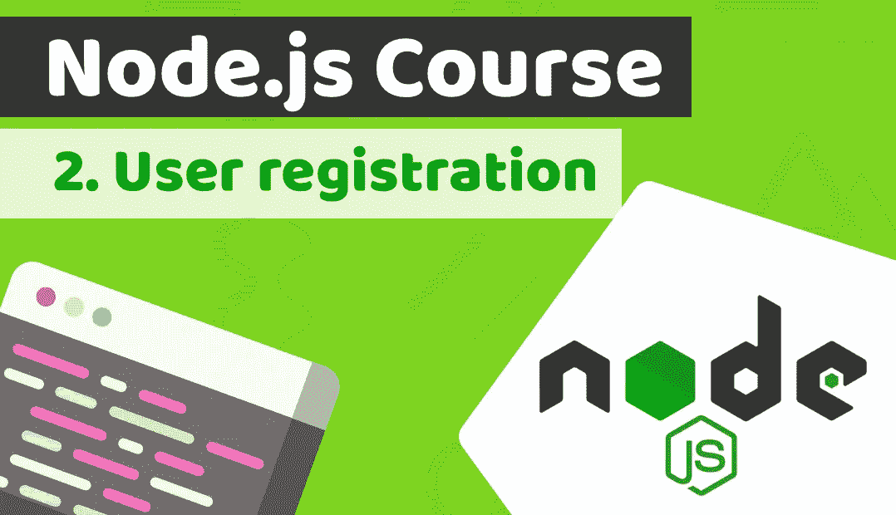

# 让我们用 Node.js、Nest.js、Sequalize 和 PostgreSQL 构建一个银行应用后端——node . js 课程:第 2 课[第 1 部分]

> 原文：<https://medium.com/duomly-blockchain-online-courses/lets-build-a-banking-app-backend-with-node-js-b5e4dfed193c?source=collection_archive---------0----------------------->

[Duomly — Programming Online Courses](https://www.duomly.com)

本文原载于[https://www . blog . duomly . com/node-js-course-with-building-a-fin tech-banking-app-lesson-2-user-registration](https://www.blog.duomly.com/node-js-course-with-building-a-fintech-banking-app-lesson-2-user-registration)

在上周，我发表了[node . js 课程的第一课，](https://www.blog.duomly.com/node-js-course-with-building-a-fintech-banking-app-lesson-1-start-the-project/)我们用 Nest.js 开始了一个项目…