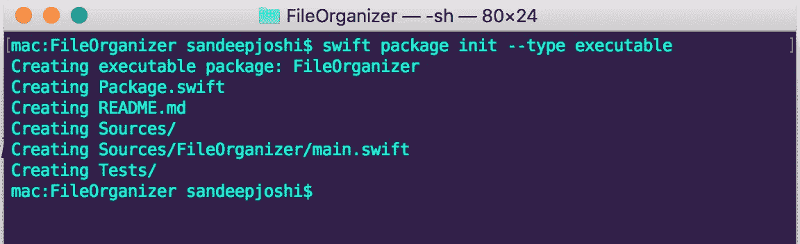
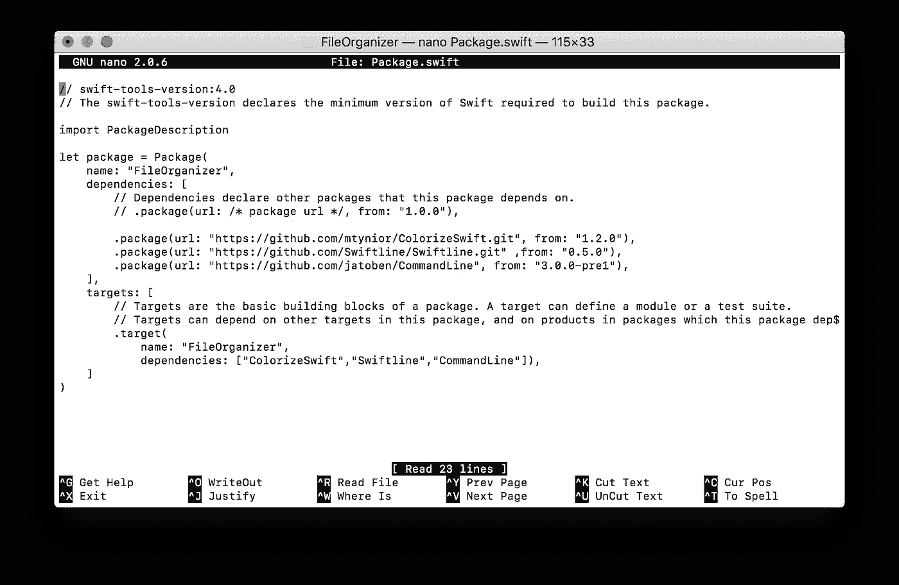
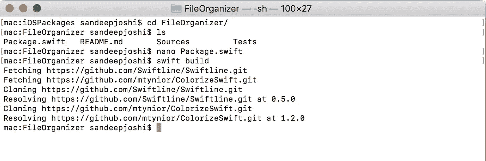
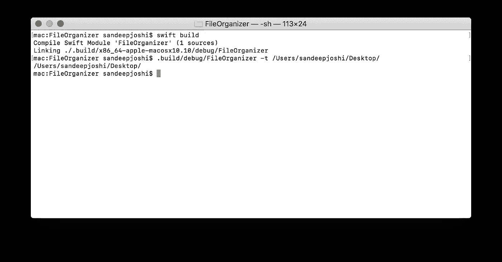
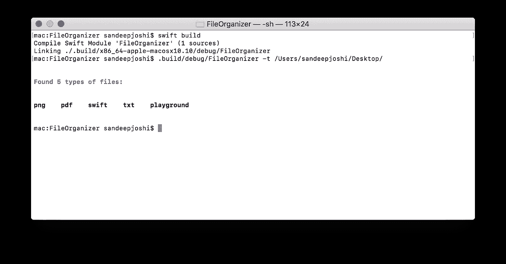
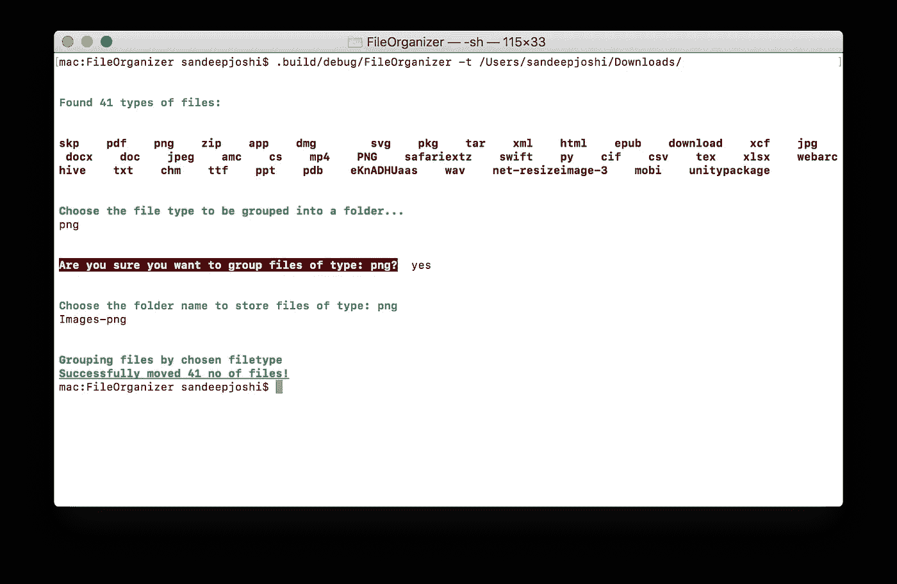

# 让我们在 Swift 中构建一个命令行应用程序

> 原文：<https://medium.com/quick-code/lets-build-a-command-line-app-in-swift-328ce274f1cc?source=collection_archive---------0----------------------->


随着 swift 的开源和服务器端 swift 获得越来越多的关注，使用 Swift 构建的命令行应用程序对于服务器端应用程序来说非常强大。已经有一些库可以帮助构建有用的命令行应用程序，今天我们将探索几个库并构建一个简单的命令行应用程序。

我们将构建一个命令行工具来对特定类型的文件进行分组，并将它们移动到子目录中。例如，将文件夹中的所有 png 文件移动到该文件夹中的子目录中。我们将在 GitHub *上探索来自 [*awesomeiOS 列表的三个包。*](https://github.com/vsouza/awesome-ios#command-line)*

# 正在设置事物…

1.  确保您安装了最新版本的 Swift(4 ),并且您可以使用如下所示的命令`swift --version`来检查它。

```
mac:~ username$ swift --versionApple Swift version 4.0.3 (swiftlang-900.0.74.1 clang-900.0.39.2)Target: x86_64-apple-macosx10.9
```

2.现在我们需要使用命令`swift package init --type executable`建立一个基本的包结构。请注意，该命令将创建一个与当前工作目录同名的包。如图 1 所示，该命令创建了一个目录结构。



Fig 1\. Creating a new Package

其中一个创建的文件是***package . swift***，它包含了包的 3 个重要方面

*   ***产品*** :作为软件包最终产品的可执行文件和库
*   ***依赖:*** 我们将在这个包中使用的所有其他库
*   ***目标:*** 这些是测试套件或者主模块之类的包的基本块，可以相互依赖。像测试套件指的是主要的源模块。

转到源文件，Swift 在源文件中有一个简单的 hello world 样板代码。一看`main.swift`如下图

```
print("Hello, world!")
```

我们现在可以构建包并确保没有问题。`swift build` 命令将编译所有模块，并处理 Package.swift 文件中的依赖关系。

```
mac:FileOrganizer sandeepjoshi$ swift build
Compile Swift Module 'FileOrganizer' (1 sources)
Linking ./.build/x86_64-apple-macosx10.10/debug/FileOrganizer
```

现在，在调试目录中运行可执行文件 FileOrganizer 应该会打印 Hello World

```
mac:FileOrganizer sandeepjoshi$ .build/debug/FileOrganizer
Hello, world!
```

Swift 初学者将从[最佳 Swift 教程](https://blog.coursesity.com/best-swift-tutorials/)中受益匪浅。现在我们有了基本的包设置，让我们使用一些库并构建工具。

# 添加依赖关系

对于这个项目，我们将使用 GitHub *上的 [*awesomeiOS 列表中的三个命令行库/包。*要添加一个包，我们需要编辑清单文件***package . swift***，如图 2 所示，然后`swift build`命令将获取、克隆并解析添加的包，如图 3 所示。](https://github.com/vsouza/awesome-ios#command-line)*

编辑***package . swift***文件，如下图

Package.swift file



Fig 2\. Adding packages to manifest file



Fig 3\. Downloading all the packages

> **注意:**在***package . swift***中添加一个包对于旧版 swift 的语法略有不同，这将不起作用。

# 构建工具

包 CommandLineKit 用作基本包来创建命令，并带有以字符串形式获取输入的选项。以下代码将目录路径作为指定选项的输入

```
import Foundation
import Swiftline
import ColorizeSwift
import CommandLineKitlet cli = CommandLineKit.CommandLine()
let dirPath = StringOption(shortFlag: “t”, longFlag: “filetypes”, helpMessage: “List all the types of files in current directory”)cli.addOptions(dirPath)do {
  try cli.parse()
} catch {
  cli.printUsage(error)
}print(dirPath.value!)
```

让我们构建并运行这段代码，您应该会得到类似下面这样的输出。



因此 **CommandLineKit** 包给出了一个类 ***Commandline*** ，它类似于任何 bash 命令，并且***string option****的一个实例类似于一个典型命令的选项。所以我们实例化字符串选项，并将其添加到 ***命令行*** 实例的选项列表中。*

*现在让我们在该目录中查找所有可用的文件类型。我们将使用`FileManager`来获取目录中所有文件的 fileUrls 并获取文件的扩展名。最后，创建一个数组来存储唯一的文件类型/扩展名。下面的代码就是这样做的。从上面的代码中删除 print 语句，然后粘贴下面的代码。*

```
*var extensions = [String]() // Array to hold types of files present in the given directory
let fileManager = FileManager.default
let dirURL = URL(fileURLWithPath: dirPath.value!)
do {
   // fileURLs contains urls of all the files in the given directory
   let fileURLs = try fileManager.contentsOfDirectory(at: dirURL,       includingPropertiesForKeys: nil) // Getting the unique file types
  for file in fileURLs {
     if !extensions.contains(file.pathExtension) {
        extensions.append(file.pathExtension)
     }
  }
 // To remove a empty string at the begining
 extensions.remove(at: 0) 

 print(“\n”)
 print(“Found \(extensions.count) types of files:”.bold().blue())
 print(“\n”)
 print(extensions.joined(separator: “ “).bold())
} catch {
     print("Error while enumerating files \(error.localizedDescription)")
 }*
```

*构建和运行代码后，现在应该会产生类似于下面的输出——*

**

*现在使用 **SwiftLine** 包，我们可以询问用户应该将哪种类型的文件分组并移动到子文件夹中。`ask`是 SwiftLine 提供的一种方法，它给出提示并接受输入的字符串。*

```
*let fileType = ask(“Choose the file type to be grouped into a folder…”.bold().green())*
```

*再次使用 SwiftLine 的另一种方法`agree`，我们可以确认用户是否真的想要对输入类型的文件进行分组。*

```
*let choice = agree(“Are you sure you want to group files of type: \(fileType)?”.bold().white().onRed())*
```

*现在，我们只需检查用户的选择，并向用户询问子目录的名称，然后将该类型的文件移动到新创建的子目录中。综合以上两个代码片段，下面是打印文件类型/扩展名后需要添加的代码。*

```
*.
.
print(extensions.joined(separator: “ “).bold())let fileType = ask("Choose the file type to be grouped into a folder...".bold().green())
    print("\n")
    let choice = agree("Are you sure you want to group files of type: \(fileType)?".bold().white().onRed())
    if(choice == true) {
      print("\n")
      let dirName = ask("Choose the folder name to store files of type: \(fileType)".bold().blue())
      print("\n")
      print("Grouping files by chosen filetype".bold().green())
      let baseDirPath = dirPath.value!
      let newDirPath = baseDirPath + dirName + "/"
      let _ = run("mkdir" ,args: newDirPath)var noOfFilesMoved = 0
      for file in fileURLs {
        if (file.pathExtension == fileType) {
          do {
              try fileManager.moveItem(atPath:file.path, toPath: newDirPath+file.lastPathComponent)
              noOfFilesMoved = noOfFilesMoved + 1
              }
              catch let error as NSError {
              print("Ooops! Couldn't move the file: \(file.lastPathComponent) because of error: \(error)")
              }
          }
      }
      print("\n")
      print("Successfully moved \(noOfFilesMoved) no of files!".underline().bold().green())}*
```

*完整的 ***main.swift*** 是这样的——*

*在构建和运行它之后，输出应该类似于下面这样..*

```
*mac:FileOrganizer sandeepjoshi$ swift build
Compile Swift Module ‘FileOrganizer’ (1 sources)
Linking ./.build/x86_64-apple-macosx10.10/debug/FileOrganizer*
```

**

> ***注意:**如你所见，提示和输出是有风格的。我已经使用了 ***ColorizeSwift*** 包来设计字符串的样式，这非常简单明了，就像在字符串上调用方法一样简单。有关这方面的更多信息，请查看下面的参考资料。*

*显然，这个工具还可以有大量的改进。这应该是在 Swift 中构建命令行应用程序的良好起点。*

***资源:***

*   *[*关于在 Swift.org 上安装&调试 Swift 和使用 Swift pm*](https://swift.org/getting-started/#using-the-package-manager)***的更多信息****
*   **[*命令行工具包*](https://github.com/jatoben/CommandLine)**
*   **[*SwiftLine 包*](https://github.com/nsomar/Swiftline)**
*   **[*彩色 Swift 包*](https://github.com/mtynior/ColorizeSwift)**

****请点击👏按钮下面几下，以示支持！⬇⬇谢谢！不要忘记遵循下面的快速代码。****

> **在[快速代码](http://www.quickcode.co/)上找到各种编程语言的免费课程。获取 [Messenger](https://www.messenger.com/t/1493528657352302) 的新更新。**