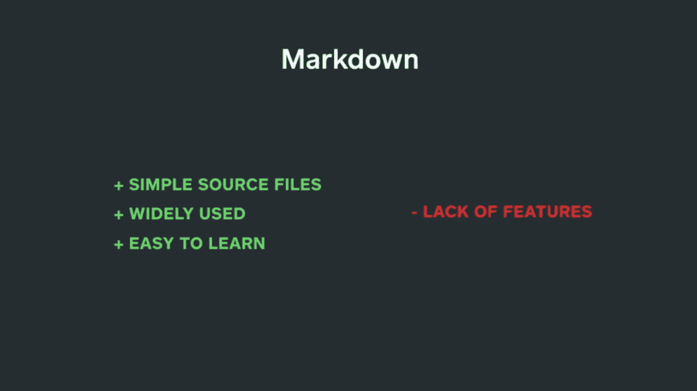

# 闪电对话:让我们构建一个 Markdown 解析器！

> 原文：<https://medium.com/square-corner-blog/lets-build-a-markdown-parser-7b02e91444c5?source=collection_archive---------3----------------------->

> 注意，我们已经行动了！如果您想继续了解 Square 的最新技术内容，请访问我们的新家[https://developer.squareup.com/blog](https://developer.squareup.com/blog)

每个月，Square 的工程师都会在内部进行闪电谈话。我们很高兴分享一些我们最喜欢的！

请欣赏 Winnie Wu 探索她的团队如何在 Ruby on Rails 应用程序中构建 markdown 解析器的精彩演讲。

