# 让我们从 Java 测试框架开始:JUnit 5

> 原文：<https://medium.com/globant/lets-get-started-with-java-testing-framework-junit-5-3c1d1b67a074?source=collection_archive---------0----------------------->

[Ref](https://junit.org/)

测试覆盖率越高，代码失败就越少。

## 在编写失败的单元测试之前，您可能无法编写成功的产品代码

在开发阶段发现错误比在生产中发现错误的成本要低得多。它不仅让你免于尴尬，也让你的公司和用户免于沮丧。

原因很简单。如果你有测试，你就不会害怕修改现有的代码！没有测试，每一个变化都是可能的错误。

不管你的架构有多灵活！

不管你的设计有多好！

如果没有测试，你将不愿意做出改变，因为害怕你会引入未被发现的错误。

> 坚持基本原则:什么是单元测试？

单元测试处于最低级别，通常检查单个方法，以确认它们根据条件返回预期的结果

单元测试通常是由软件开发人员编写和运行的自动化测试，以确保应用程序的一部分(称为“单元”)符合其设计并按预期运行。因此，我们可以解释，单元测试是为了确保我们的代码或源代码上的每个单元运行得如何，基于已经定义的业务流程。

> **让我们动手写干净的测试用例:**

Photo by [home stratosphere](https://www.homestratosphere.com/types-of-sculpting-clay/)

> ***第一件事:添加 JUnit 5 依赖项***

*   `junit-jupiter-api`提供了编写测试用例的公共 API

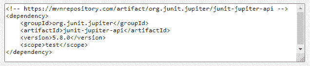

Ref [Maven Repository](https://mvnrepository.com/artifact/org.junit.jupiter/junit-jupiter-engine/5.8.0)

***问题陈述:***
根据给定的出生日期(日、月、年)求年龄。

***约束:***
出生日期应该在今天日期之前

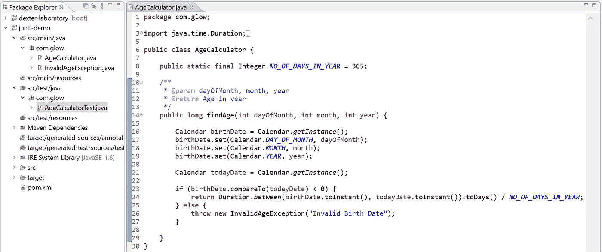

要编写一个简单的 JUnit 测试用例，我们需要在测试包中声明一个类，并使用`@Test`注释
实现一个方法。测试方法的返回类型总是 void，您需要验证预期和实际的结果，以决定测试是通过还是失败。

> 测试用例 1:成功场景

输入:出生日期:1992 年 8 月 15 日
预计输出年龄:29 岁

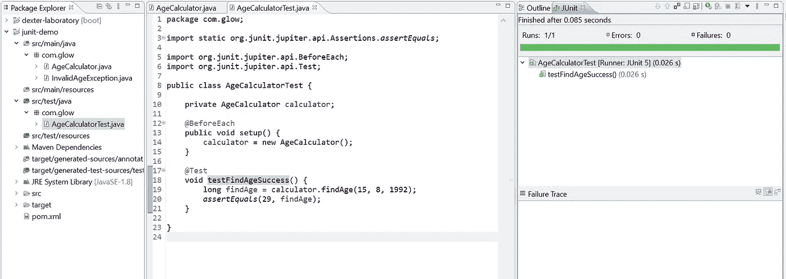

Success Scenario Test Case

> 测试用例 2:失败场景

输入:出生日期:2022 年 8 月 15 日
预期输出:抛出 InvalidAgeException 并显示消息“无效的出生日期”

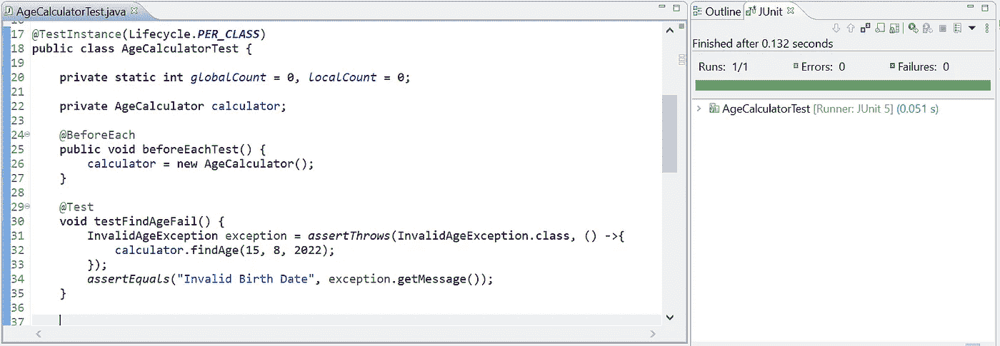

Fail Scenario Test Case

`assertEquals`是断言类的静态方法，用于检查两个对象是否相等，如果提供给`assertEquals`的条件失败，那么我们的测试用例将会失败。`assertThrows`断言提供的可执行文件抛出预期类型的异常。

如果测试中没有断言，那么测试用例总是通过。稍后我们将了解一下**断言类**。

# JUnit 测试的生命周期

我们可以在每个 JUnit 测试类中有很多测试用例，每个测试用例都经历一个生命周期，如下所示。我们有一个在所有测试运行之前和每个测试之前进行设置的选项。我们可以选择在所有测试后和每次测试后进行清理。

**每个方法的生命周期(默认生命周期):**对于测试类中的每个测试方法，将会创建一个测试实例。

**每个类的生命周期:**对于每个测试类，将会创建一个测试实例，而不是每个测试方法。

*   `@BeforeEach` *→* 表示注释的方法将在每个测试方法之前执行(JUnit4 的`@Before`)
*   `@AfterEach` *→* 表示注释的方法将在每个测试方法之后执行(6 月 4 日的`@After`)
*   `@BeforeAll` *→* 表示注释的方法将在当前类的所有测试方法之前执行(JUnit4 的`@BeforeClass`)
*   `@AfterAll` *→* 表示注释的方法将在当前类的所有测试方法之后执行(JUnit4 的`@AfterClass` )

> 让我们看看实现的生命周期。

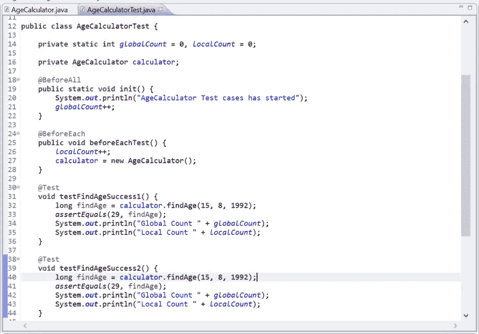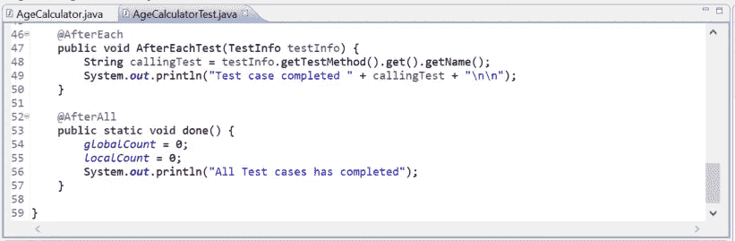

> 输出

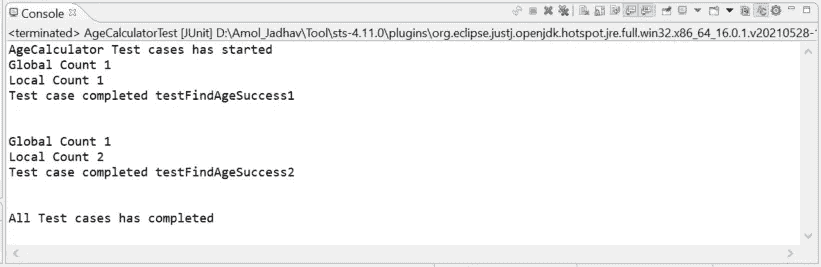

全局计数增加了一次，因为`init()`方法只执行了一次，因为我们已经用`@BeforeAll.`对它进行了注释

本地计数增加了两次，因为`beforeEachTest()`方法执行了两次，因为我们已经用`@BeforeEach.`对其进行了注释

# JUnit 5 断言

JUnit 5 断言有助于用测试用例的实际输出来验证预期的输出。为了简单起见，所有 JUnit Jupiter 断言都是`org.junit.jupiter.Assertions`类中的静态方法，如下所示:

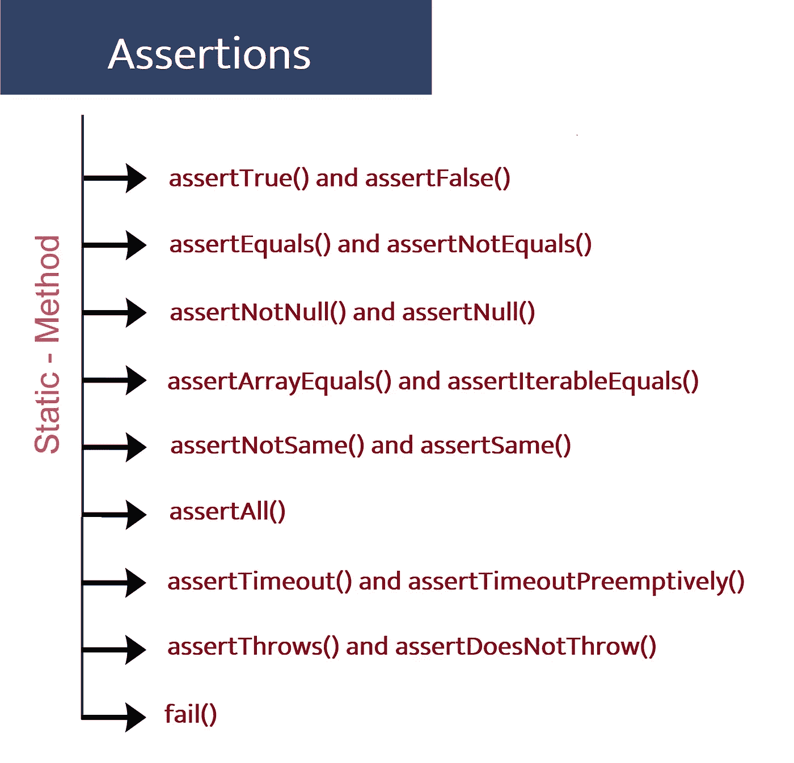

> 断言布尔变量。

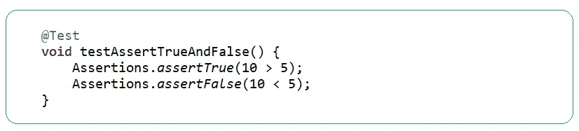

> 验证两个对象是否相等。

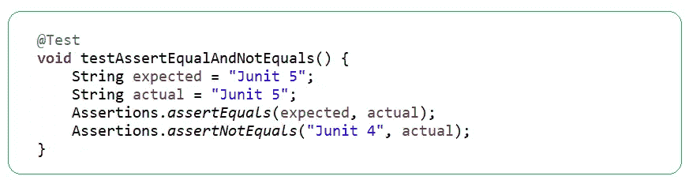

**Note**: We should always implement equals and hashCode when we want to test the equality of two custom objects, else it might not work as expected.

> 测试对象的空条件

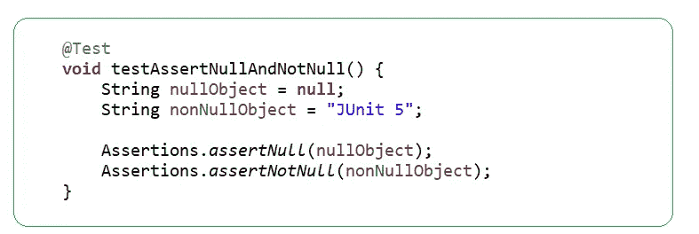

> 检查两个数组是否相等。

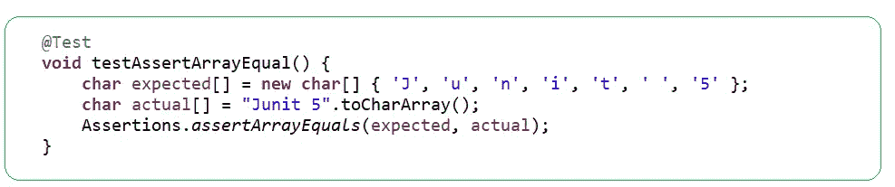

**Note**: We have to make sure that the elements in both the arrays are in the same order and If both the array objects are null then they are considered equal.

> 通过深度比较验证两个**可迭代变量**是否相等

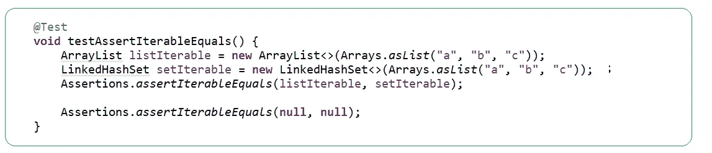

**Note**: Both iterables should return the objects in the same order.

> 测试变量是否引用同一个对象

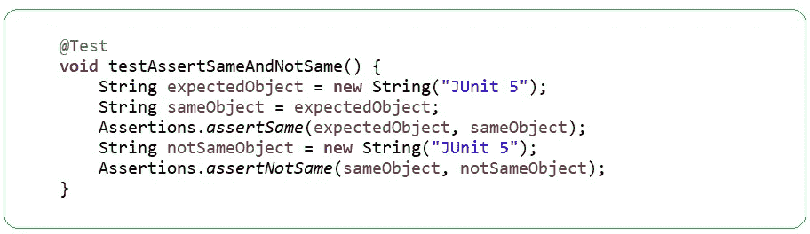

> 一次验证所有多个可执行文件

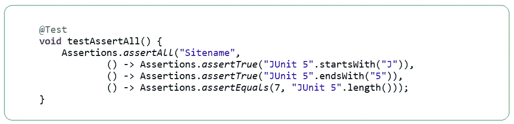

**Note:** if any executables throws exception it will continue to run all the other executables, consolidates the exceptions and report all of them at once.

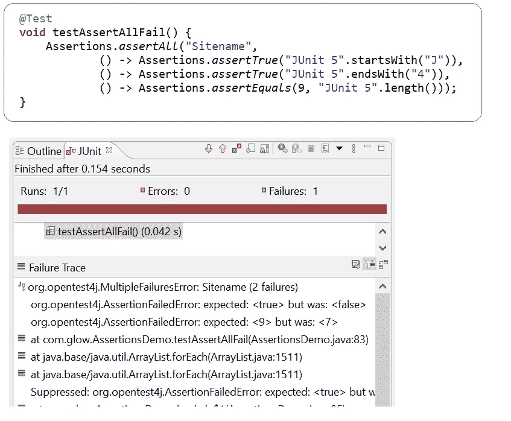

> **异常处理**:预期可执行文件会抛出预期类型的异常

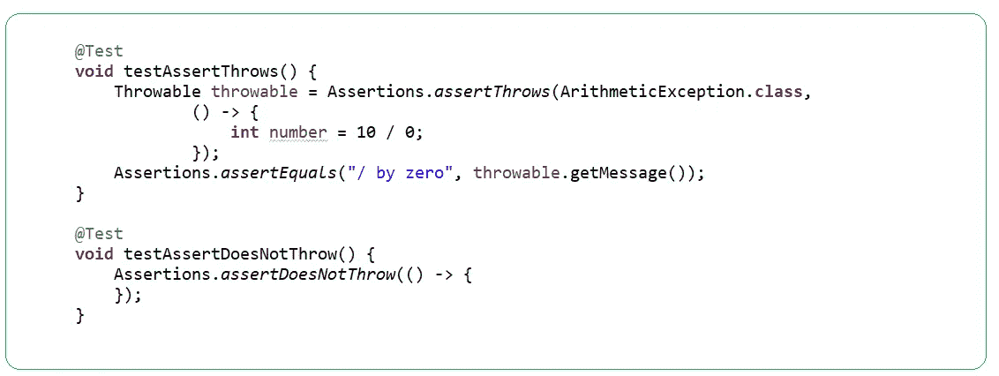

> **自定义断言**:如果我们想在某个条件下测试失败，那么我们可以使用`fail`方法。

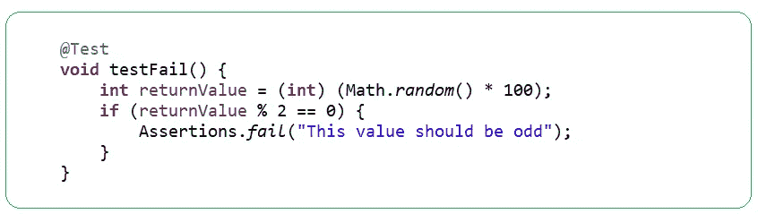

**Note** : Calling this method results in *AssertionFailedError*.

# 有用的 JUnit 注释

> **@DisplayName**

测试类和测试方法可以声明将由测试运行程序和测试报告显示的自定义显示名称。

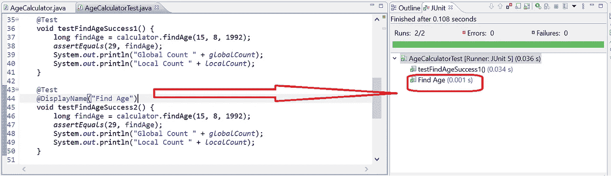

> **@禁用**

`@Disabled`注释用于禁用或跳过类或方法级别的测试。这类似于 JUnit 4 的`@Ignore`。

当在类级别声明时，所有的`@test`方法都会被跳过。当我们在方法级别使用`@Disabled`时，只有带注释的方法被禁用。

`@Disabled`用于表示带注释的测试方法当前被禁用，不应该被执行。

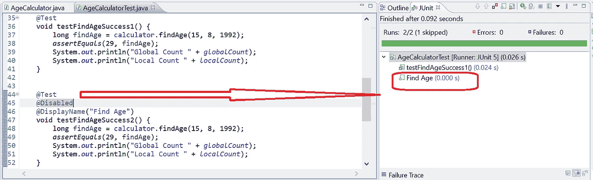

> **JUnit 5 中的依赖注入**

在所有以前的 JUnit 版本中，测试构造函数或方法不允许有参数。作为 JUnit 5 的主要变化之一，测试构造函数和方法现在都允许有参数。

这允许更大的灵活性，并支持构造函数和方法的依赖注入。

**TestInfo** 用于将关于当前测试或容器的信息注入到测试用例中

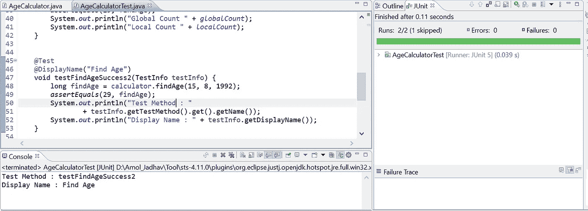

> **最后但同样重要的是:清洁测试 F.I.R.S.T 规则**

***F.I.R.S.T.*** 干净测试遵循形成上述缩写词的其他五个规则:

**快速**:测试应该快速。他们应该跑得很快。当测试运行缓慢时，您不会想要频繁地运行它们。

**独立**:测试不应该互相依赖。一次测试不应该为下一次测试设置条件。

可重复的:测试应该在任何环境下都是可重复的。您应该能够在没有网络的开发、QA、生产环境中运行测试。

**自验证**:测试应该有一个布尔输出。他们要么通过，要么失败。您不必通读日志文件来判断测试是否通过。

及时:测试需要及时地编写。单元测试应该在产品代码通过之前编写。

# 谢谢大家！！！

“对知识的投资总是会有最好的回报。”我希望这篇文章对你来说是一次很好的学习经历。谢谢你坚持到底。
敬请关注第 2 部分，Mockito 框架
快乐学习编码！..