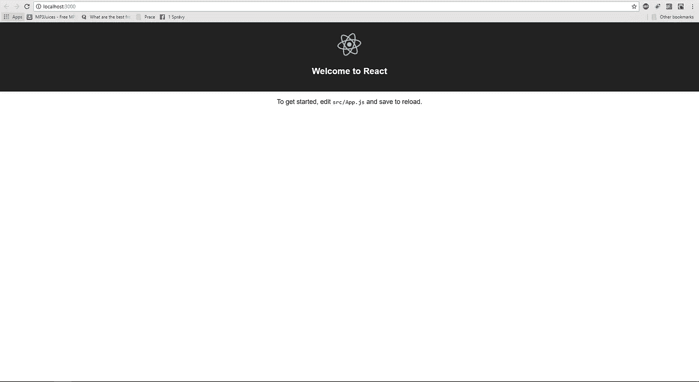
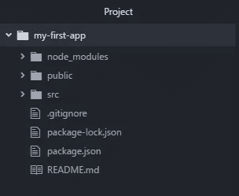
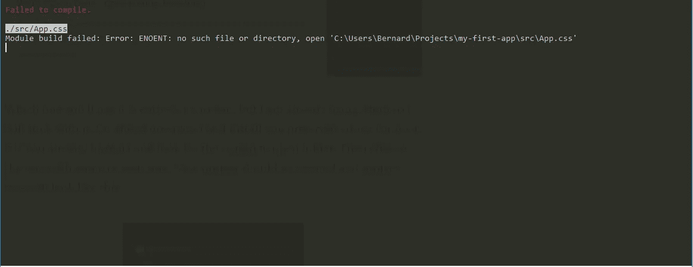
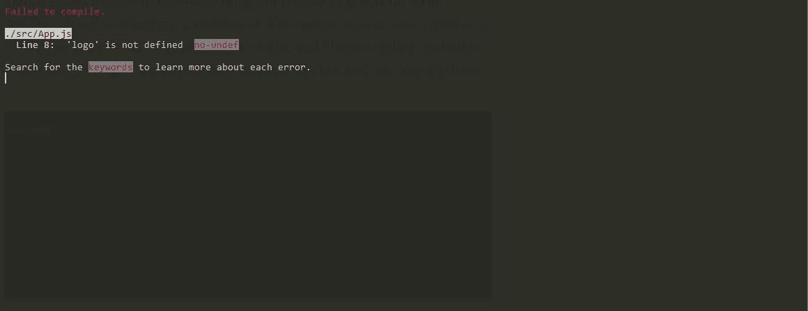

# 如何学习 React # 1——使用这些概念让你快速有效地开始

> 原文：<https://medium.com/quick-code/lets-learn-react-chapter-1-setting-up-environment-e9505b6644?source=collection_archive---------2----------------------->


下面是我应该阐明为什么学习这项技术对你有好处的部分。我可能应该包括一些图表，也显示了上升的反应受欢迎程度。但我不会那么做。这样做的目的是让你开始使用 React，如果你能学到一些东西，我也会很高兴。你仍然告诉自己，“但是我会欣赏一些图表，那会很酷”。来，让我帮你拿那个 http://bfy.tw/GHkk。

## 要求

学这个到底需要什么？让我们从物质开始。你需要一台能上网的电脑，仅此而已。对于其他东西，你至少需要 Html、Css 和 Javascript(Node.js)的基础知识。你符合所有要求吗？恭喜你进入了下一章，即将开始。对于其他人，关闭这一页，谷歌这些词，如果你感兴趣，也许会学到一些东西，然后回来…“比以往任何时候都强”。

## 安装必备组件

首先，我们将安装 Node.js. Node.js 简单地说是一种在服务器上运行 javascript 代码的方法。去 https://nodejs.org/en/download/[选择适合你平台的安装程序并下载。当下载完成安装，你应该没事了。对于那里的 linux 用户来说，去 https://nodejs.org/en/download/package-manager 的](https://nodejs.org/en/download/)，找到你的 linux 发行版，然后按照页面上的指示安装它。完成此操作后，您应该能够打开终端窗口并键入

```
npm -v
```

结果应该是指定节点版本的数字。当终端窗口仍然打开时，继续输入

```
npm install -g create-react-app
```

这将安装 npm 包 [c](https://github.com/facebook/create-react-app) reate-react-app。如果你真的对这个套餐感兴趣，你可以去 https://github.com/facebook/create-react-app 看看。如果没有也没关系，基本上它将帮助我们为 React 应用程序设置开发服务器。如果你已经安装了这个包，当你想安装一个新的 React 应用程序并输入

```
create-react-app <name_of_your_app>
```

这将开始下载所有依赖项并设置开发服务器，这可能需要一段时间，所以去散步，做一些俯卧撑，整理床铺或做一些事情。我真的不在乎，只是请不要像我一样兴奋地看着显示器等待下载过程完成，因为这需要一段时间，而且你永远也不会再回来。一切完成后，你应该可以打字了

```
cd <name_of_your_app>
npm start
```

这将启动一切，几秒钟后，浏览器窗口应该弹出，它应该看起来就像这样。

> 在[快速代码](http://www.quickcode.co/)上找到各种编程语言的免费课程。在[信使](https://www.messenger.com/t/1493528657352302)上获取新的更新。



到目前为止做得很好，但我们真的没有做任何编码…让我们做一些。为此，我们可能需要文本编辑器。基本上你有三个选择。

[](https://www.sublimetext.com/) [## sublime Text——一个复杂的代码、标记和散文文本编辑器

### Sublime Text 是一个复杂的代码、标记和散文文本编辑器。你会喜欢光滑的用户界面…

www.sublimetext.com](https://www.sublimetext.com/) [](https://atom.io/) [## 21 世纪的可破解文本编辑器

### 在 GitHub，我们正在构建我们一直想要的文本编辑器:从本质上来说是可破解的，但在第一天就变得平易近人…

atom.io](https://atom.io/) [](https://code.visualstudio.com/) [## Visual Studio 代码-代码编辑。重新定义的

### Visual Studio Code 是一个重新定义和优化的代码编辑器，用于构建和调试现代 web 和云…

code.visualstudio.com](https://code.visualstudio.com/) 

你将使用哪一个完全取决于你，但是我已经在使用 Atom，所以我将坚持使用它。继续下载并安装你喜欢的编辑器(或者打开它，如果你已经有了)，并寻找打开文件夹的选项。然后选择与您的应用程序同名的应用程序。新项目应该被打开，项目树将如下所示



我知道我答应过我们会做一些编码，但首先我们要做一些删除。打开 *src* 目录，删除除 *registerServiceWorker.js、index.js、App.js* 之外的所有文件。我们删除了一些文件，我感觉我们破坏了一些东西。让我们打开终端窗口看看。是的，它在那里



如果我们查看错误消息，我们可以猜测我们删除的文件在其他地方使用。让我们打开 *App.js，*我们可以看到 *App.css* 在第 3 行被导入。让我们继续删除这一行。同样删除上面那行，带有 importing *logo.svg* 的那行，因为我们也删除了那行。现在转到 *index.js* 并删除带有导入 *index.css* 的行，我们应该完成删除了。我们在那里所做的只是摆脱不再存在的进口。我猜这将是一个很好的时间来检查终端我们站在哪里。是的，让我们这样做…它应该看起来像这样



terminal 到底想说什么？ *App.js* 第 8 行有错误。我的猜测是，我们删除的徽标导入实际上是在某个地方使用的。别担心，我们会对 *App.js* 做一些修改。在 *App.js* 中删除整个*渲染*方法的主体。现在写你自己的。render 方法表示我们将在浏览器中实际看到的内容。我想是时候写“你好，世界！”那里。让我们这样做…现在最终的结果将是这样的

```
import React, { Component } from 'react';class App extends Component {
  render() {
    return (
      <div>Hello World</div>
    );
  }
}export default App;
```

我们改变了*渲染*方法，只返回一个*<div>*Hello world。当我们现在检查终端时，它会显示编译成功或其他类型的积极消息，但更重要的是，当我们转到浏览器时，我们会看到我们的更改反映在那里。

好的……那么让我们快速总结一下我们做了什么以及下一步要做什么

**已安装的 Node.js**

**已安装 create-react-app**

**创建了我们的第一个 React 应用**

**修改了我们的 app**

在下一章我们将谈论 JSX，我们将更深入地理解渲染 T21 的方法。如果你到了这一步，我想感谢你对我的耐心，下一章见:)干杯！

**请点击👏按钮下面几下，以示支持！⬇⬇** 谢谢！别忘了**下面跟着** **快速码**。