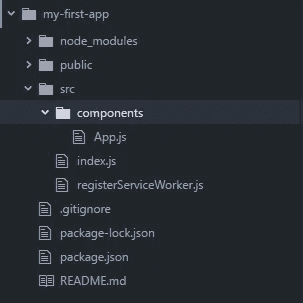

# 如何学习 React #3 —理解 React 组件背后的魔力

> 原文：<https://medium.com/quick-code/lets-learn-react-chapter-3-components-components-components-3492f771d623?source=collection_archive---------7----------------------->


在[前一章](/quick-code/lets-learn-react-chapter-2-what-the-hell-is-jsx-and-where-can-i-buy-it-5303a7db5117)中，我们谈到了 JSX，我们修改了渲染方法。我们还提到了一点 React 组件。在这一章中，我们将更多地讨论组件，我们将利用它们并给我们的应用程序带来一点变化。因此，让我们打开我们的编辑器，做一些工作。首先，我们将在 *src* 目录中创建*组件*目录，并将 *App.js* 移动到其中。这个目录将包含我们所有的组件。我们移动了 App.js，所以我感觉我们也需要改变 index.js 中的 import 语句。继续将 index.js 中的 App 组件的导入更改为`import App from './components/App';`。更改后，应用程序应该编译成功。新项目树将如下所示。



Project tree

现在…我有一种感觉，App.js 应该代表我们的应用程序。现在，它检查这是哪种类型的一天，并做一些日期名称的转换。我有点不喜欢它。我希望看到的只是一个简单的组件，其中包含了很多其他组件。假设我们对我们的 App.js 组件很满意，但是我们想称它为更好的组件，例如 DayChecker。然后…我们想在我们的应用程序中使用日检查组件。好的，我不知道为什么，但这可以通过两步来实现。我们必须创建一个名为 DayChecker 的新组件，具有 *App.js* 功能。然后，我们必须将该组件导入到我们的应用程序组件中并使用它。让我们做第一个。复制 *App.js* 中的所有内容，在 *components* 目录下创建一个名为 *DayChecker.js* 的新文件，并将代码粘贴到其中。好吧，这很容易，但这不是我们想要的。我们现在需要做一些重命名。在 *DayChecker.js* 中，将类从 *App* 更改为 *DayChecker* ，并将导出语句更改为导出 *DayChecker* 。该文件应该如下所示

```
import React, { Component } from 'react';class DayChecker extends Component {
  getDayName(number) {
    let days = ['Sunday', 'Monday', 'Tuesday', 'Wednesday', 'Thursday', 'Friday', 'Saturday'];
    return days[number];
  }render() {
    // Get current date
    let today = new Date().getDay();
    // If it is weekday
    if (today === 6 || today === 0)
      return <div>Today is {this.getDayName(today)} - You can watch TV all day today</div>;
    // If it is weeken
    return <div>Today is {this.getDayName(today)} - You should go to work today</div>;
  }
}export default DayChecker;
```

好吧…这是第一步。我知道这很容易。好的一面是，第二步更容易，也更有趣，因为我们要删除。在 *App.js* 中删除所有内容，然后添加空的渲染方法。该文件将如下所示

```
import React, { Component } from 'react';class App extends Component {
  render() {

  }
}export default App;
```

现在，我们将导入我们的日检查器组件。在 *App.js* 的顶部添加导入语句`import DayChecker from ‘./DayChecker’;`并在 render 里面返回它。该文件将如下所示

```
import React, { Component } from 'react';
import DayChecker from './DayChecker';class App extends Component {
  render() {
    return <DayChecker />;
  }
}export default App;
```

好吧…我喜欢。现在我们的应用程序组件看起来更好了，所有关于检查日期的逻辑都在我们的 DayChecker 中。现在，React 组件的好处是我们可以在应用程序中多次使用它们，所以当你编写一个组件时，考虑可重用性总是好的，因为你很可能会多次使用它。现在我们已经着火了，让我们创建另一个组件。我们称它为 Header，它只会返回一个简单的标题

`<h2>This app will tel you if you should work today</h2>`

我相信你，所以我不会在这里提供两步公式。如果你想自己尝试，不要向下滚动太多，因为那里有一个解决方案。好的，你可能创建了新的组件，它看起来像这样

```
import React, { Component } from 'react';class Header extends Component {
  render() {
    return <h2>This app will tel you if you should work today</h2>;
  }
}export default Header;
```

然后你导入并想要在我们的应用中渲染它，所以 *App.js* 看起来像这样。

```
import React, { Component } from 'react';
import DayChecker from './DayChecker';
import Header from './Header';class App extends Component {
  render() {
    return (
      <Header />
      <DayChecker />
    );
  }
}export default App;
```

但是现在我们得到了一个错误消息，说**相邻的 JSX 元素必须用一个封闭标签包起来。【React 是想告诉 *render* 不应该返回多个元素。现在我们返回 2。我们有两个选择来修复它。首先是将我们的 2 个组件包装在一个`div`标签中。是的…就是这样，我们现在只返回一个元素。**

```
render() {
    return (
      <div>        
        <Header />
        <DayChecker />
      </div>
    );
}
```

第二个是返回一个元素数组，我们可以这样做

```
render() {
    return [
      <Header />,
      <DayChecker />
    ];
}
```

不知道你更喜欢哪个。我不是什么绿野仙踪，但我猜是第二部，因为它比较短。所以我们选那个。好的……干得不错。我想祝贺你到目前为止，也感谢你和我在一起。总结一下，我们创建了新的组件，并在我们的应用程序中使用它们。在下一章，我们将学习更多关于组件的知识。我将描述基于类的组件和功能组件之间的区别。敬请期待，保持谦逊，让我们准备好迎接下一章的隆隆声。干杯！