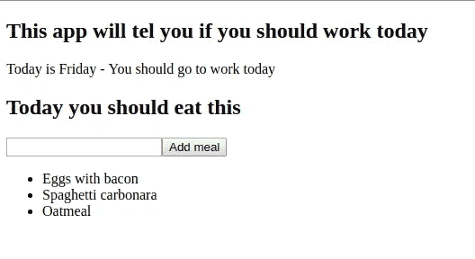

# 如何学习 React #7 —发现组件背后的魔力

> 原文：<https://medium.com/quick-code/lets-learn-react-chapter-7-component-life-cycle-6aaa815747db?source=collection_archive---------0----------------------->


你好，欢迎回到系列教程，它将帮助你理解什么是 React 以及它是如何工作的。在前一章中，我们了解了更多关于更新组件状态的内容。在本章中，我们将学习组件生命周期。我知道你今天可能有很多事情要做，所以没有任何额外的闲聊…让我们开始吧。

如果有人问我什么是组件生命周期，我会这样回答。它是在组件显示之前、组件显示之后、组件更新之前和组件更新之后执行的一系列操作。为了更好地考察它，让我们先区分两件事。显示(或安装)组件，并更新组件。让我们看看第一个。组件在*渲染*中显示或挂载，这是组件生命周期方法之一。当我们在组件中定义渲染时，我们告诉它应该如何在页面上显示。以类似的方式，我们可以定义*组件安装*(在渲染之前执行)和*组件安装*(在渲染之后执行)。现在对于更新部分，我们可以*使用 componentWillUpdate* (在组件更新之前执行)和 *componentDidUpdate* (在组件更新之后执行)。仅仅为了快速存储器刷新，可以通过例如改变组件状态来引起更新。好了，我知道你可能想听什么…理论已经讲得够多了，让我们来写点代码吧。我们走吧…

让我们稍微改变一下我们的用餐计划

我们添加了 *componentWillMount* 方法，我们正在改变其中的状态。我知道这对现在来说不算什么，但更重要的是这个想法。因此，在组件实际呈现之前，我们希望用一些数据填充它，在我们的例子中是用餐列表。因此，我们实际上可以请求服务器获取存储在数据库中的所有食物，然后在我们的组件中显示它们，而不是仅仅用一些硬编码的数据来改变状态。我想在某个时候我们会这样做，但不是在这一章，因为我们还没有服务器。现在…虚拟数据已经足够了。我们也可以使用 *componentDidMount* 做一些事情，但是我想不出还有什么与安装组件相关的事情要做。让我们看看目前为止的应用程序。



因此，应用程序被加载，我们立即看到我们应该吃的饭菜，我们也可以添加饭菜。我能想到一个我们可以添加的小功能。我们可以写一些消息给用户，当新的膳食增加。新餐增加，那意味着成分状态改变。组件状态改变意味着组件被更新，是的，你猜对了，我们将使用 *componentDidUpdate* 。我已经实现了这个功能，现在 *MealPlan* 看起来是这样的

我稍微改变了我们的状态，现在我们正在跟踪是否应该显示关于新食物的消息。最初它被设置为假，所以消息不会显示。在*渲染*中我们添加了这行代码

```
{this.state.showAddMealMessage ? <p>New meal added</p> : null}
```

我们正在检查。好的，这是真的吗？如果是，向用户显示消息。如果不是，就不要显示消息。

最后一个变化是添加了 *componentDidUpdate* ，如果你仔细观察，你会发现我们用一些参数来定义它。你看…*componentiddupdate*和 *componentWillUpdate* 总是提供两个参数…道具和状态。对于 *componentDidUpdate* 来说，它是前一个属性和前一个状态。对于*组件将更新*它是下一个道具和下一个状态。我们现在可以跳过道具，只讨论之前的状态。所以我们知道 *componentDidUpdate* 是在组件状态改变后调用的，所以当这个方法被执行时，状态已经改变了。但是我们仍然可以在更新之前访问状态的最后版本，因为方法本身为我们提供了它。所以我想检查一下是否添加了新的食物，我只是检查一下是否

如果这个条件为真，我可以说添加了新餐，并且我可以将`showAddMealMessage`设置为`true`。这就是我们所需要的。你可能会问，为什么我们可以简单地这样写这个方法

```
componentDidUpdate() {    
  this.setState({showAddMealMessage: true});      
  setTimeout(() => this.setState({showAddMealMessage: false})
    ,1000));
} 
```

我们不能真的这么做，因为记得吗？每次状态改变时都会调用此方法。我们实际上是在改变*组件的状态。因此，如果我们像这样使用它，当我们添加新的膳食时，消息仍然会显示，而且当组件第一次安装时也会显示。每当组件状态以某种方式改变时。*

好了，这就是本章的内容。如果你一直在玩这个应用程序，你可能会注意到你每次都必须点击按钮，而不仅仅是按下回车键。是的，你不是一个人……我也觉得这很气人。我们将在下一章中解决它。敬请关注。干杯:)