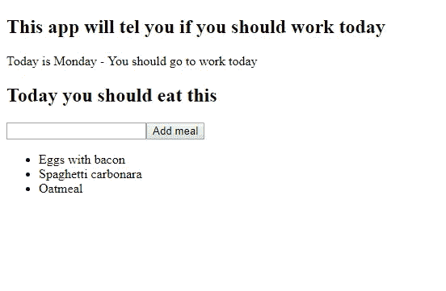

# 如何学习 React # 8——揭开 React 表单的秘密

> 原文：<https://medium.com/quick-code/lets-learn-react-chapter-8-react-forms-f3137a5c07c7?source=collection_archive---------0----------------------->

正如我在[上一章](/quick-code/lets-learn-react-chapter-7-component-life-cycle-6aaa815747db)中承诺的，我们将修复目前为止应用程序中的一个问题。提醒你我们是如何站到现在的。看起来是这样的。到目前为止，我还不知道什么新奇的东西，但是我们毕竟在学习反应，而不是 CSS。

Our application so far

我们现在的问题是，我们只能在点击按钮时添加食物。我不知道你，但对我来说，当用户按下回车键时添加它也是有意义的。我们将通过在`<form>`元素中包装我们的输入和按钮来实现这一点。这和 React 到目前为止都没有关系。这是纯 HTML。只是为了澄清…当用户当前在 HTML 表单上并按 enter 时，表单被提交。好的，让我们继续把我们的输入包在`<form>`标签中。我们的组件将如下所示

所以现在`<input>`和`<button>`被`<form>`包裹着。我也给`<button>`加了属性`type=”submit”`。我们还需要做另一个改变。现在我们的按钮有`onClick`属性，我们真的不再需要它了。为什么？在过去，它不是表单的一部分，所以我们必须专门向按钮添加动作。现在，当点击按钮时，表单被提交。是的，你又猜对了。现在我们需要定义表单提交时需要做什么。我们将`onSubmit`属性添加到`<form>`中，它将是我们在`onClick`中为`<button>`使用的相同函数。我们走吧，别害羞，你不用等我。只是为了检查我们是否在同一页上…这就是我们的组件的样子

我想说我们做到了，但这不会那么容易。当我们尝试与我们的应用程序交互时，我们会看到我们可以输入一些内容，并可以通过 ENTER 提交表单。当我们这样做时，一些事情会很快发生，然后我们的应用程序会刷新。这是由 HTML 表单的默认行为造成的。当提交表单时，它试图联系某个服务器。在我们的例子中，我们真的没有任何服务器。我们只是想在状态上做一些改变，仅此而已。别担心，我们可以很容易地解决这个问题。我们只需要告诉表单它应该防止默认事件。我们可以通过在`event`对象上调用`preventDefault`来完成。我已经进行了修改，这就是它们的样子。我会在下面解释我到底做了什么以及为什么

好的……我们可以看到我改变了`<form>`,现在`onSubmit`正在调用不同的函数。这个函数非常简单。它有一个参数，那就是`event`对象。在这个函数中，我们只调用我们定义的`handleSubmit`函数，我们现在就去揭开它的神秘面纱。所以我们已经知道我们想要阻止表单向某个服务器发送请求。我们也知道如何做到这一点。我们就叫`preventDefault`，就这样。现在我们想按照以下方式改变我们的状态:

*   将当前膳食添加到膳食数组
*   清除膳食输入

我们可以调用`setState`方法 2 次来实现这一点，但我想避免这种情况，所以我只存储当前餐的值。然后用在了`setState`里。好的，继续玩吧。现在，我们可以通过点击或按回车键提交表单。添加新的膳食并清除输入。

这看起来像是一个简单任务的大量工作，但今天我们讨论了 React 表单的功能，所以不要害羞，为自己鼓掌…你(我们)做得很好。如果你喜欢这个故事，请鼓掌让世界知道。如果你没有读过这个系列之前的故事，一定要在这里查看一下。如果你有什么意见，欢迎在评论区提问。我很乐意回答你的任何问题。在下一章中，我们将进行一点重构，我们将讨论组件道具。感谢您的关注，敬请关注，下一章再见。