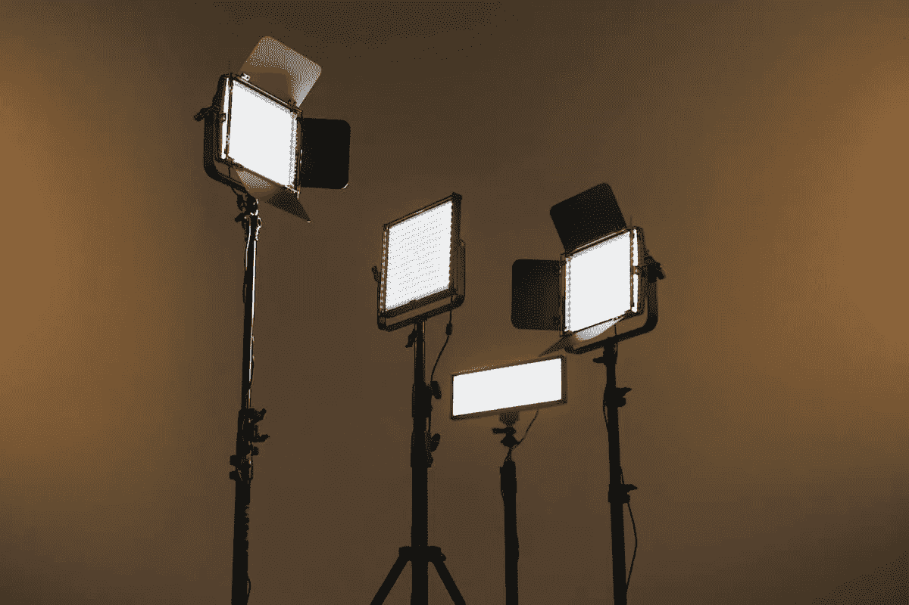

# 让我们来看看视频的最佳照明设置

> 原文：<https://medium.com/duomly-blockchain-online-courses/lets-take-a-look-at-the-best-lighting-setup-for-video-c5dd82e1c15d?source=collection_archive---------1----------------------->

[The best lighting setup for video](https://www.blog.duomly.com/best-lighting-setup-for-video/)

本文最初发表于[https://www.blog.duomly.com/best-lighting-setup-for-video/](https://www.blog.duomly.com/best-lighting-setup-for-video/)

**目录:**

*   [视频介绍的最佳灯光设置](https://www.blog.duomly.com/best-lighting-setup-for-video/#the-best-lighting-setup-for-video-intro)
*   [多么软的盒子啊](https://www.blog.duomly.com/best-lighting-setup-for-video/#what-a-softbox-does)
*   [环形灯](https://www.blog.duomly.com/best-lighting-setup-for-video/#ring-lamp)
*   [如何设置三点照明设置](https://www.blog.duomly.com/best-lighting-setup-for-video/#how-to-setup-a-three-point-lighting-setup)