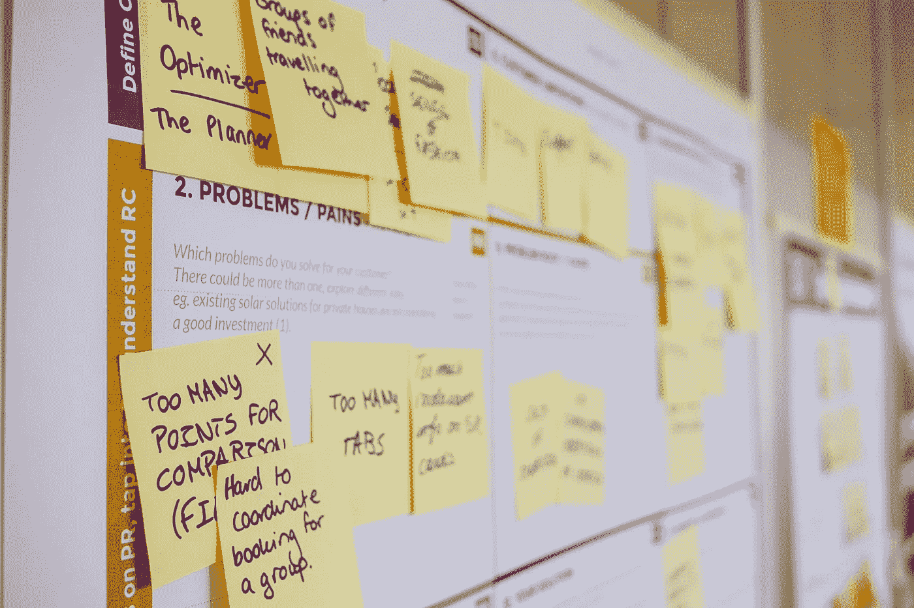

# 让我们来谈谈目标和关键成果

> 原文：<https://medium.com/globant/lets-talk-about-objectives-and-key-results-51983581c2b4?source=collection_archive---------5----------------------->

Photo by [Daria Nepriakhina](https://unsplash.com/@epicantus?utm_source=unsplash&utm_medium=referral&utm_content=creditCopyText) on [Unsplash](https://unsplash.com/s/photos/agile?utm_source=unsplash&utm_medium=referral&utm_content=creditCopyText)

[“明日创客”](https://makers-of-tomorrow.de/online-kurs/)是德国政府为大学生发起的一项倡议，其明确使命是传播和促进企业家精神。这是一套由德国和硅谷初创企业创始人讲述的 10 个在线模块。

在 2021 年 6 月的发布活动中，[plus dental 的联合首席执行官伊娃-玛利亚·梅伊宁](https://www.linkedin.com/in/eva-maria-meijnen-5420911a)正在分享他们如何在公司建立 OKRs 文化，当时在场的财政部长*安格拉·默克尔*问道: [**“什么是 OKRs？”**](https://www.linkedin.com/posts/wirtzdan_angela-merkel-learns-about-okrs-with-subtitles-activity-6833012056137056256-6vz_) 。于是伊娃用直白的语言解释了 OKRs 的基本原理。所以我认为这是为**关注产品 OKRs 焦点周开始这篇文章的一个很好的方式。**

 [## 丹尼尔·沃茨在 LinkedIn 上写道:安格拉·默克尔了解了 OKR 的情况。(带字幕)| 48 条评论

### 安格拉·默克尔了解到 OKR 氏症。(带字幕)...LinkedIn 上的 48 条评论

www.linkedin.com](https://www.linkedin.com/posts/wirtzdan_angela-merkel-learns-about-okrs-with-subtitles-activity-6833012056137056256-6vz_) 

也许这是我们学科最吸引我的主题之一，因为产品开发中的关键价值观和原则在其中发挥了作用，例如持续的一致性、专注、结果的衡量以及一个或多个团队之间的协作。

诞生于 80 年代的英特尔，在[高产出管理](https://www.amazon.com/High-Output-Management-Andrew-Grove/dp/0679762884)中由 *Andrew Grove* 做了很好的解释，OKRs(目标和关键结果)是一个基于目标的工具，可以在增长方面取得非凡的成果，如今全球无数的科技公司都在使用它。

简而言之，okr 是一个季度目标的模型，可测量，并且理想地生成自下而上的方向。它们具有挑战性，并不是一成不变的，而是寻求根据预期结果发展一致性，根据 Q 中要实现的预期值定期审查和编写，而不是与一个或另一个任务联系在一起。

让我们分成几部分，分别看一下这些元素:

**他们是季度目标的典范**

据了解，三个月的时间足以产生结果。当我们谈到结果时，我们指的是对业务 KPI 和用户体验的影响，这是面向产品的组织的重点。

**可测量的**

okr 的一个主要特点是它们的形态和写作，这样在 Q 的结尾，我们可以衡量我们对用户故事或我们正在工作的史诗所产生的影响。

**自下而上**

这意味着这是一个团队和协作活动，因此避免自上而下的 OKR 模式是非常健康的。围坐在桌前写下我们想要实现的价值、我们要影响的指标以及我们用来衡量结果的度量单位是每个季度挨饿的一个很好的练习。

**他们不是一成不变的**

okr 是一个灵活的模型，可以适应产品的现实和环境。作为一个团队，我们可以修改范围，或者最终修改之前定义的目标。如果这有助于我们纠正错误并产生影响，那么这种改变将会受到欢迎。变化是变革性的，团队按时做出必要的变化是健康的。

**他们寻求生成对齐**

OKRs 寻求的最重要的目标之一是产生承诺和一致。结盟不是共识。

**挑战**

OKRs 的另一个特点是，它们是真正具有挑战性的挑战，几乎 100%无法实现。据了解，实现 70%的 OKR 范围是一个非常令人满意的基线。不设定保守的目标是产品人文化的一部分。

**定期检查**

一个很好的实践是执行定期的检查，让自己的团队、团队的其他成员以及涉众了解他们的发展，解决依赖性或者进行调整，以确保对指标的影响。

**以数值的形式书写**

其中一些我们之前已经提到过，这里重要的是根据价值而不是具体的任务来建立目标。在我们作为产品经理的经历中，我们可以找到无数这样的例子，尽管已经满足了最后期限，完成了任务，但由于任何原因，结果并没有实现。这就是为什么这一点在产品文化中至关重要。而且关于数量，每个季度不超过 3、4 个 okr 为宜，保证大家的重点。

**值得一读**

在他的书[“产品方向，如何用策略、路线图、目标和关键结果大规模地构建成功的产品”](https://www.amazon.com/Product-Direction-successful-products-Objectives/dp/1736824716) *Nacho Bassino* 中，他用整个第三部分来谈论 okr:管理它们的过程、震耳欲聋的区域和团队 okr 草案、依赖和反馈、签入、更新和沟通。

另一本很棒的书是前面提到的风险投资家*约翰·杜尔登*写的[《衡量重要的事情】](https://www.amazon.com/Measure-What-Matters-Google-Foundation/dp/0525536221)。这是一个很好的理论总结，有很多 OKRs 的例子。伟大的领导者会分享他们的经验，无论是谷歌这样的公司，还是比尔和梅林达·盖茨基金会这样的非政府组织，或是波诺领导的组织。约翰·杜尔登是将 OKRs 引入谷歌的主要负责人。

最后，[Natalija helle SOE 和 *Sonja Mewes* 撰写的《OKRs 处于中心:如何利用目标推动持续变革并创建你想要的组织》](https://www.amazon.com/OKRs-At-Center-ongoing-organization/dp/B0874N53WC)是对 OKRs 的简短介绍。

**结论**

okr 是实现个人、团队或组织目标的伟大工具。

在我的职业生涯中，我有机会首先在一个产品开发团队建立 OKR 文化，后来被我工作的整个公司采纳。极具挑战性的经历，一年后，我们可以看到成长和以结果为导向的团队取得了非凡的成绩。

最重要的问题之一是将面向任务的文化转变为面向结果的文化。在前三个季度，很难为他们的目标写得比活动更有价值，尤其是对 C 级成员而言。另一个大问题是同一个 OKR 所涉及的地区之间的对齐。

有几个工具可以用来设置、测量、定期检查和可视化 okr 是如何进行的，但是你(和你的团队)只需要一个电子表格就可以了。主要的想法是一个季度一个季度地迭代，你会看到两方面的学习和改进，增长和结果文化。

*这篇文章之前发表在 OKRs 焦点周的 Mind the Product 博客上。*