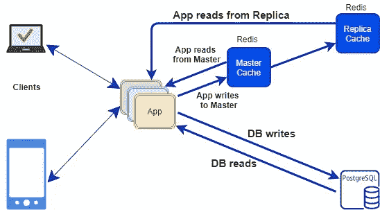

# 莴苣 Redis 实现的高级 Java 客户端

> 原文：<https://medium.com/globant/lettuce-an-advanced-java-client-for-redis-implementation-90c267424a01?source=collection_archive---------0----------------------->

> Ritesh 担心他的应用程序的性能。当请求到达他的应用程序时，他的应用程序每次都与数据库交互静态数据库信息。Ritesh 正在寻找一种解决方案来减少应用程序的数据库调用。一边搜索。他开始了解雷迪斯。

Ritesh 开始从互联网上阅读以下信息。

# **Redis 的基本概念:**

Redis 是一个开源的 NoSQL 数据库，它遵循键值在内存中存储的原则。它被用作数据库、缓存和消息代理。它支持数据结构，如字符串、哈希、列表、集合、带有范围查询的排序集合、位图、超级日志、带有 radius 查询的地理空间索引和流。

*   NoSQL 数据库
*   键值存储
*   内存数据库中
*   数据结构服务器
*   开放源码

# 当我们使用 Redis 时:

*   隐藏物
*   排行榜
*   长队
*   Cookie 存储
*   信息发送
*   使用主/从服务器等进行数据复制。

# Redis 缓存的系统架构

**Redis 的 Java 客户端:**

为了在 Java 中使用 Redis，您需要一个 Java Redis 客户机。 [***莴苣***](https://github.com/mp911de/lettuce/) ***和***[***Jedis***](https://github.com/xetorthio/jedis)是 Redis 最常见的两个 Java 客户端。

**生菜概述:**

莴苣提供同步、异步和反应式 API 与 Redis 交互。

莴苣为从 Redis 数据库服务器发出异步请求和创建流提供了一个自然的接口。

**为什么生菜胜过杰迪斯:**

Jedis 可以与集群同步工作。
然而，莴苣能够与集群进行同步、异步的反应式交互。

**主/从:**

Redis 服务器在主/从配置中进行自我复制。主服务器向从服务器发送将主缓存复制到从服务器的命令流。Redis 不支持双向复制，所以从属服务器是只读的。

## 哨兵

Redis Sentinel 监控主实例和从实例，并在主实例发生故障转移时协调从实例的故障转移。莴苣可以连接到 Sentinel，用它来发现当前主机的地址，然后返回一个到它的连接。

# 实施:

> 在了解 Redis 缓存之后，他决定在自己的 java 应用程序中实现 Redis。他为自己的应用程序选择了莴苣 java 客户端，因为它具有主/从概念，能够与集群进行同步、异步、反应式交互。在他的应用程序中添加了莴苣依赖项后，应用程序开始出错。他很困惑。

他又开始探索如何用 2.0.x 以上的 Spring boot 实现 Redis 缓存。

**用 Spring boot 实现 Redis 缓存:**

添加 Redis 和莴苣的依赖项。
在 application.properties 中添加属性
编写 Redis 连接的配置。
为 Redis 操作写一个 Util 类，如 putValues，getValues，setExpire 等。
为了存储或获取缓存，使用 Redis 键和值调用 RedisUtil 方法。
将可缓存列表传递给 CacheManager。
检查 Redis 服务器中的 Redis 缓存。

Git 链接:

[https://github . corp . globant . com/scalable platform/莴苣-A-Java-Redis-Client](https://github.corp.globant.com/scalableplatform/lettuce-A-Java-Redis-Client)

> 现在 Ritesh 很开心。他的申请太快了。他的工作得到了客户的赞赏。现在，如果您的应用程序也面临类似的性能问题，那么您可以使用莴苣客户端实现 Redis。

真的管用。