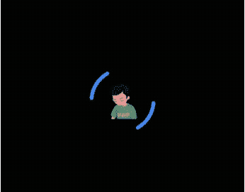

# Level up my flutter loading widget with Logo + Flutter animation

> 原文：<https://medium.easyread.co/level-up-my-flutter-loading-widget-with-logo-flutter-animation-75b8c07e521d?source=collection_archive---------1----------------------->

Beberapa waktu lalu aku mengerjakan project IoT menggunakan Thingsboard. Setelah eksplore beberapa fitur di webnya, aku menemukan aplikasi mobilenya dikembangkan menggunakan flutter. Dan satu bagian yang menarik adalah loading widget di aplikasi thingsboard tersebut.

Loading widget yang paling simpel dan mudah di flutter adalah `CircularProgressIndicator()` . Widget ini sangat sering aku pakai untuk animasi loading. Setelah melihat loading widget thingsboard jadi aku coba membuat versi lite-nya 😅.

> anyway, kalian bisa pakai animasi dibawah ini dengan custom logo kalian dengan package [***logo_n_spinner***](https://pub.dev/packages/logo_n_spinner) yang sudah saya upload di pub.dev. Jadi tidak perlu membuat codingan dari awal lagi. Hanya perlu tambahkan package `logo_n_spinner` kedalam flutter app kalian.

[](https://pub.dev/packages/logo_n_spinner) [## logo_n_spinner | Flutter Package

### Flutter loader widget with logo and spinning arc. Use your image assets to create loader animation with the image logo…

pub.dev](https://pub.dev/packages/logo_n_spinner) 

```
dependencies:
  logo_n_spinner: ^latest
```


Result

Setelah baca tutorial dan berselancar di stackoverflow , akhirnya selesai seperti preview diatas. Untuk membuat loading widget seperti itu ada beberapa langkah :

*   **Membuat StatefullWidget with SingleTickerProviderState**
    Pertama karena kita butuh animasi, kita perlu StatefullWidget untuk initialize controller animasinya. Disini aku kasi nama loader.dart.
    Lalu tambahakan `with SingleTickerProviderState` , karena kita akan menggunakan animation controller.

***loader.dart***

```
import 'package:flutter/material.dart';class PotatooLoader extends StatefulWidget {
  const PotatooLoader({Key? key}) : super(key: key);@override
  State<PotatooLoader> createState() => _PotatooLoaderState();
}
class _PotatooLoaderState extends State<PotatooLoader> with SingleTickerProviderStateMixin {@override
  Widget build(BuildContext context) {
      return Container();
  }
}
```

Sebelum membuat animasinya , pertama kita membuat container dan import logo yang akan digunakan.

*   **Import assets gambar dan menambahkan kedalam pubspec.ymal**

disini aku menyimpan logo di dalam folder assets. Dan kemudian ga lupa tambahkan di pubspec.ymal file, untuk nanti kita pakai kedalam widget Image.

***pubspec.ymal***


*   **Membuat container dan menampilkan logo atau gambar**

kembali ke *loader.dart* , karna widget loader ini aku gunakan sebagai component , aku membuat dengan ukuran yang static yaitu 200x200 pixel. Kalian bisa custom ukurannya sesuai kebutuhan. Untuk menampilkan gambar aku menggunakan widget `Image.assets()` dan mengarahkan gambar yang sudah di *define* di pubspec.ymal tadi. Karna nantinya logo atau gambarnya akan di kelilingin widget animasi lain yaitu busur (arc) , jadi aku bungkus lagi menggunakan widget `Stack.`

***loader.dart***

```
.............@override
  Widget build(BuildContext context) {
   return SizedBox(
      width: 200,
      height: 200,
      child: Center(
        child: Stack(
          alignment: Alignment.center,
          children: [
            SizedBox(
              width: 60,
              height: 60,
               child: Image.asset('assets/me2.png',),
         )],
      )),
    );
  }
```

langkah selanjutnya adalah membuat busur logo. Disini kita akan menggunakan `CustomPainter` dari flutter.

*   **Membuat busur ( *arc* )**

Disini aku membuat class baru dengan nama `PaintArc` dan di `extends` dengan `CustomPainter` . Untuk membuat arc-nya bisa lebih dinamis, aku meng-extract 3 parameter. Untuk properties lain juga bisa kalian extract sesuai kebutuhan.

> *-* `*start*` *dengan tipe data double. ini adalah konstanta pengali untuk sudut awal untuk menggambar busurnya.
> -* `*sweep*` *ini adalah konstanta untuk ujung busur yang akan digambar.
> -* `*color*` *warna busur dengan default value* `*Colors.cyan*`

logic-nya adalah bermain dengan lingkaran. Jadi untuk satu putaran penuh lingkaran adalah 2 pi radians. Lihat codinganku bagian `canvas.drawArc ()` .

`start * pi/16` : aku membagi setengah lingkaran menjadi 16, artinya untuk menggambar 1 lingkaran penuh adalah `32*pi rad` , karena satu lingkaran penuh adalah 2pi radians.
contohnya : aku mau membuat busur 180°, dimulai dari titik sudut 90°, artinya busur yang tergambar adalah setengah lingkaran dari titik 90° sampai titik 270°.

selain itu , kita juga bisa mengubah beberapa parameter lain, seperti `strokWidth` : ketebalan arc , `style` : tipe `PaintingStyle.stroke` busur nya hanya bagian sisi lengkungannya , sedangkan tipe `PaintingStyle.fill` busur akan tergambar dari titik tengahnya. Variable itu bisa di extract jadi properti dari loader agar bisa di custom lagi nantinya. Untuk full code drawing arc seperti berikut:

***paint_arc.dart***

kemudian kembali lagi ke loader.dart , import class PaintArc tadi untuk mengaplikasikan nya kedalam container yang sudah dibuat sebelumnya.

*   **Membuat busur ( *arc* )**

Kita akan menggambar busur yang diletakkan disamping gambar/ logo. masuk kebagian `children` dari widget stack, kita akan menambahkan widget `CustomPaint` dengan menggunakan painter yang sudah dibuat sebelumnya.

pertama aku akan menggambarkan 1 busur disisi logo yang tadi sesuai contoh yang sebelumnya yaitu :

> aku mau membuat busur 180° derajat dimulai dari titik sudut 90° , artinya busur yang tergambar adalah setengah lingkaran dari 90° — 270°.
> start : 8 = 90 °
> sweep : 16 = 90° + 180° = 270°

```
...................
children: [
   SizedBox(
      width: 60,
      height: 60,
      child: Image.asset('assets/me2.png',),
   CustomPaint(
      painter: PaintArc(
          start: 8, 
          sweep: 16,
          color: Colors.blueAccent,
      ),
    ),
)],
```

titik awal nya 0° di kanan logo .
maka titik 90° ada di bawah logo,sudut 270° diatas logo.
dengan putaran searah jarum jam (clockwise)


result draw arc

untuk membuat busur yang lain kita bisa menambakan `CustomPaint` lagi di list widgetnya dengan menggunakan sudut yang berbeda juga.

disini aku akan menggunakan 2 busur, dan kalian bisa tambah sesuai keinginan.

```
.....................
CustomPaint(
      painter: PaintArc(
          start: 2, 
          sweep: 5,
          color: Colors.blueAccent,
      ),
    ),
 CustomPaint(
      painter: PaintArc(
          start: 18, 
          sweep: 5,
          color: Colors.blueAccent,
      ),
    ),
......................
```

> ingat sweep akan dijumlahkan dengan sudut awalnya. untuk busur kedua aku buat start : 18 , kemuadian sweep : 5\. Artinya ujung busur kedua ada di `*18*pi/16 + 5*pi / 16 = 23*pi /16*`
> maka akan digambar busur dari titik `*18*pi/16*` –sampai `*23*pi/16*`

dan hasilnya akan seperti ini:


result

untuk static widget-nya sudah selesai, selanjutnya kita menambahkan animasi pada widget agar bisa bergerak mengelilingi gambarnya.

*   **Inisiasi animation controller**

pertama inisiasi controller dan animation_rotation

```
late AnimationController _controller;
late Animation<double> _animation_rotation;
```

selanjutnya kita membuat method initState untuk men-define `_controller` dan `_animation_rotation.`

```
..........................
@override
void initState() {
 _controller = AnimationController(
    vsync: this, 
    duration: const   Duration(seconds: 2));_animation_rotation = Tween<double>(begin: 0.0, end: 1.0).animate( CurvedAnimation(
    _controller,
    curve: const Interval(0.0, 1.0, curve: Curves.easeInOutSine)));_controller.repeat(reverse: false);super.initState();
}
..........................
```

vsync : adalah [TickerProvider] untuk `current context` .
duration : durasi animasi berjalan
untuk menjalankan animasi terus menerus , maka kita mengulang animasi dengan memanggil `_controller.repeat()`
`reverse : false` animiasi akan mengulang searah.

terakhir kita membuang `_controller` ketika tidak digunakan lagi

```
@override
void dispose() {
  _controller.dispose();
  super.dispose();
}
```

setelah animasi di inisiasi, kita aplikasikan kedalam widget dengan menggunakan `RotationTransition`

sebelumnya aku akan membungkus kedua `CustomPaint` kedalam satu method ( agar lebih rapi ) 😃

```
Widget buildRing() {
  return Stack(
    children: [
      CustomPaint(
        painter: PaintArc(
        start: 2,
        sweep: 5,
        color: Colors.blueAccent,
      ),),
      CustomPaint(
        painter: PaintArc(
        start: 18,
        sweep: 5,
        color: Colors.blueAccent,
      ),),
    ],
  );
}
```

kemudian method tadi return Widget bisa dipakai sebagai `child` widget dari `RotationTransition` , dan menggunakan `_animation_rotation` yang telah kita defenisikan di `initState`

```
RotationTransition(
  turns: _animation_rotation,
  child: buildRing(),
)
```

dan akhirnya selesai !!! 🎉 🎉🎉🎉🎉



reverse: true


reverse : false

full code ada dibawah ini:

**loader.dart**

full code github repository : [***potatooLoader***](https://github.com/pota-too/potatooLoader)

[](https://pub.dev/packages/logo_n_spinner) [## logo_n_spinner | Flutter Package

### Flutter loader widget with logo and spinning arc. Use your image assets to create loader animation with the image logo…

pub.dev](https://pub.dev/packages/logo_n_spinner)