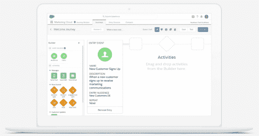

# 旅程构建器功能:Salesforce 营销云(SFMC)生态系统指南

> 原文：<https://medium.com/globant/leverage-automation-technology-guide-to-salesforce-marketing-cloud-d02d38c6f50e?source=collection_archive---------0----------------------->

Top Features: Guide to Salesforce Marketing Cloud(SFMC) Studio Ecosystem

欢迎来到数字颠覆和变革的世界。为了在数字时代蓬勃发展，公司需要通过采用营销自动化成为数字创新者，重塑扰乱市场的商业模式。

为了通过更好的参与来吸引和赢得客户，你必须通过个性化的体验来管理客户的旅程。

幸运的是，像 SFMC 这样的工具可以让营销人员和 IT 团队更容易实现营销自动化。我提到了 Salesforce 营销云(SFMC)工作室生态系统的主要功能和完整指南

Salesforce Marketing Cloud

# **关于 Salesforce 营销云-SFMC**

**Salesforce 营销云-SFMC** 当我们谈论营销自动化和大规模个性化需求时，无需介绍。如果企业愿意投资自动化工具，它总是聪明的营销人员的首选。

您有能力通过跨渠道营销快速转化客户，并在转化周期内快速转移他们。该平台引领自动化技术，允许客户根据自己的意愿开展动态、个性化的活动。

*该工具是企业公司的理想选择*。*我已经花了很长时间来谈论这个工具的特性和功能。*

Salesforce Marketing Cloud Campaign Orchestration

# SFMC-Salesforce 营销云有什么特点？

1.  使用工作室的概念，如**电子邮件、社交、广告、手机、网络**和**互动**
2.  能够推出**跨渠道活动**，如电子邮件、短信、广告、Whatsapp、Line、应用内消息&推送通知
3.  能够获得客户的**统一视图**并了解更好的行为洞察
4.  **在正确的时间，以正确的语气，用正确的信息进行实时互动**
5.  Automation Studio 和 Journey Builder 允许客户自动化他们的营销工作
6.  利用**爱因斯坦人工智能特性**使客户旅程变得相关

*这些功能允许公司通过利用营销自动化实现更好的投资回报，优化营销绩效，留住客户*

# **SFMC 工作室生态系统**

让我们深入探讨四个主要工作室的功能以及普遍的使用案例，以实现业务 KPI，例如 ***增加目标订户&提高参与度。***

Overview of Salesforce Marketing Cloud-SFMC Studios

# **SFMC 旅途建设者概述**

我对 salesforce 营销生态系统感到惊讶，该生态系统旨在满足不断增长的需求，并将客户之旅置于应用程序的中心阶段

SFMC Application Menus

我最喜欢的功能之一是*旅程构建器，它将所有应用程序连接在一个地方，以协调营销活动来吸引客户。您也可以使用目标来衡量您的旅程表现。*

****

*Journey Builder Dashboard*

# *SFMC 旅行建设者的特色:*

*从入门到多种活动，SFMC 旅程构建器有许多可用功能，您可以利用这些功能创建一个强大的客户之旅。企业公司可以通过电子邮件、手机、广告和网络将每一个小到大的互动联系起来。*

*让我们深入探讨 SFMC 旅程构建器的入口源、活动和优势:*

## *SFMC 旅程构建器的入口源*

**

1.  *数据扩展*
2.  *应用编程接口事件*
3.  *CloudPages*
4.  *观众入场*
5.  *Salesforce 数据*
6.  *谷歌分析 360*

*以下组件可用于构建 SFMC 客户之旅*

**

***Journey Builder Template Canvas***

## *SFMC 旅程构建器提供的活动*

1.  *信息:添加相关的营销活动*

**

*Journey Builder Features for Messages Activity*

*2.广告:建立广告受众和设计付费广告活动的能力(脸书)*

**

*Advertising Activity in SFMC*

*3.流量控制-根据活动之间的时间框架添加流量。使用人工智能的功能，如角色分割，爱因斯坦 STO*

**

*Flow Control in SFMC*

*4.客户更新-根据用户操作自动更新联系人*

**

*Customer Updates in SFMC*

*5.销售和服务云——利用销售或服务云中的可用受众*

**

*Entry Source For Sales & Service Cloud*

*除了旅程构建器之外，还有一些功能可以帮助简化来自内部或外部集成的客户数据*

*   ***自动化工作室***

*Automation Studio 专注于 ETL 功能。该产品允许您从任何外部数据源导入、丰富和分割数据，使您能够直接集成到 travel Builder 中*

*   ***行为触发***

*营销人员现在可以在旅程构建器中轻松部署放弃旅程(浏览、购物车和愿望列表)，并在内容构建器中使用拖放块添加放弃的项目*

*以上信息只是简单了解 SFMC 的冰山一角。如果您打算使用该工具，您可以了解更多信息。*

# *SFMC 旅行建设者的优势:*

**

*Build a Journey with SFMC Journey Builder*

*   *一个平台，用于从进行 **1 比 1 的行程，以通过多步行程、单次发送行程和交易发送行程发送多通道渠道活动***
*   *使用行为触发器轻松部署**弃船行程**(浏览、推车和意愿列表)*
*   *跨**电子邮件、短信、Whatsapp、短信、推送通知、广告、** **云页面和应用程序**设计跨渠道活动*
*   *能够使用**销售云、服务云**和**社区云中的本地工具定制旅程内容。***
*   *您可以添加目标，根据符合您为旅程设置的目标标准的联系人评估旅程绩效*
*   *在客户生命周期的每个阶段提供**个性化体验**,包括决策分割、参与分割等功能。*
*   *先进的人工智能功能，如**角色评分分割，频率分割**和爱因斯坦发送时间优化-STO*

# *SFMC·爱因斯坦特写*

*爱因斯坦功能是一个支持人工智能的智能 CRM 助手，允许所有用户:*

*   *发现隐藏的见解和模式*
*   *预测业务成果*
*   *推荐最佳行动、提议或约定*
*   *自动化业务流程和工作流*
*   *建立目标用户*

***最后的裁决来了:***

*SFMC 是我个人的选择。您可以选择任何营销自动化工具，因为它提供个性化以及管理数据、智能自动化和大规模个性化的能力。市场自动化的成功使用不仅有助于公司转变业务，还有助于提高整体影响力、参与度和转化率。*

*您还可以阅读[通过数据驱动的营销策略赢得营销自动化工具的成熟技巧](/globant/how-to-win-the-marketing-automation-game-with-a-data-driven-strategy-de14240ef972)*