# 利用 Azure 数据工厂将数据从 Azure 加载到自治数据库

> 原文：<https://medium.com/oracledevs/leverage-azure-data-factory-to-load-data-from-azure-to-autonomous-database-c808c9ce3a47?source=collection_archive---------0----------------------->

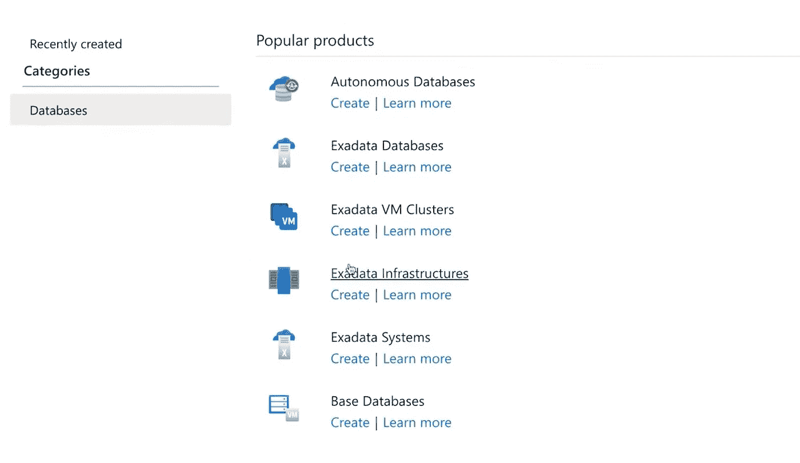

甲骨文最近推出了面向微软 Azure (ODSA)的甲骨文数据库服务(T1)，该服务允许用户轻松地将甲骨文云基础设施的数据库服务集成到 Azure 云环境中。ODSA 的互联和账户链接服务是免费提供的。这种合作关系为用户提供了更多的多云架构选择。它通过利用两家云提供商的服务，进一步开辟了混合用例的可能性。

一个这样的例子是利用 Azure 数据工厂(ADF)和自治数据库(ADB)。ADF 可用于将数据从位于 Azure 或内部的各种数据源复制到 OCI 自治数据库。

[先决条件](https://oradocs-prodapp.cec.ocp.oraclecloud.com/documents/fileview/DDF1D5998FC41B6A1FD5EB2F5A44F7DF99630B1F50C0/_OCLS-Migrate-Integration-to-OIC.pptx):

如果数据源位于 Azure 虚拟网络/内部网络/AWS VPC，我们需要一个 Azure 自托管集成运行时来连接 ADB。

请注意，如果数据源是 Azure 中的托管云服务，我们可能会使用 Azure 集成运行时。

这里我们将讨论第一个用例的连接过程，比如使用一个[自托管集成运行时](https://docs.microsoft.com/en-us/azure/data-factory/create-self-hosted-integration-runtime)。

这可以通过执行 3 个简单的步骤来实现:

**第一步**

在 Azure 中配置自托管集成运行时(IR)。这个 IR 可以安装在 Azure 或 OCI 上运行的 Windows Server 中。在我们的例子中，我们已经将它安装在 OCI windows 服务器上。

在 ADF 中创建集成运行时:

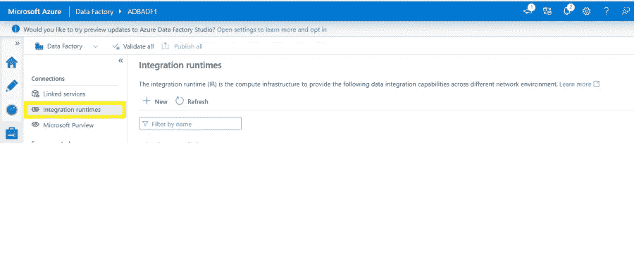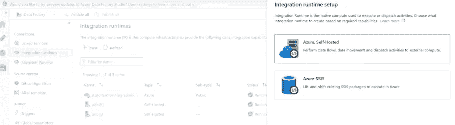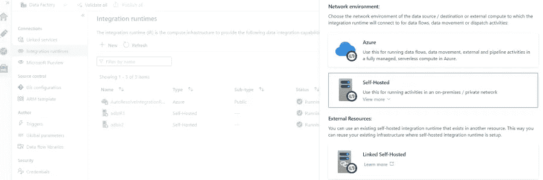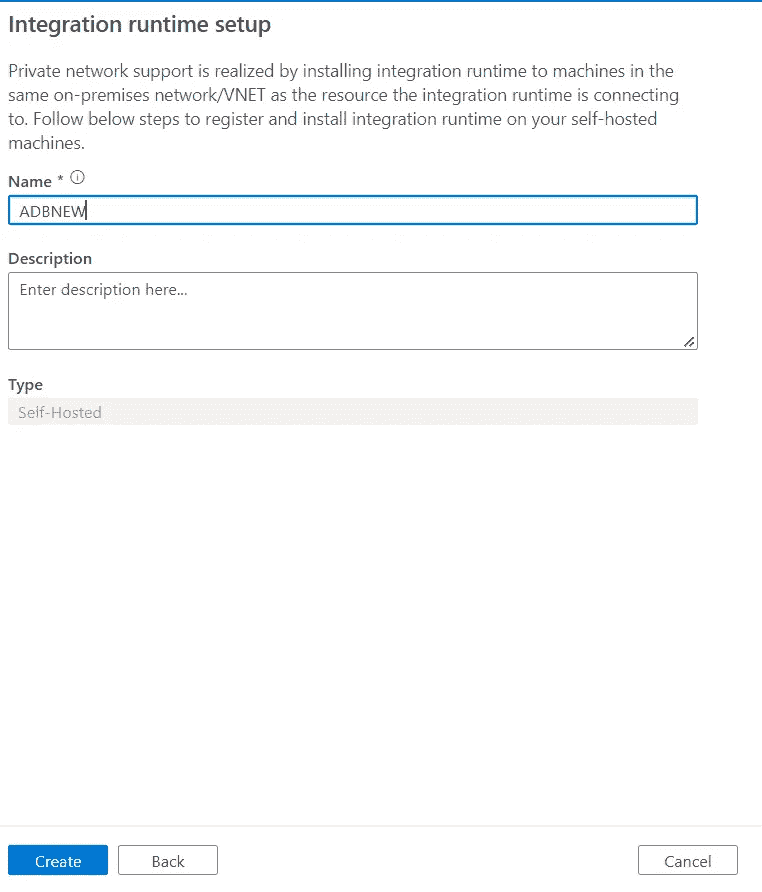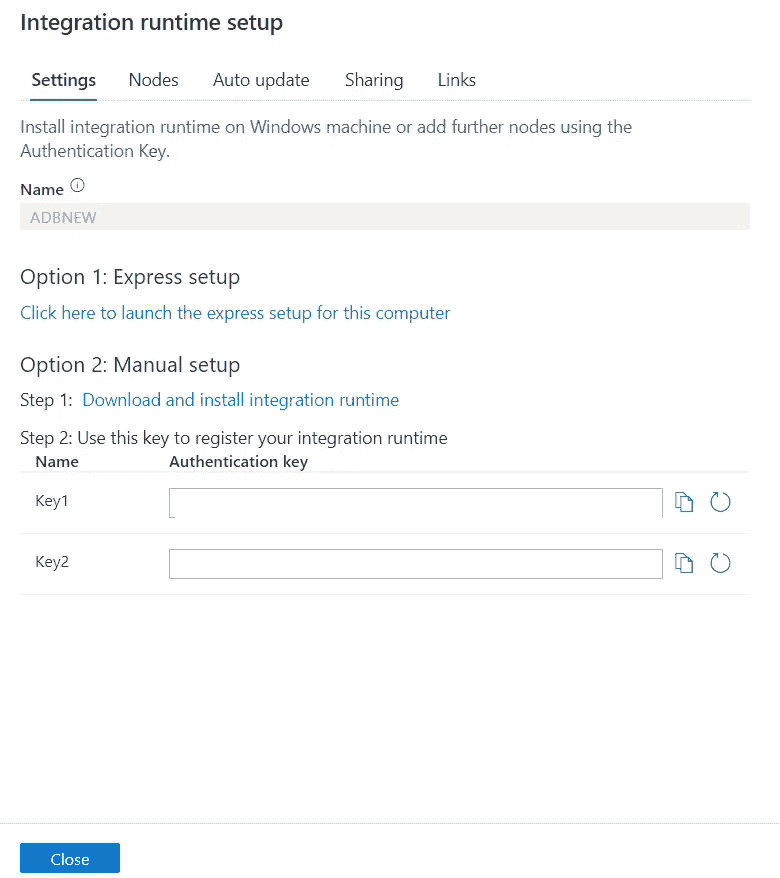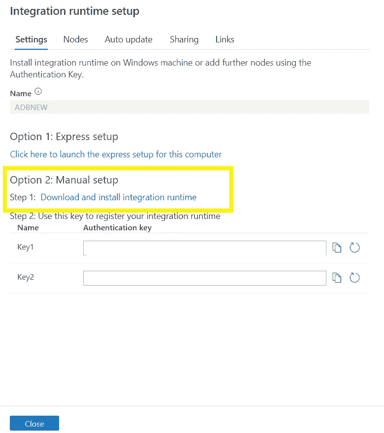

在 OCI windows server 中配置集成运行时。

从上面的链接下载软件，并按照向导中的说明进行操作。

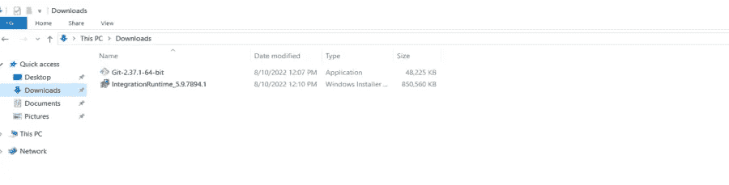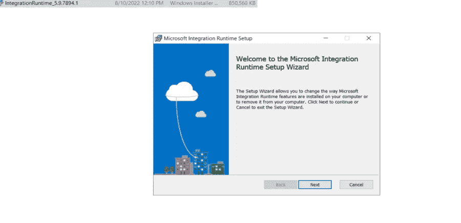

启动 IR 配置管理器。

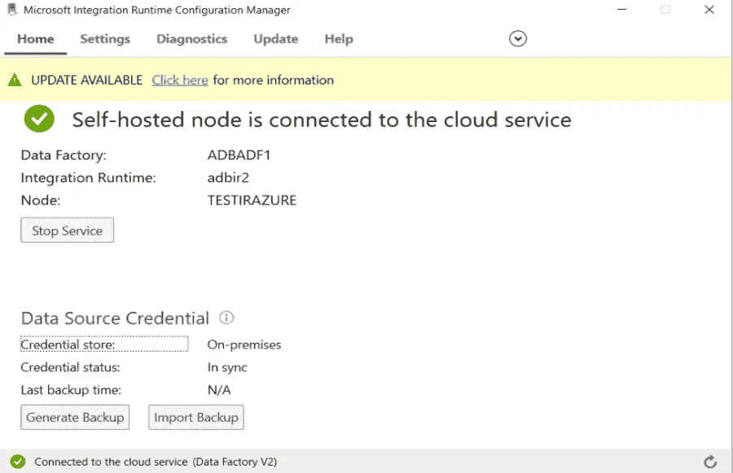

刷新 Azure 门户中的 IR 状态，状态应该显示为“正在运行”

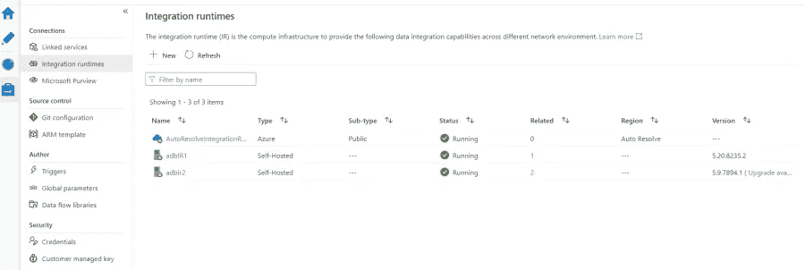

**第二步**

我们将利用 ADB 中的 TLS 连接字符串来建立连接。在我们安装 IR 的 OCI windows server 的 c:\ drive 中下载钱包。

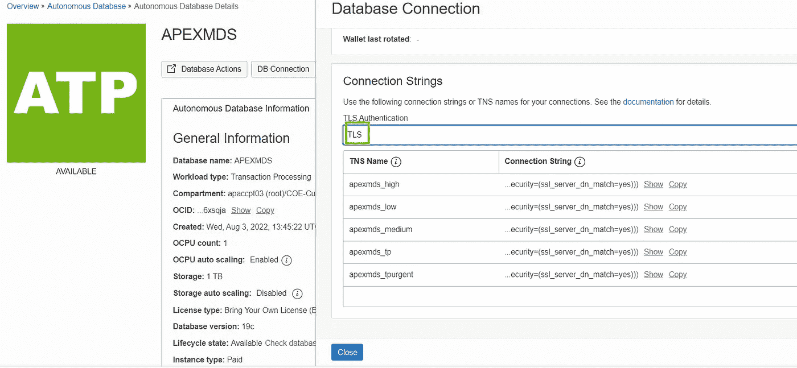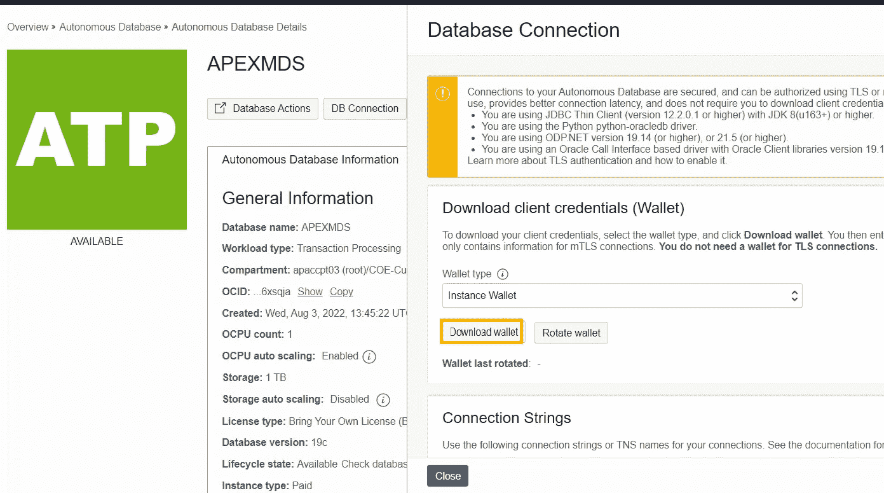

**步骤#3**

在 Azure ADF 中创建链接服务。

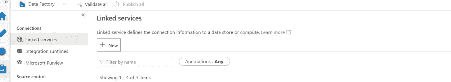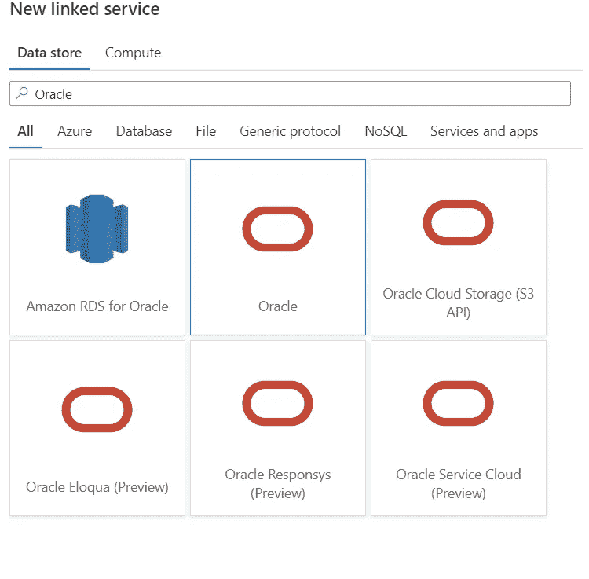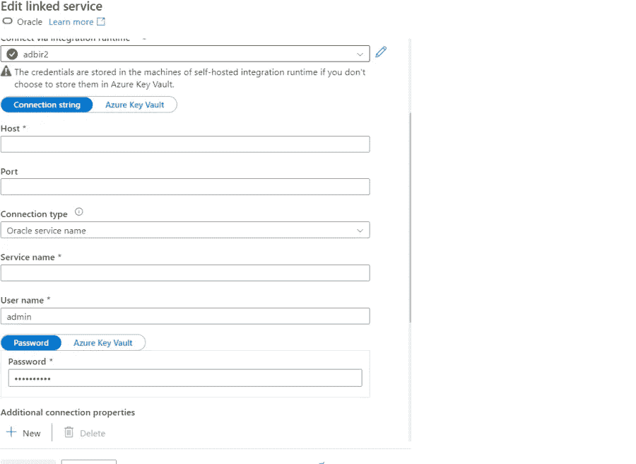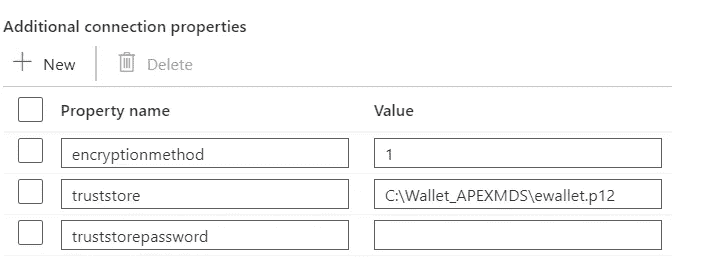

测试连接。

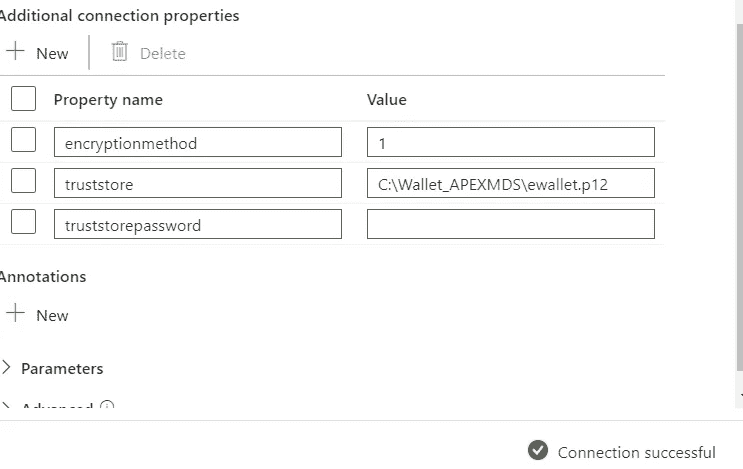

这样，用户可以将数据从非 Oracle 环境带到 Oracle 自治数据库。这不仅加快了对来自多云计算环境的数据进行分析的速度，而且企业也可以更放心地投资于多云计算环境中的数据和分析用例。

快乐阅读！

想聊聊吗？加入我们的[开发者松弛期](https://bit.ly/devrel_slack)！