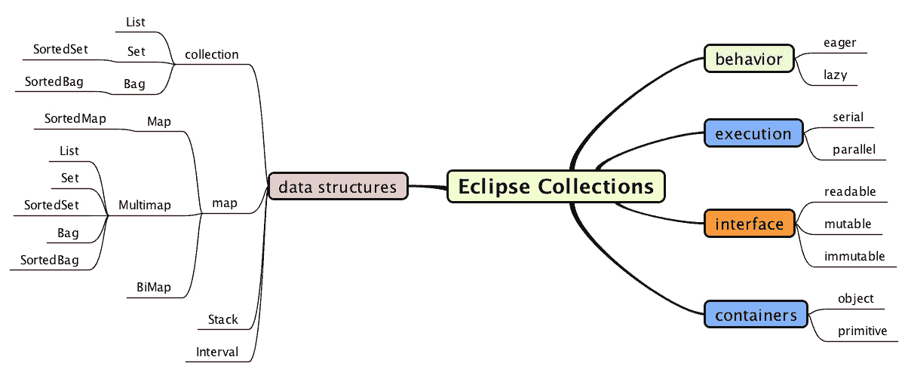
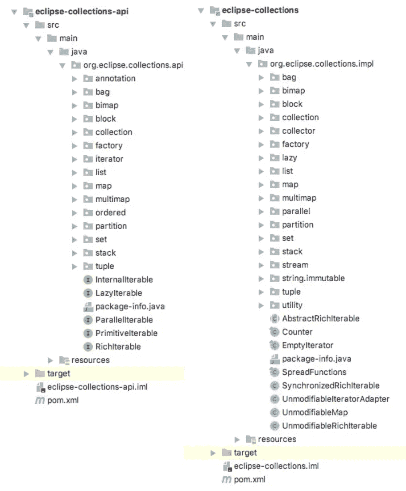
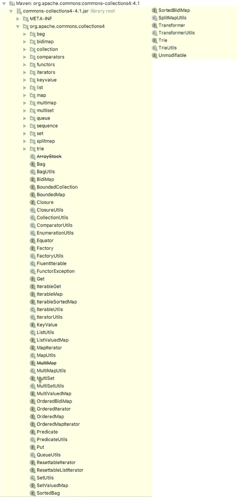
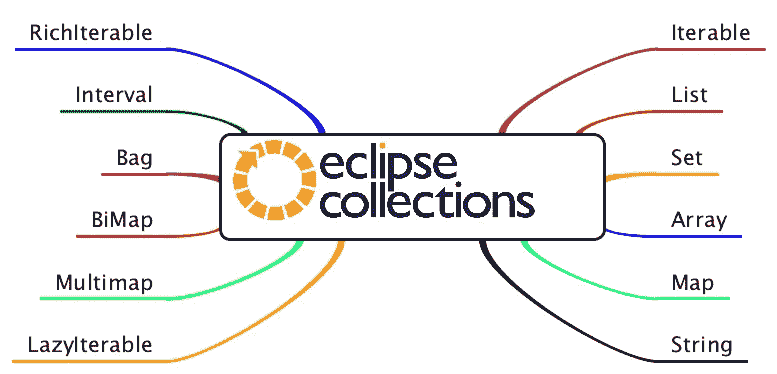
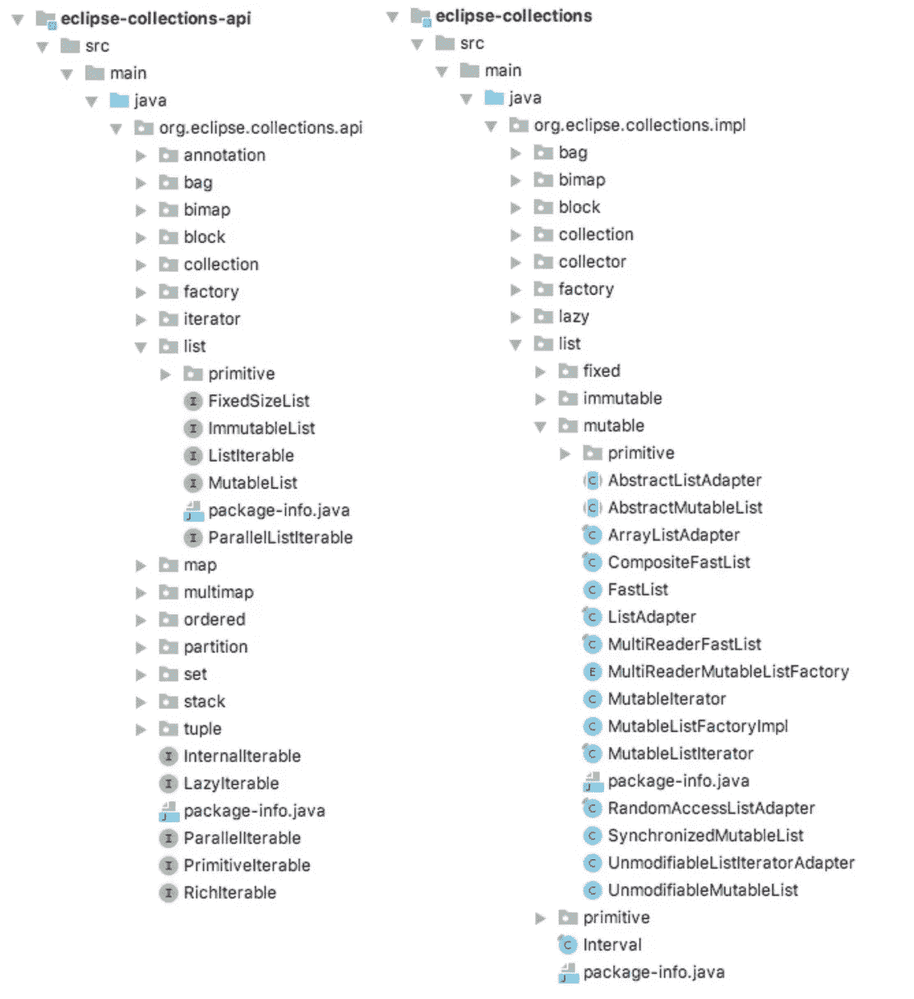
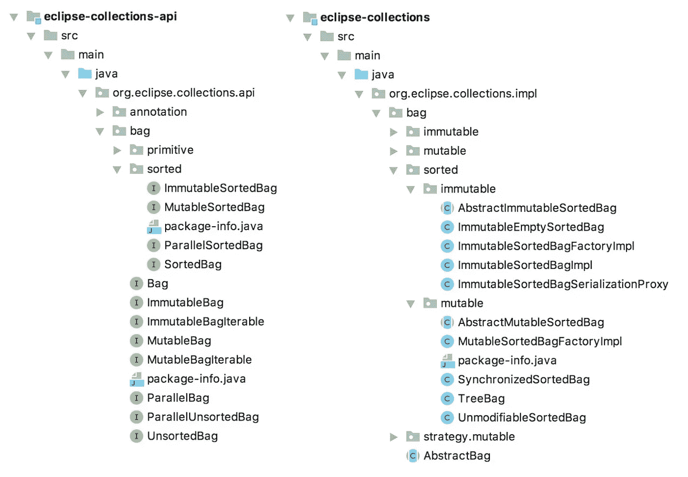
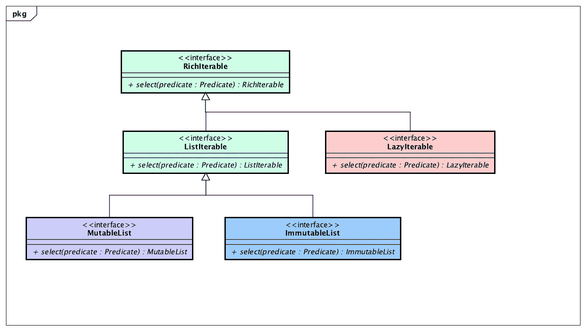
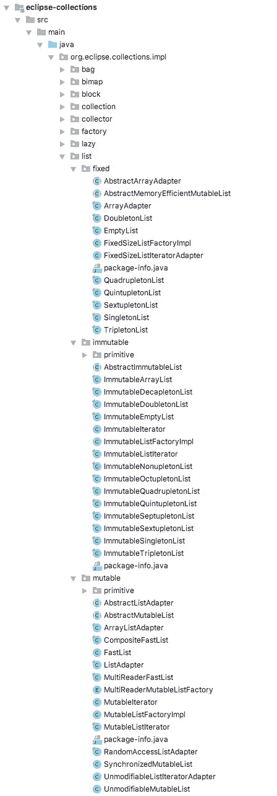
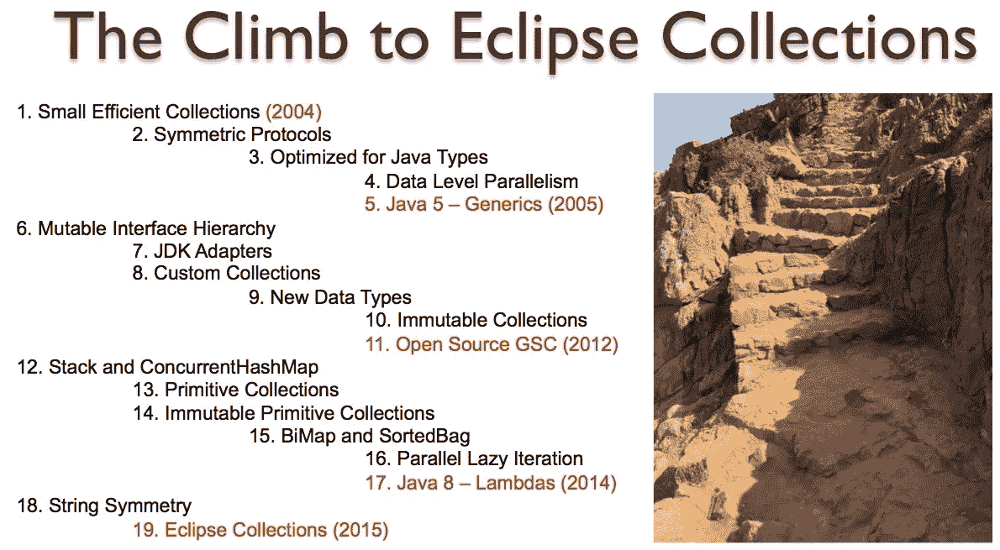

# 利用信息分块来扩展您的 Java 库包设计

> 原文：<https://medium.com/oracledevs/leverage-information-chunking-to-scale-your-java-library-package-design-fcedf64af434?source=collection_archive---------0----------------------->

对包进行组织和分组有助于使你的库更容易导航、理解和随时间增长。

Grounds for Sculpture, Hamilton Township, NJ

# 扩展 Java 库包设计是困难的

Java 给了我们组织相关类和接口的包。包非常有用，但是很难有效地利用，因为每个包都需要一个名字。给事物命名很难。将事物有效地组织成一个层次可能是一个挑战。在您的 IDE 中，重命名和移动内容可能很容易，但是如果您的客户端在升级您的库时不得不在代码中手动重放重命名和移动重构，那么这可能会非常困难。

当库中的类数量少于 10 个或 20 个时，将所有东西放在同一个包和 jar 中似乎是一个微不足道的决定。但是，如果您拥有的类和接口的数量比这多得多，您该怎么办呢？如果您的库中有大量的接口和类，请考虑将 API 和实现类拆分到单独的包中。此外，如果您想让其他人实现您的 API，而不必包含默认实现，那么拥有一个单独的 API jar 会很有帮助。

我将解释我们在 [Eclipse 集合](https://github.com/eclipse/eclipse-collections)中利用的信息分块策略。随着库的增长，我们的包层次结构也发生了显著的变化。在我们开源 Eclipse 集合之前，我们有意识地做出了包设计决策，这使得我们有可能在更长的时间内继续扩充库。

# 信息分块是如何工作的

人类的大脑一次可以记住 7 个正负两件事情。这就是为什么在美国电话号码是七位数。如果将相关的概念分成七个正负两个事物的大块，人类可以更有效地管理大量的信息。有时，如果不增加不必要的包数，严格遵守这个数字是不可能的。例如，将每个基本类型的容器组织到它自己的包中可能是多余的。接口和类名的字母排序给了我们一个包内的可视分组，因此我们可以根据前缀更快地关注或忽略一些东西。

**推荐:**不要让我滚动。如果您让我滚动查看一个包中的所有类，那就太多了。

# Eclipse 集合包策略

*   将接口与实现分开
*   按容器类型组织顶级包
*   用容器类型组织容器类型专门化(例如，分类)
*   按接口类型(如可变、不可变)组织 impl 包
*   将基本类型组织到一个单独的包中

High-level concerns in Eclipse Collections

# 将接口与实现分开

Eclipse 集合为接口和实现类提供了单独的包和 jar 文件。这允许我们库的客户分别理解 API 和实现，并通过容器类型将两者归入一个相似的心智模型。

## Eclipse 集合 org.eclipse.collections.api/impl 软件包

Eclipse 集合为 api 和实现提供了单独的模块和包名。api 包在左边，impl 包在右边。

Eclipse Collections API and Implementation Package Structures

Eclipse Collections 是一个很大的库，但是有可管理数量的高级概念分组到包中。我们已经组织了 Eclipse 集合，因此可以很容易地探索受支持的容器类型，并根据需要深入了解更多细节。

将 API 接口从实现类中分离出来给这个库带来了额外的好处。实现类依赖于 API 接口，而不是反过来。当 API 接口和实现类在同一个包中并位于同一个 jar 中时，就有可能在接口和它们的实现之间引入不必要的依赖，这种依赖很难在以后消除。

## JDK java.util 包

JDK `java.util`包中包含的接口和类如下所示。

JDK java.util package

这是一个包的许多类和接口。您可以通过图标来区分接口和类，但是没有办法理解这些实用程序类之间的关系。在同一个包中有集合、异常、格式化器、比较器、统计、选项、日历、日期、服务加载器、字符串相关的东西、时区、计时器类和其他实用程序。这是一个按名称字母顺序排序的接口和类包。

这个`java.util`包已经变成了一个停车场，用来存放那些被松散地归类为“公用事业”的东西。理想情况下，应该有一个`java.util.collection`包，其中只包含处理集合的类和接口。因为 Java 的向后兼容性保证，唯一合理的前进方式是在像`java.util.stream`这样的新包中引入新概念。

## Google Guava com.google.collect 包

这些是谷歌番石榴的`com.google.collect`包中的类和接口。

Guava package com.google.collect

这个包里面有很多类，但是都和收藏有关。由于某些类的前缀(例如，过滤、转发、不可变、常规)而产生了一种视觉分组，但是很难将重点放在接口和实现上来理解库的整体重点和范围。

## Apache org . Apache . commons . collections 4 包

这里我要比较的最后一个库是 Apache Commons Collections，它是最古老的第三方 Java collections 库。

Apache package org.apache.commons.collections4

Apache Commons Collections 按照容器类型组织它的实现，但是不把它的 API 接口和实现分成单独的包。

Eclipse Collections 是四个 Java collections 库中唯一一个将其 API 和实现分成单独的包和单独的 jar 文件的库。

# 按容器类型组织包裹

当我们决定向 Eclipse 集合中添加不可变容器类型和实现时，我们知道我们需要重组这个库。我们知道，如果我们在一个包中有超过 100 个类和接口，它将不能很好地工作。我们还决定将我们的 API 接口分离到一个单独的包结构中。然后，我们选择“集装箱类型”作为高级包装分组。

这是我们必须弄清楚如何在我们的 API 和实现包中组织的一组高级容器。

Eclipse Collections container types

每种容器类型都有一组额外的问题需要在包层次结构中解决。

这是在接口和实现包中展开`List`容器类型包时的样子。

Interfaces in API package drive the package hierarchy in implementation package

# 用容器类型组织容器类型专门化

Eclipse Collections 已经对`Bag`、`Set`和`Map`的版本进行了**排序。这些容器类型中的每一种都有一个名为**的分类**的子包。这个策略可以根据需要与其他容器类型专门化一起使用。**

Bag, Set and Map all have sorted versions

# 按接口类型组织 impl 包

对于 Eclipse 集合中的所有容器类型，有三种主要的接口类型。它们分别是`Mutable`、`Immutable`和`Iterable`(又名可读)。

Symmetry across container types — Iterable, Mutable, Immutable

对于`List`容器类型，有`Mutable` **、** `Immutable`和`FixedSize`接口类型的实现类。`FixedSize`目前仅限于`List`、`Set`和`Map`容器类型，用于实现类似数组的`Mutable`容器类型的内存效率。也就是说，它们可以被修改，但不能生长。

Object List implementations organized by FixedSize, Immutable and Mutable

# 将基本类型组织到一个单独的包中

原始容器被组织在 API jar 中的容器类型包之下，以及实现 jar 中的`Mutable`和`Immutable`包之下。

API packages (left) and Impl packages(right) for List container type and Mutable Implementations only

我们可以将原始集合按照原始类型分割成单独的包。这将导致每个原始包有八个包。我们决定不这样做，因为类名及其前缀的字母排序在原语包中提供了足够的可视分组。

# 够了

当你的层次结构中有足够多的包时，你需要最终做出决定，而考虑到神奇的数字 7，它可能不会完美地工作。

可变集合实现有几个额外的问题需要处理— `Synchronized`、`Unmodifiable`和`MultiReader`。我们觉得这些概念并不能保证它们有自己的包装。我们想不出一个好名字来把它们放在一起打包。像“mutable.other”这样的名字并不十分有用。所以我们在实现包的`list.mutable`和`list.mutable.primitive`停下来。

# 什么时候是重组软件包的时候？

当我们向库添加不可变集合时，我们重组了 Eclipse 集合中的包(#10)，就在我们将库开源为 GS 集合之前。不可变集合大大增加了我们必须在包中管理的概念的数量。

Package restructuring happened around item #10

下一点，我们在生态系统中引入了一些必须适合我们的包层次结构的大东西，这就是原始集合(#13)。我们能够通过将**原语**包插入到其对象对应物下面的现有层次结构中来完成这一点，而不需要完全的重组。

当库迁移到 Eclipse Foundation 并成为 Eclipse 集合时，父包再次从`com.gs.collections`更改为`org.eclipse.collections`。我们开源了一个独立的库来帮助 GS 集合的用户转换到 Eclipse 集合——[https://github.com/eclipse/gsc-ec-converter](https://github.com/eclipse/gsc-ec-converter)

# 最后的想法

Java 包是帮助解决名称间距和逻辑分组问题的解决方案。当您发展和扩大一个库时，您应该准备好优化您的包结构，以允许更好的逻辑分组和信息分块。

*我是*[*Eclipse Collections*](https://github.com/eclipse/eclipse-collections)*OSS 项目在*[*Eclipse Foundation*](https://projects.eclipse.org/projects/technology.collections)*的项目负责人。* [*月食收藏*](https://github.com/eclipse/eclipse-collections) *是开投* [*投稿*](https://github.com/eclipse/eclipse-collections/blob/master/CONTRIBUTING.md) *。如果你喜欢这个库，你可以在 GitHub 上让我们知道。*