# 在反应式微服务架构中利用 Akka 和机器学习

> 原文：<https://medium.com/capital-one-tech/leveraging-akka-and-machine-learning-in-a-reactive-microservices-architecture-57b2da0c949e?source=collection_archive---------5----------------------->

一个新的技术时代即将来临！软件让最终用户更容易在他们想做的时候，通过他们选择的设备，立即完成他们需要做的事情。支持这些解决方案的软件架构也变得越来越智能、响应越来越快、弹性越来越大、可伸缩性越来越强。构成这些架构的几个基础支柱包括*机器学习、反应式框架和* [*微服务*](https://developer.capitalone.com/blog-post/delivering-microservices-for-enterprise-with-devops/) 。

在[之前的帖子](/capital-one-tech/using-machine-learning-and-open-source-bpm-in-a-reactive-microservices-architecture-96bb8dc9e962)中，我们讨论了如何在反应式微服务架构中利用[开源 BPM](/capital-one-tech/comparing-and-contrasting-open-source-bpm-projects-196833f23391) 和机器学习。它提供了机器学习的基本概述，Kafka，H20，并解释了一种方法，当你有人类工作流参与时，这种方法是有价值的。

在[另一篇之前的帖子](/capital-one-tech/building-microservices-a-reactive-framework-comparison-fb49d8f3c8f4)中，我们讨论了反应式架构，并涵盖了一些运行在 JVM 之上的领先反应式框架的基本概念，如 Akka 和 Vert.x。这些框架非常强大，提供了创建反应式架构所需的工具。

那么，如果您有一个不涉及人工工作流的用例，而主要是您希望在反应式微服务架构中与机器学习集成的系统到系统交互，该怎么办呢？让我们仔细看看如何解决这个特殊的问题。

# 理解问题

在我们开始解决问题之前，确保你对你试图解决的问题有一个真正好的理解总是一个好的最佳实践。这有助于您为您的特定用例找到合适的技术和架构模式。通常，团队认为他们知道问题，当他们只是在表面上。他们需要深入几个层次才能找到根源。这往往需要提问并继续问*“为什么？”*直到你到达那里。你要避免的是找到一个不适合你试图解决的问题的解决方案。这可能导致解决方案过于复杂。

当使用反应式架构时，这变得更加重要，因为由于异步概念的引入，默认情况下会增加额外的复杂性。

# 反应式微服务和系统的集成选项

当考虑机器学习和集成不同的反应系统时，根据使用情况，有几种方法可以采用。每当有多个系统需要集成时，[反应式架构](https://www.reactivemanifesto.org/)的一个关键原则就是保持这些系统的解耦。

一种方法是通过命令和事件，你可以在我的[以前的帖子](/capital-one-tech/microservices-when-to-react-vs-orchestrate-c6b18308a14c)中读到更多。Kafka 是一种用于实现命令和事件的常用技术。它可以用来将微服务*集成到*反应式应用中，以分离各种应用组件。

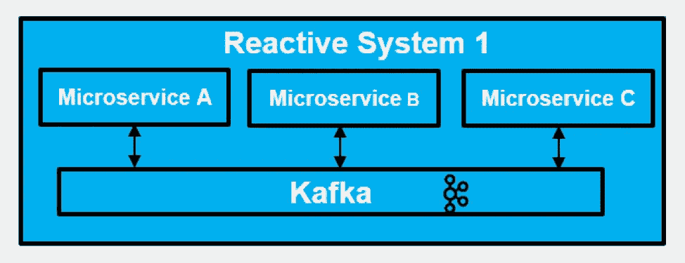

Leveraging Kafka within a reactive system

在 中利用 Kafka ***可以很好地适应反应系统:***

*   如果您的反应系统中的微服务本质上是多语言的，这意味着技术的混合(例如，Spring Boot、Java、Akka)。
*   如果希望避免局限于特定的反应式框架进行交流。

Kafka 也可以用于集成*跨*反应式系统。

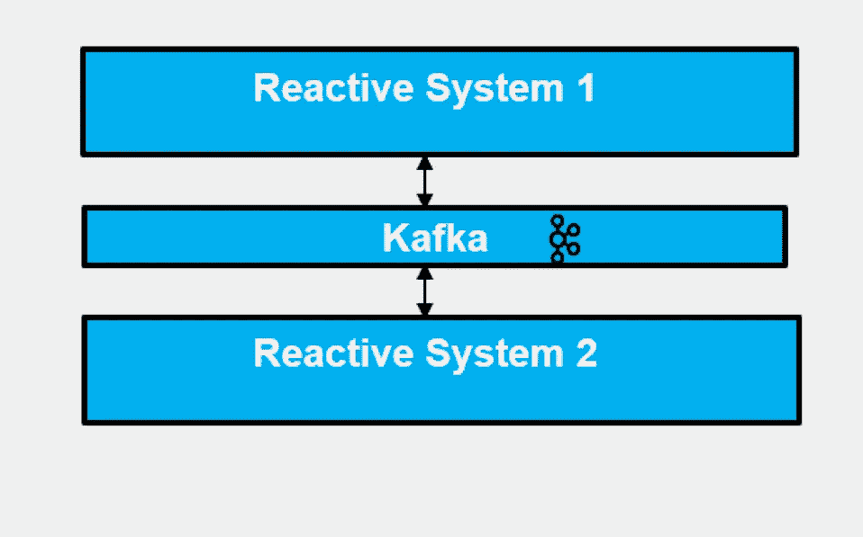

Leveraging Kafka across reactive systems

利用 Kafka ***跨越*** 的反应系统可能是一个不错的选择:

*   如果你的反应系统本质上是多语言的(Akka Actor 系统，Java)。
*   如果希望避免锁定到特定的反应式框架来进行交叉反应式系统通信。

您也可以利用 [Akka](/capital-one-tech/building-microservices-a-reactive-framework-comparison-fb49d8f3c8f4) 的功能来实现类似的结果。Akka 使您能够构建一个可以包含多个演员的演员系统。为了在反应式系统中进行*沟通，参与者可以通过 Akka 的内置消息传递功能(例如，通过 EventStream 构造询问、告知或发布/订阅)相互沟通。*

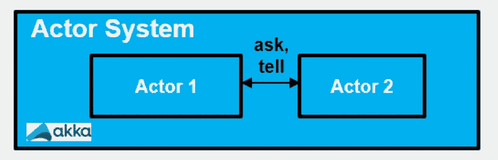

Leveraging the Akka Ask or Tell built-in messaging

当您的所有微服务都是同一个 Actor 系统的一部分时，在反应式系统中利用 Akka 可能是一个很好的选择。

对于跨 Akka 系统的通信， [Akka HTTP](https://doc.akka.io/docs/akka-http/current) 或 [Akka gRPC](https://developer.lightbend.com/docs/akka-grpc/current/) 可用于同步无阻塞通信，而 [Akka Streams Kafka](https://doc.akka.io/docs/akka-stream-kafka/current/home.html) 可用于异步通信。这些方法中的每一种都将背压作为消息流的一部分。此外，通信的另一端可以用 Akka 之外的东西来实现。

您还可以将其中一些模式结合在一起，这可以让您利用每种方法的优势。

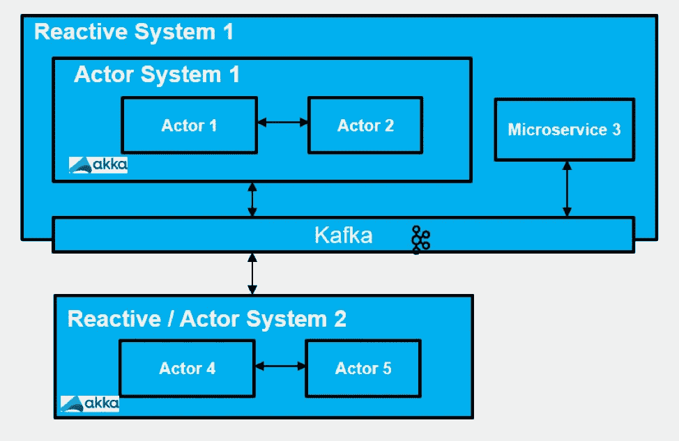

Leveraging Kafka within and across reactive systems AND leveraging Akka within a reactive system

这种方法利用 Kafka 在一个反应式系统内和跨角色系统传递消息。它还利用 Akka 在 actor 系统中传递消息。当您希望在微服务和反应式系统级别最大化去耦并支持多语言通信时，这种方法非常合适。在下一节中，我们将展示如何采用这种模式，并使用反应式框架和机器学习来实现一个示例。

# 一个示例实现

让我们通过一个例子来说明如何利用 Akka 框架、Lagom、H20、Kafka 和基于 Java 的微服务来实现基于机器学习的解决方案，该解决方案使用反应式微服务架构。你也可以在下面找到我和我的同事在 2018 年反应式峰会上发表的关于这个主题的演讲和视频。

[**将机器学习、反应式微服务、Akka 与 Kafka 整合—@ react ivesummit***react ive18—很多公司都在尝试机器学习，看看他们如何更好地预测未来……【www.reactivesummit.org】T4*](https://www.reactivesummit.org/2018/schedule/integrating-machine-learning-reactive-microservices-and-akka-with-kafka)

在本例中，我们创建了一个预测欺诈性信用卡交易的解决方案。28 个数值特征被计算并输入到执行预测的 H20 模型中。在我的[上一篇](/capital-one-tech/using-machine-learning-and-open-source-bpm-in-a-reactive-microservices-architecture-96bb8dc9e962)中，我们提供了 Akka、H20 和 Kafka 的概述。我们之前没有讨论过的新技术组件是 [Lagom](https://www.lagomframework.com/) 。Lagom 是一个开源框架，可以更容易地将微服务连接在一起(例如，它可以将 Akka Actors 作为 RESTful APIs 公开)。在我们的例子中，我们用它来为 Kafka 提供一个引导带。现在，让我们看看使用所有这些组件的建议体系结构。我们重用了许多来自[开源 BPM 示例](/capital-one-tech/using-machine-learning-and-open-source-bpm-in-a-reactive-microservices-architecture-96bb8dc9e962)的相同组件，请看这篇文章，了解 H20 组件的详细介绍。

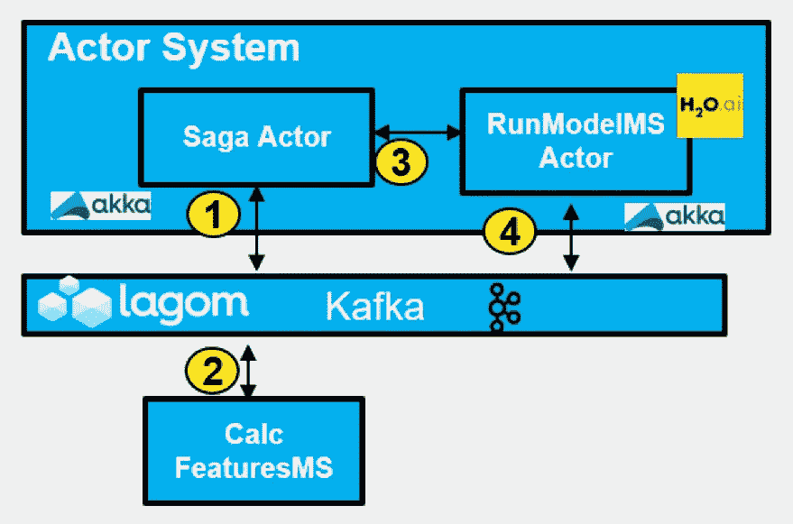

Architecture for example

上述解决方案利用了命令和事件。您将看到一个带有 Akka Actors 的 Akka 系统，它使用内置的 Akka 消息传递(ask/tell)，以及发布和订阅 Kafka 来与基于 Java 的微服务进行通信。该解决方案的关键微服务包括:

*   **Kafka Producer(上面未显示)** —基于 Java 的微服务，用于通过在 Kafka 主题 card.transaction 上放置命令“Calc Features”来模拟系统流程。
*   **Saga Actor** —基于 Java 的 Akka Actor，订阅 Kafka 上的 card.transaction 主题。对事件“Features Calculated”作出反应，并使用 Akka 的内置消息传递功能通过“ask”向 RunModelMS Actor 发送命令，传递 28 个模型输入。
*   **CalcFeaturesMS** —基于 Java 的微服务，订阅 Kafka 上的 card.transaction 主题。通过计算 28 个数字特征并将它们发布回 Kafka 主题和事件“计算的特征”来响应命令“计算特征”。
*   **RunModelMS** —基于 Java 的 Akka Actor，封装了基于 Java 的 H20 模型代码。从 Saga 演员接收命令以运行 H20 模型。运行模型并将带有事件“交易正常”或“欺诈性交易”的输出发布到 card.transaction Kafka 主题。

总体流程可以通过下图直观显示。

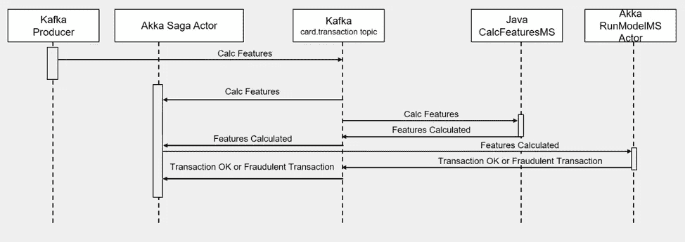

overall flow for example

现在，让我们仔细看看这个例子中新增的代码片段。Kafka 生成器功能由 TestKafkaProducer 类实现，该类扩展了 ProducerExample 类。ProducerExample 创建一个连接到本地 Kafka 实例的 Actor 系统。TestKafkaProducer 在 card.transaction Kafka 主题上传递“Calc Features”命令。

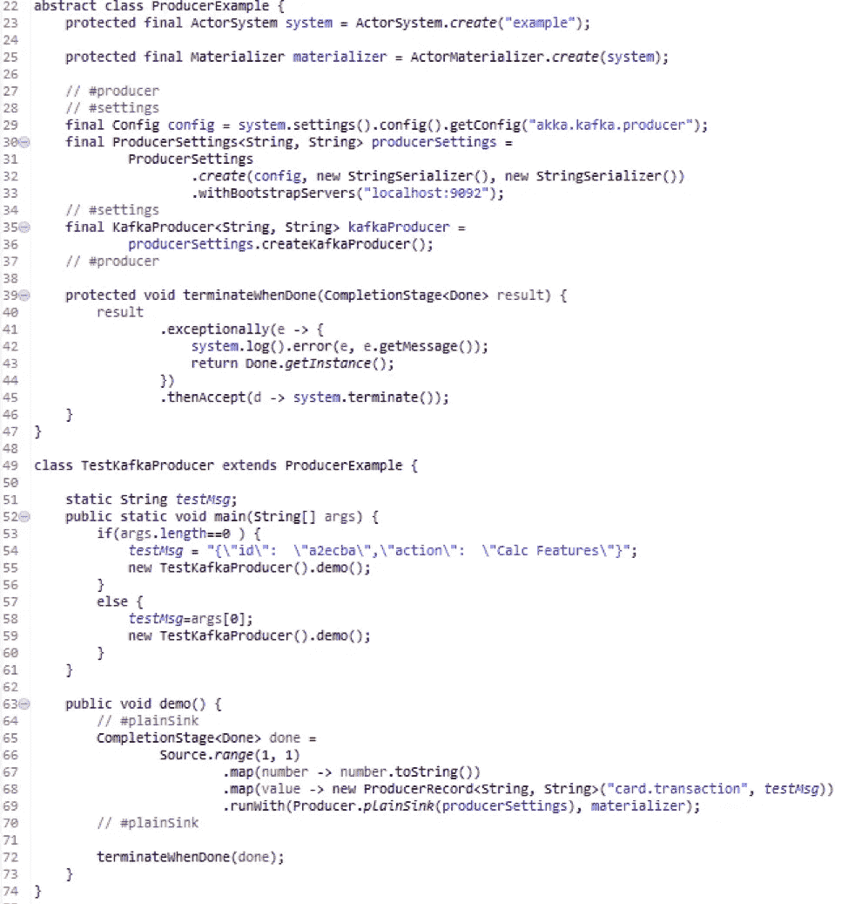

Kafka Producer example

我们的传奇演员是通过一系列四个独立的组件实现的。第一个是 application.conf，它位于类路径的根，用于将 Akka 的配置信息传递给 ActorSystem 实例。我们的 application.conf 文件指向 Saga 演员，我们称之为通信模块。

> play . modules . enabled+= com . capital one . ACC . impl . communication s module

CorrespondenceModule.java 是 Kafka 与服务实现类绑定的地方:

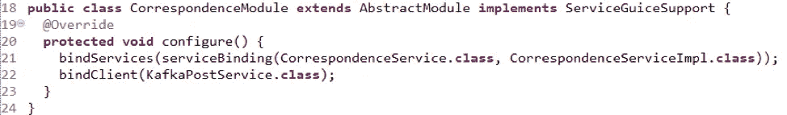

CorrespondenceModule.java

服务实现类创建 Saga Actor 和 StartEventCmd 的实例。

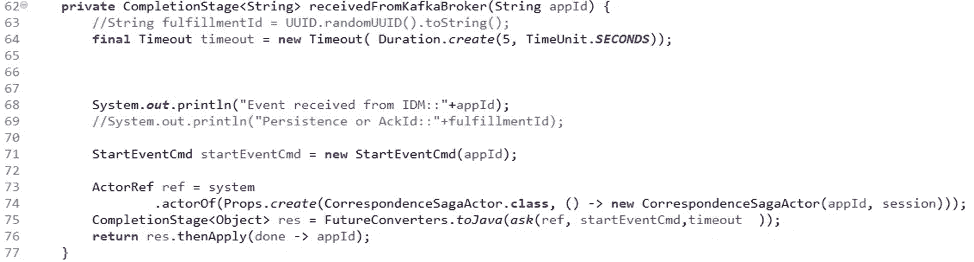

Service Implementation Class

Saga Actor 中的 startEventCmd 接收消息，并向 RunModelMS(在本例中称为 ProcessAppActor)发送一条 tell 消息。

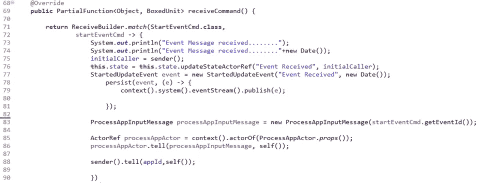

startEventCmd in Saga Actor

RunModelMS(在代码中称为 ProcessAppActor)检查消息以查看是否已经计算了特性。

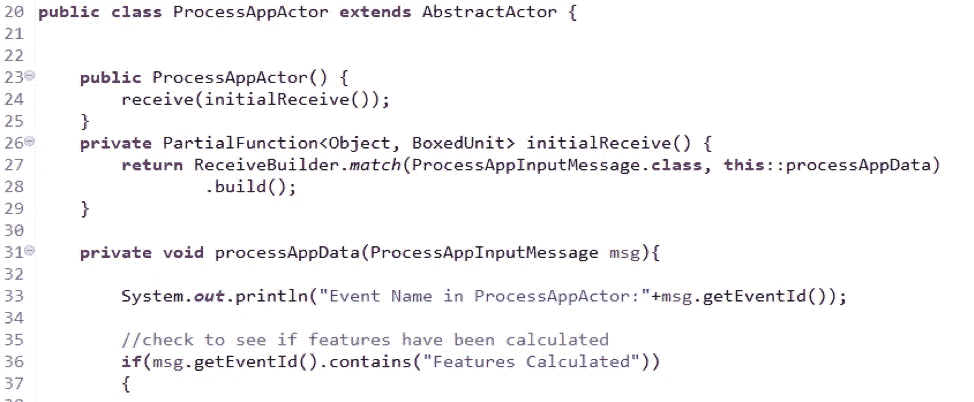

checks EventId for “Features Calculated”

如果已经计算了特征，那么它将执行 H20 模型，你可能从我们的[上一篇文章](/capital-one-tech/using-machine-learning-and-open-source-bpm-in-a-reactive-microservices-architecture-96bb8dc9e962)中的例子中认出它。

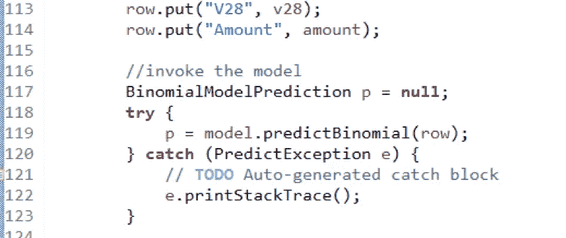

Execution of H20 model

# 处理故障

在这一点上，您可能想知道的一件事是，我如何在这样的分布式架构中处理故障？有许多方法可以在应用程序级别加以利用。下面就让我们一起走过几个。

*   使用 try / catch 块捕捉异常。注意，我们是在执行上面的 H20 模型时这样做的。
*   将您的处理设计成幂等的。这意味着设计您的处理，这样它就不需要记住哪里出错了，而是您可以从头开始重新处理。这种方法可能是简化设计的一种很好的方式，但根据使用案例的不同，可能并不总是可行的。
*   利用 Kafka 消费者群体，仅在您知道处理成功时提交补偿。对于 Kafka 消费群，Zookeeper 会跟踪偏移量，即消息流中要消费的当前点。一旦消息被读取，消费者可以控制提交偏移量或自动提交。通过控制何时提交偏移量，使用者可以等待特定的成功条件发生。如果在 Kafka 中继续产生消息时，消费者进程停止，当消费者恢复时，它将能够处理任何未提交的消息。
*   利用 Akka 持久性，因为它通过存储参与者的内部状态来提供容错。这使得参与者的状态可以在崩溃时恢复。你可以在我之前的博客中找到更多的细节。

# 摘要

在反应式微服务架构中结合 Akka、Lagom、H20 和 Kafka 的力量，可以将您的机器学习用例提升到一个新的水平。它提供了一种分离内部组件的方法，支持异步处理，同时通过发布和订阅功能支持与各种多语言反应系统的集成。这种模式对于系统到系统类型的交互(非人类工作流)是一种很好的模式。我希望这篇文章对你有所帮助，感谢你的时间！

*披露声明:这些观点是作者的观点。除非本帖中另有说明，否则 Capital One 不属于所提及的任何公司，也不被其认可。使用或展示的所有商标和其他知识产权都是其各自所有者的所有权。本文为 2019 首都一。*

# 相关:

*   [在反应式微服务架构中使用机器学习和开源 BPM](/capital-one-tech/using-machine-learning-and-open-source-bpm-in-a-reactive-microservices-architecture-96bb8dc9e962)
*   [构建微服务:反应式框架比较](/capital-one-tech/building-microservices-a-reactive-framework-comparison-fb49d8f3c8f4)
*   [微服务——何时应对，何时协调](/capital-one-tech/microservices-when-to-react-vs-orchestrate-c6b18308a14c)

> *披露声明:2019 首创一。观点是作者个人的观点。除非本帖中另有说明，否则 Capital One 不隶属于所提及的任何公司，也不被这些公司认可。使用或展示的所有商标和其他知识产权是其各自所有者的财产。*