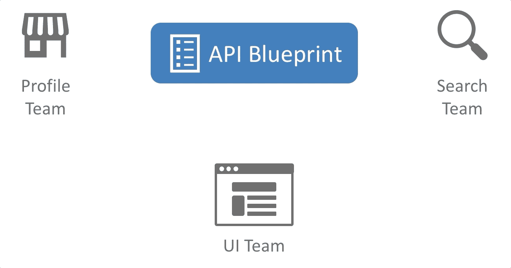
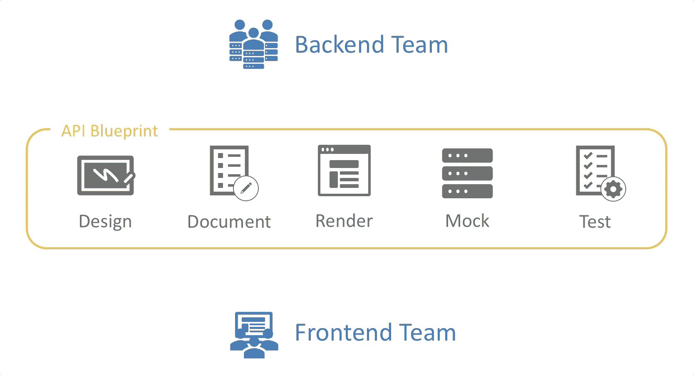

# 利用 API 蓝图扩展应用程序开发

> 原文：<https://medium.com/walmartglobaltech/leveraging-api-blueprint-to-scale-application-development-ba69be715f90?source=collection_archive---------1----------------------->

## 采用 API 描述解决方案来鼓励团队之间的协作，以改进 API 设计生命周期。

沟通是任何成功的工作关系的关键，你应该建立一种共同的语言来推动这种成功。我说的*通用*语言是什么意思？我指的是一种在你工作的团队之间，甚至是你自己团队的成员之间交换清晰而具体的信息的方法。

Photo by [Daniel McCullough](https://unsplash.com/@d_mccullough?utm_source=medium&utm_medium=referral) on [Unsplash](https://unsplash.com?utm_source=medium&utm_medium=referral)

在应用程序开发中，通常有不同的个人拥有代码的特定区域。让我们以一个餐馆寻找应用程序为例。一个团队可以为餐厅简介页面构建功能；另一个团队可能从事搜索；而另一个可以开发 UI。如果没有可理解的方式来共享他们的工作，团队内部的集成将是非常低效的。

我一直在沃尔玛实验室努力应对这个挑战。我的团队负责构建 ui，我们在开发过程中经常会遇到 API 设计的问题——导致大量的返工。*查看我的博客关于* [*简化后端团队的前端即服务*](/walmartlabs/streamlining-frontend-as-a-service-for-backend-teams-69d9223efcec) *。*

那么，您可以做些什么来跨多个团队扩展应用程序交付？欢迎使用 API 蓝图—一种设计、创建、记录和测试 API 的简单方法。

*备注:本博客灵感来自*[*Idris Tarwala*](https://medium.com/u/e0a5bcbe983?source=post_page-----ba69be715f90--------------------------------)*发布的内部演示。*

Team Collaboration with API Blueprint

# 什么是 API 蓝图？

API 蓝图是一种 web APIs 的设计语言，它提供了一系列开源工具。这些工具可在工程师的整个开发生命周期中为他们提供帮助，其功能包括但不限于以下内容:

*   编辑
*   测试
*   解析器
*   模拟服务器
*   呈现器
*   转换器

查看完整的[工具清单](https://apiblueprint.org/tools.html)。

> “API 蓝图的目标是在封装后端实现行为的同时，将 API 的元素去耦合以实现模块化。”

# 为什么是 API 蓝图？

> API 蓝图旨在鼓励项目涉众、开发人员和客户在 API 生命周期的任何点进行对话和协作

同样，成功的关键是建立一种通用的*语言。API 蓝图为您提供了一种通用语言来推动围绕 API 设计的讨论，并在整个 API 生命周期中构建数据契约。与开发开始后进行更改相比，尽早确定 API 设计的更改要少得多。*

API 蓝图通过提供清晰地记录 API、呈现文档和生成用于测试和持续开发的模拟服务器的工具，消除了所有涉众之间的模糊性。

> “一旦 API 蓝图就位，每个人都可以[测试](https://github.com/apiaryio/dredd)实现是否达到合同中设定的期望。”

Example Development Flow with API Blueprint

在上面的示例中，后端团队以 HTML 格式为前端团队设计、记录和呈现 API 定义。后端团队还构建模拟服务器和测试，从而使前端团队能够开发具有可操作端点的 UI。

在这里开始 API 蓝图[。](https://apiblueprint.org/documentation/tutorial.html)

## 替代解决方案

还有一些替代解决方案可以提供与 API 蓝图相同的好处，例如 [OpenAPI 规范](https://swagger.io/docs/specification/about/)(swag)。这两种格式都是开源的，并围绕它们构建了强大的社区和工具。两者之间的关键高层差异是:

*   **swage:**采用 YAML(或 JSON)格式，焦点易于解析，有很多种扩展和集成选项。
*   **API 蓝图:**的语法接近于 Markdown，MSON，并且完全支持所有的 API 工具和开源工具

本博客的目的是描述一个理想的 API 生命周期过程，它将适用于任何 API 描述解决方案。选择的解决方案应取决于哪种格式和工具集最符合您团队的技能集。

## 采用 API 蓝图的影响

采用 API 蓝图已将我们的团队转向设计优先的开发思路。我们已经扩展了应用程序开发流程，并在以下领域看到了积极的影响:

*   **能够尽早讨论 API 要求:**遵循设计优先的思路，我们的团队可以针对构建内容和方法制定一个有预谋的计划。
*   **利益相关方之间的协作增加:**开发人员、产品经理和客户能够进行审核和讨论。
*   **API 端点的质量和可靠性得到提高:**建立合约后，团队可以在发布前测试彼此的 API。
*   **减少 UI 构建的返工:**提前花时间设计、记录和测试 API 终结点确保了 UI 开发就绪性，从而减少了后端更改。

我总是在寻找新的方法来改进我们的流程。如果你有任何建议或有过类似的经历，请在下面的评论部分分享。

1: *API 蓝图。*2019 年 12 月 26 日从 https://apiblueprint.org/[检索](https://apiblueprint.org/)

# 你觉得这有用吗？请大家推荐或分享，随意点击拍手键。👏🏻关注我以后的帖子。