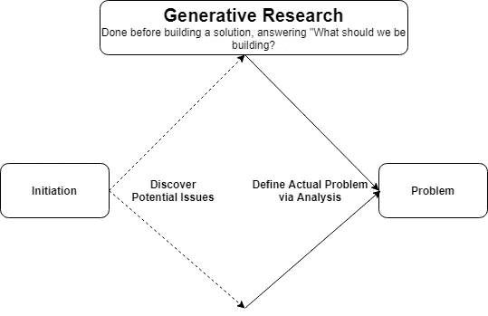
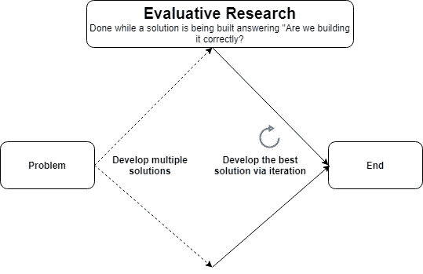
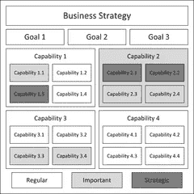
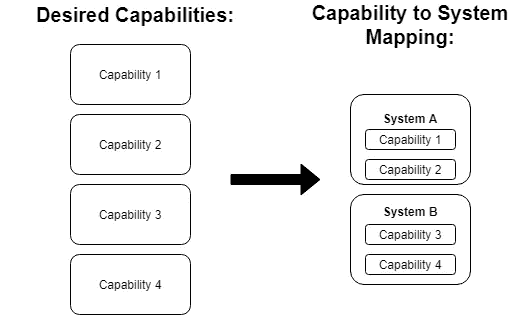
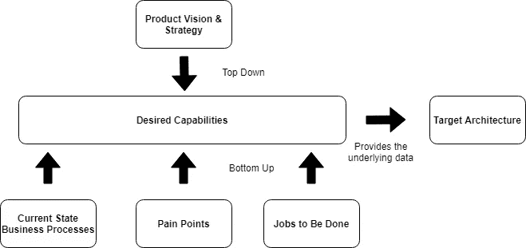

# 利用要完成的工作启动目标体系结构

> 原文：<https://medium.com/capital-one-tech/leveraging-jobs-to-be-done-to-start-a-target-architecture-8cf797b25e80?source=collection_archive---------0----------------------->

## 理解“事情背后的原因”,采取自下而上和自上而下的方法

你是否曾经点了外卖，开车回家 20 分钟后发现少了什么东西？我们每个人都会在某个时候遇到这种事。这也发生在软件开发中。敏捷有助于降低这种可能性，因为您以渐进的方式交付产品，并与客户保持密切的互动。但是，您仍然需要了解客户要求的更大原因，因为这可能会改变您的整体产品和架构愿景。幸运的是，在软件交付中有一个框架解决了这个被称为要做的工作(JTBD)。

哈佛大学教授克雷·克里斯腾森解释说，JTBD 理论有助于理解事情背后的原因。在你开始构建任何东西之前，拥有这种背景和细节是至关重要的，因为它定义了用户希望产品在未来是什么样的。

在本文中，我们将学习更多关于 JTBD 的知识，然后学习如何将输出与其他自下而上和自上而下的数据源结合起来，以创建一个目标架构。

# 什么是 JTBD 框架？

T2 认为亨利·福特说过，“如果我问顾客他们想要什么，他们会说是更快的马。”

Model T from the [Internet Archive Flickr Account](https://www.flickr.com/photos/internetarchivebookimages/14778958845/)

福特意识到他需要超越*用户所说的*，并理解他们想要什么背后的*原因*。这是 JTBD 的根本目标。

JTBD 框架利用对用户的多步研究过程来确定他们真正想要的是什么。从[用户体验研究(UXR)](https://en.wikipedia.org/wiki/User_experience) 开始。这是一门跨学科的科学，在创建解决方案之前理解用户需求，然后利用这些发现来构建以用户为中心的设计。

作为 JTBD 框架的一部分，有两种类型的 UXR 研究——生成研究和评估研究。

*   [生成研究](https://www.usertesting.com/blog/generative-vs-evaluation-research)在构建解决方案之前完成，以回答问题“*我们应该构建什么？*

Generative Research

*   [评估性研究](https://www.usertesting.com/blog/generative-vs-evaluation-research)在构建解决方案时进行，以回答问题“*我们构建的正确吗？*

Evaluative Research

## 占领 JTBD

这两个研究步骤都包括采访用户以了解他们的需求。最终，在研究完成后，您将创建遵循以下格式的 JTBD:

> 在做[情境]时，使用者需要能够[行动]，以达成[目标]为目的。

这从未来功能的角度提供了用户想要什么的视角。让我们看一个例子。我们将在文章的后面剖析这个 JTBD 的不同部分。

> 在处理客户服务电话时，代理需要能够查看帐户详细信息，以便回答客户问题。

清点特定领域的 JTBD 有助于提供用户需求的整体视图。然后，这可以用作启动目标体系结构的初始输入。

# 目标体系结构的公共输入

目标架构是任何软件产品的关键工件。它们定义了软件产品的目标状态，提供了一个更大的图片视图，显示了所有的部分是如何组合在一起的，以及它们的接口。它们还解决了许多因素，包括功能性和非功能性需求(例如可用性、持久性、可靠性、弹性)。关键的一点是，它们显示了我们希望事情如何发展(例如，目标状态)，而不是它们今天如何发展(当前状态)。有多种方法可以实现目标架构。我建议双管齐下:自上而下和自下而上。

## 自上而下的方法

自上而下的视角通常始于产品愿景。

这展示了你希望一个产品在一段时间内成为什么样的愿景，并提供了总体方向。产品愿景的一个例子可能是一家公司，它有许多分散的用户界面(UI ),并希望将它们整合到一个 UI 中。然而，一个愿景本身并不足以完成一个目标架构。你需要利用自下而上的数据，比如 JTBD，来为你的愿景打下基础。

## 自下而上的方法

JTBD 通过提供“是什么”和“为什么”的下一个层次的细节，奠定了整体愿景的基础。一个没有 JTBD 支持的愿景可能是模棱两可的，并为误解需求留下了空间。另一方面，没有远见的 JTBD 可能过于战术化，缺乏整体方向。我发现你需要两者才能成功。回到我们的例子，如果产品的愿景是有一个统一的用户界面，你需要理解什么样的体验应该是用户界面的一部分。在我们之前的 JTBD 示例中，“在处理客户服务呼叫时，代理需要能够查看帐户详细信息，以便回答客户问题”开始提供一些详细信息。您可能希望绘制出所有的 JTBD，以便全面了解客户需求。

## 事件风暴

另一个有价值的自下而上的输入是事件风暴。在之前的[文章](/capital-one-tech/event-storming-decomposing-the-monolith-to-kick-start-your-microservice-architecture-acb8695a6e61)中，我们讨论了如何利用事件风暴来启动目标架构。这是一种基于当前状态进行领域驱动设计的交互方式。它通常用于分解一个域，以了解如何将其分解为微服务。它还提供了对整体业务流程的深入了解。然而，它通常专注于当前状态。另一方面，JTBD 关注的是你希望事情如何发展。将这两者结合在一起，可以让您了解 it 的现状以及未来的发展方向。

## 棘手问题

对目标架构有帮助的另一个自下而上的输入是痛点。这些代表了需要改变的事情，从对生产力的直接影响到整体客户体验。一些棘手问题包括手动流程或因必须在多个应用程序/用户界面之间切换而导致的生产力损失。痛点作为事件风暴和 JTBD 框架的一部分出现是很常见的。

## 将 JTBD 映射到能力

那么，如何将自顶向下和自底向上的数据输入结合起来呢？答案是能力。

能力代表做某事的能力，例如展示产品、履行订单等。通过[事件风暴](/capital-one-tech/event-storming-decomposing-the-monolith-to-kick-start-your-microservice-architecture-acb8695a6e61)，我们解释了如何将事件映射到功能。有了 JTBD，你可以做类似的映射。如果我们看一下 JTBD 的故事格式，*“在做【情境】的时候，用户需要能够* ***【动作】*** *，为了达到【目标】*，通常**动作**就是可以映射到一个能力的东西。例如:

> 在处理客户服务电话时，代理需要能够**查看账户详情**以回答客户问题。

该 JTBD 的功能是“查看帐户详细信息”。可以对一个域中的所有 JTBD 进行这一练习，以生成所需功能的列表。

接下来，您可以进行分组练习，将相似的能力组合在一起。在某些情况下，您可能需要调整功能的粒度，使它们处于相同的级别，无论是在细节上向上还是向下。在 [Event Storming](/capital-one-tech/event-storming-decomposing-the-monolith-to-kick-start-your-microservice-architecture-acb8695a6e61) 文章中，我提到创建一个能力[分类](https://en.wikipedia.org/wiki/Taxonomy)来帮助分组。

Business capability model, from [https://en.wikipedia.org/wiki/Enterprise_architecture_artifacts](https://en.wikipedia.org/wiki/Enterprise_architecture_artifacts)

一旦您有了一组分组的功能，您就可以决定什么系统应该在目标状态下提供该功能。作为其中的一部分，确定系统需要什么数据源和数据输出以及接口。在某些情况下，它可能是一个现有的系统，在其他情况下，它可能是一个需要建立的新系统。对每个 JTBD 重复这个步骤，然后你应该有一个初始的架构蓝图。

capability to system mapping

在某些情况下，当您难以决定系统的功能时，在每个系统中执行概念验证(POC)可以确定更多的优点/缺点，从而帮助您做出决定。

# 何时使用自上而下和自下而上的方法

根据我的经验，我个人的建议是使用自顶向下和自底向上的方法来收集目标架构的输入。

overall top down and bottom up approach to defining a target architecture

这确保了解决产品愿景的目标架构是有基础的。JTBD 确保进行适当的研究，以了解事情背后的原因。这最终将改善目标国家的决策。

# 结论

JTBD 是一种很好的方式，通过探究“什么”背后的“为什么”,来理解用户真正想要的是什么。将此与[事件风暴](/capital-one-tech/event-storming-decomposing-the-monolith-to-kick-start-your-microservice-architecture-acb8695a6e61)、痛点和整体产品愿景一起映射到功能，有助于提供创建目标架构所需的底层数据。这不仅有助于从各种涉众那里获得对目标架构的认同，还将提高准确性和寿命。我希望你觉得这篇文章很有用，并且学到了一些新概念！

*披露声明:2022 资本一。观点是作者个人的观点。除非本帖中另有说明，否则 Capital One 不隶属于所提及的任何公司，也不被这些公司认可。使用或展示的所有商标和其他知识产权是其各自所有者的财产。*