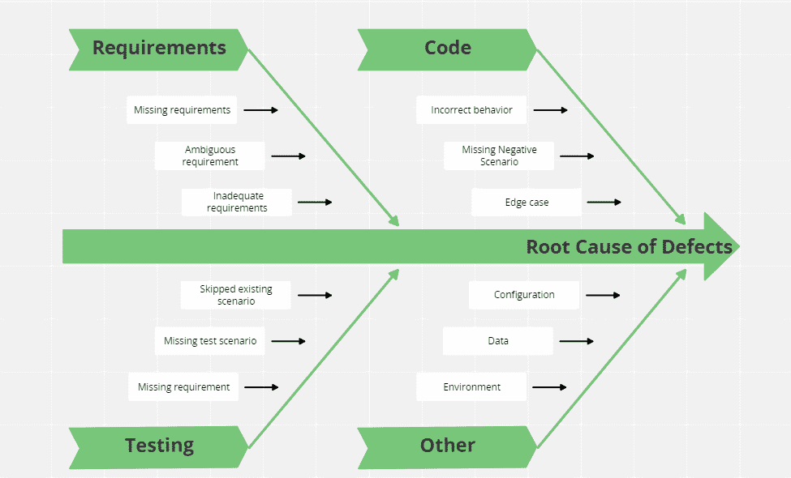

# 利用根本原因分析

> 原文：<https://medium.com/globant/leveraging-root-cause-analysis-ca4c8f868d58?source=collection_archive---------0----------------------->

## 我们如何通过实施根本原因分析来改进开发周期？

即使在许多测试论文中提到了根本原因分析(RCA ),并且对它的好处有一个共同的理解，但在我身上发生的次数比我愿意承认的次数还要多，团队最终准备了根本原因分析来标记处理器中的检查，因为客户需要它来检查特定的缺陷。

> ISTQB 将该过程定义为*，一种旨在识别缺陷根本原因的分析技术。通过针对根本原因采取纠正措施，有望将缺陷复发的可能性降至最低*。

即使是我认为的那个定义也低估了 RCA 给项目带来的好处。

我强烈建议始终推动在不同级别实施 RCA:

1.  开发周期中发现的缺陷的 RCA
2.  回归过程中发现的缺陷的 RCA
3.  UAT 期间发现的缺陷的 RCA
4.  生产环境中发现的缺陷的 RCA

这可能看起来很费力，但最终是值得的。如果你把它作为过程的一个自然部分，它不会比关闭一个缺陷和做一些计算花费更多的时间。

# RCA 流程

# 这个练习的目标是什么？

本练习的最终目标是确定问题的根源，以便您能够:

1.  确定发生了什么
2.  确定发生的原因
3.  想办法做些什么来降低它再次发生的可能性

# 分析时应该考虑哪些缺陷？

所有的缺陷，不管它们是在哪个阶段产生的，或者它们的有效性，都应该被分析。如果你目前没有根据缺陷发生的阶段来标记你的缺陷，我建议你开始用某种方式来标记它们。如果你使用一个测试管理工具，这可能是使用一个标签，否则一个简单的标题中的[走查]、[冲刺]、[回归]、[UAT]、[生产]就可以了。

按阶段过滤根本原因的能力将导致实施具体的改进措施。

同样，分析无效的缺陷也会导致实施某些行动来改进过程。

# 我们如何实施流程？

我们先从如何准备做 RCA 以及如何实施开始快速提醒。

*   第一步是集合团队(团队应该理解整个开发团队:至少是开发人员和质量保证分析师，也欢迎其他利益相关者参与)，因为他们的投入是非常有价值的。
*   讨论我们想要了解的关于缺陷的信息，你可以从定义类别开始，然后是子类别。鱼骨图是这个练习的好工具。

例如，您可以定义:

*   这些类别需要共享，因为来自可能不是会议一部分的利益相关者的反馈可以提供局外人的观点，从而导致增加/删除某些类别。
*   一旦商定了初始类别集；它们应该在缺陷结束时使用——不管上面提到的结束原因是什么。

如果您使用任何测试管理工具，首先检查您是否可以启用此功能；这将使整个过程更加顺利。JIRA 是最常用的工具之一，它允许启用 RCA 字段。

# RCA 在行动

RCA 结果预计将在开发周期中实施。我们可以通过冲刺巩固冲刺，通过发布结果巩固发布。

## **1。开发周期中发现的缺陷的 RCA**

一个可能出现的问题是…为什么分析在冲刺周期中发生的缺陷很重要，即使它们从未到达客户那里？

如果我们试图将**质量作为整个团队的责任**，确定在整个过程中哪些可以改进是关键。团队是否错过了任何需要包含在需求定义阶段的场景？我们在编码阶段错过了吗？我故意没有提到 BAs 或开发人员，因为我想强调全球责任，而不是特定的角色。

在这个阶段确定根本原因可以减少回归阶段创建、修复和重新测试 bug 所花费的时间。

## **2。回归过程中发现的缺陷的 RCA**

对回归过程中发现的缺陷进行分析的目的是识别测试中需要改进的地方，以及在早期阶段调整过程。

例如，分析可能会导致发现端到端场景中的集成问题或缺陷。这让我们了解在开发阶段可以确定哪些前提条件，并在未来的实现中审查这些前提条件。

它还可以识别团队出于测试目的可能没有考虑到的场景；这可能是因为我们在业务定义期间没有识别它；我们没有在测试中涵盖它，或者因为我们确实识别了它，但是质量工程团队没有正确理解这个场景。

你应该问:

*   在 sprint 测试阶段应该会遇到这个缺陷吗？；
*   是代码整合的结果吗？

## **3。UAT 期间发现的缺陷的 RCA**

通过分析 UAT 缺陷，我们旨在确定在开发周期中可以改进什么，以继续提高对产品的理解。

它还帮助团队了解他们是否遗漏了一些业务场景，以便在未来的实现中考虑这些场景。

最后，它可能会揭示团队可能没有考虑到的某些类型的缺陷。

## **4。生产过程中发现的缺陷的 RCA**

生产过程中发现的缺陷可以提供不同类型的反馈；有效的和无效的都要分析，这一点尤为重要。

对于**有效的那些**以及类似于在开发早期阶段发现的那些，它给出反馈以改进流程，在可能需要的地方增加额外的验证。

**无效的**也非常重要，它们可以提供开发和/或测试环境之间配置差异的信息。

这些缺陷也可以帮助团队识别系统的功能工作流/可用性中需要改进的地方。

# 这个过程会增加测试时间吗？

答案是‘肯定不会’。

在开始的时候，当你定义框架来实现它的时候，可能会花一点时间，但是之后，它只是缺陷管理过程中的一个额外的领域。

它为质量保证过程提供的价值远大于其成本。

我想更进一步说，它将最终加速开发过程。

# 最后的免责声明

最后但并非最不重要的一点，我要提醒你，这不是一个期望马上产生结果的过程；识别趋势、实施改进措施并看到结果需要时间。

正如在所有过程改进计划中一样，您需要等待一段时间，以便能够分析实践是否提供了结果。

如果第一轮没有提供你想要的结果，不要质疑自己，随着时间的推移，调整是预期的(也是必要的),即使那些过程在过去可能有效。

此外，让我们强调一下，这不应该是一个孤立的工作，如果你在一个由不同项目组成的大客户上工作，分享结果是一个好主意。证明对项目有效的行动可能成为对其他人有价值的反馈。