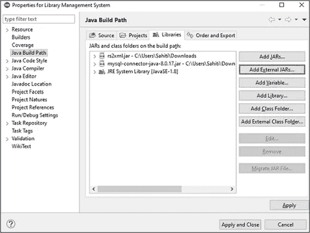

# 如何用 Java 创建图书管理系统项目？

> 原文：<https://medium.com/edureka/library-management-system-project-in-java-b003acba7f17?source=collection_archive---------1----------------------->


Library Management System Project in Java — Edureka

在这个互联网的现代时代，我们几乎所有人都依赖于基于网络的应用程序，无论是小型任务还是大型任务。嗯，图书馆管理系统是专业人员在用 Java 构建应用程序时考虑的最流行的用例之一。在本文中，我将向您展示如何用 Java 创建一个图书馆管理系统项目。

以下是本文的主题顺序:

1.  Java 是什么？
2.  什么是 MySQL？
3.  图书馆管理系统项目

*   系统需求
*   考虑的表格
*   项目代码
*   输出

让我们开始吧。

# Java 是什么？

Java 是一种类似于 C++的面向对象的语言，但是具有高级和简化的特性。Java 是**免费访问**并且可以**在**所有平台**上运行**。

Java 的特性如下:

*   简单: Java 消除了所有的复杂性，如 C++或任何其他编程语言中的指针、运算符重载，从而使生活变得更加简单。
*   **面向对象:**一切都被认为是一个**对象**，它拥有一些状态、行为，所有的操作都是使用这些对象来执行的。
*   **安全:**所有代码在编译后都被转换成**字节码**，人类无法阅读。java 不使用显式指针，而是在沙箱内运行程序来防止来自不可信来源的任何活动。它能够开发无病毒、无篡改的系统/应用程序。

# 什么是 MySQL？

MySQL 是一个开源的关系数据库管理系统，可以在许多平台上运行。它提供多用户访问以支持许多存储引擎，并由 Oracle 提供支持。因此，您可以从 Oracle 购买商业许可版本，以获得高级支持服务。

MySQL 的特性如下:

*   **易于管理—** 该软件非常容易下载，并且使用事件调度程序来自动安排任务。
*   **健壮的事务支持—** 拥有 ACID(原子性、一致性、隔离性、持久性)属性，还允许分布式多版本支持。
*   **全面的应用程序开发—** MySQL 拥有插件库，可将数据库嵌入任何应用程序。它还支持应用程序开发的存储过程、触发器、函数、视图等等。参考 ***RDS 教程*** 了解亚马逊的 RDBMS。

# Java 中的图书馆管理系统项目

图书馆管理系统是使用 Java 开发的最流行的项目之一。因此，在本文中，我将向您展示如何使用以下系统需求来创建这个项目。

# 系统需求

要执行以下项目，您将需要以下业务需求:

*   MySQL 社区服务器
*   MySQL JDBC 连接器
*   Java 语言(一种计算机语言，尤用于创建网站)
*   Eclipse IDE
*   rs2xml.jar

rs2xml jar 用于以表格格式显示数据。因此，一旦在 Eclipse IDE 中创建了一个项目，就必须将 rs2xml jar 和 JDBC 连接器 jar 导入到项目中。

为此，**右击项目**，选择**构建路径**->-**配置构建路径**。在打开的对话框中，选择**添加外部 JAR**，并添加 JAR 文件。添加完成后，点击**应用并关闭**。参考下文。



# 考虑的表格

现在，对于这个特定的项目，我考虑了三个表，它们是:

*   **用户** - >该表由{UID、用户名、密码、管理员}列组成
*   **图书** - >图书的表格由{BID，Book name，Price，Genre}列组成
*   **发布** - >该表由{IID、UID、BID、发布日期、周期、返回日期、罚款}列组成

好了，现在初始设置已经完成，我已经告诉了你表的模式，让我们开始吧。

# 图书馆管理系统项目代码

为了让您更好地理解，我将代码分成了以下几个函数，我将按函数来解释:

*   注册
*   连接
*   创建/重置
*   用户菜单
*   管理菜单

此外，为了创建 GUI，我将使用 Swing。Swing 是一个库或一组程序组件，用于创建图形用户界面组件，如滚动条、按钮、对话框等。

在我与您讨论函数代码之前，让我向您展示要导入的主类和库的代码:

```
import java.awt.event.ActionEvent;
import java.awt.event.ActionListener;
import java.sql.*;
import java.text.DateFormat;
import java.text.ParseException;
import java.text.SimpleDateFormat;
import java.util.ArrayList;
import java.util.Date;
import java.util.Locale;
import java.util.concurrent.TimeUnit;

import javax.swing.*;
import net.proteanit.sql.DbUtils;

public class main {

    public static class ex{
        public static int days=0;
            }

    public static void main(String[] args) {

        login();
        //create();
    }
```

现在在这篇关于 Java 图书管理系统的文章中，让我们了解一下上述所有函数的代码。

## 注册

我创建了这个函数来启用用户和管理员登录。因此，最初当用户首次登录时，默认情况下，该用户将是管理员，用户名和密码将是{admin，admin}。参考下文。


对于这个模式，我只考虑了一个管理员。因此，一旦用户作为管理员登录，他或她将被重定向到如下所示的管理菜单。我将在管理菜单部分讨论管理员的功能。


回到登录函数，参考下面的代码:

```
public static void login() {

    JFrame f=new JFrame("Login");//creating instance of JFrame  
    JLabel l1,l2;  
    l1=new JLabel("Username");  //Create label Username
    l1.setBounds(30,15, 100,30); //x axis, y axis, width, height 

    l2=new JLabel("Password");  //Create label Password
    l2.setBounds(30,50, 100,30);    

    JTextField F_user = new JTextField(); //Create text field for username
    F_user.setBounds(110, 15, 200, 30);

    JPasswordField F_pass=new JPasswordField(); //Create text field for password
    F_pass.setBounds(110, 50, 200, 30);

    JButton login_but=new JButton("Login");//creating instance of JButton for Login Button
    login_but.setBounds(130,90,80,25);//Dimensions for button
    login_but.addActionListener(new ActionListener() {  //Perform action

        public void actionPerformed(ActionEvent e){ 

        String username = F_user.getText(); //Store username entered by the user in the variable "username"
        String password = F_pass.getText(); //Store password entered by the user in the variable "password"

        if(username.equals("")) //If username is null
        {
            JOptionPane.showMessageDialog(null,"Please enter username"); //Display dialog box with the message
        } 
        else if(password.equals("")) //If password is null
        {
            JOptionPane.showMessageDialog(null,"Please enter password"); //Display dialog box with the message
        }
        else { //If both the fields are present then to login the user, check wether the user exists already
            //System.out.println("Login connect");
            Connection connection=connect();  //Connect to the database
            try
            {
            Statement stmt = connection.createStatement();
              stmt.executeUpdate("USE LIBRARY"); //Use the database with the name "Library"
              String st = ("SELECT * FROM USERS WHERE USERNAME='"+username+"' AND PASSWORD='"+password+"'"); //Retreive username and passwords from users
              ResultSet rs = stmt.executeQuery(st); //Execute query
              if(rs.next()==false) { //Move pointer below
                  System.out.print("No user");  
                  JOptionPane.showMessageDialog(null,"Wrong Username/Password!"); //Display Message

              }
              else {
                  f.dispose();
                rs.beforeFirst();  //Move the pointer above
                while(rs.next())
                {
                  String admin = rs.getString("ADMIN"); //user is admin
                  //System.out.println(admin);
                  String UID = rs.getString("UID"); //Get user ID of the user
                  if(admin.equals("1")) { //If boolean value 1
                      admin_menu(); //redirect to admin menu
                  }
                  else{
                      user_menu(UID); //redirect to user menu for that user ID
                  }
              }
              }
            }
            catch (Exception ex) {
                 ex.printStackTrace();
        }
        }
    }               
    });

    f.add(F_pass); //add password
    f.add(login_but);//adding button in JFrame  
    f.add(F_user);  //add user
    f.add(l1);  // add label1 i.e. for username
    f.add(l2); // add label2 i.e. for password

    f.setSize(400,180);//400 width and 500 height  
    f.setLayout(null);//using no layout managers  
    f.setVisible(true);//making the frame visible 
    f.setLocationRelativeTo(null);

}
```

## 连接

连接功能用于将数据库连接到 [GUI](https://www.edureka.co/blog/java-swing/) 。为此，我提到了下面的代码:

```
public static Connection connect()
{
try {
        Class.forName("com.mysql.cj.jdbc.Driver");
        //System.out.println("Loaded driver");
        Connection con = DriverManager.getConnection("jdbc:mysql://localhost/mysql?user=root&password=edureka");
        //System.out.println("Connected to MySQL");
        return con;
 } 
 catch (Exception ex) {
        ex.printStackTrace();
 }
return null;
}
```

在上面的函数中，我们用**用户名“root”**和**密码“edu reka”**将我们的 **MySQL 数据库**连接到我们的应用程序。现在，一旦应用程序连接到数据库，我们的下一步是创建或重置数据库。因此，接下来在这篇关于 Java 图书馆管理系统项目的文章中，让我们讨论一下 Create 函数。

## 创造

create 函数用于创建数据库和表，并将数据添加到这些表中。因此，要做到这一点，SQL 语句将如下使用。

```
public static void create() {
    try {
    Connection connection=connect();
    ResultSet resultSet = connection.getMetaData().getCatalogs();
    //iterate each catalog in the ResultSet
        while (resultSet.next()) {
          // Get the database name, which is at position 1
          String databaseName = resultSet.getString(1);
          if(databaseName.equals("library")) {
              //System.out.print("yes");
              Statement stmt = connection.createStatement();
              //Drop database if it pre-exists to reset the complete database
              String sql = "DROP DATABASE library";
              stmt.executeUpdate(sql);
          }
        }
          Statement stmt = connection.createStatement();

          String sql = "CREATE DATABASE LIBRARY"; //Create Database
          stmt.executeUpdate(sql); 
          stmt.executeUpdate("USE LIBRARY"); //Use Database
          //Create Users Table
          String sql1 = "CREATE TABLE USERS(UID INT NOT NULL AUTO_INCREMENT PRIMARY KEY, USERNAME VARCHAR(30), PASSWORD VARCHAR(30), ADMIN BOOLEAN)";
          stmt.executeUpdate(sql1);
          //Insert into users table
          stmt.executeUpdate("INSERT INTO USERS(USERNAME, PASSWORD, ADMIN) VALUES('admin','admin',TRUE)");
          //Create Books table
          stmt.executeUpdate("CREATE TABLE BOOKS(BID INT NOT NULL AUTO_INCREMENT PRIMARY KEY, BNAME VARCHAR(50), GENRE VARCHAR(20), PRICE INT)");
          //Create Issued Table
          stmt.executeUpdate("CREATE TABLE ISSUED(IID INT NOT NULL AUTO_INCREMENT PRIMARY KEY, UID INT, BID INT, ISSUED_DATE VARCHAR(20), RETURN_DATE VARCHAR(20), PERIOD INT, FINE INT)");
          //Insert into books table
          stmt.executeUpdate("INSERT INTO BOOKS(BNAME, GENRE, PRICE) VALUES ('War and Peace', 'Mystery', 200),  ('The Guest Book', 'Fiction', 300), ('The Perfect Murder','Mystery', 150), ('Accidental Presidents', 'Biography', 250), ('The Wicked King','Fiction', 350)");

    resultSet.close();
    }
     catch (Exception ex) {
         ex.printStackTrace();
}
}
```

现在，我们已经创建了数据库，连接了 GUI 并启用了登录功能，接下来在这篇关于 Java 图书馆管理系统项目的文章中，让我们现在讨论用户菜单的功能。

## 用户菜单

用户菜单旨在显示图书馆中所有图书的详细信息以及用户发行的图书。

```
public static void user_menu(String UID) {

    JFrame f=new JFrame("User Functions"); //Give dialog box name as User functions
    //f.setDefaultCloseOperation(JFrame.EXIT_ON_CLOSE); //Exit user menu on closing the dialog box
    JButton view_but=new JButton("View Books");//creating instance of JButton  
    view_but.setBounds(20,20,120,25);//x axis, y axis, width, height 
    view_but.addActionListener(new ActionListener() { 
        public void actionPerformed(ActionEvent e){

            JFrame f = new JFrame("Books Available"); //View books stored in database
            //f.setDefaultCloseOperation(JFrame.EXIT_ON_CLOSE);

            Connection connection = connect();
            String sql="select * from BOOKS"; //Retreive data from database
            try {
                Statement stmt = connection.createStatement(); //connect to database
                 stmt.executeUpdate("USE LIBRARY"); // use librabry
                stmt=connection.createStatement();
                ResultSet rs=stmt.executeQuery(sql);
                JTable book_list= new JTable(); //show data in table format
                book_list.setModel(DbUtils.resultSetToTableModel(rs)); 

                JScrollPane scrollPane = new JScrollPane(book_list); //enable scroll bar

                f.add(scrollPane); //add scroll bar
                f.setSize(800, 400); //set dimensions of view books frame
                f.setVisible(true);
                f.setLocationRelativeTo(null);
            } catch (SQLException e1) {
                // TODO Auto-generated catch block
                 JOptionPane.showMessageDialog(null, e1);
            }               

    }
    }
    );

    JButton my_book=new JButton("My Books");//creating instance of JButton  
    my_book.setBounds(150,20,120,25);//x axis, y axis, width, height 
    my_book.addActionListener(new ActionListener() { //Perform action
        public void actionPerformed(ActionEvent e){

            JFrame f = new JFrame("My Books"); //View books issued by user
            //f.setDefaultCloseOperation(JFrame.EXIT_ON_CLOSE);
            int UID_int = Integer.parseInt(UID); //Pass user ID

            //.iid,issued.uid,issued.bid,issued.issued_date,issued.return_date,issued,
            Connection connection = connect(); //connect to database
            //retrieve data
            String sql="select distinct issued.*,books.bname,books.genre,books.price from issued,books " + "where ((issued.uid=" + UID_int + ") and (books.bid in (select bid from issued where issued.uid="+UID_int+"))) group by iid";
            String sql1 = "select bid from issued where uid="+UID_int;
            try {
                Statement stmt = connection.createStatement();
                //use database
                 stmt.executeUpdate("USE LIBRARY");
                stmt=connection.createStatement();
                //store in array
                ArrayList books_list = new ArrayList();

                ResultSet rs=stmt.executeQuery(sql);
                JTable book_list= new JTable(); //store data in table format
                book_list.setModel(DbUtils.resultSetToTableModel(rs)); 
                //enable scroll bar
                JScrollPane scrollPane = new JScrollPane(book_list);

                f.add(scrollPane); //add scroll bar
                f.setSize(800, 400); //set dimensions of my books frame
                f.setVisible(true);
                f.setLocationRelativeTo(null);
            } catch (SQLException e1) {
                // TODO Auto-generated catch block
                 JOptionPane.showMessageDialog(null, e1);
            }               

    }
    }
    );

    f.add(my_book); //add my books
    f.add(view_but); // add view books
    f.setSize(300,100);//400 width and 500 height  
    f.setLayout(null);//using no layout managers  
    f.setVisible(true);//making the frame visible 
    f.setLocationRelativeTo(null);
    }
```

接下来，在这篇关于 Java 图书馆管理系统项目的文章中，让我们讨论一下管理菜单功能的代码。

## 管理菜单

管理菜单旨在显示用户、图书、已发行图书、添加图书、归还图书、添加用户以及创建或重置数据库的详细信息。

```
public static void admin_menu() {

    JFrame f=new JFrame("Admin Functions"); //Give dialog box name as admin functions
    //f.setDefaultCloseOperation(JFrame.EXIT_ON_CLOSE); //

    JButton create_but=new JButton("Create/Reset");//creating instance of JButton to create or reset database
    create_but.setBounds(450,60,120,25);//x axis, y axis, width, height 
    create_but.addActionListener(new ActionListener() { //Perform action
        public void actionPerformed(ActionEvent e){

            create(); //Call create function
            JOptionPane.showMessageDialog(null,"Database Created/Reset!"); //Open a dialog box and display the message

        }
    });

    JButton view_but=new JButton("View Books");//creating instance of JButton to view books
    view_but.setBounds(20,20,120,25);//x axis, y axis, width, height 
    view_but.addActionListener(new ActionListener() {
        public void actionPerformed(ActionEvent e){

            JFrame f = new JFrame("Books Available"); 
            //f.setDefaultCloseOperation(JFrame.EXIT_ON_CLOSE);

            Connection connection = connect(); //connect to database
            String sql="select * from BOOKS"; //select all books 
            try {
                Statement stmt = connection.createStatement();
                 stmt.executeUpdate("USE LIBRARY"); //use database
                stmt=connection.createStatement();
                ResultSet rs=stmt.executeQuery(sql);
                JTable book_list= new JTable(); //view data in table format
                book_list.setModel(DbUtils.resultSetToTableModel(rs)); 
                //mention scroll bar
                JScrollPane scrollPane = new JScrollPane(book_list); 

                f.add(scrollPane); //add scrollpane
                f.setSize(800, 400); //set size for frame
                f.setVisible(true);
                f.setLocationRelativeTo(null);
            } catch (SQLException e1) {
                // TODO Auto-generated catch block
                 JOptionPane.showMessageDialog(null, e1);
            }               

    }
    }
    );

    JButton users_but=new JButton("View Users");//creating instance of JButton to view users
    users_but.setBounds(150,20,120,25);//x axis, y axis, width, height 
    users_but.addActionListener(new ActionListener() { //Perform action on click button
        public void actionPerformed(ActionEvent e){

                JFrame f = new JFrame("Users List");
                //f.setDefaultCloseOperation(JFrame.EXIT_ON_CLOSE);

                Connection connection = connect();
                String sql="select * from users"; //retrieve all users
                try {
                    Statement stmt = connection.createStatement();
                     stmt.executeUpdate("USE LIBRARY"); //use database
                    stmt=connection.createStatement();
                    ResultSet rs=stmt.executeQuery(sql);
                    JTable book_list= new JTable();
                    book_list.setModel(DbUtils.resultSetToTableModel(rs)); 
                    //mention scroll bar
                    JScrollPane scrollPane = new JScrollPane(book_list);

                    f.add(scrollPane); //add scrollpane
                    f.setSize(800, 400); //set size for frame
                    f.setVisible(true);
                    f.setLocationRelativeTo(null);
                } catch (SQLException e1) {
                    // TODO Auto-generated catch block
                     JOptionPane.showMessageDialog(null, e1);
                }       

    }
        }
    );  

    JButton issued_but=new JButton("View Issued Books");//creating instance of JButton to view the issued books
    issued_but.setBounds(280,20,160,25);//x axis, y axis, width, height 
    issued_but.addActionListener(new ActionListener() {
        public void actionPerformed(ActionEvent e){

                JFrame f = new JFrame("Users List");
                //f.setDefaultCloseOperation(JFrame.EXIT_ON_CLOSE);

                Connection connection = connect();
                String sql="select * from issued";
                try {
                    Statement stmt = connection.createStatement();
                     stmt.executeUpdate("USE LIBRARY");
                    stmt=connection.createStatement();
                    ResultSet rs=stmt.executeQuery(sql);
                    JTable book_list= new JTable();
                    book_list.setModel(DbUtils.resultSetToTableModel(rs)); 

                    JScrollPane scrollPane = new JScrollPane(book_list);

                    f.add(scrollPane);
                    f.setSize(800, 400);
                    f.setVisible(true);
                    f.setLocationRelativeTo(null);
                } catch (SQLException e1) {
                    // TODO Auto-generated catch block
                     JOptionPane.showMessageDialog(null, e1);
                }       

    }
        }
    );

    JButton add_user=new JButton("Add User"); //creating instance of JButton to add users
    add_user.setBounds(20,60,120,25); //set dimensions for button

    add_user.addActionListener(new ActionListener() {
        public void actionPerformed(ActionEvent e){

                JFrame g = new JFrame("Enter User Details"); //Frame to enter user details
                //g.setDefaultCloseOperation(JFrame.EXIT_ON_CLOSE);
                //Create label 
                JLabel l1,l2;  
                l1=new JLabel("Username");  //label 1 for username
                l1.setBounds(30,15, 100,30); 

                l2=new JLabel("Password");  //label 2 for password
                l2.setBounds(30,50, 100,30); 

                //set text field for username 
                JTextField F_user = new JTextField();
                F_user.setBounds(110, 15, 200, 30);

                //set text field for password
                JPasswordField F_pass=new JPasswordField();
                F_pass.setBounds(110, 50, 200, 30);
                //set radio button for admin
                JRadioButton a1 = new JRadioButton("Admin");
                a1.setBounds(55, 80, 200,30);
                //set radio button for user
                JRadioButton a2 = new JRadioButton("User");
                a2.setBounds(130, 80, 200,30);
                //add radio buttons
                ButtonGroup bg=new ButtonGroup();    
                bg.add(a1);bg.add(a2);  

                JButton create_but=new JButton("Create");//creating instance of JButton for Create 
                create_but.setBounds(130,130,80,25);//x axis, y axis, width, height 
                create_but.addActionListener(new ActionListener() {

                    public void actionPerformed(ActionEvent e){

                    String username = F_user.getText();
                    String password = F_pass.getText();
                    Boolean admin = false;

                    if(a1.isSelected()) {
                        admin=true;
                    }

                    Connection connection = connect();

                    try {
                    Statement stmt = connection.createStatement();
                     stmt.executeUpdate("USE LIBRARY");
                     stmt.executeUpdate("INSERT INTO USERS(USERNAME,PASSWORD,ADMIN) VALUES ('"+username+"','"+password+"',"+admin+")");
                     JOptionPane.showMessageDialog(null,"User added!");
                     g.dispose();

                    }

                    catch (SQLException e1) {
                        // TODO Auto-generated catch block
                         JOptionPane.showMessageDialog(null, e1);
                    }   

                    }

                });

                    g.add(create_but);
                    g.add(a2);
                    g.add(a1);
                    g.add(l1);
                    g.add(l2);
                    g.add(F_user);
                    g.add(F_pass);
                    g.setSize(350,200);//400 width and 500 height  
                    g.setLayout(null);//using no layout managers  
                    g.setVisible(true);//making the frame visible 
                    g.setLocationRelativeTo(null);

    }
    });

    JButton add_book=new JButton("Add Book"); //creating instance of JButton for adding books
    add_book.setBounds(150,60,120,25); 

    add_book.addActionListener(new ActionListener() {
        public void actionPerformed(ActionEvent e){
                //set frame wot enter book details
                JFrame g = new JFrame("Enter Book Details");
                //g.setDefaultCloseOperation(JFrame.EXIT_ON_CLOSE);
                // set labels
                JLabel l1,l2,l3;  
                l1=new JLabel("Book Name");  //lebel 1 for book name
                l1.setBounds(30,15, 100,30); 

                l2=new JLabel("Genre");  //label 2 for genre
                l2.setBounds(30,53, 100,30); 

                l3=new JLabel("Price");  //label 2 for price
                l3.setBounds(30,90, 100,30); 

                //set text field for book name
                JTextField F_bname = new JTextField();
                F_bname.setBounds(110, 15, 200, 30);

                //set text field for genre 
                JTextField F_genre=new JTextField();
                F_genre.setBounds(110, 53, 200, 30);
                //set text field for price
                JTextField F_price=new JTextField();
                F_price.setBounds(110, 90, 200, 30);

                JButton create_but=new JButton("Submit");//creating instance of JButton to submit details  
                create_but.setBounds(130,130,80,25);//x axis, y axis, width, height 
                create_but.addActionListener(new ActionListener() {

                    public void actionPerformed(ActionEvent e){
                    // assign the book name, genre, price
                    String bname = F_bname.getText();
                    String genre = F_genre.getText();
                    String price = F_price.getText();
                    //convert price of integer to int
                    int price_int = Integer.parseInt(price);

                    Connection connection = connect();

                    try {
                    Statement stmt = connection.createStatement();
                     stmt.executeUpdate("USE LIBRARY");
                     stmt.executeUpdate("INSERT INTO BOOKS(BNAME,GENRE,PRICE) VALUES ('"+bname+"','"+genre+"',"+price_int+")");
                     JOptionPane.showMessageDialog(null,"Book added!");
                     g.dispose();

                    }

                    catch (SQLException e1) {
                        // TODO Auto-generated catch block
                         JOptionPane.showMessageDialog(null, e1);
                    }   

                    }

                });

                    g.add(l3);
                    g.add(create_but);
                    g.add(l1);
                    g.add(l2);
                    g.add(F_bname);
                    g.add(F_genre);
                    g.add(F_price);
                    g.setSize(350,200);//400 width and 500 height  
                    g.setLayout(null);//using no layout managers  
                    g.setVisible(true);//making the frame visible 
                    g.setLocationRelativeTo(null);

    }
    });

    JButton issue_book=new JButton("Issue Book"); //creating instance of JButton to issue books
    issue_book.setBounds(450,20,120,25); 

    issue_book.addActionListener(new ActionListener() {
        public void actionPerformed(ActionEvent e){
                //enter details
                JFrame g = new JFrame("Enter Details");
                //g.setDefaultCloseOperation(JFrame.EXIT_ON_CLOSE);
                //create labels
                JLabel l1,l2,l3,l4;  
                l1=new JLabel("Book ID(BID)");  // Label 1 for Book ID
                l1.setBounds(30,15, 100,30); 

                l2=new JLabel("User ID(UID)");  //Label 2 for user ID
                l2.setBounds(30,53, 100,30); 

                l3=new JLabel("Period(days)");  //Label 3 for period
                l3.setBounds(30,90, 100,30); 

                l4=new JLabel("Issued Date(DD-MM-YYYY)");  //Label 4 for issue date
                l4.setBounds(30,127, 150,30); 

                JTextField F_bid = new JTextField();
                F_bid.setBounds(110, 15, 200, 30);

                JTextField F_uid=new JTextField();
                F_uid.setBounds(110, 53, 200, 30);

                JTextField F_period=new JTextField();
                F_period.setBounds(110, 90, 200, 30);

                JTextField F_issue=new JTextField();
                F_issue.setBounds(180, 130, 130, 30);   

                JButton create_but=new JButton("Submit");//creating instance of JButton  
                create_but.setBounds(130,170,80,25);//x axis, y axis, width, height 
                create_but.addActionListener(new ActionListener() {

                    public void actionPerformed(ActionEvent e){

                    String uid = F_uid.getText();
                    String bid = F_bid.getText();
                    String period = F_period.getText();
                    String issued_date = F_issue.getText();

                    int period_int = Integer.parseInt(period);

                    Connection connection = connect();

                    try {
                    Statement stmt = connection.createStatement();
                     stmt.executeUpdate("USE LIBRARY");
                     stmt.executeUpdate("INSERT INTO ISSUED(UID,BID,ISSUED_DATE,PERIOD) VALUES ('"+uid+"','"+bid+"','"+issued_date+"',"+period_int+")");
                     JOptionPane.showMessageDialog(null,"Book Issued!");
                     g.dispose();

                    }

                    catch (SQLException e1) {
                        // TODO Auto-generated catch block
                         JOptionPane.showMessageDialog(null, e1);
                    }   

                    }

                });

                    g.add(l3);
                    g.add(l4);
                    g.add(create_but);
                    g.add(l1);
                    g.add(l2);
                    g.add(F_uid);
                    g.add(F_bid);
                    g.add(F_period);
                    g.add(F_issue);
                    g.setSize(350,250);//400 width and 500 height  
                    g.setLayout(null);//using no layout managers  
                    g.setVisible(true);//making the frame visible 
                    g.setLocationRelativeTo(null);

    }
    });

    JButton return_book=new JButton("Return Book"); //creating instance of JButton to return books
    return_book.setBounds(280,60,160,25); 

    return_book.addActionListener(new ActionListener() {
        public void actionPerformed(ActionEvent e){

                JFrame g = new JFrame("Enter Details");
                //g.setDefaultCloseOperation(JFrame.EXIT_ON_CLOSE);
                //set labels 
                JLabel l1,l2,l3,l4;  
                l1=new JLabel("Issue ID(IID)");  //Label 1 for Issue ID
                l1.setBounds(30,15, 100,30); 

                l4=new JLabel("Return Date(DD-MM-YYYY)");  
                l4.setBounds(30,50, 150,30); 

                JTextField F_iid = new JTextField();
                F_iid.setBounds(110, 15, 200, 30);

                JTextField F_return=new JTextField();
                F_return.setBounds(180, 50, 130, 30);

                JButton create_but=new JButton("Return");//creating instance of JButton to mention return date and calculcate fine
                create_but.setBounds(130,170,80,25);//x axis, y axis, width, height 
                create_but.addActionListener(new ActionListener() {

                    public void actionPerformed(ActionEvent e){                 

                    String iid = F_iid.getText();
                    String return_date = F_return.getText();

                    Connection connection = connect();

                    try {
                    Statement stmt = connection.createStatement();
                     stmt.executeUpdate("USE LIBRARY");
                     //Intialize date1 with NULL value
                     String date1=null;
                     String date2=return_date; //Intialize date2 with return date

                     //select issue date
                     ResultSet rs = stmt.executeQuery("SELECT ISSUED_DATE FROM ISSUED WHERE IID="+iid);
                     while (rs.next()) {
                         date1 = rs.getString(1);

                       }

                     try {
                            Date date_1=new SimpleDateFormat("dd-MM-yyyy").parse(date1);
                            Date date_2=new SimpleDateFormat("dd-MM-yyyy").parse(date2);
                            //subtract the dates and store in diff
                            long diff = date_2.getTime() - date_1.getTime();
                            //Convert diff from milliseconds to days
                            ex.days=(int)(TimeUnit.DAYS.convert(diff, TimeUnit.MILLISECONDS));

                        } catch (ParseException e1) {
                            // TODO Auto-generated catch block
                            e1.printStackTrace();
                        }

                     //update return date
                     stmt.executeUpdate("UPDATE ISSUED SET RETURN_DATE='"+return_date+"' WHERE IID="+iid);
                     g.dispose();

                     Connection connection1 = connect();
                     Statement stmt1 = connection1.createStatement();
                     stmt1.executeUpdate("USE LIBRARY");                
                    ResultSet rs1 = stmt1.executeQuery("SELECT PERIOD FROM ISSUED WHERE IID="+iid); //set period
                    String diff=null; 
                    while (rs1.next()) {
                         diff = rs1.getString(1);

                       }
                    int diff_int = Integer.parseInt(diff);
                    if(ex.days&amp;amp;amp;amp;amp;amp;amp;amp;amp;amp;amp;gt;diff_int) { //If number of days are more than the period then calculcate fine

                        //System.out.println(ex.days);
                        int fine = (ex.days-diff_int)*10; //fine for every day after the period is Rs 10.
                        //update fine in the system
                        stmt1.executeUpdate("UPDATE ISSUED SET FINE="+fine+" WHERE IID="+iid);  
                        String fine_str = ("Fine: Rs. "+fine);
                        JOptionPane.showMessageDialog(null,fine_str);

                    }

                     JOptionPane.showMessageDialog(null,"Book Returned!");

                    }

                    catch (SQLException e1) {
                        // TODO Auto-generated catch block
                         JOptionPane.showMessageDialog(null, e1);
                    }   

                    }

                }); 
                    g.add(l4);
                    g.add(create_but);
                    g.add(l1);
                    g.add(F_iid);
                    g.add(F_return);
                    g.setSize(350,250);//400 width and 500 height  
                    g.setLayout(null);//using no layout managers  
                    g.setVisible(true);//making the frame visible 
                    g.setLocationRelativeTo(null);              
    }
    });

    f.add(create_but);
    f.add(return_book);
    f.add(issue_book);
    f.add(add_book);
    f.add(issued_but);
    f.add(users_but);
    f.add(view_but);
    f.add(add_user);
    f.setSize(600,200);//400 width and 500 height  
    f.setLayout(null);//using no layout managers  
    f.setVisible(true);//making the frame visible 
    f.setLocationRelativeTo(null);

    }
}
```

现在您已经理解了所有的功能，让我们用 Java 执行我们的图书馆管理系统项目，并查看输出。

# 输出:

单击运行按钮执行应用程序。一旦你执行，你会看到下面的对话框。在下面的对话框中，输入用户名和密码{admin，admin}。然后点击登录按钮。


一旦你点击**登录按钮**，你会看到下面的对话框打开。


在这里你有各种选择，你可以探索。所以，让我们从第一个开始:

## 查看书籍

一旦你点击查看书籍按钮，你会看到下面的框架显示所有的书籍在数据库中，与他们的细节。


## 查看用户

“查看用户”按钮用于查看系统中的当前用户。由于我们只有一个用户，即管理员，它将向您显示如下输出:


## 创建/重置

此功能用于创建或重置数据库。因此，一旦你点击按钮创建/休息，你会看到下面的输出:


## 添加用户

要添加用户，单击选项“**添加用户**”，并提及用户名、密码等详细信息，然后选择单选按钮用户或管理员。默认情况下，它将是用户。然后，点击**创建**。


创建用户后，您将看到如下输出:


现在，再次点击**查看用户按钮**，您将看到以下输出:


好了，现在我们已经添加了一个用户。比方说，那个特定的用户想要发行书籍。为此，用户必须选择发料书选项。

## 发行书

假设，如果你是用户，一旦你点击**发书按钮**，你必须提及**图书 ID、用户 ID、期间(发书天数)**和**发行日期**如下:


然后点击**提交**。一旦你点击**提交**，你会看到下面的对话框:


现在，如果您想查看已发行书籍的详细信息，可以使用查看已发行书籍功能。

## 查看已发行的图书

单击此按钮后，您将看到以下输出:


好了，现在**如果用户使用登录功能登录到系统**，如下所示:


然后用户将看到下面的用户菜单。


在这里，用户可以通过**使用**查看图书选项**查看数据库中的所有图书**以及用户在**我的图书区**中发布的**图书，如下所示:**


现在，如果你想还书，你必须选择还书选项。

## 还书

一次，你点击归还书，如下提及**问题 ID 和归还日期**。然后点击**返回**。


然后，您会看到一个显示罚款的消息框。


之后，您会再次看到一个对话框，显示消息“**图书已归还**”。参考下文。


现在，如果你点击**查看已发行的书籍**，你会看到下面的输出:


最后，如果您希望添加一本书，您可以使用 Add Book 选项。

## 添加图书

点击**添加图书按钮**，并提及**图书名称、流派和价格**。然后，点击**提交按钮**。参考下文。


您将看到一个显示以下消息的对话框:


除此之外，您还可以在**查看图书**部分查看添加的图书，如下所示:


这就把我们带到了 Java 图书馆管理系统项目这篇文章的结尾。我希望这篇文章对你有所帮助，并增加了你的知识价值。如果你想查看更多关于人工智能、DevOps、道德黑客等市场最热门技术的文章，那么你可以参考 [Edureka 的官方网站。](https://www.edureka.co/blog/?utm_source=medium&utm_medium=content-link&utm_campaign=library-management-system-project-in-java)

> 1.[面向对象编程](/edureka/object-oriented-programming-b29cfd50eca0)
> 
> 2.[Java 中的继承](/edureka/inheritance-in-java-f638d3ed559e)
> 
> 3.[Java 中的多态性](/edureka/polymorphism-in-java-9559e3641b9b)
> 
> 4.[Java 中的抽象](/edureka/java-abstraction-d2d790c09037)
> 
> 5. [Java 字符串](/edureka/java-string-68e5d0ca331f)
> 
> 6. [Java 数组](/edureka/java-array-tutorial-50299ef85e5)
> 
> 7. [Java 集合](/edureka/java-collections-6d50b013aef8)
> 
> 8. [Java 线程](/edureka/java-thread-bfb08e4eb691)
> 
> 9.[Java servlet 简介](/edureka/java-servlets-62f583d69c7e)
> 
> 10. [Servlet 和 JSP 教程](/edureka/servlet-and-jsp-tutorial-ef2e2ab9ee2a)
> 
> 11.[Java 中的异常处理](/edureka/java-exception-handling-7bd07435508c)
> 
> 12.[高级 Java 教程](/edureka/advanced-java-tutorial-f6ebac5175ec)
> 
> 13. [Java 面试问题](/edureka/java-interview-questions-1d59b9c53973)
> 
> 14. [Java 程序](/edureka/java-programs-1e3220df2e76)
> 
> 15.[科特林 vs Java](/edureka/kotlin-vs-java-4f8653f38c04)
> 
> 16.[依赖注入使用 Spring Boot](/edureka/what-is-dependency-injection-5006b53af782)
> 
> 17.[Java 中的可比](/edureka/comparable-in-java-e9cfa7be7ff7)
> 
> 18.[十大 Java 框架](/edureka/java-frameworks-5d52f3211f39)
> 
> 19. [Java 反射 API](/edureka/java-reflection-api-d38f3f5513fc)
> 
> 20.[Java 中的 30 大模式](/edureka/pattern-programs-in-java-f33186c711c8)
> 
> 21.[核心 Java 备忘单](/edureka/java-cheat-sheet-3ad4d174012c)
> 
> 22.[Java 中的套接字编程](/edureka/socket-programming-in-java-f09b82facd0)
> 
> 23. [Java OOP 备忘单](/edureka/java-oop-cheat-sheet-9c6ebb5e1175)
> 
> 24.[Java 中的注释](/edureka/annotations-in-java-9847d531d2bb)
> 
> 25. [](/edureka/library-management-system-project-in-java-b003acba7f17) [Java 教程](/edureka/java-tutorial-bbdd28a2acd7)
> 
> 26.[Java 中的树](/edureka/java-binary-tree-caede8dfada5)
> 
> 27.[Java 中的机器学习](/edureka/machine-learning-in-java-db872998f368)
> 
> 28.[Java 中的顶级数据结构&算法](/edureka/data-structures-algorithms-in-java-d27e915db1c5)
> 
> 29. [Java 开发者技能](/edureka/java-developer-skills-83983e3d3b92)
> 
> 30.[前 55 个 Servlet 面试问题](/edureka/servlet-interview-questions-266b8fbb4b2d)
> 
> 31. [](/edureka/java-exception-handling-7bd07435508c) [顶级 Java 项目](/edureka/java-projects-db51097281e3)
> 
> 32. [Java 字符串备忘单](/edureka/java-string-cheat-sheet-9a91a6b46540)
> 
> 33.[Java 中的嵌套类](/edureka/nested-classes-java-f1987805e7e3)
> 
> 34. [Java 集合面试问答](/edureka/java-collections-interview-questions-162c5d7ef078)
> 
> 35.[Java 中如何处理死锁？](/edureka/deadlock-in-java-5d1e4f0338d5)
> 
> 36.[你需要知道的 50 大 Java 集合面试问题](/edureka/java-collections-interview-questions-6d20f552773e)
> 
> 37.[Java 中的字符串池是什么概念？](/edureka/java-string-pool-5b5b3b327bdf)
> 
> 38.[C、C++和 Java 有什么区别？](/edureka/difference-between-c-cpp-and-java-625c4e91fb95)
> 
> 39.[Java 中的回文——如何检查一个数字或字符串？](/edureka/palindrome-in-java-5d116eb8755a)
> 
> 40.[你需要知道的顶级 MVC 面试问答](/edureka/mvc-interview-questions-cd568f6d7c2e)
> 
> 41.[Java 编程语言的十大应用](/edureka/applications-of-java-11e64f9588b0)
> 
> 42.[Java 中的死锁](/edureka/deadlock-in-java-5d1e4f0338d5)
> 
> 43.[Java 中的平方和平方根](/edureka/java-sqrt-method-59354a700571)
> 
> 44.[Java 中的类型转换](/edureka/type-casting-in-java-ac4cd7e0bbe1)
> 
> 45.[Java 中的运算符及其类型](/edureka/operators-in-java-fd05a7445c0a)
> 
> 46.[Java 中的析构函数](/edureka/destructor-in-java-21cc46ed48fc)
> 
> 47.[Java 中的二分搜索法](/edureka/binary-search-in-java-cf40e927a8d3)
> 
> 48.[Java 中的 MVC 架构](/edureka/mvc-architecture-in-java-a85952ae2684)
> 
> 49. [Hibernate 面试问答](/edureka/hibernate-interview-questions-78b45ec5cce8)

*原载于 2019 年 9 月 3 日 https://www.edureka.co*[](https://www.edureka.co/blog/library-management-system-project-in-java)**。**