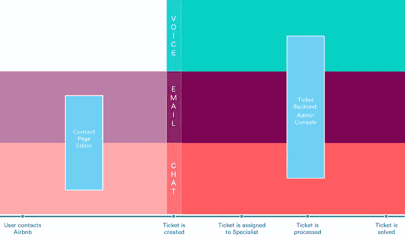
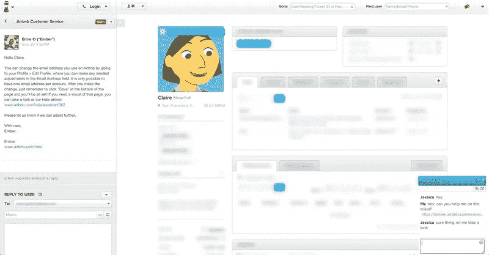
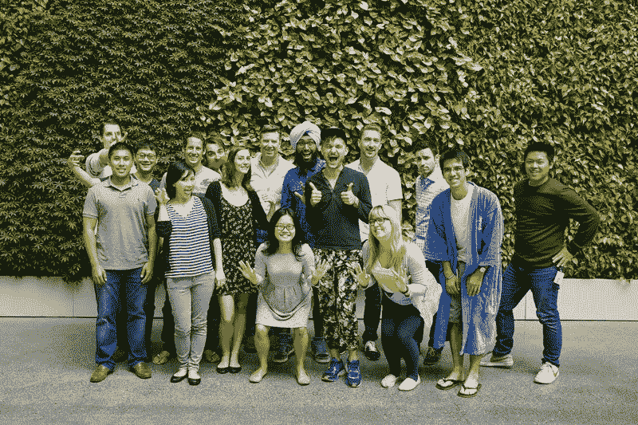

# 票证的寿命

> 原文：<https://medium.com/airbnb-engineering/life-of-a-ticket-903790ed5d53?source=collection_archive---------1----------------------->


埃姆雷·奥兹德米尔

截至 2012 年底，累计有超过 400 万客人在 Airbnb 住宿。

这是巨大的！我们花了近四年时间才迎来第一个 100 万客人——现在每个月有超过 200 万的客人住在 Airbnb 上。随着这种增长而来的是扩大市场运营的挑战，这是我的团队旨在改进的任务。

我在一个名为内部产品的团队工作，这个团队由两个部分组成，产品卓越和服务卓越。我们的任务是开发工具来提高客人和主人的自助能力，并提高客户体验专家的工作效率。

正如[王一山](http://algeri-wong.com/yishan/engineering-management-tools-are-top-priority.html)所说，“你的运营效率……直接受到你内部产品独创性的影响。”在 Airbnb，我们希望提供世界上最好的客户服务，所以我们非常重视这一点，并有一整个团队致力于此。

我们的团队直接与客户——客户体验(CX)团队——相处，了解他们的需求并解决问题。我们的团队与我们的 CX 专家有一个紧密的反馈环，这不仅会产生根据他们的需求定制的工具，还会通过快速迭代来改进。

我们团队发现的一个明显问题是如何加快处理客户支持单。分享我们解决方案的最佳方式是通过检查票证的有效期向您展示我们解决问题的方法。



有 3 种渠道可以联系 Airbnb 的专家:

*   **声音:**拨打我们的支持电话。在这种情况下，当有人拨打我们的支持热线时，我们将根据他们的电话号码收集我们对他们的了解。在这里，我们根据他们的当前状态(如果他们有当前预订，如果他们是主人，客人等)将他们分配给特定的代理。).
*   **电子邮件:**在这种情况下，人们必须通过我们的联系页面与我们联系。他们将被要求首先选择他们的预订(如果相关的话)和他们需要什么帮助(他们的问题)，之后我们会根据他们的当前状态神奇地显示一些故障诊断提示。如果这不能回答他们的问题，他们将有机会向我们发送电子邮件。
*   **聊天:**与上面的电子邮件流程类似，在选择问题后，他们可以选择与我们的 CX 专家或社区成员一起创建图表。

在打电话、开始聊天或发送电子邮件后，我们会创建一个票证。这张机票最终被分配给 Airbnb CX 的一名专家，客人/主人和专家在那里进行通信。问题解决后，专家解决了票证，案例也就结束了。

我们的团队负责改善票务流程中的两个方面:

*   每当我们用**联系页面编辑器**神奇地显示故障排除提示时
*   每当票证后端(**管理控制台**)处理票证时

# 联系人页面编辑器

让我们暂时回到 2012 年。当时，当有人需要联系我们时，他们只需在联系页面上选择一个问题，填写表格并提交即可。我们的目标是方便访问，但我们希望确保我们优先考虑最紧急的请求。为了做到这一点，我们需要给某些人和问题以优先权，并降低可以由人们自己处理的问题的优先权。我们需要一个应用程序，让我们的内容团队能够进行必要的更改，而不是每次产品更新或工作流程更改时都需要工程师。

我们开始将我们的联系页面变成一个故障排除向导；它可以根据您选择的问题提供自定义内容，并在需要创建票证时添加强大的标记和路由。

例如，如果有人就如何上传他们的个人资料照片联系我们，我们可以显示一些关于如何上传他们的个人资料照片的常见问题，提供一个上传页面的链接，如果这仍然没有帮助，让他们选择联系 Airbnb。

你可以更深入地展示基于此人平台的内容，无论他们是主人还是客人，是否在未来 3 天内有预定，等等。

我和我的团队为我们的内容团队构建了必要的工具，以便他们可以个性化每个问题，我们可以提出正确的问题，显示正确的帮助内容，让您与 CX 专家联系。我们称之为联系页面编辑器，它看起来像这样:


这个截图的左边部分显示了联系页面编辑器的样子(管理员端)，而右边部分显示了相同的内容，但是在联系页面上。

后端依赖于包含不同类型节点的简单决策树。有三种类型的节点:

*   **内容节点:**它们只会显示一些常见问题列表、文本或链接按钮之类的内容。
*   **上下文节点:**它们将根据人的状态显示内容。例如，如果客人/主人在 3 天内开始预订，如果他们使用 iPhone 或 Android，等等。
*   **动作节点:**它们包含其他节点，它们将根据人员的交互显示内容，就像一个选择选项下拉列表。

通过向我们的客人/主人提出正确的问题，每一个问题都变得更加个性化，这有助于加快个人/CX 专家的互动，因为来回的次数会更少。

通过在联系页面上建立定制和更个性化的内容流，我们在 2013 年帮助了 15%以上的人。

# 管理控制台

管理控制台是我们根据客户体验专家的需求定制的客户体验工具。我们观察并分析了我们的专家正在做的工作，以设计一种工具，它不仅可以自动完成计算机可以更快完成的任务，还可以仅在需要时显示所需的信息。



管理控制台是一个前端非常庞大的 Rails 应用程序。我们和两位工程师一起开始了这个项目。这里的目标是为我们的客户体验团队构建一个工具，以提高解决来自联系页面的问题的效率。

我负责前端，当时我们只使用主干网。由于管理控制台非常动态，内容会不断变化，所以我决定使用 knockout.js 进行数据绑定，这样我们就不用像 jQuery 这样的库来直接操作 DOM，而是允许使用数据绑定来操作 DOM，这样就消除了额外的复杂性，因为代码中只有一个真实的来源。下面的代码片段展示了一个典型的主干/剔除组件是如何构建的示例。

```
<!-- template.hbs -->
<div id='myComponent'>
  <span data-bind='text: name'></span>
  <ul>
    <!-- ko foreach: listings -->
      <li data-bind='text: name'></li>
    <!-- /ko -->
  </ul>
</div>// view.js
var Backbone = require('backbone');
var ko = require('knockout');
var _ = require('underscore');var data = {
  name: 'John Doe',
  listings: [{
    name: 'Quiet room in Duboce Triangle' 
  }]
}; var userModel = new Backbone.Model(data);var userViewModel = {
  name: ko.observable(userModel.get('name')),
  listings: ko.observableArray(userModel.get('listings'))
};userModel.on('change', function() {
  _.each(userViewModel, function(value, key) {
    if (userModel.has(key)) {
      userViewModel[key](userModel.get(key));
    }
  });
}, this);ko.applyBindings(
  userViewModel,
  document.getElementById('myComponent')
);
```

随着时间的推移，我们向管理控制台添加了更多的功能，但它的伸缩性不是很好。页面变得更慢，代码更难阅读。是时候离开骨干/击倒，寻找其他替代方案了 React 出现了。由于它的影子 DOM 以及模板和 javascript 在单个文件中的结合，应用程序变得更快、更灵敏、更干净。对于工程师来说，他们有更愉快的开发体验，不容易有错误的代码，更干净的架构(eq。更少的代码重复、可读性、模块化)，并且可以更快地工作，因为 React 让您重新思考如何编写代码。

下面的代码显示了与上面相同的主干/剔除组件，用 ES6 语法编写，用 React 和 flux 构建。

```
// Modules
const React = require('react');// Data
const data = {
  name: "John Doe",
  listings: [{
    id: 1,
    name: "Quiet Room in Duboce Triangle"
  }]
};// Components
class ListingView extends React.Component {
  constructor(props) {
    super(props);
    this.state = data;
  } render() {
    return (
      <div>
        <span>{this.state.name}</span> 
        {this.state.listings.map((listing) => {
          return <li key={listing.id}>{listing.name}</li>;
        })}
      </div>
    );
  }
};export default ListingView;
```

我们的团队是第一个实验 React 的团队。我们在管理控制台和解决中心使用它。React 在 [Resolution Center](https://www.airbnb.com/support/article/767) 上的成功实验给了我们的前端团队信心，让 React 成为 Airbnb 前端堆栈的一部分。在旧的应用程序中，我们仍然有一些路由、模型和集合的主干代码，但我们正在远离它。新的应用程序是用 Alt 编写的，用于单向数据流，react-router 用于路由。

我们的团队是任何想尝试新技术的工程师的理想场所，因为我们在为我们的朋友和同事制造产品。由于团队的相互作用，我们的路线图可以比其他小组更灵活。2012 年的一个周末，我决定建一个内部聊天，叫锡罐。我是用 with node.js，websockets 和 redis 搭建的。所有我从未使用过的新技术。我在接下来的周一将它提交给团队，并在反馈后的一周内发货。所有客户体验代理现在都使用 Tin Can，每天处理 7 万条消息，每天都在提高我们专家的工作效率。此后，我们重新编写了代码来扩展产品，但这是一个很好的例子，说明一个想法可以很快成为我们团队的产品。

这些只是我的团队致力于改善客户体验的众多项目中的两个。我们帮助人们在需要时联系 Airbnb 专家，但我们也通过构建更快、更周到、更直观的工具来提高专家帮助客人和主人的能力。所有这些都是在小马休息厅用有趣的彩色裤子完成的。



## 在 [airbnb.io](http://airbnb.io) 查看我们所有的开源项目，并在 Twitter 上关注我们:[@ Airbnb eng](https://twitter.com/AirbnbEng)+[@ Airbnb data](https://twitter.com/AirbnbData)

*原载于 2015 年 8 月 25 日 nerds.airbnb.com**[*。*](http://nerds.airbnb.com/life-of-a-ticket/)*