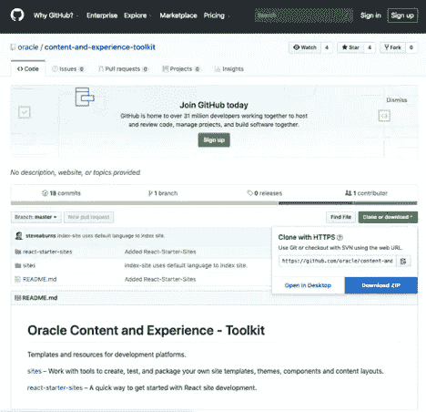
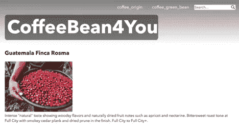

# OCE 反应站点的生命周期

> 原文：<https://medium.com/oracledevs/lifecycle-of-oce-react-site-4c31370dee36?source=collection_archive---------7----------------------->


# 概观

入门网站 CLI 是开始 React 开发 Oracle 内容和体验(OCE)云的快捷方式。使用 Starter Site CLI，可以在 React 中生成一个起始站点。React 站点不同于使用站点生成器构建的站点。React 站点是用 React 编码的，它是一个可独立运行的应用程序。它是根据您的内容资产的模型从头开始生成的。您可以在开发模式下通过迭代开发来使用 React 站点，其中的内容资产可以在本地提供。然后，您可以在生产模式下运行站点，内容资产来自 OCE。

这篇博客演示了使用 Starter Site CLI 的安装、开发和生产阶段。下面是我们将要做的事情的概要:

安装和设置站点工具包

发展:

*   获取内容模板
*   从内容模板创建一个 React 站点
*   构建开发站点
*   运行开发网站
*   执行迭代开发

生产:

*   将模板部署到 OCE
*   更新网站。cec _ 属性
*   建立一个生产站点
*   运行生产站点
*   测试生产现场

# 安装和设置站点工具包

Sites 工具包可以直接从 GitHub 获得。前往[https://github.com/oracle/content-and-experience-toolkit](https://github.com/oracle/content-and-experience-toolkit)点击**克隆下载**。选择**下载 ZIP，**和**内容和体验工具包 master.zip** 将被下载。解压文件 content-and-experience-toolkit-master . zip，输入***CD content-and-experience-toolkit-master/react-starter-site****进入目录。*

**

*要设置启动站点 CLI，请继续从 [**的步骤 4 开始安装启动站点 CLI**](https://docs.oracle.com/en/cloud/paas/content-cloud/developer/install-starter-site-cli.html) 。安装 Starter Site CLI 后，您应该能够调用 cecss 的帮助。*

```
*content-and-experience-toolkit-master/react-starter-sites$ **cecss -h** Usage: cecss <command> [options]Run 'cecss <command> -h' to get the detailed help for the command.Commands:
  cecss create-site <name>               Creates the Site <name> for the content from local or from CEC server.
  cecss export-server-content <channel>  Create content template based on the channel <channel>, then export and download the archive from CEC server.
  cecss list-server-content-types        List all content types from server.
  cecss list-server-channels             List all channels from server.
  cecss develop                          Start development server. Watches files, rebuilds, and hot reloads if something changes.
  cecss build                            Build a CEC starter site.
  cecss serve                            Serve previously build CEC starter site.Options:
  --help, -h     Show help                                                                                                                             [boolean]
  --version, -v  Show version number*
```

*然后 [**做一次 Gradle 设置**](https://docs.oracle.com/en/cloud/paas/content-cloud/developer/do-one-time-gradle-setup.html) 来设置 gradle.properties*

*最后，在用户的主目录下创建一个名为**的新文件。cec_properties** (~/。cec_properties)并输入 OCE 服务器的值。例如:*

```
*cec_url=*<server-name.example.com>*
cec_username=*<username>*
cec_password=*<password>*
cec_env=pod_ec*
```

# *开发:获取内容模板*

*内容模板是内容资产(即内容项目和内容类型)的打包。给定发布渠道，可以使用 Starter 站点 CLI 从 OCE 生成内容模板包。除了打包之外，内容模板的目的之一是作为创建 React 站点的内容模型。其次，当您在开发阶段生成要在本地使用的数据时，内容模板可以作为一个示例。*

*对于这个博客，提供了一个示例内容模板，[**coffee _ channel _ export . zip**](http://www.oracle.com/webfolder/PublicBlogs/OCE/ReactSiteBlog/coffee_channel_export.zip)。*

*但是，如果需要从 OCE 生成内容模板，可以使用***cecss export-server-content<channel>***命令。例如:*

```
*~/content-and-experience-toolkit-master/react-starter-sites$ **cecss export-server-content coffee_channel
** - validate channel coffee_channel (id: CC2F6DD98FC4D082F349DF0301F6580B16DFDE295DCF)
 - get CSRF token
 - submit export job
 - download export file
 - save export to ~/content-and-experience-toolkit-master/react-starter-sites/coffee_channel_export.zip*
```

# *开发:从内容模板创建一个 React 站点*

*可以使用以下命令从内容模板创建 React 站点:**cecss create-site<site>-c<内容模板> -n <导航内容类型>** 。使用以下命令创建了站点 CoffeeSite。确保内容模板 coffee_channel_export.zip 位于 content-and-experience-toolkit-master/react-starter-sites 目录中。*

```
*~/content-and-experience-toolkit-master/react-starter-sites$ **cecss create-site CoffeeSite -c coffee_channel_export.zip -n coffee_origin,coffee_green_bean**
 - unzip content template file
 - unzip site template
 - add content to site
 - set up files for site runtime
 - create component file ./CoffeeSite/src/coffee_green_bean/coffee_green_bean.js
 - create component file ./CoffeeSite/src/coffee_origin/coffee_origin.js
 - finish processing js files
 *** site created, please run npm install to build*
```

# *开发:构建开发站点*

*在开发阶段，可以使用命令 npm install 构建 React 站点。转到站点目录 CoffeeSite 并进行 **npm 安装**。*

```
*~/content-and-experience-toolkit-master/react-starter-sites$ **cd CoffeeSite**
~/content-and-experience-toolkit-master/react-starter-sites/CoffeeSite$ **npm install**> fsevents@1.2.7 install ~/content-and-experience-toolkit-master/react-starter-sites/CoffeeSite/node_modules/fsevents
> node installnode-pre-gyp WARN Using request for node-pre-gyp https download 
[fsevents] Success: "~/content-and-experience-toolkit-master/react-starter-sites/CoffeeSite/node_modules/fsevents/lib/binding/Release/node-v64-darwin-x64/fse.node" is installed via remote> puppeteer@1.7.0 install ~/content-and-experience-toolkit-master/react-starter-sites/CoffeeSite/node_modules/puppeteer
> node install.jsDownloading Chromium r579032 - 80.8 Mb [====================] 100% 0.0s 
Chromium downloaded to ~/content-and-experience-toolkit-master/react-starter-sites/CoffeeSite/node_modules/puppeteer/.local-chromium/mac-579032
npm notice created a lockfile as package-lock.json. You should commit this file.
added 898 packages from 637 contributors and audited 7480 packages in 43.691s
found 0 vulnerabilities*
```

*如果 npm 有网络问题，请检查您是否在防火墙后面。您可能需要在~/.npmrc 中指定代理。*

```
*~/content-and-experience-toolkit-master/react-starter-sites$ **cat ~/.npmrc** 
proxy=*<proxy-name.example.com>*
https-proxy=*<https-proxy-name.example.com>*
registry=https://registry.npmjs.org*
```

# *开发:运行开发站点*

*要在开发模式下运行站点，您可以使用 **cecss develop** 。*

```
*~/content-and-experience-toolkit-master/react-starter-sites/CoffeeSite$ **cecss develop**
[0] CEC configure file: ~/content-and-experience-toolkit-master/react-starter-sites/CoffeeSite/.cec_properties
[0] Configured server={"url":"","username":"","password":"","oauthtoken":"","env":"pod_ec","content":"server","contentStatus":"","channelToken":""}
[0] Node env: dev
[0] NodeJS running...:
[0] Site page: http://localhost:8080
[1] Listening at http://localhost:9090
[1] webpack built 3f6d98a12c8f527e007c in 2425ms*
```

*将浏览器指向[**http://localhost:9090**。](http://localhost:9090.)*

**

*点击中美洲下方的**详细信息**链接。*

**

*它展示了来自中美洲的咖啡豆。点击**coffee _ green _ bean:Guatemala Finca Rosma**的咖啡绿豆。它显示了咖啡豆的特征。*

**

*应该注意的是，内容资产在开发阶段是在本地提供的。*

# *开发:执行迭代开发*

*下一步是在网站上进行迭代开发。示例修改已经完成，您可以将文件[**coffee _ sample _ development . zip**](http://www.oracle.com/webfolder/PublicBlogs/OCE/ReactSiteBlog/coffee_sample_development.zip)解压缩到 **CoffeeSite** 目录。*

```
*~/content-and-experience-toolkit-master/react-starter-sites/CoffeeSite$ **unzip coffee_sample_development.zip** 
Archive:  coffee_sample_development.zip
replace src/Constants.js? [y]es, [n]o, [A]ll, [N]one, [r]ename: **A**
  inflating: src/Constants.js        
  inflating: src/common/ItemMultiValues.js  
  inflating: src/coffee_green_bean/coffee_green_bean.js  
  inflating: src/coffee_origin/coffee_origin.js*
```

*以下是对修改的高级描述:*

*CoffeeSite/src/Constants.js*

*   *将网站名称从“CoffeeSite”更改为“CoffeeBean4You”*

*咖啡网站/src/coffee _ origin/coffee _ origin . js*

*   *更改 coffee_origin 类的 render()，将“coffee_origin”替换为“Coffee Bean By Origin”*
*   *更改 coffee_originSummary 类的 render()以移除

    * * ** 
*   *更改 coffee_originSummary 类的 render()，将硬编码的“Details”替换为 coffee_originSummary 类的 render()的“{item.fields['origin']}”*
*   *更改 coffee_originDetail 类的 render()*

*coffee site/src/coffee _ green _ bean/coffee _ green _ bean . js*

*   *更改 coffee_green_beanDetail 类的 render()*

*coffee site/src/common/item multivalues . js*

*   *更改 ItemMultiValues 类的 render()*

*解压文件后，不反弹服务器，再次将浏览器指向 [http://localhost:9090/](http://localhost:9090/) 。下面是使用修改示例修改站点后的相同屏幕。*

******

# *生产:将模板部署到 OCE*

*在开发阶段之后，该网站将在生产模式下运行，内容资产由 OCE 提供。但是我们必须首先将模板中的内容资产放入 OCE。不幸的是，实现这一点的唯一方法是导入包含内容资产的站点模板，并基于该模板创建一个站点，以根据发布渠道具体化内容资产。更好的是能够通过使用 cecss CLI 导入资产的服务器内容。但这计划在未来的 OCE 版本中实现。*

*让我们导入站点模板。模板包是[***coffee _ template . zip***](http://www.oracle.com/webfolder/PublicBlogs/OCE/ReactSiteBlog/coffee_template.zip)***。*** 上传到 OCE。转到**开发者>模板**并导入模板包。*

**

*您可能会看到一个解决冲突对话框。选择**创建新组件**。*

**

*导入模板后，coffee_template 就创建好了。*

**

*在 Assets (Administration) > Assets 中，创建一个名为 **coffee_repository** 的新存储库，以及内容类型 **coffee_origin** 和 **coffee_green_bean** 。*

**

*在站点中，使用 **coffee_template 创建一个新站点。**调用站点 **coffee_site** 并使用仓库 **coffee_repository** 。*

**

*创建站点后，coffee_site 应该出现在站点中。*

**

*转到**资产**并选择**咖啡 _ 仓库**。选择**选择所有**和**发布**所有内容项。*

**

# *制作:更新网站。cec _ 属性*

*在控制台中，运行 **cecss 列表-服务器-频道**。该命令返回通道和令牌的列表。记下您看到的 coffee_site 的令牌。例如:*

```
*~/content-and-experience-toolkit-master/react-starter-sites/CoffeeSite$ **cecss list-server-channels**
 - CEC config: ~/.cec_properties
 - Channels:
 Name                             Token                             
 coffee_site                      **7264753c4ef2f3d11855ed4d499433cb***
```

*打开**content-and-experience-toolkit-master/react-starter-sites/coffee site/。编辑器中的 cec_properties** 文件。像下面一样填充所有字段，包括使用上面的令牌填充 **cec_channel_token** 。例如:*

```
*cec_url=***<server-name.example.com>***
cec_username=***<userid>***
cec_password=***<password>***
cec_env=**pod_ec**
cec_content=**server**
cec_content_status=
cec_channel_token=**7264753c4ef2f3d11855ed4d499433cb***
```

# *生产:建立一个生产站点*

*要构建生产站点，只需运行 **cecss build** 。例如:*

```
*~/content-and-experience-toolkit-master/react-starter-sites/CoffeeSite$ **cecss build**
Hash: bae365e77aa7881b4418
Version: webpack 4.16.0
Time: 8450ms
Built at: 04/02/2019 1:59:22 PM
      Asset       Size  Chunks                    Chunk Names
  bundle.js    510 KiB       0  [emitted]  [big]  app
favicon.ico   1.12 KiB          [emitted]         
 index.html  652 bytes          [emitted]         
Entrypoint app [big] = bundle.js
  [2] (webpack)/buildin/global.js 489 bytes {0} [built]
  [5] ./node_modules/history/esm/history.js + 4 modules 31.3 KiB {0} [built]
      |    5 modules
 [10] ./src/Constants.js 383 bytes {0} [built]
 [13] ./node_modules/react-redux/es/index.js + 23 modules 43 KiB {0} [built]
      |    24 modules
 [16] ./node_modules/react-router/es/index.js + 10 modules 32.2 KiB {0} [built]
      |    11 modules
 [21] ./src/common/queryItems.js 3.71 KiB {0} [built]
 [62] ./src/assets/app.css 1.05 KiB {0} [built]
 [63] ./src/assets/PageNotFound.png 15 KiB {0} [built]
 [64] ./src/common/LocaleSwitcher.js 3.84 KiB {0} [built]
 [65] ./src/coffee_origin/coffee_origin.js 8.74 KiB {0} [built]
 [95] ./src/coffee_green_bean/coffee_green_bean.js 9.17 KiB {0} [built]
 [96] ./src/app/App.js 9.43 KiB {0} [built]
[100] ./src/common/queryReducer.js 3.77 KiB {0} [built]
[123] ./src/index.js 1.38 KiB {0} [built]
[124] multi ./src/index.js 28 bytes {0} [built]
    + 111 hidden modulesWARNING in asset size limit: The following asset(s) exceed the recommended size limit (244 KiB).
This can impact web performance.
Assets: 
  bundle.js (510 KiB)WARNING in entrypoint size limit: The following entrypoint(s) combined asset size exceeds the recommended limit (244 KiB). This can impact web performance.
Entrypoints:
  app (510 KiB)
      bundle.jsWARNING in webpack performance recommendations: 
You can limit the size of your bundles by using import() or require.ensure to lazy load some parts of your application.
For more info visit https://webpack.js.org/guides/code-splitting/
Child html-webpack-plugin for "index.html":
     1 asset
    Entrypoint undefined = index.html
    [0] (webpack)/buildin/module.js 497 bytes {0} [built]
    [1] (webpack)/buildin/global.js 489 bytes {0} [built]
    [3] ./node_modules/html-webpack-plugin/lib/loader.js!./src/index.html 763 bytes {0} [built]
        + 1 hidden module*
```

# *生产:运行生产站点*

*要运行生产站点，请执行 **cecss 服务**。如果开发站点正在运行，则必须停止，否则生产站点将无法运行。*

```
*~/content-and-experience-toolkit-master/react-starter-sites/CoffeeSite$ **cecss serve**
CEC configure file: ~/content-and-experience-toolkit-master/react-starter-sites/CoffeeSite/.cec_properties
Configured server={"url":"*<server-name>.example.com:8080*","username":"*<username>*","password":"*<password>*","oauthtoken":"","env":"dev_ec","content":"server","contentStatus":"","channelToken":""}
Node env: production
Logged in to remote server: http://swebcli-oracle.slc07jio.osn.oraclecorp.com:8080
Server is listening on port: 8080
NodeJS running...:
Site page: http://localhost:8080*
```

# *生产:测试生产现场*

*生产站点将在 [http://localhost:8080](http://localhost:8080) 上运行。将您的浏览器指向该 URL 进行尝试。*

******

*入门网站 CLI 是开始 React 开发 Oracle 内容和体验(OCE)云的简单方法。对于 React 开发人员来说，开发和生产阶段使它变得完整。*