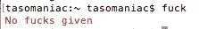
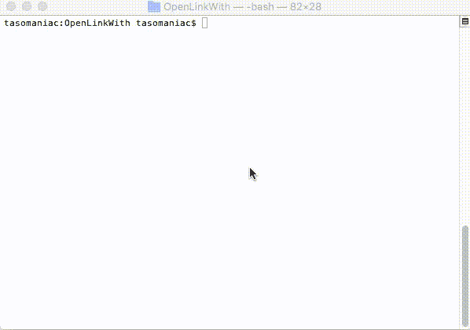

# 救生员保护计划:该死的格雷德法则

> 原文：<https://medium.com/google-developer-experts/lifesaver-protip-the-fuck-gradle-rule-3291857181fc?source=collection_archive---------1----------------------->

这件事我想了很久。当你在 *gradle、*中输入一个错误的*任务*名称时， *stderr* 输出会告诉你，并给出一个备选名称。

当这种情况发生时，我总是键入**他妈的**，我看到的只是:

嗯，不会再有了。最后，我决定为它写一个自定义规则。

给你:

 [## 嗜酒者/同性恋者

### 该死的格雷德-格雷德的该死的规则

github.com](https://github.com/tasomaniac/thefuck-gradle) 

一旦你安装了这个规则，它会一次又一次地拯救你的生命。

要了解如何安装，请阅读[自述文件](https://github.com/tasomaniac/thefuck-gradle)。