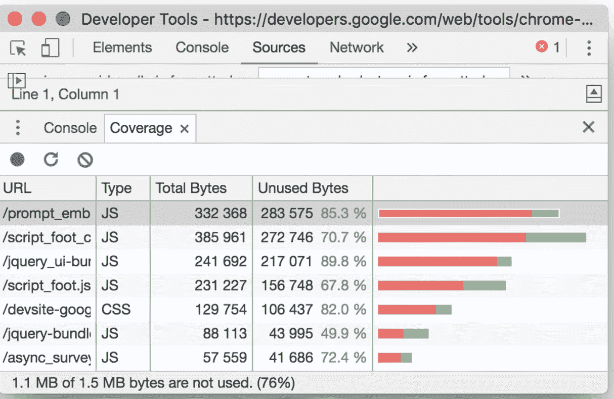

# 灯塔:提升网页速度的工具

> 原文：<https://medium.com/globant/lighthouse-a-tool-that-boosts-the-web-page-speed-f79fe54a0f03?source=collection_archive---------0----------------------->

# “谷歌研究发现，如果一个页面的加载时间超过 3 秒，超过一半的页面访问都会被放弃”

# 最大的问题是:网页加载时间长

对于最终用户来说，如果网页花费太多时间，这是一个令人沮丧的体验。对于提供商来说，如果页面加载缓慢，他们很有可能会失去客户。

在使用应用程序时，发现有些页面需要很长时间才能加载。这就产生了分析速度慢的原因的需要。

# 使用案例:我们如何解决“大问题”

我们发现 Lighthouse 工具是最好的解决方案，它不仅检查网页速度，还指导我们开发可以提高网页速度的解决方案。

# 灯塔:它是什么，为什么如此重要？

这是一个开源的自动化工具，用于提高网页质量。Lighthouse 超级容易访问，只需点击一下。打开开发工具，你会看到它在那里。你可以在任何网页上运行它，无论是公开的还是需要认证的。它对性能、可访问性、渐进式网络应用、搜索引擎优化等进行审计。Google 开发的，用 Javascript 写的。

# 从《灯塔行》看问题

上面的截图是一个网页的实际分数，这个网页花了很长时间来加载。分数是 8(很差)。

## **理解问题**

指标分数根据这些范围进行着色:

**0 到 49:差—用户可能遇到速度慢的可能性很高。**

**50 到 89:中等——速度提高。可能不会经历很长的加载时间。**

**90 比 100: Best —页面渲染速度快概率很高。**

为了提供良好的用户体验，网站应该努力获得高分(90-100)。100 分的“完美”分数是很难达到的，也不是我们所期望的。

例如，从 99 分到 100 分需要与从 90 分到 94 分相同的度量改进。

## **解决方案:与 Lighthouse 集成**

# 性能优化的灯塔

在它的许多用途中，性能是最有用的特性之一，它帮助我们评估页面在内容交付方面的表现有多好/多快。

> Lighthouse 使用上述指标来衡量网页的性能。使用所有这些指标，它计算一个页面的整体性能得分。分数根据其值进一步分为最佳/良好/最差类别。

# 我们如何优化每项指标？

指标分数是优化性能的关键。一旦 lighthouse 生成了一个报告，它就会详细地显示指标分数以及优化这些分数的方法。

以下是 Lighthouse 给出的常用解决方案以及实现方法:

# FCP 和 LCP 优化

## **消除渲染阻塞资源**

这种解决方案显著缩短了 *FCP* 时间。一些关键资源被渲染阻塞。我们发现了这些阻塞资源。

例如，在下图中，材质字体是从服务器下载的，它是一个阻止程序。在索引页面的

## **预载密钥请求**

一些关键的资产/资源，如字体、css，是浏览器最早需要的。这些请求的延迟将延迟第一次油漆。给予这些资源最高优先权减少了 FCP。我们可以通过尽早提供这些资源来优化 FCP。

*一个名为 preload-webpack-plugin 的 webpack 插件有助于区分它们的优先级。*

## **减少未使用的 css**

未使用的 css 会占用不必要的空间并增加文件大小，从而增加页面加载时间。有多种方法可以减少未使用的 css。

一种方法是使用 IDE。例如，Webstorm 有一个选项来识别未使用的 css。或者可以使用名为 purge-css 的 web pack 插件。另一种方法是在开发工具中使用“覆盖率”标签选项。这降低了 FCP 和 LCP。

## **在网页字体加载期间，所有文本保持可见**

字体通常是大文件，需要一段时间来加载。一些浏览器在字体加载前隐藏文本，导致不可见文本的[闪烁](https://web.dev/avoid-invisible-text)。

在所有字体请求中使用了属性“display=swap”。` swap '告诉浏览器显示系统字体而不是 FOIT，直到字体被加载，并且当它可用时切换到自定义字体。

# 所有组合:优化所有指标

观察到一些导致项目速度缓慢的主要问题(在灯塔建议的帮助下)

1.  未实现延迟加载
2.  广泛使用的第三方工具
3.  大模块(不必要的导入未使用的模块，模块划分不当)
4.  大尺寸的节点模块(不必要的封装)
5.  大图像尺寸(未优化的图像)

我们对上述问题进行了分析和研究。解决之后，我们发现 lighthouse 分数有了巨大的提高，网页速度也提高了。解决方案/建议如下:

# 1.包分析:Webpack Visualizer

使用“webpack-visualizer-plugin2 ”,它可以可视化整个包。它显示哪个模块占用了多少空间。

在下图中，在我们的应用程序中，node_modules 占据了大约 74%的模块。在此帮助下，可以轻松识别未使用的模块/大型模块，并对其采取措施。

# 2.优化捆绑包大小(网络包优化)

如果 webpack 配置正确，它可以减少包的大小，从而大大减少页面加载时间。在 web pack 中尝试了不同的优化选项，以获得最佳的捆绑包大小，并最小化捆绑包。比如一个叫做 *CompressionPlugin 的插件。使用它来压缩 gzip 或 brotli 中的包*

# 3.减少包的大小:使用惰性加载方法

懒惰加载了模块。减小了模块尺寸。这反过来减少了整体束尺寸。此外，通过删除不必要的导入或其他模块依赖项，减少了模块大小。

# 4.节点模块相关性:第三方检查

不必要的第三方库可能会占用大量空间，从而增加整个包的大小。

在我们的例子中可以观察到， *Lodash* 库占用了非常大的空间，导致了包大小的增加。我们观察到内置的 javascript 方法更有用，可以用来代替 lodash 函数，如。过滤器()。findIndex()来避免导入 lodash。

*导入洛达什的一个有效方法是“从洛达什导入{ map }”。而不是“import { _ from lodash}”。只有导入一个特定的方法才能加载该文件，否则在整个 lodash 库被导入模块的情况下。*

# 5.减少 Javascript 执行时间

当 JavaScript 执行时间超过 2 秒时，Lighthouse 会显示警告。当执行时间超过 3.5 秒时，审核失败。

发现在项目中，一个特定的组件需要很长时间来处理一个本地 json 文件。消除这种依赖性后，我们观察到执行时间减少了。这个建议是由 lighthouse 提供的，因此我们能够发现这个问题。

# 6.优化的图像:Webp 图像格式

Webp 图像格式取代 png/jpeg 格式，在不影响图像质量的情况下极大地缩小了图像尺寸。例如，Webp 在图像质量不变的情况下，将一幅图像的大小从 190 kb 减少到 40 kb。

可以优化项目中的图像。它有助于减少整体束的大小，并且可以快速渲染图像。

# 结果

实施解决方案后，绩效分数比原来的分数提高了 7-8 倍。仍然有很大的改进空间。

# 结论

灯塔让我们可以分析相对速度。它不仅显示一页的分数，而且给出问题的详细解释，并建议可以实施的解决方案。

例如，在上面的截图中，它显示了是什么导致了这个问题和可能的解决方案，即在这种情况下内嵌材料字体。

有时解决方案可以直接实施，但在许多情况下，对项目的详细分析是必要的。例如，包的大小，MVC 架构，使用的节点包等等。

# 所有解决方案的摘要

*   用灯塔来衡量网页评分。
*   考虑灯塔的建议来提高速度。
*   对于 FCP，LCP 指标删除阻塞资源，对关键资源进行优先级排序，并删除未使用的 css。
*   整体改善(所有指标)
*   减少捆绑包大小:分析捆绑包，使用延迟加载，使用优化图像(Webp)，减少第三方使用，只在必要时使用，使用 webpack 配置压缩捆绑包(仍在工作)，删除未使用的 javascript，缩小 CSS，JS。
*   确定哪个模块执行时间长，并采取相应的措施。Lighthouse 可以提供哪个文件可能需要更多的执行时间。
*   项目架构分析有助于实现解决方案。

**参考文献:**

*   [灯塔:开发者工具](https://developers.google.com/web/tools/lighthouse)
*   【Medium.com T4:chrome 灯塔简介
*   [Web.dev:使用 Lighthouse 优化 Web 生命周期](https://web.dev/optimize-vitals-lighthouse/)
*   [Webpack:优化](https://webpack.js.org/configuration/optimization/)
*   [NPM](https://www.npmjs.com/)

特别感谢:拉纳·兰维杰·辛格。[https://medium.com/@ranaranvijaysingh](/@ranaranvijaysingh)