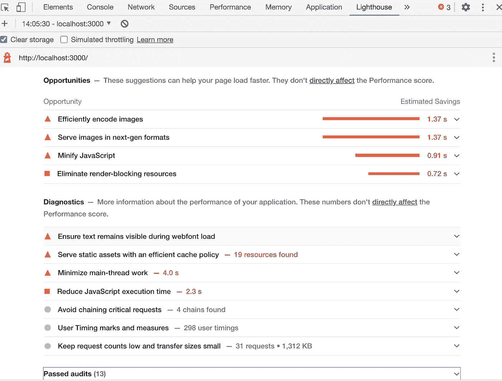
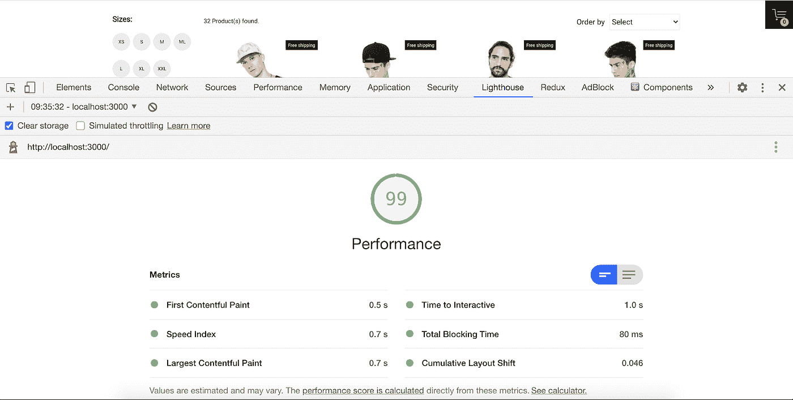

# Lighthouse —应用性能的助推器。

> 原文：<https://medium.com/globant/lighthouse-the-booster-pack-for-your-app-performance-b4b0771af035?source=collection_archive---------1----------------------->

Lighthouse

Kunal 是一名自由职业者，在 web 开发方面有 3 年的经验。他为他的一个客户做了一个电子商务项目，从零开始构建并按时交付。然而，客户的 QA 团队阻止了该项目的发布，因为该网站加载一个页面需要将近 12 秒！不用说，客户显然不高兴。

他意识到自己从未在开发阶段考虑过性能改进，而今天它却成了重中之重。

**为什么性能很重要？**

*   网站业绩和收入成正比。
*   它提高了网站在 SEO 中的排名。
*   根据亚马逊的说法:

> 页面加载时间增加几分之一秒，每年会损失 7 . 45 亿美元的收入！
> 
> 2009 年，该公司对 1000 多名网上购物者进行了一项调查研究。
> 
> 阈值是 2 秒——超过这个时间，用户会变得不耐烦
> 
> 如果加载时间超过 3 秒，40%的受访者会放弃该网站

*   DoubleClick 发现，加载时间少于 5 秒的网站比加载时间在 19 秒内的网站赚取了两倍的广告收入。

他开始对这个问题进行调查，以衡量网络性能，并瞄准了两个主要工具:

*   谷歌灯塔
*   WPT —网络性能测试

Kunal 想要探索 Lighthouse，因为它有谷歌的支持。他想了解更多。

**灯塔到底是什么？**

它是一个开源的自动化工具，用于提高网页质量。你可以在任何网页上运行它，无论是公开的还是需要认证的。您还可以使用 Lighthouse CI 来防止您的站点出现倒退。

它允许您审计页面的:

*   表演
*   易接近
*   渐进式网络应用
*   最佳实践
*   搜索引擎优化和更多

在 Lighthouse 对你选择的页面进行审计后，它会为你生成一份报告。

Lighthouse provides performance metrics to measure website performance score

Lighthouse 提供了性能指标来衡量你的网站得分。

**性能指标:**

*   **第一个内容绘制**标记第一个文本或图像被绘制的时间。
*   **第一个有意义的绘图**测量页面的主要内容何时可见
*   **速度指数**显示页面内容可视填充的速度。
*   **第一次 CPU 空闲**标志着页面的主线程第一次安静到足以处理输入
*   **交互时间**是页面开始交互所需的时间。
*   用户可能经历的最大潜在首次输入延迟是最长任务的持续时间，以毫秒为单位。

**为什么是指标？**

*   它为您提供改进方面的建议和诊断。
*   你可以在任何网页上运行它，无论是公开的还是需要认证的。
*   它对性能、可访问性、渐进式网络应用、搜索引擎优化等进行审计。
*   它还提供对网络、主线程、CPU 使用情况、帧等的底层深入分析。

Audit Reports and Diagnostics

Low-level in-depth analysis

当 Kunal 测试他开发的电子商务项目时，lighthouse 得分为 37 分。

Lighthouse score for unoptimized version

在分析了这个问题之后，他想出了一个提高绩效的行动计划

**计划:**

*   **消除渲染阻塞资源**:任何阻塞 DOM 整体渲染的资源。它应该是异步和独立的…

Render-blocking resources example

*   **小块"*只加载你所需要的* ":** 它有助于在最初更快地加载页面，并根据需要延迟加载其余的组件和图像:

Lazy component

*   **最新版本的库和框架**:它有助于优化依赖项的性能。

bundle size comparison

*   **将不必要的依赖项移到 devDependencies 部分:**它减少了最终的生产构建大小，从而进一步减少了 JS 解析和执行时间。

Moved unnecessary dependency to dev-dependency

*   **DOM 树**:DOM 的渲染和绘制性能取决于 DOM 树的深度。(最好小于 200)
*   **图像优化**:以正确的格式、尺寸、大小和分辨率获得高质量的图像，同时保持尽可能小的尺寸。 **WebP** 是一种现代图像格式，为网络上的图像提供卓越的无损和有损压缩。目前 Safari 和 IE11 浏览器不支持 WebP 格式。
*   **CSS 优化:**删除不必要的样式，缩小、压缩并缓存，将页面加载时不需要的 CSS 拆分到附加文件中，减少 CSS 渲染阻塞。
*   **CDN:** 从最近的服务器获取资源，节省网络通话时长。
*   在 HTTP 中，浏览器可以同时发送 6 个请求，而在 HTTP/2 中，它们可以发送 100 个请求。

经过这些优化后，Lighthouse 得分跃升至 99 分，页面加载时间降至约 2 秒，Kunal 能够将应用程序投入生产。

Lighthouse score for optimised version

**结论:**

对于大多数开发人员来说，网站性能排在最后，而它应该是应用程序设计的第一阶段。Lighthouse 在审计中起着重要的作用，可以提高网站的性能。

记住意识到绩效会让你得到什么:

*   良好的用户体验
*   独立用户数量增加
*   更高的收入

无论如何都不要忽视表演，否则你以后会付出代价的