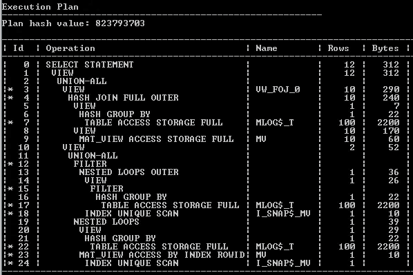

# 带有实时物化视图的闪电般快速的 SQL:开发人员会喜欢的关于 Oracle Database 12c 第 2 版第 5 部分的 12 件事

> 原文：<https://medium.com/oracledevs/lightning-fast-sql-with-real-time-materialized-views-12-things-developers-will-love-about-oracle-54bcc9eac358?source=collection_archive---------0----------------------->

物化视图可以带来惊人的性能提升。一旦基于查询创建了一个语句，Oracle 就可以直接从 MV 中获得结果，而不用执行语句本身。这可以显著提高 SQL 的速度。尤其是当查询处理数百万行，但输出中只有少数几行时。

只有一个问题。

MV 里的数据必须是新鲜的。否则甲骨文不会重写。

你当然可以直接查询 MV。但是数据仍然是旧的。

所以您需要保持物化视图是最新的。最简单的方法是将其声明为“提交时快速刷新”。

但这说起来容易做起来难。这样做有几个问题:

因此，如果您有复杂的 SQL，您可能无法使用查询重写。即使可以，在高事务系统上，刷新开销可能会使系统瘫痪。

所以不是“提交时快速刷新”，而是让 MV“按需快速刷新”。并创建一个作业来更新它。每秒钟都在运行！

但是，无论您多频繁地运行作业，总会有 MV 过时的时候。因此查询性能可以在快如闪电和慢如狗之间切换。一个保证让你的用户不安的方法！

那么如何克服这一点呢？

实时物化视图！

这些都是两全其美的。可以按需刷新 MV。但是仍然让它返回最新信息。

为此，使用子句创建 MV:

关于查询计算

例如:

```
create table t (
  x not null primary key, y not null
) as 
  select rownum x, mod(rownum, 10) y 
  from   dual connect by level <= 1000; create materialized view log on t 
  with rowid (x, y) including new values; create materialized view mv 
refresh fast on demand 
enable on query computation 
enable query rewrite as 
  select y , count(*) c1 
  from   t 
  group by y;
```

这样，您可以向表中添加更多数据:

```
insert into t 
  select 1000+rownum, 1 from dual 
  connect by level <= 100; commit;
```

而且甲骨文还可以用 MV 来重写。*即使 MV 已经陈旧*！

```
select /*+ rewrite */y , count(*) from t group by y;
```

它通过以下方式做到这一点:

*   查询过时的 MV
*   然后对其应用 MV 日志中的插入、更新和删除

这可能会导致一些可怕的执行计划！



要记住的一点是，Oracle 正在读取物化视图日志。然后将更改应用到 MV。因此，两次刷新间隔的时间越长，数据就越多。您需要进行测试，找到平衡刷新过程和在查询重写时应用 MV 更改日志的最佳点。

你甚至可以在直接查询 MV 的时候获得最新的信息。为此，请添加 fresh_mv 提示:

```
select /*+ fresh_mv */* from mv;
```

最酷的部分是什么？

您可以使用以下命令将现有的 MVs 转换为实时:

```
alter materialized view mv enable on query computation;
```

这使得 MVs 更容易使用，打开了您的查询调优选项！

【blogs.oracle.com】全文原载于 2016 年 11 月 10 日[](https://blogs.oracle.com/sql/12-things-developers-will-love-about-oracle-database-12c-release-2)**。**