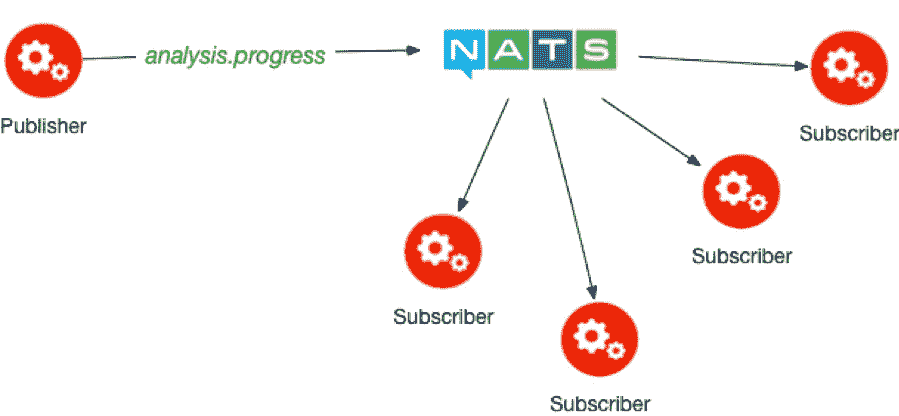
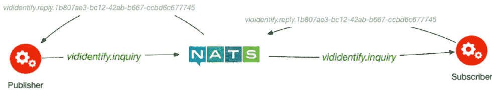
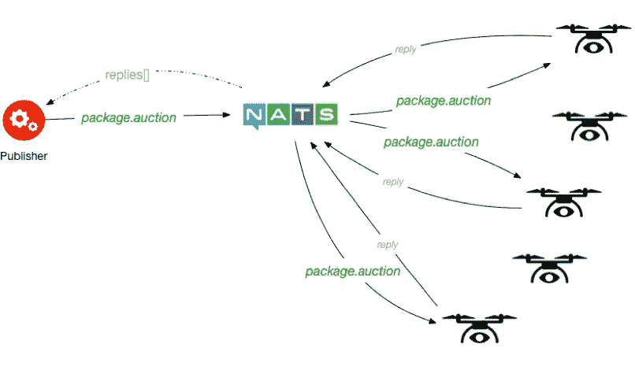

# 通过 NATS 实现轻量级云原生消息传递

> 原文：<https://medium.com/capital-one-tech/lightweight-cloud-native-messaging-with-nats-ad730ca2becf?source=collection_archive---------1----------------------->


在为云构建应用时，我们通常会投入大量精力来打破我们的铁板一块，将应用构建为小型、容器化的工作负载，这些工作负载遵循云原生应用的 [12(或 15)个因素](https://www.oreilly.com/webops-perf/free/beyond-the-twelve-factor-app.csp)。随着我们的关注点缩小到代码库的内部，我们经常将关于*消息传递*的讨论和设计留在待办事项中。

消息传递是任何大规模分布式系统的*中枢神经系统*。无论我们是在做事件外包还是更简单的工作分派模型，消息传递都是让一切工作顺利进行的粘合剂。没有它，我们美妙的分布式系统就会陷入停顿。

那么，我们如何为我们的应用程序选择消息代理或消息传递架构呢？这可能会让人感到不知所措，因为大量的选项已经存在，而且每天都有新的选项出现。

在复杂性和规模方面，我们有 [*卡夫卡*](https://kafka.apache.org/) 。Kafka 通常被称为分布式日志存储。假设在 Kafka 中发布到主题的消息将持续一段时间，并且 [*消费者群体*](https://kafka.apache.org/documentation/#theconsumer) 的概念允许消息在同一服务的多个实例中平均分布。它非常强大，但伴随着这种力量而来的是巨大的责任。Kafka 很难维护，对于任何希望提高技术的团队来说，学习曲线都很陡。

另一个相当常见的选择是 [*RabbitMQ*](https://www.rabbitmq.com/) (或者任何[*AMQP*](https://www.amqp.org/)——顺从的经纪人，真的)。Rabbit 的重量要轻得多，但是 Rabbit 没有使用独特的*消费者群体*的概念，而是采用了让客户消费队列的更简单的方法。如果一个客户端没有确认消息，它将回到队列中由另一个客户端处理。这种架构的微妙之处在于，允许两个工人接收相同的调度的小时间窗口，等等。

甚至像 Redis 这样不把自己标榜为消息代理的应用程序也支持发布/订阅消息。正如您所看到的，围绕消息代理的产品和服务的列表非常庞大。

每一种产品都有它们的亮点，它们闪耀的地方。Kafka 在使用持久消息日志的大规模消息流和聚合场景中展示了自己的实力。Rabbit 在需要更简单的发布/订阅功能和消息代理范围之外的工作的强制幂等性的环境中茁壮成长。如果您的所有消息客户端都与 Redis 进行缓存，并且您不需要持久化消息，Redis 甚至可能是一个很好的选择。

如果我真的想拥抱“中枢神经系统”的想法，但我不想所有的其他解决方案的开销呢？如果我想既能进行传统的发布/订阅，又能请求/回复，甚至分散-收集，同时又保持事物的敏捷和轻便，该怎么办？这就是 NATS 可能更适合的地方。

NATS 是一个令人难以置信的快速，开放源码的消息传递系统，建立在一个简单，但功能强大，核心。该服务器使用基于文本的协议，因此虽然有许多特定语言的客户端库，但您可以真正地进入 NATS 服务器并发送和接收消息。NATS 被设计成永远在线、连接并随时接受命令。如果你的年龄足够大，知道什么是“*拨号音*”，那么值得一提的是，NATS 的文档喜欢用这个比喻来描述这个设计。

为了感受在 NATS 上构建应用程序的感觉，让我们来看几个常见的用例。

# 发布和订阅



Publish/Subscribe Pattern

在最简单的发布/订阅模型中，我们有一个发布者向主题为*的*发布消息(尽管您可能更熟悉术语*主题*)。任何对该主题的消息感兴趣的人都可以订阅它。NATS 将保证*最多一次*交货。这意味着从单个发布者发送的消息保证按顺序到达，但是在多个发布者之间不保持顺序。我将把“全球信息排序”的兔子洞讨论留到以后的博客文章中，因为这场辩论可能会持续几天。

假设我们正在构建一个进行面部识别的视频分析系统。当分析器在一大块媒体上取得进展时，我们希望将进展发布给任何可能感兴趣的人。

因为 NATS 是一种文本协议，所以您可以发出类似如下的命令:

```
PUB analysis.progress 55
{"hash": "abc56fghe", id: 12, progress: 32, faces: 78}
**+OK**
```

我们告诉 NATS 主题(`analysis.progress`)和内容长度(55 字节)。然后，在实际数据之前和之后有一个换行符。如果一切顺利，NATS 给了我们一个`+OK`的回应。这与一些消息代理使用的复杂甚至专有的二进制协议形成了鲜明的对比。当我们可以用 POSTman 插件轻松调试 RESTful 服务时，我们的感觉类似于我可以远程登录到我的 NATS 服务器时的感觉。

要订阅，我们创建一个具有唯一主题标识符的订阅(主题 ID 是我的连接的私有 ID):

```
SUB analysis.progress 50
```

这意味着主题 ID 50 代表对`analysis.progress`的订阅。每个订户都会收到一条类似这样的消息:

```
MSG analysis.progress 50 55
{"hash": "abc56fghe", id: 12, progress: 32, faces: 78}
```

与发布一样，仅用一个简单的换行符/回车符组合就将有效负载与元数据分开了。每个`MSG`协议消息包含主题 ID 和原始消息的内容长度。

与其他一些代理相比，在某些情况下，我们必须在服务开始之前编写管理脚本来提前创建主题。卡夫卡要求显式创建主题，兔子也是如此，而雷迪斯和 NATS 让你在飞行中创建频道和主题(它们各自的术语)。

这种按需创建主题的能力是启用请求-应答语义的关键。

# 请求-回复



Request — Reply Pattern

当我们进行 RESTful 服务调用时，我们向服务发出 HTTP 请求，然后得到回复，我们使用的是传统的同步请求-响应模式。

对于许多消息传递系统，请求-应答模式通常很困难，或者需要一些非常笨拙且负担沉重的妥协。使用 NATS，请求-回复是一个相当简单的操作，包括在发布消息时提供一个“回复”主题。

下面是在基于 NATS 的请求-回复场景中发生的事情的分解，在该场景中，我们想要请求出现特定人物的视频列表。这里要记住的一件重要的事情是，我们不知道我们要求的信息是谁的。我们所做的只是发布我们对答案的渴望，而系统会满足我们的要求。这种松散耦合令人难以置信地增强了我们的能力，给了我们极大的灵活性来升级和增强系统，而不需要发布“停止世界”的版本。

1.  发布者订阅一个主题，例如`vididentify.reply`
2.  然后，发布者发送一条主题为`vididentify.inquiry`的消息，并包含“回复”主题的名称:`vididentify.reply`
3.  然后，Publisher 会等待一段时间来接收单个响应
4.  出版商取消了对`vididentify.reply`主题的兴趣
5.  发布者相应地处理响应

为了防止相同类型的多个并发请求相互干扰，并确保处理请求的任何代码只回复给负责该消息的单个请求发布者，每个请求的“回复”主题是唯一的，通常带有 GUID 后缀。例如，我们可以发布如下视频识别查询请求:

```
PUB vididentify.inquiry vididentify.reply.1b807ae3-bc12-42ab-b667-ccbd6c677745 25
{ "person_id": 4237249 }
**+OK**
```

这种复杂性几乎总是由特定于语言的客户端来处理。例如， **Go** 客户端完全隐藏了回复主题的创建:

```
nc, err := nats.Connect(*urls) 
if err != nil { 
 log.Fatalf("Can't connect: %v\n", err) 
}defer nc.Close()
// get payload...**msg, err := nc.Request("vididentify.inquiry",
                       []byte(payload), 100*time.Millisecond)**
```

这将发布一个请求，并等待 100 毫秒的答复。Go 库对开发人员隐藏了回复主题的详细信息。它还隐藏了对回复主题的订阅和取消订阅。如果您正在使用的库没有为您实现这一点，那么创建一个实现这一点的包装器是相当容易的。

# 分散-聚集



Scatter — Gather Pattern

在分散-聚集模式中，单个发布者同时向未知数量的订阅者发布关于某个主题的消息。假设所有的监听器都将开始工作。然后，发布者等待部分或全部订阅者的回复，然后以某种方式汇总结果。

假设我有几千架无人机组成了我的包裹递送设备舰队。有一个递送包裹的请求，我想选择我要使用的无人机。“用老方法”做事，我可以迭代所有无人机的已知列表，通过缓慢且潜在不可靠的网络单独询问每一个无人机，然后当我完成这个循环时，我可以最终根据剩余电池、重量容量和当前位置做出决定。这很慢，容易出错，而且效率非常低。

为了解决这个问题，我们可以使用 [*来代替*](http://www.enterpriseintegrationpatterns.com/patterns/messaging/BroadcastAggregate.html) 。我就`package.auction`话题发布一条消息如下:

```
PUB package.auction auction.d5e979a1-bf54-4baf-abdc-c91d451898c5.replies (content-length)
{ "pkg_weight": 12.5, "dest_address": {...}, "priority": "A"}
**+OK**
```

请注意，我们仍然使用一个独特的回复主题。这允许舰队中的所有监听无人机回复这个特定的拍卖请求，并且不干扰同时处理的任何其他拍卖请求。

那些没有收到消息的人显然不是好的选择，那些没有在我们预期的超时时间内回复的人也不是。消息可能会像这样返回:

```
MSG auction.d5e979a1-bf54-4baf-abdc-c91d451898c5.replies 50 (content-length)
{"drone_id":12345,"est_batt_remaining":12.34,"capacity":30, ...}
```

然后，我们可以收集在超时期限内收到的所有结果，并根据无人机电池寿命、位置、容量以及在投放结束时它可能剩余的电池量，从回复中做出决定。

# 摘要

让 NATS 如此强大的不是它的复杂性，而是它的简单性。我对简约的优雅情有独钟(日本人对此有个词， [***【古田】***](http://www.romajidesu.com/dictionary/meaning-of-%E6%9E%AF%E6%B7%A1.html) )，而 NATS 很好地体现了这一点。通过保持底层协议的简单性，通过关注性能和云原生可靠性，我们可以构建各种真正强大的消息传递模式，而不必硬塞笨拙的功能或在更大的产品中承载大量未使用的功能。

希望这篇文章已经启发了你，不仅要看看 NATS，还要用批判的眼光评估你的消息代理需要的复杂程度。如果你想尝试 NATS，你可以去拿起 [gnatsd docker 图片](https://nats.io/documentation/tutorials/gnatsd-docker/)开始摆弄它。

*声明:以上观点仅代表作者个人观点。除非本帖中另有说明，否则 Capital One 不属于所提及的任何公司，也不被其认可。使用或展示的所有商标和其他知识产权都是其各自所有者的所有权。本文为 Capital One 2018。*