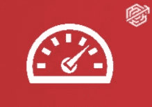
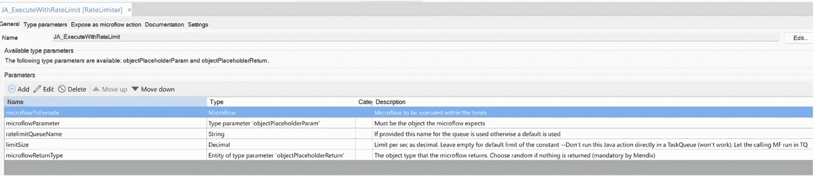
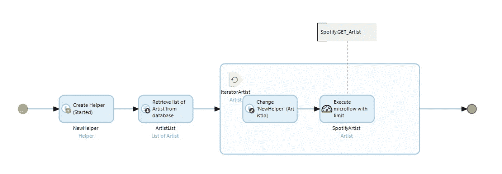
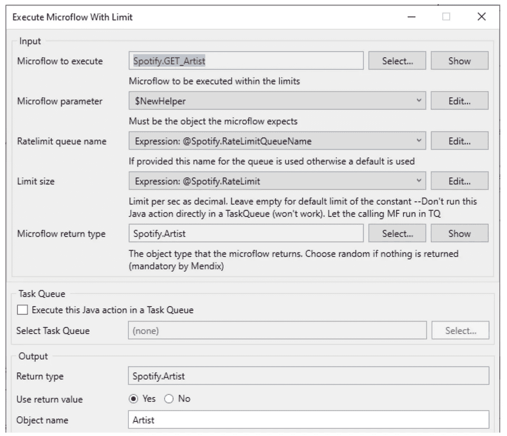
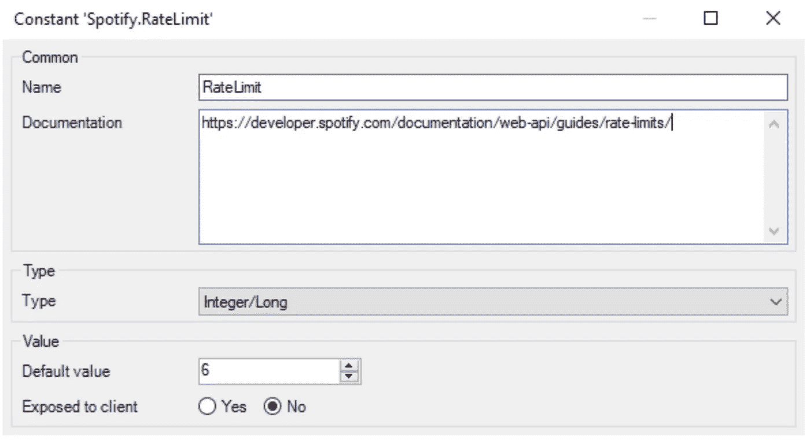
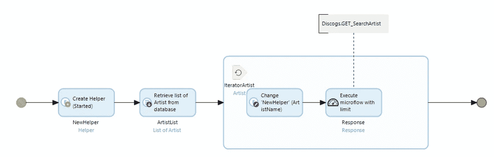
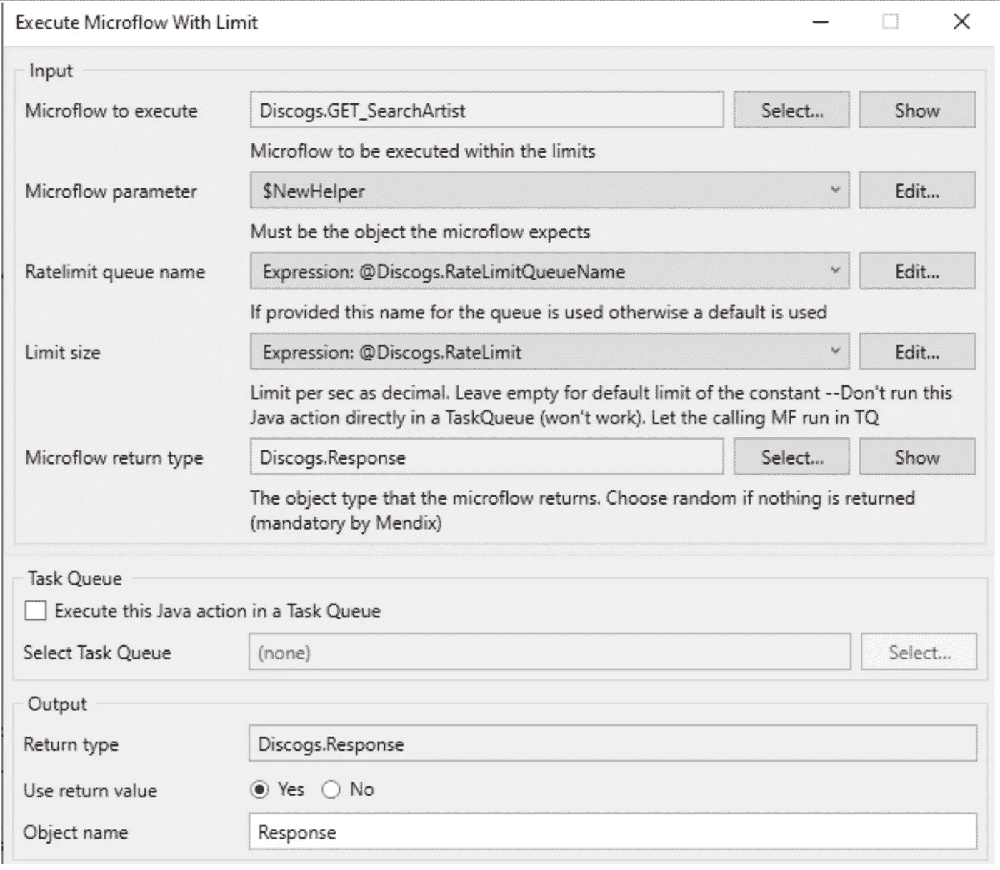
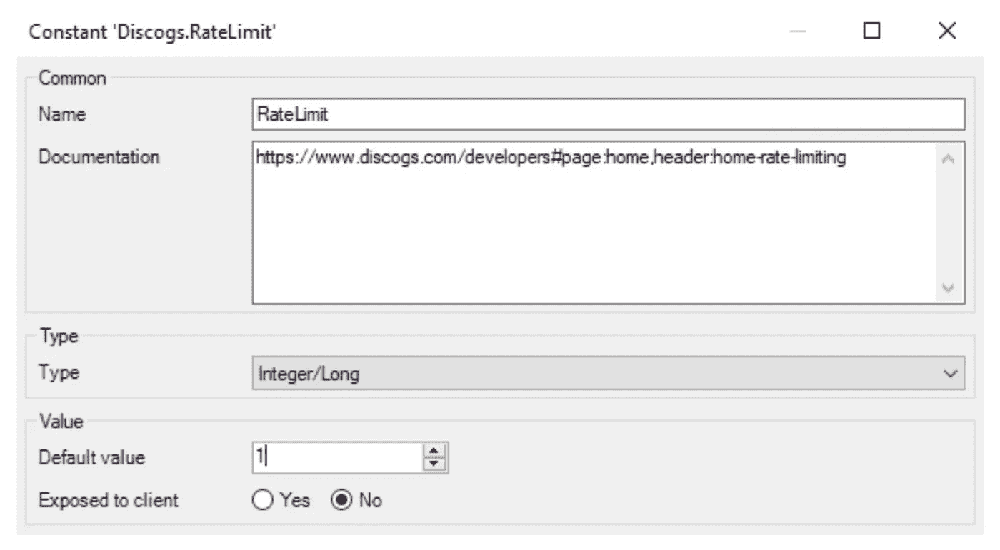

# 限制 Mendix 中 REST 调用的数量(大部分时间)

> 原文：<https://medium.com/mendix/limiting-your-amount-of-calls-in-mendix-most-of-the-time-rest-835dde55b10e?source=collection_archive---------4----------------------->

## 你有没有构建一个集成，得到一个 HTTP 代码 429 的响应作为回报？或者供应商抱怨您对他们的系统调用太多？

Limiting the amount of REST calls in Mendix (most of the time)

> 合著者:Martijn Booij 和 Remco van der Gaag

> HTTP **429 太多请求**响应状态代码表示用户在给定时间内发送了太多请求(“速率限制”)。

在这种情况下，您在特定的时间范围内向服务器发送了太多的调用，服务器将阻止您在该时间访问它。这主要是为了防止端点服务器过载。

使用队列机制的增量重试是这个问题的解决方案之一，但是，您仍然无法解决这个问题:您仍然不知道每个时间范围内您向端点发送了多少个呼叫。

# **解决方案**

有时，供应商会记录特定端点的速率限制。在这种情况下，您不希望在任何时候超过这个限制(否则您将再次得到 429 错误)。

在 Appronto，**我们已经建立了一个速率限制模块**，它将允许你执行一个你可以控制的速率限制的微流！**指定的微流**将由带有**内部限速队列**的 Java 动作执行**。**

该模块不仅为单个速率受限集成提供了解决方案，还为具有不同速率限制的多个集成提供了解决方案。

在这里下载:[https://marketplace.mendix.com/link/component/120637](https://marketplace.mendix.com/link/component/120637)。

# **简化示例**

您的应用程序有两个速率受限的集成:

1.  集成到 **ERP** 允许每分钟 **30 次呼叫** =每秒 0.5 次
2.  集成到 **CRM** 允许每秒 **1 次呼叫** = 1 次

除了这些数字，积分将开始给你 429 个答案。

在这种情况下，您必须执行所有运行 ERP 集成调用的微流，以及那些从模块中的 Java 操作调用 CRM 集成的微流，您希望在该模块中执行微流。

所有调用 ERP 集成的微流都将具有以下设置:

*   速率限制:0.5
*   RatelimitQueue:“integration ERP”(这定义了微流将在哪个队列中执行，从而限制了速率)。

所有调用 CRM 集成的微流都将具有以下设置:

*   速率限制 1
*   RatelimitQueue: "integrationCRM "

# **速率限制**

Java 操作接受以下参数:

*   **要执行的微流程**

基于指定的限制，Java 队列处理后将执行的微流。

*   **微流量参数**

可以传递给微流的参数。如果您需要向您的微流传递多个参数，您可以修改它，使用一个临时对象来保存不同的对象 ID 和您的微流的必要参数。

*   **极限尺寸**

每秒执行队列中微流的限制。将此项设置为 1 将每秒执行一个微流。当未指定限制时，操作将恢复到常量“RateLimit”中指定的默认限制。建议使用常数，因为每次积分使用一个极限。

*   **限速队列**

呼叫将添加到的 ratelimit 队列的名称。

Java 动作将在指定的速率限制内执行微流。它使用一种内部排队机制，在这种机制下，将执行队列中的第一项，然后等待指定的时间(基于限制)，并执行队列中的第二项。Java 队列不知道应该执行哪个微流，因此一个集成的所有微流应该使用同一个队列。

# **动态速率限制**

该模块不会自动为您管理费率限额。如果您调用的集成有动态速率限制(如 Spotify ),请确定一个较低的速率限制，以防止出现 HTTP 错误，如 429(请求太多)。

集成通常会在响应中回复一个 HTTP 状态代码 429 和一个 Retry-After 标头，指示在发出新请求之前要等待多长时间。根据这些消息调整您的速率限制。

# **例子**

在我们的例子中，我们正在**与两个外部音乐平台**集成，每个平台都有不同的速率限制。 **Spotify API** 服务根据连续 30 秒时间内的呼叫数量设置了动态速率限制。根据测试，我们发现 **Spotify 每分钟允许大约 180 个请求**而不会返回错误 429。 **Discogs API** 服务**允许每分钟 60 个请求**。

# Spotify

我们的艺术家数据库每天都会更新新信息。在本例中，我们只检索艺术家的基本信息:

# **迪斯科舞厅**

在我们更新了我们的 artist 对象之后，我们希望根据找到的名称查询 Discogs 数据库。

## 感谢您的阅读！

我们希望你喜欢阅读这篇文章，如果你有任何想法或问题，请在这里留下评论。

## 阅读更多

 [## GitHub-approto/rate limiter:限制一段时间内微流调用的数量

### Ratelimiter 限制一段时间内每秒的微流调用次数。特点:极限可由…设定

github.com](https://github.com/appronto/ratelimiter)  [## 费率限制|面向开发者的 Spotify

### 如果您的应用程序在短时间内发出大量的 Web API 请求，那么它可能会收到来自…的 429 错误响应

developer.spotify.com](https://developer.spotify.com/documentation/web-api/guides/rate-limits/)  [## Discogs API 文档

### 这里是你编码所有东西的地方！Discogs API 允许开发人员构建他们自己的 Discogs 驱动的…

www.discogs.com](https://www.discogs.com/developers) 

*来自发布者-*

*如果你喜欢这篇文章，你可以在我们的* [*中页*](https://medium.com/mendix) *找到更多喜欢的。对于精彩的视频和直播会话，您可以前往*[*MxLive*](https://www.mendix.com/live/)*或我们的社区*[*Youtube PAG*](https://www.youtube.com/c/MendixCommunity/community)*e .*

*希望入门的创客，可以注册一个* [*免费账号*](https://signup.mendix.com/link/signup/?source=direct) *，通过我们的* [*学苑*](https://academy.mendix.com/link/home) *获得即时学习。*

有兴趣加入我们的社区吗？加入我们的 [*松弛社区频道*](https://join.slack.com/t/mendixcommunity/shared_invite/zt-hwhwkcxu-~59ywyjqHlUHXmrw5heqpQ) *。*