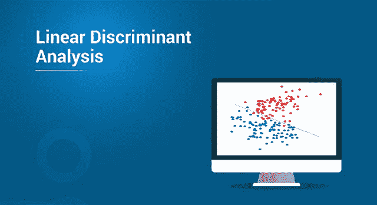
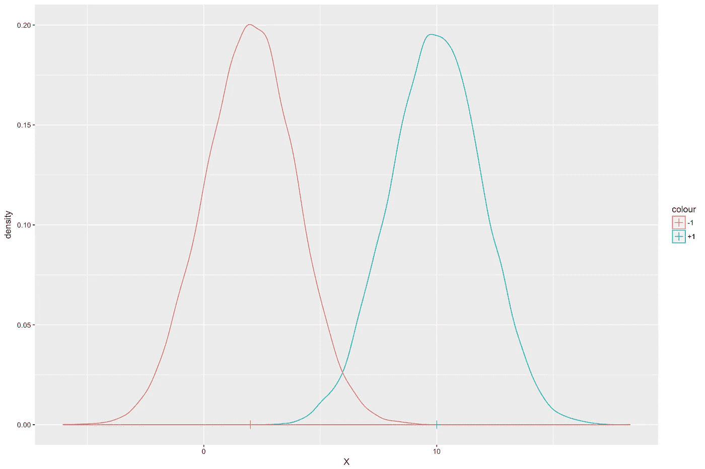
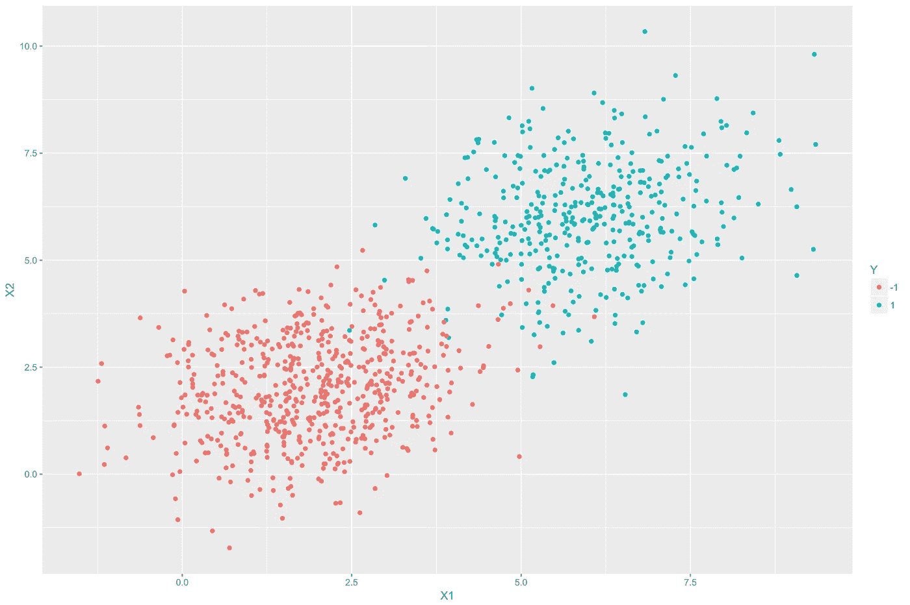
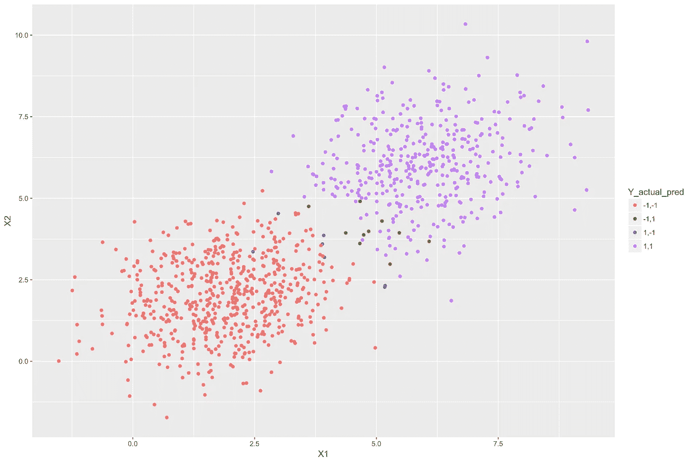

# 如何在 R 中实现线性判别分析？

> 原文：<https://medium.com/edureka/linear-discriminant-analysis-88fa8ad59d0f?source=collection_archive---------2----------------------->



Linear Discriminant Analysis — Edureka

线性判别分析是一种非常流行的用于解决分类问题的机器学习技术。在本文中，我们将尝试理解这种技术背后的直觉和数学。还提供了一个用 R 语言实现 LDA 的例子。

*   线性判别分析假设
*   直觉
*   LDA 的数学描述
*   学习模型参数
*   R 中的示例

那么让我们开始吧

# 线性判别分析假设

线性判别分析基于以下假设:

*   因变量 *Y* 是离散的。在本文中，我们将假设因变量是二元的，并且取类值 *{+1，-1}* 。样本属于类别 *+1* 的概率，即 *P(Y = +1) = p* 。因此，样本属于类别 *-1* 的概率为 *1-p* 。
*   自变量 *X* 来自高斯分布。高斯分布的平均值取决于类别标签 *Y* 。即如果 *Yi = +1* ，那么 *Xi* 的平均值就是 *𝜇+1* ，否则就是 *𝜇-1* 。两个类的方差 *𝜎2* 是相同的。数学上讲， *X|(Y = +1) ~ N(𝜇+1，𝜎2)* 和 *X|(Y = -1) ~ N(𝜇-1，𝜎2)* ，其中 *N* 表示正态分布。

有了这些信息，就有可能为自变量和因变量构建一个联合分布 *P(X，Y)* 。因此，LDA 属于**生成分类器模型**的一类。一个密切相关的生成分类器是二次判别分析(QDA)。它基于 LDA 所有相同的假设，除了类方差不同。

让我们继续用线性判别分析文章看看

# 直觉

考虑给定类别 *Y* 的 *X* 的类别条件高斯分布。下图显示了分布的密度函数。在该图中，如果 *Y = +1* ，则 *X* 的平均值为 10，如果 *Y = -1* ，则平均值为 2。两种情况下的方差都是 2。



现在假设给我们一个新的值 *X* 。我们姑且称之为 *xi* 。任务是确定这个 *xi* 最可能的阶级标签，即*伊*。为简单起见，假设样本属于类别 *+1* 的概率 *p* 与属于类别 *-1* 的概率相同，即 *p=0.5* 。

直觉上讲，如果*比*更靠近*【𝜇+1】*，那么*易= +1* 的可能性更大。更正式的说法是， *yi = +1* if:**

***| 𝜇+1| Xi<| 𝜇-1| Xi***

**通过标准偏差归一化两边:**

***|𝜇+1|/𝜎Xi<|𝜇-1|/𝜎Xi***

**两边成直角:**

***(𝜇+1)2/𝜎2—Xi<)(𝜇-1)2/𝜎2—Xi***

***xi2/𝜎2+𝜇+12/𝜎2–2 xi𝜇+1/𝜎2<xi2/𝜎2+𝜇-12/𝜎2–2 xi𝜇-1/𝜎2***

***2(𝜇-1—𝜇+1)/𝜎2—(𝜇-12/𝜎2—𝜇+12/𝜎2)<0***

***-2(𝜇-1—𝜇+1)/𝜎2)+(𝜇-12/𝜎2—𝜇+12/𝜎2)>0***

**上述表达式的形式为 *bxi + c > 0* 其中 *b = -2(𝜇-1 — 𝜇+1)/𝜎2* 和 *c = (𝜇-12/𝜎2 — 𝜇+12/𝜎2)* 。**

**显而易见，方程的形式是**线性**，因此得名线性判别分析。**

**让我们继续看线性判别分析文章，**

# **LDA 的数学描述**

**LDA 表达式的数学推导基于贝叶斯规则和**贝叶斯最优分类器**等概念。**

**我们将直接针对 *Y* 取两个类 *{+1，-1}* 的具体情况提供表达式。我们还将把上一节展示的直觉扩展到一般情况，其中 *X* 可以是多维的。假设有 *k* 个自变量。在这种情况下，类均值 *𝜇-1* 和 *𝜇+1* 将是维度 *k*1* 的向量，方差-协方差矩阵 *𝜮* 将是维度 *k*k* 的矩阵。**

**分类器函数如下所示**

***Y = h(X) = sign(bTX + c)***

**在哪里，**

***b = -2 𝜮 -1(𝜇-1 — 𝜇+1)***

***c =𝜇-1t𝜮-1𝜇-1—𝜇-1t𝜮-1𝜇-1-2ln {(1-p)/p }***

**sign 函数如果表达式 *bTx + c > 0* 则返回 *+1* ，否则返回 *-1* 。 *c* 中的自然对数项用于调整两个类别的类别概率不需要相等的事实，即 *p* 可以是(0，1)之间的任何值，而不仅仅是 0.5。**

# **学习模型参数**

**给定一个有 *N* 个数据点 *(x1，y1)，(x2，y2)，… (xn，yn)* 的数据集，我们需要估计 *p，𝜇-1，*和 *𝜮* 。一种称为最大似然估计的统计估计技术用于估计这些参数。上述参数的表达式如下所示。**

***𝜇+1= (1/N+1) ** 𝚺 *我:易=+1 xi***

***=(1/n-1)**𝚺*我:易=-1 xi***

***p = N+1/N***

***𝜮=(1/n)**𝚺i*= 1:n(𝜇i)(xi——𝜇i)t——Xi***

**其中 *N+1 =样本数，yi = +1* ，N-1 =样本数，yi = -1 。**

**有了上面的表达式，LDA 模型就完成了。可以使用上述表达式来估计模型参数，并在分类器函数中使用它们来获得自变量 *X* 的任何新输入值的类别标签。**

**让我们继续用线性判别分析文章看看**

# **R 中的示例**

**以下代码生成一个虚拟数据集，其中包含两个独立变量 *X1* 和 *X2* 以及一个因变量 *Y* 。对于 *X1* 和 *X2* ，我们将使用均值 *𝜇-1= (2，2)* 和 *𝜇+1= (6，6)* 从两个多元高斯分布中生成一个样本。40%的样本属于类别 *+1* ，60%属于类别 *-1* ，因此 *p = 0.4* 。**

```
**library(ggplot2)
library(MASS)
library(mvtnorm)
#Variance Covariance matrix for random bivariate gaussian sample
var_covar = matrix(data = c(1.5, 0.3, 0.3, 1.5), nrow=2)
#Random bivariate gaussian samples for class +1
Xplus1 <- rmvnorm(400, mean = c(6, 6), sigma = var_covar)
# Random bivariate gaussian samples for class -1
Xminus1 <- rmvnorm(600, mean = c(2, 2), sigma = var_covar)
#Samples for the dependent variable
Y_samples <- c(rep(1, 400), rep(-1, 600))
#Combining the independent and dependent variables into a dataframe
dataset <- as.data.frame(cbind(rbind(Xplus1, Xminus1), Y_samples))
colnames(dataset) <- c("X1", "X2", "Y")
dataset$Y <- as.character(dataset$Y)
#Plot the above samples and color by class labels
ggplot(data = dataset)+
geom_point(aes(X1, X2, color = Y))**
```

****

**在上图中，蓝点代表 *+1* 类的样品，红点代表 *-1* 类的样品。样本之间有一些重叠，即不能用一条简单的线将类别完全分开。换句话说，它们不是完美的线性可分的。**

**我们现在将使用上述数据训练 LDA 模型。**

```
**#Train the LDA model using the above dataset
lda_model <- lda(Y ~ X1 + X2, data = dataset)
#Print the LDA model
lda_model**
```

****输出:****

```
**Prior probabilities of groups:
-1 1
0.6 0.4
Group means:
X1 X2
-1 1.928108 2.010226
1 5.961004 6.015438
Coefficients of linear discriminants:
LD1
X1 0.5646116
X2 0.5004175**
```

**可以看出，模型学习的类均值对于类 *-1* 为(1.928108，2.010226)，对于类 *+1* 为(5.961004，6.015438)。这些平均值非常接近我们用来生成这些随机样本的类别平均值。组 *+1* 的先验概率是参数 *p* 的估计。 *b* 向量是线性判别系数。**

**我们现在将使用上述模型来预测相同数据的类别标签。**

```
**#Predicting the class for each sample in the above dataset using the LDA model
y_pred <- predict(lda_model, newdata = dataset)$class
#Adding the predictions as another column in the dataframe
dataset$Y_lda_prediction <- as.character(y_pred)
#Plot the above samples and color by actual and predicted class labels
dataset$Y_actual_pred <- paste(dataset$Y, dataset$Y_lda_prediction, sep=",")
ggplot(data = dataset)+
geom_point(aes(X1, X2, color = Y_actual_pred))**
```

****

**在上图中，紫色样本来自被 LDA 模型正确分类的类别 *+1* 。同样，红色样品来自正确分类的类别 *-1* 。蓝色的是来自 *+1* 级，但是被错误地归类为 *-1* 。绿色的是来自 *-1* 级的，被误划为 *+1* 。发生错误分类是因为这些样本比它们的实际类均值更接近另一个类均值(中心)。**

**如果你想查看更多关于 Python、DevOps、Ethical Hacking 等市场最热门技术的文章，你可以参考 Edureka 的官方网站。**

**请留意本系列中的其他文章，它们将解释数据科学的各个方面。**

> ***1。* [*数据科学教程*](/edureka/data-science-tutorial-484da1ff952b)**
> 
> ***2。* [*数据科学的数学与统计*](/edureka/math-and-statistics-for-data-science-1152e30cee73)**
> 
> ***3。*[*R 中的线性回归*](/edureka/linear-regression-in-r-da3e42f16dd3)**
> 
> ***4。* [*机器学习算法*](/edureka/machine-learning-algorithms-29eea8b69a54)**
> 
> ***5。*[*R 中的逻辑回归*](/edureka/logistic-regression-in-r-2d08ac51cd4f)**
> 
> ***6。* [*分类算法*](/edureka/classification-algorithms-ba27044f28f1)**
> 
> ***7。* [*随机森林中的 R*](/edureka/random-forest-classifier-92123fd2b5f9)**
> 
> ***8。* [*决策树中的 R*](/edureka/a-complete-guide-on-decision-tree-algorithm-3245e269ece)**
> 
> ***9。* [*机器学习入门*](/edureka/introduction-to-machine-learning-97973c43e776)**
> 
> ***10。* [*朴素贝叶斯在 R*](/edureka/naive-bayes-in-r-37ca73f3e85c)**
> 
> ***11。* [*统计与概率*](/edureka/statistics-and-probability-cf736d703703)**
> 
> ***12。* [*如何创建一个完美的决策树？*](/edureka/decision-trees-b00348e0ac89)**
> 
> ***13。* [*关于数据科学家角色的十大神话*](/edureka/data-scientists-myths-14acade1f6f7)**
> 
> ***14。* [*顶级数据科学项目*](/edureka/data-science-projects-b32f1328eed8)**
> 
> ***15。* [*数据分析师 vs 数据工程师 vs 数据科学家*](/edureka/data-analyst-vs-data-engineer-vs-data-scientist-27aacdcaffa5)**
> 
> ***16。* [*人工智能的种类*](/edureka/types-of-artificial-intelligence-4c40a35f784)**
> 
> ***17。*[*R vs Python*](/edureka/r-vs-python-48eb86b7b40f)**
> 
> **18。 [*人工智能 vs 机器学习 vs 深度学习*](/edureka/ai-vs-machine-learning-vs-deep-learning-1725e8b30b2e)**
> 
> **19。 [*机器学习项目*](/edureka/machine-learning-projects-cb0130d0606f)**
> 
> ***二十。* [*数据分析师面试问答*](/edureka/data-analyst-interview-questions-867756f37e3d)**
> 
> ***21。* [*面向非程序员的数据科学和机器学习工具*](/edureka/data-science-and-machine-learning-for-non-programmers-c9366f4ac3fb)**
> 
> **22。 [*十大机器学习框架*](/edureka/top-10-machine-learning-frameworks-72459e902ebb)**
> 
> ***23。* [*用于机器学习的统计*](/edureka/statistics-for-machine-learning-c8bc158bb3c8)**
> 
> ***二十四。* [*随机森林中的 R*](/edureka/random-forest-classifier-92123fd2b5f9)**
> 
> ***25。* [*广度优先搜索算法*](/edureka/breadth-first-search-algorithm-17d2c72f0eaa)**
> 
> ***26。* [*监督学习*](/edureka/supervised-learning-5a72987484d0)**
> 
> ***27。* [*机器学习的先决条件*](/edureka/prerequisites-for-machine-learning-68430f467427)**
> 
> ***28。* [*互动 WebApps 使用 R 闪亮*](/edureka/r-shiny-tutorial-47b050927bd2)**
> 
> ***29。* [*机器学习十大书籍*](/edureka/top-10-machine-learning-books-541f011d824e)**
> 
> ***三十。* [*无监督学习*](/edureka/unsupervised-learning-40a82b0bac64)**
> 
> ***31。* [*10 本最好的数据科学书籍*](/edureka/10-best-books-data-science-9161f8e82aca)**
> 
> ***32。* [*机器学习使用 R*](/edureka/machine-learning-with-r-c7d3edf1f7b)**

***原载于 2019 年 7 月 24 日*[*www.edureka.co*](https://www.edureka.co/blog/linear-discriminant-analysis/)*。***