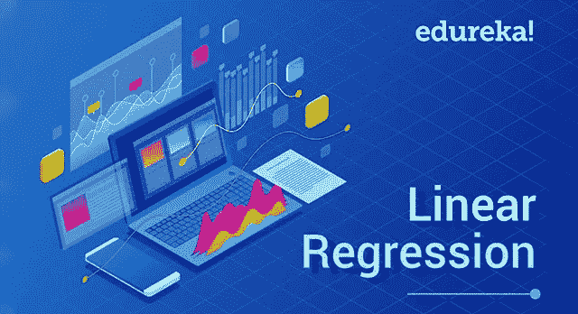
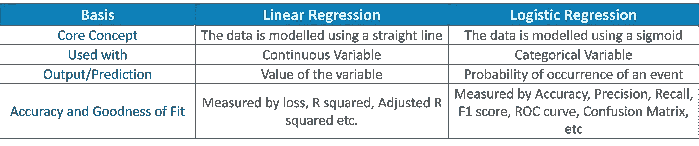
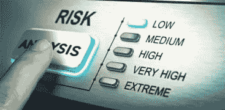
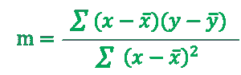
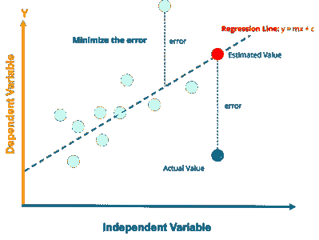
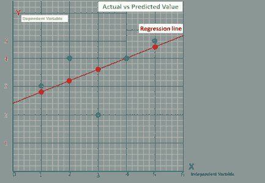
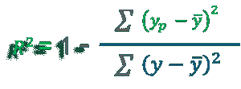

# Python 中从头开始的线性回归算法

> 原文：<https://medium.com/edureka/linear-regression-in-python-e66f869cb6ce?source=collection_archive---------1----------------------->



Linear Regression — Edureka

# **什么是线性回归？**

线性回归是机器学习中最简单的统计模型之一。它用于显示因变量和一个或多个自变量之间的线性关系。


在我们深入探讨线性回归之前，让我先简单介绍一下什么是回归，因为线性回归是一种回归算法

# 什么是回归？

回归分析是预测建模技术的一种形式，它调查因变量**和自变量**之间的关系****

# 回归的类型

*   线性回归
*   逻辑回归
*   多项式回归
*   逐步回归

# 线性回归与逻辑回归



# 线性回归用在哪里？

## 1.评估趋势和销售预测


线性回归可以在商业中用于评估趋势和做出估计或预测。
在创建趋势线之后，公司可以使用该线的斜率来预测未来几个月的销售额。

## 2.分析价格变化的影响


线性回归也可以用来分析定价对消费者行为的影响。

**例如**，如果一家公司多次改变某种产品的价格，它可以记录每个价格水平的销售量，然后以销售量为因变量，价格为解释变量进行线性回归。结果将是一条线，描述随着价格上涨，消费者减少产品消费的程度，这可能有助于指导未来的定价决策。

## **3。评估风险**



线性回归可以用来分析风险。

**例如**

一家健康保险公司可能会进行线性回归，绘制每个客户的索赔数量与年龄的关系图，并发现年龄较大的客户往往会提出更多的健康保险索赔。这种分析的结果可能会指导做出重要的商业决策来考虑风险。

# 线性回归算法是如何工作的？

# 最小二乘法—寻找最佳拟合线

最小二乘法是一种统计方法，通过最小化由数学函数创建的平方的**和**来确定最佳拟合线或回归线。这里的“平方”是指一个数据点与**回归线**之间距离的平方。平方和最小值所在的线是最佳回归直线。

回归线， **y = mx+c** 其中，

y =因变量

x=独立变量；c = y 轴截距



# 最小二乘法—使用 Python 实现

对于实现部分，我将使用由不同人的头部大小和大脑重量组成的数据集。



```
# Importing Necessary Libraries

%matplotlib inline
import numpy as np
import pandas as pd
import matplotlib.pyplot as plt
plt.rcParams['figure.figsize'] = (20.0, 10.0)

# Reading Data
data = pd.read_csv('headbrain.csv')
print(data.shape)
data.head()

# Collecting X and Y
X = data['Head Size(cm^3)'].values
Y = data['Brain Weight(grams)'].values
```

为了找到 m 和 c 的值，首先需要计算 X 和 Y 的平均值

```
# Mean X and Y
mean_x = np.mean(X)
mean_y = np.mean(Y)

# Total number of values
n = len(X)

# Using the formula to calculate m and c
numer = 0
denom = 0
for i in range(n):
numer += (X[i] - mean_x) * (Y[i] - mean_y)
denom += (X[i] - mean_x) ** 2
m = numer / denom
c = mean_y - (m * mean_x)

# Print coefficients
print(m, c)
```

上面 m 和 c 的值将被加到这个等式中

> 大脑重量= c+m÷头部大小

# 绘制线性回归线

现在我们有了直线方程。因此，对于 x 的每个实际值，我们将找到 y 的预测值。一旦我们得到这些点，我们就可以绘制它们，并创建线性回归线。

```
# Plotting Values and Regression Line
max_x = np.max(X) + 100
min_x = np.min(X) - 100
# Calculating line values x and y
x = np.linspace(min_x, max_x, 1000)
y = c + m * x 

# Ploting Line
plt.plot(x, y, color='#52b920', label='Regression Line')
# Ploting Scatter Points
plt.scatter(X, Y, c='#ef4423', label='Scatter Plot')

plt.xlabel('Head Size in cm3')
plt.ylabel('Brain Weight in grams')
plt.legend()
plt.show()
```

# r 平方方法—拟合优度

**R**–**平方**值是显示数据与拟合回归线接近程度的统计度量



y =实际值

y̅= y 的平均值

yp =的预测值

r 平方并不表示回归模型是否合适。对于好的模型，您可以使用低 R 平方值，对于不符合数据的模型，您可以使用高 R 平方值！

```
#ss_t is the total sum of squares and ss_r is the total sum of squares of residuals(relate them to the formula).
ss_t = 0
ss_r = 0
for i in range(m):
y_pred = c + m * X[i]
ss_t += (Y[i] — mean_y) ** 2
ss_r += (Y[i] — y_pred) ** 2
r2 = 1 — (ss_r/ss_t)
print(r2)
```

# 线性回归—使用 scikit learn 实现

如果您已经到了这里，我假设您现在已经很好地理解了使用最小二乘法的线性回归算法。现在是时候告诉你如何使用一个叫做 scikit-learn 的机器学习库来简化事情和实现相同的模型了

```
from sklearn.linear_model import LinearRegression
from sklearn.metrics import mean_squared_error

# Cannot use Rank 1 matrix in scikit learn
X = X.reshape((m, 1))
# Creating Model
reg = LinearRegression()
# Fitting training data
reg = reg.fit(X, Y)
# Y Prediction
Y_pred = reg.predict(X)

# Calculating R2 Score
r2_score = reg.score(X, Y)

print(r2_score)
```

如果你想查看更多关于人工智能、DevOps、道德黑客等市场最热门技术的文章，你可以参考 Edureka 的官方网站。

请留意本系列中的其他文章，它们将解释 Python 和数据科学的各个方面。

> 1. [Python 教程](/edureka/python-tutorial-be1b3d015745)
> 
> 2. [](/edureka/python-functions-f0cabca8c4a) [Python 编程语言](/edureka/python-programming-language-fc1015de7a6f)
> 
> 3. [Python 函数](/edureka/python-functions-f0cabca8c4a)
> 
> 4.[Python 中的文件处理](/edureka/file-handling-in-python-e0a6ff96ede9)
> 
> 5. [](/edureka/scikit-learn-machine-learning-7a2d92e4dd07) [Python Numpy 教程](/edureka/python-numpy-tutorial-89fb8b642c7d)
> 
> 6. [Scikit 学习机](/edureka/scikit-learn-machine-learning-7a2d92e4dd07)
> 
> 7. [Python 熊猫教程](/edureka/python-pandas-tutorial-c5055c61d12e)
> 
> 8. [Matplotlib 教程](/edureka/python-matplotlib-tutorial-15d148a7bfee)
> 
> 9. [Tkinter 教程](/edureka/tkinter-tutorial-f655d3f4c818)
> 
> 10.[请求教程](/edureka/python-requests-tutorial-30edabfa6a1c)
> 
> 11. [PyGame 教程](/edureka/pygame-tutorial-9874f7e5c0b4)
> 
> 12. [OpenCV 教程](/edureka/python-opencv-tutorial-5549bd4940e3)
> 
> 13.[用 Python 进行网页抓取](/edureka/web-scraping-with-python-d9e6506007bf)
> 
> 14. [PyCharm 教程](/edureka/pycharm-tutorial-d0ec9ce6fb60)
> 
> 15. [](/edureka/linear-regression-in-python-e66f869cb6ce) [机器学习教程](/edureka/machine-learning-tutorial-f2883412fba1)
> 
> 16.[面向数据科学的 Python](/edureka/learn-python-for-data-science-1f9f407943d3)
> 
> 17. [Python 正则表达式](/edureka/python-regex-regular-expression-tutorial-f2d17ffcf17e)
> 
> 18.[Python 中的循环](/edureka/loops-in-python-fc5b42e2f313)
> 
> 19. [Python 项目](/edureka/python-projects-1f401a555ca0)
> 
> 20.[机器学习项目](/edureka/machine-learning-projects-cb0130d0606f)
> 
> 21.[Python 中的数组](/edureka/arrays-in-python-14aecabec16e)
> 
> 22.[在 Python 中设置](/edureka/sets-in-python-a16b410becf4)
> 
> 23.[Python 中的多线程](/edureka/what-is-mutithreading-19b6349dde0f)
> 
> 24. [Python 面试问题](/edureka/python-interview-questions-a22257bc309f)
> 
> 25. [Java vs Python](/edureka/java-vs-python-31d7433ed9d)
> 
> 26.[如何成为一名 Python 开发者？](/edureka/how-to-become-a-python-developer-462a0093f246)
> 
> 27. [Python Lambda 函数](/edureka/python-lambda-b84d68d449a0)
> 
> 28.[网飞如何使用 Python？](/edureka/how-netflix-uses-python-1e4deb2f8ca5)
> 
> 29.[Python 中的套接字编程是什么](/edureka/socket-programming-python-bbac2d423bf9)
> 
> 30. [Python 数据库连接](/edureka/python-database-connection-b4f9b301947c)
> 
> 31. [Golang vs Python](/edureka/golang-vs-python-5ac32e1ef2)
> 
> 32. [Python Seaborn 教程](/edureka/python-seaborn-tutorial-646fdddff322)
> 
> 33. [Python 职业机会](/edureka/python-career-opportunities-a2500ce158de)

*原载于 2018 年 9 月 6 日*[*【www.edureka.co】*](https://www.edureka.co/blog/linear-regression-in-python/)*。*