# 使用 R 建立线性回归模型

> 原文：<https://medium.com/edureka/linear-regression-in-r-da3e42f16dd3?source=collection_archive---------2----------------------->


Linear Regression — Edureka

线性回归是最广泛使用的机器学习算法之一，但尽管它很流行，我们很多人都没有彻底了解这种算法的工作和实现。在这篇关于 R 中的线性回归的文章中，您将理解线性回归背后的数学原理，以及它使用 R 语言的实现。

本文将涵盖以下主题:

1.  什么是回归分析？
2.  回归的类型

*   线性回归
*   逻辑回归
*   多项式回归

3.线性回归简介

4.使用 R 建立线性回归模型

# 什么是回归分析？

*回归分析是一种统计、预测建模技术，用于研究因变量与一个或多个自变量之间的关系。*我们试着用一个例子来理解回归分析。

假设您已经得到了一套纽约市的房价数据。该数据集包含诸如大小、位置、房屋中卧室的数量等信息。你在这里的任务是通过研究给你的数据集来预测房子的价格。你会如何处理这样的问题？

嗯，很简单。你要建立因变量和自变量之间的关系模型。

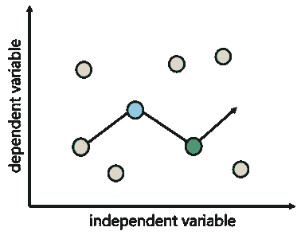

但是什么是因变量和自变量呢？

关于房子的数据，如卧室的数量，房子的大小等等，被称为独立变量或预测变量。这些预测变量用于预测响应变量。

在我们的例子中，响应变量是房子的价格。响应变量也称为因变量，因为它们的值取决于自变量的值。

所以，给定房子的相关数据，我们手头的任务就是预测新房的价格。这类问题可以用一种叫做回归分析的统计方法来解决。

回归分析广泛应用于商业领域，用于销售或市场预测、风险分析、运营效率、发现新趋势等。

# 回归分析的类型

有许多回归分析技术，但最广泛使用的三种回归模型是:

1.  线性回归
2.  逻辑回归
3.  多项式回归

## 什么是线性回归？

线性回归是最基本和最广泛使用的机器学习算法之一。它是一种预测建模技术，用于在给定一个或多个自变量的情况下预测连续的因变量。

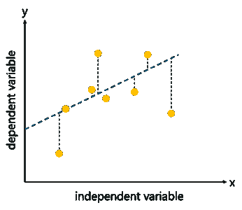

在线性回归模型中，因变量和自变量之间的关系总是线性的，因此，当你试图绘制它们之间的关系时，你会发现更多的是直线而不是曲线。

以下等式用于表示线性回归模型:

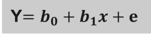

## 什么是逻辑回归？

逻辑回归是一种用于解决分类问题的机器学习算法。它被称为“逻辑回归”，因为它的基本技术与线性回归非常相似。

逻辑回归是一种预测分析技术，用于在给定一组自变量的情况下预测因变量，使得因变量是分类变量。

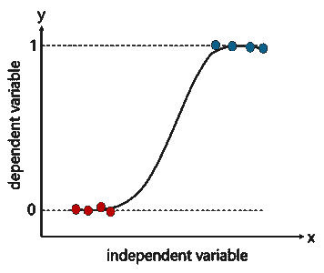

当我说分类变量时，我的意思是，它包含 1 或 0，是或否，真或假等值。

以下等式用于表示逻辑回归模型中因变量和自变量之间的关系:

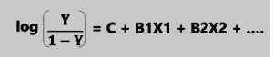

## 什么是多项式回归？

多项式回归是一种用于处理非线性数据的方法。非线性可分数据基本上是当你不能画出一条直线来研究因变量和自变量之间的关系时。

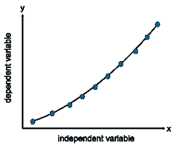

因此，在该算法中，最佳拟合线不是直线，而是拟合到数据点的曲线。之所以称之为“多项式”回归，是因为一些自变量的幂大于 1。

以下等式用于表示多项式回归模型:

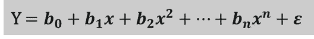

# ­­­­­

现在你对回归分析的基础有了很好的理解，让我们把重点放在线性回归上。

# 线性回归简介

线性回归是一种监督学习算法，用于根据自变量(X)的值预测*连续因变量(Y)* 。这里要注意的重要一点是，线性回归模型的因变量总是连续的，然而，自变量可以是连续的也可以是离散的。

现在你可能会问，什么是连续变量？

连续变量有无限多种可能性。比如一个人的体重。有人可能重 160 磅，他们可能重 160.11 磅，或者他们可能重 160.1134 磅。重量的可能性是无限的。这就是连续变量。

我用一个例子来解释一下线性回归。

让我们假设你想预测一段时间内股票的价格。对于这类问题，可以通过*研究因变量股票价格和自变量时间*之间的关系，利用线性回归。

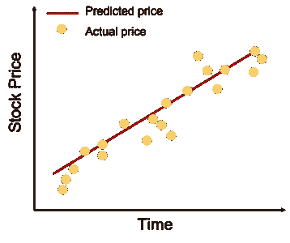

在我们的例子中，股票价格是因变量，因为股票价格随时间而变化。请注意，股票的价值总是一个连续的量。

另一方面，时间是独立变量，可以是连续的，也可以是离散的。这个自变量用来决定因变量的值。

线性回归的第一步是通过使用最佳拟合直线来绘制因变量和自变量之间的关系。

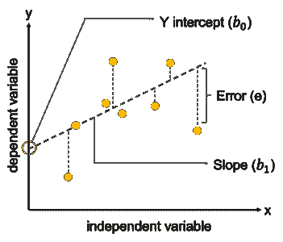

我们称之为“线性”回归，因为两个变量都是线性变化的。这意味着，在绘制两个变量之间的关系时，我们将得到更多的直线而不是曲线。

现在让我们讨论线性回归背后的数学。

下面的等式用于得出自变量(X)和因变量(Y)之间的关系。我们都知道数学中线性直线的方程是 y=mx + c，所以线性回归方程用同一个方程表示:

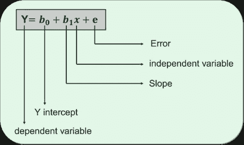

*   y 代表需要预测的因变量。
*   B0 是 Y 轴截距，基本上是直线上与 Y 轴相交的点。
*   B1 是直线的斜率(斜率可以是负的，也可以是正的，取决于因变量和自变量之间的关系。)
*   这里的 x 代表独立变量，用于预测我们的合成因变量。
*   e 表示计算中的误差

既然您对线性回归有了很好的理解，让我们开始实现吧。

# 使用 R 建立线性回归模型

很多人心里都有这个问题，**线性回归中的 R 代表什么？**

答案是，R 基本上是一种用于数据分析、数据操作和数据可视化的开源编程和统计语言。它是一种多用途编程语言，广泛用于机器学习、人工智能和数据科学领域。

## **数据集描述:**

为了理解线性回归模型是如何工作的，我们将使用一个简单的数据集，其中包含 30 个不同年龄的人的收缩压水平。

## **问题陈述:**

建立一个线性回归模型，通过与相应年龄建立具有统计显著性的线性关系，可用于预测一个人的血压。我们将创建一个线性回归模型来研究血压水平和相应年龄之间的关系。

让我们来看看数据集的前 5–6 个观察结果:

```
head(trainingSet)
  age y
1 39 144
2 47 220
3 45 138
4 47 145
5 65 162
6 46 142
```

建立回归模型的第一步是以图形方式理解我们的数据。我们需要通过可视化数据来理解自变量和因变量之间的关系。我们可以利用各种图，如箱线图、散点图等:

## 散点图

散点图是一种图形表示，用于通过 x 轴和 y 轴绘制数据点。散点图的主要目的是表示因变量和自变量之间的关系或它们之间的相关性。

```
scatter.smooth(x=trainingSet$age, y=trainingSet$y, main="Blood pressure ~ Age") # scatterplot
```

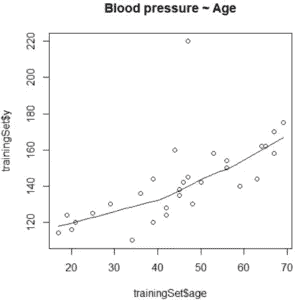

在上图中，散点图显示了“年龄”和“血压”变量之间的线性正相关关系。

*这表明响应(因变量)和预测(自变量)变量之间的关系是线性的*，这是线性回归模型的基础之一。

## 箱形图

箱线图主要用于解释性数据分析。箱线图代表数据的分布及其可变性。箱形图包含上四分位数和下四分位数，因此箱形图基本上跨越了四分位数之间的范围(IQR)。

使用箱线图的主要原因之一是为了检测数据中的异常值。由于箱形图跨越了 IQR，因此它会检测位于此范围之外的数据点。这些数据点被称为异常值。

```
# Divide the graph area in 2 columns
par(mfrow = c(1, 2))
# Boxplot for X
boxplot(trainingSet$age, main='age', sub=paste('Outliers: ', boxplot.stats(trainingSet$x)$out))
# Boxplot for Y
boxplot(trainingSet$y, main='blood pressure', sub=paste('Outliers: ', boxplot.stats(trainingSet$y)$out))
```

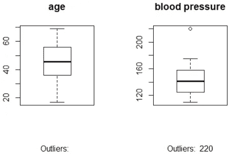

## 相互关系

线性回归中的下一个重要度量是相关性。

相关性是显示两个或多个变量一起变化的程度的统计度量。有两种类型的相关性:

1.  正相关范围在 0 到+1 之间。它表明因变量和自变量相互对应地增加或减少。所以基本上，强正相关意味着，随着一个人年龄的增长，血压也会随之增长。这种关系的相关性将更接近于 1。
2.  负相关范围在-1 和 0 之间。它显示了一个变量随着另一个变量的减少而增加的程度。强烈的负相关性表明，随着一个人年龄的增加，血压降低，反之亦然，在这种情况下，年龄和血压之间的相关性将更接近于-1。

如果因变量和自变量之间的相关值更接近于零，则表明它们之间的关系较弱。相关性的值非常重要，因为它表明因变量是否真的根据自变量而变化。

在(-0.2 至 0.2)范围内的相关性表明反应变量和预测变量之间的关系较弱，因此表明因变量相对于自变量基本上没有变化。在这种情况下，寻找更好的预测变量被认为是明智的。

```
# Finding correlation
cor(trainingSet$age, trainingSet$y)
[1] 0.6575673
```

在研究了因变量和自变量之间的关系并计算了相关性之后，现在是建立线性回归模型的时候了。

# 构建回归模型

## R 中的 lm()函数是什么？

r 带有一个预定义的函数，用于构建线性回归模型。这个函数称为 lm()函数。lm()函数的语法如下:

*lm(公式，数据)*

让我们理解这两个参数:

*   **公式:**公式是 x 和 y 之间关系的表示
*   **数据:**数据是应用公式的数据帧

```
# Fitting Simple Linear regression
regressor = lm(formula = y ~ age, data = trainingSet)
print(regressor)

Call:
lm(formula = y ~ age, data = trainingSet)

Coefficients:
(Intercept)    age
98.7147     0.9709
```

上图显示了我们的线性回归模型以及系数。系数部分有两个参数:

1.  拦截
2.  年龄

这些系数也称为β系数，用于计算响应变量(血压)的值。

这里使用的公式是:

*血压=截距+ (b1 *年龄)*

# 线性回归分析

到目前为止，我们建立了线性回归模型，还计算出了在给定年龄的情况下计算血压所需的公式。那么，接下来呢？

我们的下一步是检查我们的模型的效率。我们需要认识到这个模型在统计上是否足够强大，足以做出预测。

为了确保模型是高效的，我们来看看模型的总结:

```
summary(regressor)

Call:
lm(formula = y ~ age, data = trainingSet)

Residuals:
Min 1Q Median 3Q Max
-21.724 -6.994 -0.520 2.931 75.654

Coefficients:
            Estimate Std. Error t value Pr(>|t|)
(Intercept) 98.7147    10.0005   9.871  1.28e-10 ***
age         0.9709     0.2102    4.618  7.87e-05 ***
---
Signif. codes: 0 ‘***’ 0.001 ‘**’ 0.01 ‘*’ 0.05 ‘.’ 0.1 ‘ ’ 1

Residual standard error: 17.31 on 28 degrees of freedom
Multiple R-squared: 0.4324, Adjusted R-squared: 0.4121
F-statistic: 21.33 on 1 and 28 DF, p-value: 7.867e-05
```

上面的总结告诉我们一些事情:

*   **调用:**是对线性回归模型的函数调用
*   **残差:**该度量用于通过计算实际值和预测值之间的差异来检查模型的效率。理想情况下，残差的和大约为零或尽可能低。然而，在现实世界的问题中，情况并非如此，残差总是预期的
*   **系数:**表示贝塔系数及其统计显著性。

*密切注意系数的 p 值，(1.28e-10 和 7.87e-05)*

简单来说，p 值表示你的回归模型有多强。在确保模型的显著性时，p 值是一个非常重要的度量。只有当两个 p 值都小于预定的统计显著性水平(理想情况下为 0.05)时，线性模型才具有统计显著性。每个系数的 p 值被表示为概率 *Pr( > |t|)。*

在我们讨论 *Pr( > |t|)，*之前，让我们讨论一下与 p 值相关的另一个重要概念，这就是无效和交替假设

# 零假设和交替假设

*   零假设表明与因变量相关的系数等于零，这意味着因变量和自变量之间没有任何关系。
*   另一方面，替代假设指出系数不等于零，这意味着自变量和因变量之间存在关系。

在模型总结中，请注意另一个重要参数，称为 t 值。较大的 *t 值*表明替代假设为真，系数不等于零纯属偶然。

*Pr( > |t|)* 基本上是零假设成立时，得到的 t 值高于观察值的概率。*简而言之，如果 Pr( > |t|)的值低于 0.05，则系数在线性回归模型的计算中是必需的，但是如果 Pr( > |t|)高，则系数不是必需的。*

在我们的例子中，

*   截距的 p 值为 1.28e-10，远低于 0.05。
*   年龄的 p 值为 7.87e-05 **，**，也远低于标准统计水平。

变量的 p 值越小，预测响应变量的值就越重要。对应于 p 值的星号表示相应变量的显著性。由于在我们的模型中，两个 p 值都有一个 3 星，这表明这两个变量在预测因变量(Y)时都非常重要。

# R 平方和调整的 R 平方

r 平方是一种统计方法，表示预测变量(X)解释响应变量(Y)变化的程度。例如，如果 R-square 为 0.7，这表明响应变量中 70%的变化是由预测变量解释的。因此，R 的平方越高，预测变量就越重要。

一般只有一个预测变量时用 R-square，但如果有多个预测变量呢？

R 平方的问题是，它要么保持不变，要么随着更多变量的增加而增加，即使它们与输出变量没有任何关联。

这就是 ***调整后的 R 方形*** 的用武之地。调整的 R-square 限制您添加不会提高回归模型性能的变量。因此，如果您使用多个预测变量构建回归模型，建议您测量调整后的 R 平方，以检测模型的有效性。

## 剩余标准误差

如前所述，残差用于通过计算实际值和预测值之间的差异来检查模型的效率，当残差标准误差(RSE)计算为零时(这在现实世界的问题中不太可能)，则模型完全符合数据。RSE 主要用于检查模型的准确性，RSE 越低，模型的预测就越准确。

## f 统计量

F 统计量是一种统计度量，用于判断是否至少有一个自变量具有非零系数。高 F 统计值导致统计学上可接受的 p 值(即 p < 0.05)。

在我们的例子中，F 统计值为 21.33，这导致 p 值为 7.867e-05，这是非常显著的。

在选择有效的线性回归模型时，我上面讨论的统计方法非常重要。只有当模型在统计上显著时，它才能用于预测因变量。

## 预测线性模型

现在有趣的部分来了。在检查了我们的模型的有效性之后，现在让我们在一个单独的测试数据集上测试我们的模型。

因此，我已经创建了一个单独的测试数据框，我将使用这个数据集来测试模型。

**步骤 1:** 导入测试数据集

```
# Importing test data
testSet = read.csv('/Users/zulaikha/Desktop/test.csv')
```

**第二步:**使用您之前建立的线性回归模型，预测测试数据的响应变量(血压)

```
# Predicting the test results
regressor = lm(formula = y ~ age, data = trainingSet)
y_pred = predict(regressor, newdata = testSet)
```

**第三步:**评估总结模型

```
summary(regressor)

Call:
lm(formula = y ~ age, data = trainingSet)

Residuals:
Min 1Q Median 3Q Max
-21.724 -6.994 -0.520 2.931 75.654

Coefficients:
            Estimate Std. Error t value Pr(>|t|)
(Intercept) 98.7147   10.0005    9.871   1.28e-10 ***
age         0.9709    0.2102     4.618   7.87e-05 ***
---
Signif. codes: 0 ‘***’ 0.001 ‘**’ 0.01 ‘*’ 0.05 ‘.’ 0.1 ‘ ’ 1

Residual standard error: 17.31 on 28 degrees of freedom
Multiple R-squared: 0.4324, Adjusted R-squared: 0.4121
F-statistic: 21.33 on 1 and 28 DF, p-value: 7.867e-05
```

在上图中，模型 p 值和自变量 p 值小于预先确定的标准显著性水平(0.05)。因此，我们可以得出结论，我们的模型是有统计学意义的。

请注意 R-Sq 和 Adj R-Sq，它们与根据训练数据创建的原始模型比较相似。

**第四步:**计算预测精度

可以通过比较实际值和预测值来测试准确性。

```
#Finding accuracy
actuals_preds <- data.frame(cbind(actuals=testSet$y, predicted=y_pred))
correlation_accuracy <- cor(actuals_preds)
head(actuals_preds)
actuals predicted
1  144   136.5787
2  220   144.3456
3  138   142.4039
4  145   144.3456
5  162   161.8213
6  142   143.3748
```

在上面的输出中，您可以看到预测值和实际值相差不远。为了提高准确性，我们可以在更大的数据集上训练模型，并尝试使用其他预测变量。

所以，这就是从零开始在 R 中构建线性回归模型的全部内容。

至此，我们结束了 R 文章中的线性回归。我希望你发现这篇文章信息丰富。

这让我想到了这篇文章的结尾。如果你想查看更多关于 Python、DevOps、Ethical Hacking 等市场最热门技术的文章，那么你可以参考 [Edureka 的官方网站。](https://www.edureka.co/blog/?utm_source=medium&utm_medium=content-link&utm_campaign=linear-regression-in-r)

请留意本系列中的其他文章，它们将解释数据科学的各个方面。

> *1。* [*数据科学教程*](/edureka/data-science-tutorial-484da1ff952b)
> 
> *2。* [*数据科学的数学与统计*](/edureka/math-and-statistics-for-data-science-1152e30cee73)
> 
> *3。*[*R 中的机器学习*](/edureka/machine-learning-with-r-c7d3edf1f7b)
> 
> *4。* [*机器学习算法*](/edureka/machine-learning-algorithms-29eea8b69a54)
> 
> *5。*[*R 中的逻辑回归*](/edureka/logistic-regression-in-r-2d08ac51cd4f)
> 
> *6。* [*分类算法*](/edureka/classification-algorithms-ba27044f28f1)
> 
> *7。* [*随机森林中的 R*](/edureka/random-forest-classifier-92123fd2b5f9)
> 
> *8。* [*决策树中的 R*](/edureka/a-complete-guide-on-decision-tree-algorithm-3245e269ece)
> 
> *9。* [*机器学习入门*](/edureka/introduction-to-machine-learning-97973c43e776)
> 
> 10。 [*朴素贝叶斯在 R*](/edureka/naive-bayes-in-r-37ca73f3e85c)
> 
> *11。* [*统计与概率*](/edureka/statistics-and-probability-cf736d703703)
> 
> *12。* [*如何创建一个完美的决策树？*](/edureka/decision-trees-b00348e0ac89)
> 
> 13。 [*关于数据科学家角色的 10 大误区*](/edureka/data-scientists-myths-14acade1f6f7)
> 
> *14。* [*顶级数据科学项目*](/edureka/data-science-projects-b32f1328eed8)
> 
> 15。 [*数据分析师 vs 数据工程师 vs 数据科学家*](/edureka/data-analyst-vs-data-engineer-vs-data-scientist-27aacdcaffa5)
> 
> *16。* [*人工智能的种类*](/edureka/types-of-artificial-intelligence-4c40a35f784)
> 
> *17。*[*R vs Python*](/edureka/r-vs-python-48eb86b7b40f)
> 
> *18。* [*人工智能 vs 机器学习 vs 深度学习*](/edureka/ai-vs-machine-learning-vs-deep-learning-1725e8b30b2e)
> 
> *19。* [*机器学习项目*](/edureka/machine-learning-projects-cb0130d0606f)
> 
> *20。* [*数据分析师面试问答*](/edureka/data-analyst-interview-questions-867756f37e3d)
> 
> *21。* [*面向非程序员的数据科学和机器学习工具*](/edureka/data-science-and-machine-learning-for-non-programmers-c9366f4ac3fb)
> 
> *22。* [*十大机器学习框架*](/edureka/top-10-machine-learning-frameworks-72459e902ebb)
> 
> *23。* [*用于机器学习的统计*](/edureka/statistics-for-machine-learning-c8bc158bb3c8)
> 
> *24。* [*随机森林中的 R*](/edureka/random-forest-classifier-92123fd2b5f9)
> 
> *25。* [*广度优先搜索算法*](/edureka/breadth-first-search-algorithm-17d2c72f0eaa)
> 
> *26。*[*R 中的线性判别分析*](/edureka/linear-discriminant-analysis-88fa8ad59d0f)
> 
> 27。 [*机器学习的先决条件*](/edureka/prerequisites-for-machine-learning-68430f467427)
> 
> 28。 [*互动 WebApps 使用 R 闪亮*](/edureka/r-shiny-tutorial-47b050927bd2)
> 
> *29。* [*十大机器学习书籍*](/edureka/top-10-machine-learning-books-541f011d824e)
> 
> 三十岁。 [*无监督学习*](/edureka/unsupervised-learning-40a82b0bac64)
> 
> *三十一。* [*10 本数据科学最佳书籍*](/edureka/10-best-books-data-science-9161f8e82aca)
> 
> 32。 [*监督学习*](/edureka/supervised-learning-5a72987484d0)

*原载于 2019 年 1 月 28 日 www.edureka.co*[](https://www.edureka.co/blog/linear-regression-in-r)**。**