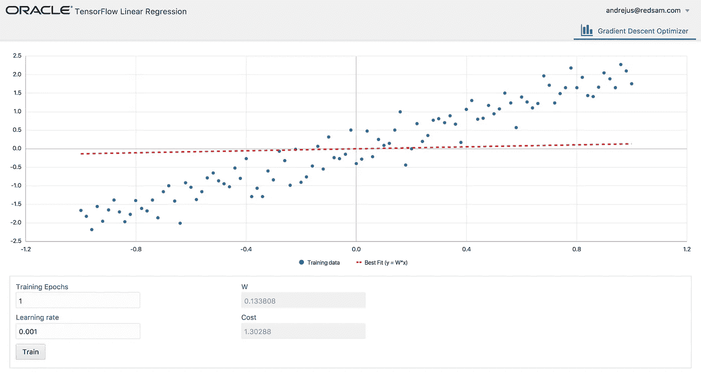
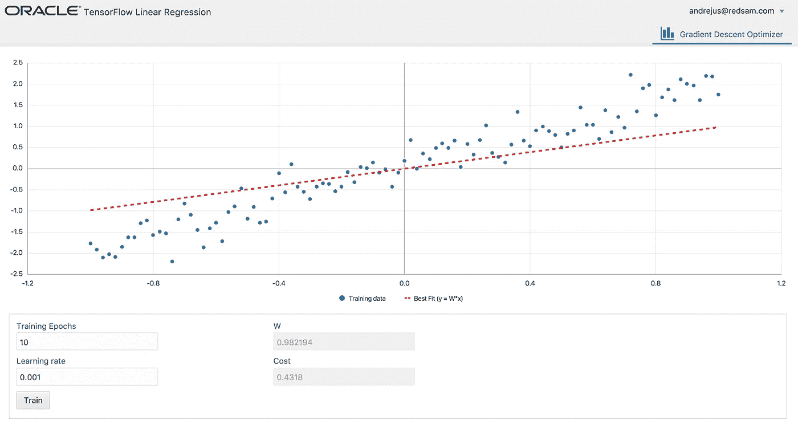
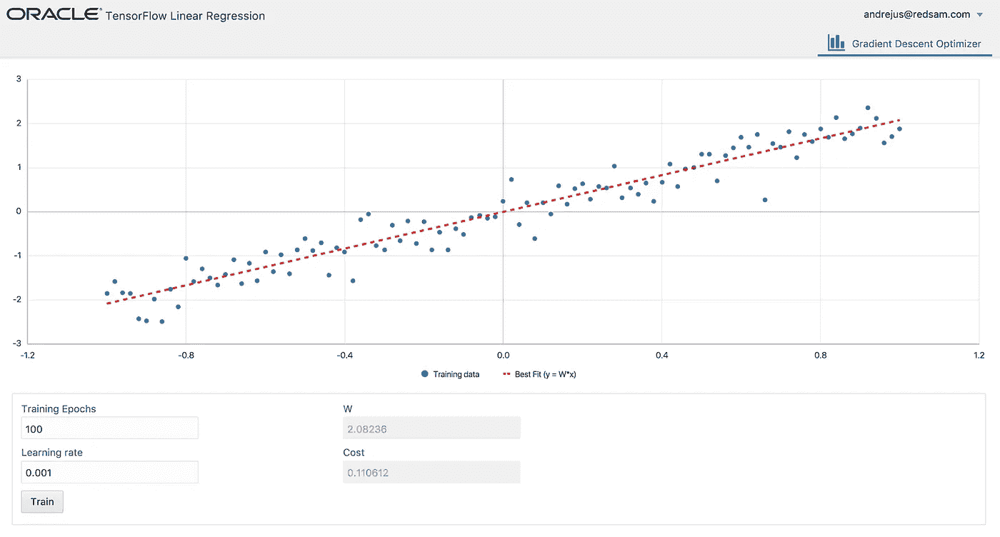
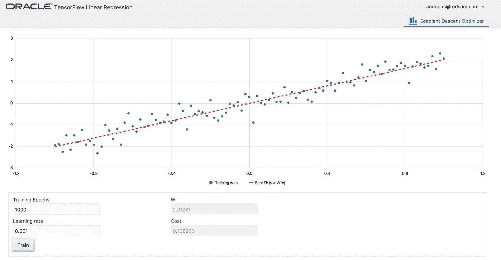
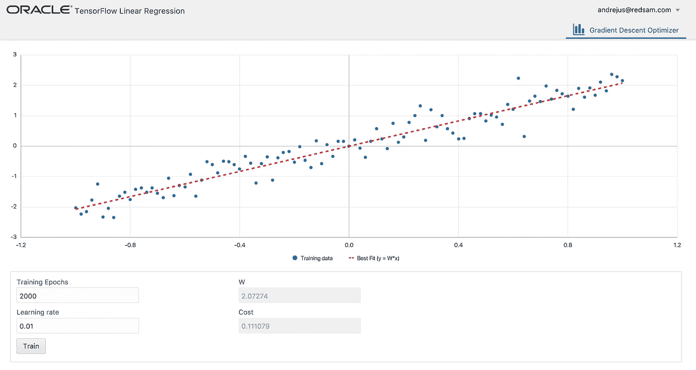
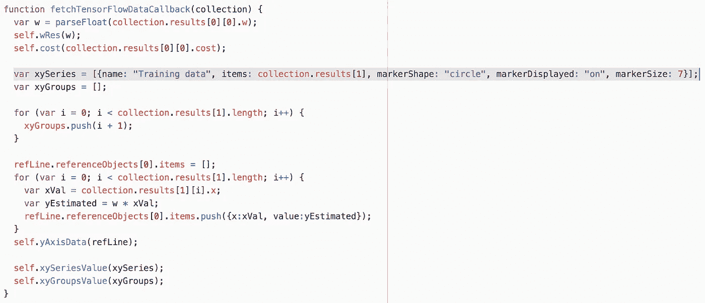
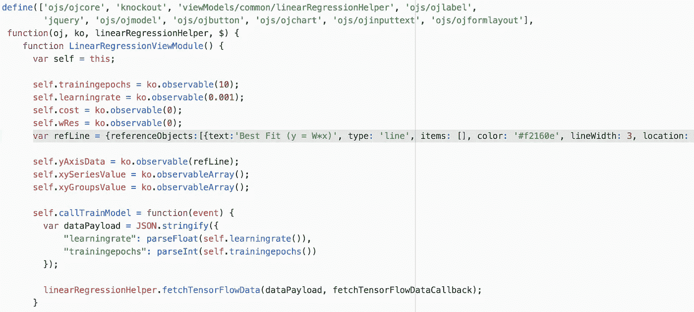
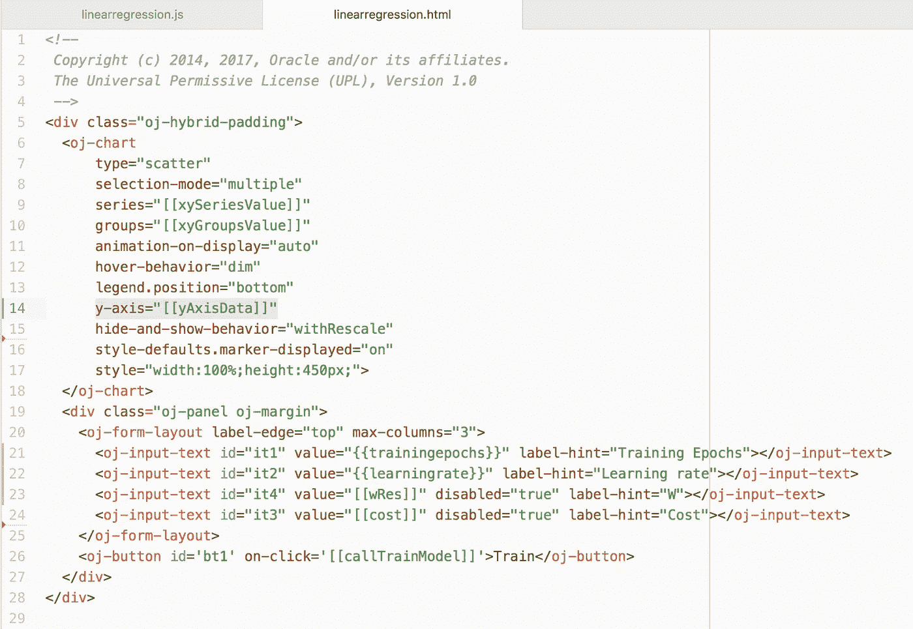

# 线性回归-解释了使用 TensorFlow 和 Oracle JET UI 的机器学习

> 原文：<https://medium.com/oracledevs/linear-regression-machine-learning-with-tensorflow-and-oracle-jet-ui-explained-ed06d6bab108?source=collection_archive---------6----------------------->

机器学习话题这几天绝对是热门。一些人对它有错误的假设——他们认为机器可以通过自身和它的魔法学习。事实是——没有魔法，只有数学。机器将学习为学习过程定义数学模型的方式。在我看来，最好的解决方案是机器学习数学和算法的结合。在这里，我可以联系聊天机器人保持对话上下文——语言处理可以通过神经网络的机器学习来完成，而意图和上下文处理可以通过可编程算法来执行。

如果你开始学习机器学习，首先有两个基本概念:

1.  回归

2.分类

这篇文章的重点是回归，在接下来的文章中，我将谈论分类。

回归是一种计算曲线最佳拟合来汇总数据的方法。选择哪种类型的曲线取决于你，你应该根据给定的数据集假设哪种类型最合适(这也可以通过试错法来实现)。回归的目标是通过发现可能产生数据点的曲线来理解数据点。

在这个例子中，我将使用最简单的回归方法——线性回归。直线由方程 *y = W*x + b* 描述。其中 b 是可选的，可以是 0(线将穿过(0，0)点)。对于复杂的数据集，我们可以使用多项式方程并生成曲线。

下面是使用 TensorFlow API 实现线性回归的 Python 代码(我已经为所有步骤提供了注释，阅读代码应该是不言自明的):

任何机器学习的关键要素——成本。成本越高，学习产出越差。在线性回归中，成本通常由误差的总和来定义。预测 *x* 的误差通过实际值 *f(x)* 与预测值 *M(w，x)* 的平方差来计算。成本是实际值和预测值之差的平方和。

正如您在上面的代码中看到的，我们定义了成本函数，并要求 TensorFlow 运行 optimizer 来找到模型参数的最佳值。所有困难的数学计算都发生在 TensorFlow 中，我们的工作是准备训练数据，并用正确的方程选择正确的学习方法。

让我们运行 JET UI，它通过 REST 与 TensorFlow 对话。训练数据是在每次训练期间随机生成的(总是 100 分)。

*训练时期* —训练期间的学习迭代次数*学习速率* —学习速度，较小的速率——更仔细的学习
*W* —用于计算公式 y = W*x
*成本*的学习模型参数——显示学习成功程度的值，成本越低越好

**1。我们从 1 个训练历元开始，学习率 0.001:**

学习结果不好-红线是线性回归的结果，它不代表最适合训练数据。成本也相当高，这表明学习并不成功。

**2。10 个训练周期，学习率 0.001:**

当我们在同一个培训课程中重复多次学习迭代时，学习效果会更好。成本变得更小，线性回归计算线拟合得更好，但仍不理想。

**3。100 次训练，学习率 0.001:**

它有助于增加学习迭代次数，成本显著降低，直线拟合更好。这意味着 W 参数学习的结果非常好。

**4。1000 次训练，学习率 0.001**

让我们让模型学得更努力，重复更多次——成本变得更好。

**5。2000 训练次数和学习率 0.001**

我们可以进一步增加学习迭代次数，但在某些时候这将无济于事。学习过程将开始遭受过度拟合。你可以考虑一下——学习和重复这么多次，到最后你开始忘记事情。进一步重复学习迭代，成本越来越差。

**6。2000 训练次数和学习率 0.0001**

它应该有助于使学习速度更小，从而导致更仔细的学习。这应该允许用更高数量的学习迭代来获得更好的学习结果。我们在这里得到最好的学习成本结果和最优线。你可能会问——那句台词有什么用？它有助于预测训练数据集中没有的 *y* 值。

**7。2000 训练次数和学习率 0.01**

相反，如果我们提高学习率，学习过程将更快，优化器将运行得更快。这将导致模型输出质量下降，成本更高，并且 W 参数值将不会产生与先前训练运行中一样的最佳拟合线。

与 Oracle JET UI 相关的一些提示。您可以使用 JET 图表组件实现非常好的数据可视化。例如，我可以控制为训练数据点渲染的标记类型:

代表学习结果线可以显示为参考线:

为了显示参考线，我使用 JET 图表附带的 *y 轴*属性:

参考资料:

*   使用 Python 和 TensorFlow 进行线性回归的示例— [要点](https://gist.github.com/abaranovskis-redsamurai/c7690d2732e531086c79716d0ba17720)
*   JET UI 示例— [GitHub](https://github.com/abaranovskis-redsamurai/linearregressionuiv2)
*   通过 REST 访问 TensorFlow 模型— [使用 Oracle JET 和 TensorFlow 进行机器学习](http://andrejusb.blogspot.lt/2017/12/machine-learning-with-oracle-jet-and.html)
*   本书— [用 TensorFlow 进行机器学习](https://www.manning.com/books/machine-learning-with-tensorflow?a_aid=TensorFlow&a_bid=042443a4)

*原载于 2018 年 1 月 16 日*[*andrejusb.blogspot.com*](https://andrejusb.blogspot.lt/2018/01/linear-regression-machine-learning-with.html)*。*