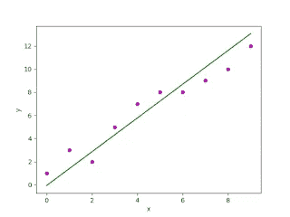
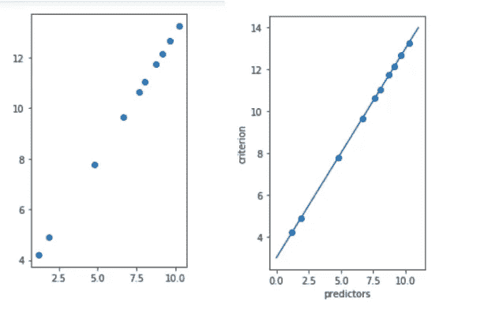

# 使用 Python 进行线性回归

> 原文：<https://medium.com/quick-code/linear-regression-using-python-4b8a5fbf56b9?source=collection_archive---------8----------------------->

这篇博客是关于我学到的第一个机器学习算法，线性回归及其实现**。**我不打算深入这个算法的数学实现。

所以让我们开始吧..

**什么是回归？**

当问题有连续和真实的输出而不是离散的输出时，使用回归技术。为了前任。“最近十天的温度”、“12 个月的加薪”等。

**什么是线性回归？**

线性回归是任何想入门机器学习的程序员的第一步。该算法是一种线性统计方法，用于对因变量和一个或多个自变量之间的关系进行建模。



Fig. A sample linear regression output.

我们在这里的任务是找到一条[最适合](https://en.wikipedia.org/wiki/Goodness_of_fit)图中所有点的线，它可以几乎预测任何以前不存在的新特征的值。

**线性回归的类型**

最常见的线性回归技术类型是[简单线性回归](https://en.wikipedia.org/wiki/Simple_linear_regression)和[多元线性回归](https://en.wikiversity.org/wiki/Multiple_linear_regression)。

在简单线性回归中，一个特征用于预测输出，而在多元线性回归中，多个特征用于预测值。

**这是如何工作的？**

在这两种类型中，主要目标是形成线性图，在简单 LR 中使用一个特征(X ),而在多个 LR 中联合使用多个特征(X)来预测一个特征。

绘制散点图后，我们找到一条最佳拟合线，该线距离所有点的距离最小。每个点和线之间的累积距离使用任何距离公式计算，如欧几里德或曼哈顿距离公式。然后使用训练数据，我们发现值中的错误。这是我们希望最小化的误差，以拟合相应的最佳拟合线。

**使用 scikit-learn 实现**

```
*#importing libraries
import numpy as np
import matplotlib.pyplot as plt
from sklearn.linear_model import LinearRegression*x = 11 * np.random.random((10,1))
y = a * x + b
y = 1.0 * x + 3.0# create a linear regression modelmodel = LinearRegression()
model.fit(x,y)# predict y from the data where the x is predicted from the xx_pred = np.linspace(0, 11, 100)
y_pred = model.predict(x_pred[:, np.newaxis]) # plot the resultsplt.figure(figsize =(3, 5))
ax = plt.axes()
ax.scatter(x,y)
ax.plot(x_pred, y_pred)
ax.set_xlabel('predictors')
ax.set_ylabel('criterion')
ax.axis('tight')
plt.show()
```



Fig. Output of the above implementation.