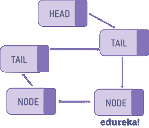
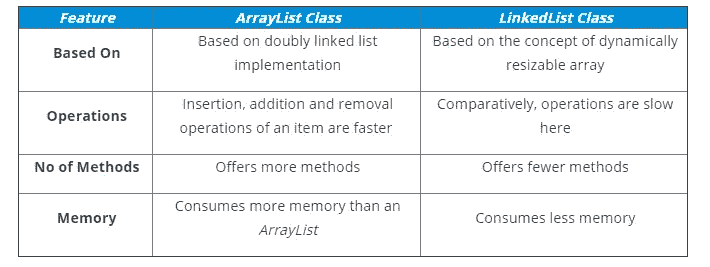

# Java 中的链表:如何用 Java 实现一个链表？

> 原文：<https://medium.com/edureka/linked-list-in-java-546730687354?source=collection_archive---------2----------------------->


在链中的下一个节点之后。在本文中，让我们看看如何使用 Java 的内置数组，第二种最流行的数据结构是链表。链表是一种线性数据结构，由一系列节点组成，其中每个节点都包含一个值和一个指针 *LinkedList* 类，用于在 Java 中实现链表。

下面列出了本文涉及的主题:

1)什么是链表？

Java 中的链表

*   Java LinkedList 类
*   链接的列表类功能
*   LinkedList 类声明
*   LinkedList 的构造函数

3)如何实现 LinkedList 类？

*   演示 LinkedList 类的基本方法的 Java 程序
*   将链表转换为数组的程序
*   将数组转换成链表的程序

4)数组列表与链接列表

**什么是链表？**

链表是一个由多个节点组成的线性数据结构，其中每个元素存储自己的数据和指向下一个元素位置的指针。链表中的最后一个链接指向 null，表示链的结束。链表中的一个元素叫做**节点**。第一个节点称为**头**。最后一个节点称为**尾**。

这里有一个简单的例子:想象一个链表，就像一串连接在一起的回形针。您可以轻松地在顶部或底部添加另一个回形针。中间插一个甚至很快。你所要做的就是从中间断开链条，装上新的回形针，然后重新连接另一半。链表也是类似的。

**链表的类型**

单向链表(单向)


双向链表(双向)


循环链表



现在，让我们看看如何在 Java 中实现链表概念。

# Java 中的链表

Java 作为一种编程语言，通过类和对象等概念关注代码的可重用性。简单地说，类是对象的蓝图或模板。虽然您可以为链表实现构建自己的定制类，但 Java 确实提供了一个方便的内置 *LinkedList* 类来用 Java 实现链表。

## Java 中的 LinkedList 类

在 Java 中， *LinkedList 类*是 List 和 Deque 接口的双向链表实现。它还实现所有可选的列表操作，并允许所有元素(包括 null)。

## **LinkedList 类特性**

下面是 LinkedList 类最重要的属性:

*   实现队列和队列接口。因此，它也可以用作队列、出队或堆栈
*   它可以包含所有元素，包括重复元素和空元素
*   LinkedList 保持元素的插入顺序
*   Java LinkedList 类是不同步的，这意味着在多线程环境中，您必须从外部同步对链表的并发修改
*   我们可以使用*collections . synchronized list(new linked list())*来获得同步链表
*   *LinkedList 类*没有实现 *RandomAccess* 接口，所以，我们只能按顺序访问元素
*   我们可以使用 *ListIterator* 来迭代列表中的元素

**LinkedList 类声明**

LinkedList 是一个泛型类，它具有以下声明:

```
public class LinkedList<E>;
extends AbstractSequentialList<E>;
implements List<E>, Deque<E>, Cloneable, Serializable
```

这里，E 指定了列表包含的对象的类型。

## LinkedList 类的构造函数

LinkedList 有两个构造函数，如下所示:

1.  **LinkedList( )** —构建一个空链表
2.  **LinkedList(集合 c)** —构建一个用集合 c 的元素初始化的链表

# 如何实现 LinkedList 类？

借助多个示例 Java 程序，让我们试着理解如何用 Java 实现 LinkedList 类。我在这些示例程序中使用了很多方法。

**示例 1:** 创建一个 LinkedList 并演示 LinkedList 类中基本方法的用法

以下示例显示了:

1.  使用 linked list 类创建一个链表
2.  以多种方式向列表中添加元素
3.  使用 get()和 set()访问链表的元素
4.  如何移除链表中的元素

```
**package** MyPackage;**import** java.util.LinkedList;**import** java.util.ListIterator;**public** **class** linkedlist {**public** **static** **void** main(String args[]) {/* Linked List Declaration */LinkedList<String> l_list = **new** LinkedList<String>();/*add(String Item) is used for adding* the Items to the linked list*/l_list.add("Java");l_list.add("Python");l_list.add("Scala");l_list.add("Swift");System.out.println("Linked List Content: " +l_list);/*Add Items at specified position*/l_list.add(2, "JavaScript");l_list.add(3, "Kotlin");System.out.println("l_list Content after editing: " +l_list);/*Add First and Last Item*/l_list.addFirst("First Course");l_list.addLast("Last Course");System.out.println("l_list Content after addition: " +l_list);/*Get and set Items in the list*/Object firstvar = l_list.get(0);System.out.println("First Item: " +firstvar);l_list.set(0, "Java9");System.out.println("l_list Content after updating first Item: " +l_list);/* Remove from a position*/l_list.remove(1);l_list.remove(2);System.out.println("LinkedList after deletion of Item in 2nd and 3rd position " +l_list);/*Remove first and last Item*/l_list.removeFirst();l_list.removeLast();System.out.println("Final Content after removing first and last Item: "+l_list);/*Iterating the linked list*/ListIterator<String> itrator = l_list.listIterator();System.out.println("List displayed using iterator:");**while** (itrator.hasNext()) {System.out.println(itrator.next());}}}
```

输出:

```
Linked List Content = { Java, Python, Scala, Swift}Content after editing =  { Java, Python, JavaScript, Kotlin, Scala, Swift }Content after addition = { First Course, Java, Python, JavaScript, Kotlin, Scala, Swift, Last Course }First Item = { First Course }Content after updating first item = { Java9, Java, Python, JavaScript, Kotlin, Scala, Swift, Last Course }Content after deletion of item in 2nd and 3rd position = { Java9, Python, Kotlin, Scala, Swift, Last Course }Final Content after removing first and last Item = { Python, Kotlin, Scala, Swift }List displayed using iterator =PythonKotlinScalaSwift
```

在处理链表时，您可以使用多种内置方法。如您所见，上面的程序演示了许多基本方法的使用，我在下面指定了这些方法的功能:

*   **add(E e)** —该方法将元素一个接一个地添加到链表中
*   **add (int index，E element)** —此方法在列表中的指定位置添加指定的元素
*   **addFirst(E e)** —此方法将指定的元素添加到列表的开头
*   **addLast (E e)** —此方法将指定的元素添加到列表的末尾
*   **get (int index):** 该方法返回列表中指定位置的元素
*   **set (int index，E element):** 该方法用指定的元素替换列表中指定位置的元素
*   **remove (int index):** 该方法删除列表中指定位置的元素
*   **removeFirst ():** 该方法移除并返回列表中的第一个元素
*   **removeLast ():** 该方法移除并返回列表中的最后一个元素

除此之外，在使用 *LinkedList 类*时，还有很多其他方法可以使用。再来探索几个。

**例 2:** 一个将链表转换成数组的 Java 程序

下面的示例演示如何查找链接列表的大小并将链接列表转换为数组。

```
**package** MyPackage;**import** java.util.Arrays;**import** java.util.LinkedList;**import** java.util.List;**public** **class** linkedlisttoarray{**public** **static** **void** main(String[] args){List<String> courseList = **new** LinkedList<>();courseList.add("Java");courseList.add("Python");courseList.add("DevOps");courseList.add("Hadoop");courseList.add("AWS");**int** size = courseList.size();System.out.println("Size of linked list = " + size);String[] numbers = **new** String[size];numbers = courseList.toArray(numbers);System.out.println("Elements of array are:");System.out.println(Arrays.toString(numbers));}}
```

输出:

```
Size of linked list = 5Elements of array are:[Java, Python, DevOps, Hadoop, AWS]
```

在上面的例子中，我使用了 Java 的 LinkedList 类的两个重要方法。下面列出了这些方法及其功能:

*   **size ():** 这个方法返回列表中元素的个数。
*   **toArray ():** 该方法返回一个数组，该数组包含列表中所有元素的正确顺序

**例 2** :一个将数组转换成链表的 Java 程序

下面的示例演示如何将数组转换为链表

```
**package** MyPackage;**import** java.util.LinkedList;**import** java.util.List;**public** **class** ArrayToLinkedList {**public** **static** **void** main(String[] args){String[] courses = {"Java","PHP","Hadoop","DevOps","Python"};List<String> coursesList = **new** LinkedList<>();**for**(String s : courses){coursesList.add(s);}System.out.println("The array of popular courses is: " + coursesList);}}
```

输出:

```
The array of popular courses is: [Java, PHP, Hadoop, DevOps, Python]
```

嗯，在上面的例子中，我使用了 for loop 和 add()方法将一个数组转换为一个链表。这样，在 Java 中使用 linked list 类处理链表时，我们可以使用很多方法。要了解可以使用的其他方法，请参考 Oracle 关于 Java 中 LinkedList 类的官方文档。

# 数组列表与链接列表

程序员经常混淆 ArrayList 属性和 LinkedList 属性。虽然它们都实现了 *List* 接口，但是它们有不同的语义，这肯定会影响使用哪一个的决定。

下面列出了 ArrayList 和 LinkedList 之间的一些差异:



那都是乡亲们！这就把我们带到了这篇关于 Java 中的链表的文章的结尾。我希望我们在这里讨论的 *Java LinkedList 类*示例能够帮助您开始使用 Java 进行 LinkedList 编程。
如果你想查看更多关于人工智能、DevOps、道德黑客等市场最热门技术的文章，你可以参考 [Edureka 的官方网站。](https://www.edureka.co/blog/?utm_source=medium&utm_medium=content-link&utm_campaign=linked-list-in-java)

请留意本系列中的其他文章，它们将解释 Java 的各个方面。

> *1。* [*面向对象编程*](/edureka/object-oriented-programming-b29cfd50eca0)
> 
> *2。* [*继承 Java 中的*](/edureka/inheritance-in-java-f638d3ed559e)
> 
> *3。*[*Java 中的多态性*](/edureka/polymorphism-in-java-9559e3641b9b)
> 
> *4。*[*Java 中的抽象*](/edureka/java-abstraction-d2d790c09037)
> 
> *5。* [*Java 字符串*](/edureka/java-string-68e5d0ca331f)
> 
> *6。* [*Java 数组*](/edureka/java-array-tutorial-50299ef85e5)
> 
> 7 .*。* [*Java 收藏*](/edureka/java-collections-6d50b013aef8)
> 
> *8。* [*Java 线程*](/edureka/java-thread-bfb08e4eb691)
> 
> *9。*[*Java servlet 简介*](/edureka/java-servlets-62f583d69c7e)
> 
> *10。* [*Servlet 和 JSP 教程*](/edureka/servlet-and-jsp-tutorial-ef2e2ab9ee2a)
> 
> 11。[*Java 中的异常处理*](/edureka/java-exception-handling-7bd07435508c)
> 
> *12。* [*Java 教程*](/edureka/java-tutorial-bbdd28a2acd7)
> 
> *13。* [*Java 面试题*](/edureka/java-interview-questions-1d59b9c53973)
> 
> *14。* [*Java 程序*](/edureka/java-programs-1e3220df2e76)
> 
> *15。* [*科特林 vs Java*](/edureka/kotlin-vs-java-4f8653f38c04)
> 
> *16。* [*依赖注入使用 Spring Boot*](/edureka/what-is-dependency-injection-5006b53af782)
> 
> *17。* [*堪比 Java 中的*](/edureka/comparable-in-java-e9cfa7be7ff7)
> 
> *18。* [*十大 Java 框架*](/edureka/java-frameworks-5d52f3211f39)
> 
> *19。* [*Java 反射 API*](/edureka/java-reflection-api-d38f3f5513fc)
> 
> *20。*[*Java 中的 30 大模式*](/edureka/pattern-programs-in-java-f33186c711c8)
> 
> *21。* [*核心 Java 备忘单*](/edureka/java-cheat-sheet-3ad4d174012c)
> 
> *22。*[*Java 中的套接字编程*](/edureka/socket-programming-in-java-f09b82facd0)
> 
> *23。* [*Java OOP 备忘单*](/edureka/java-oop-cheat-sheet-9c6ebb5e1175)
> 
> *24。*[*Java 中的注释*](/edureka/annotations-in-java-9847d531d2bb)
> 
> *25。*[*Java 中的库管理系统项目*](/edureka/library-management-system-project-in-java-b003acba7f17)
> 
> *26。* [*爪哇树木*](/edureka/java-binary-tree-caede8dfada5)
> 
> 27。[*Java 中的机器学习*](/edureka/machine-learning-in-java-db872998f368)
> 
> 28。 [*顶级数据结构&Java 中的算法*](/edureka/data-structures-algorithms-in-java-d27e915db1c5)
> 
> *29。* [*Java 开发者技能*](/edureka/java-developer-skills-83983e3d3b92)
> 
> 三十岁。 [*前 55 名 Servlet 面试问题*](/edureka/servlet-interview-questions-266b8fbb4b2d)
> 
> *三十一。*[](/edureka/java-exception-handling-7bd07435508c)*[*顶级 Java 项目*](/edureka/java-projects-db51097281e3)*
> 
> **32。* [*Java 字符串备忘单*](/edureka/java-string-cheat-sheet-9a91a6b46540)*
> 
> **33。*[*Java 中的嵌套类*](/edureka/nested-classes-java-f1987805e7e3)*
> 
> *34。 [*Java 集合面试问答*](/edureka/java-collections-interview-questions-162c5d7ef078)*
> 
> **35。*[*Java 中如何处理死锁？*](/edureka/deadlock-in-java-5d1e4f0338d5)*
> 
> **36。* [*你需要知道的 50 个 Java 合集面试问题*](/edureka/java-collections-interview-questions-6d20f552773e)*
> 
> **37。*[*Java 中的字符串池是什么概念？*](/edureka/java-string-pool-5b5b3b327bdf)*
> 
> **38。*[*C、C++和 Java 有什么区别？*](/edureka/difference-between-c-cpp-and-java-625c4e91fb95)*
> 
> **39。*[*Java 中的回文——如何检查一个数字或字符串？*](/edureka/palindrome-in-java-5d116eb8755a)*
> 
> **40。* [*你需要知道的顶级 MVC 面试问答*](/edureka/mvc-interview-questions-cd568f6d7c2e)*
> 
> **41。*[*Java 编程语言的十大应用*](/edureka/applications-of-java-11e64f9588b0)*
> 
> **42。*[*Java 中的死锁*](/edureka/deadlock-in-java-5d1e4f0338d5)*
> 
> **43。*[*Java 中的平方和平方根*](/edureka/java-sqrt-method-59354a700571)*
> 
> *44。[*Java 中的类型转换*](/edureka/type-casting-in-java-ac4cd7e0bbe1)*
> 
> **45。*[*Java 中的运算符及其类型*](/edureka/operators-in-java-fd05a7445c0a)*
> 
> **46。*[*Java 中的析构函数*](/edureka/destructor-in-java-21cc46ed48fc)*
> 
> *47。 [*爪哇的二分搜索法*](/edureka/binary-search-in-java-cf40e927a8d3)*
> 
> *48。[*Java 中的 MVC 架构*](/edureka/mvc-architecture-in-java-a85952ae2684)*
> 
> *49。 [*冬眠面试问答*](/edureka/hibernate-interview-questions-78b45ec5cce8)*

**原载于 2019 年 6 月 27 日 https://www.edureka.co*[](https://www.edureka.co/blog/linked-list-in-java/)**。***