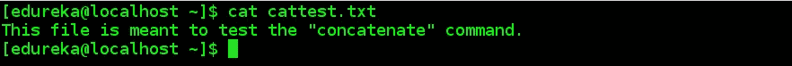
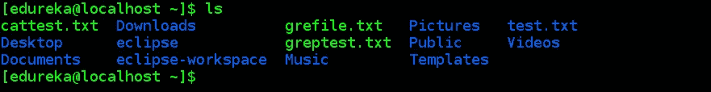
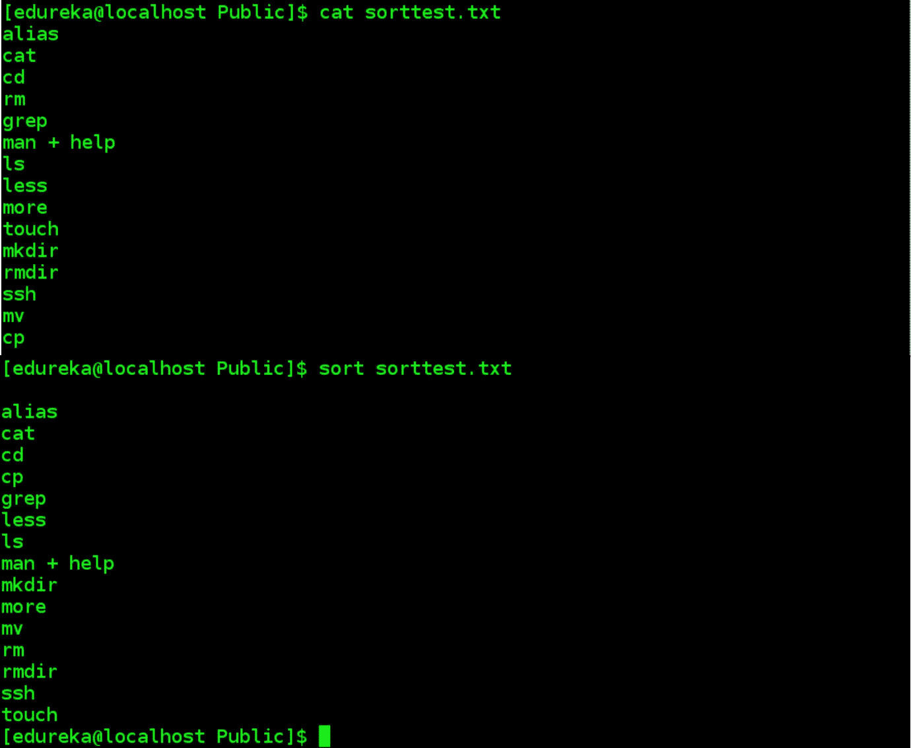

# 你在生活中会用到的 20 个 Linux 命令

> 原文：<https://medium.com/edureka/linux-commands-895d69fa4f07?source=collection_archive---------0----------------------->

Linux Commands — Edureka

Linux 用户和管理员不能仅仅依靠 GUI 生活。通过学习如何使用您的工具，您可以充分利用 Linux。因此，我们将一系列有用的 ***Linux 命令*** 汇集到这个方便的指南中，无论您选择学习哪种 ***Linux 课程*** ，它都会有所帮助。

因此，我将这些命令分为以下几个部分:

*   *Linux 基本命令*
*   *处理文件的命令*
*   *使用目录的命令*
*   *使用用户权限的命令*
*   *处理压缩文件的命令*
*   *使用安全外壳进行远程机器访问*

Linux 提供了一个 **CLI** (命令行界面)来与操作系统通信。以下是最基本的 Linux 命令。

## 1.显示当前工作目录

该命令显示终端的当前工作目录。

***语法:***

`$ pwd`

## 2.回声

该命令将其参数写入标准输出。

***语法:***

`*$ echo "<text>"*`

该命令用于切换到 root 用户，以便可以使用超级用户权限来执行命令。

## 3.苏联（USSR 的缩写）

该命令用于切换到另一个用户，该用户的名称作为参数传递。

***语法:***

`*$ su*`

## 4.苏<username></username>

该命令用于切换到另一个用户，该用户的名称作为参数传递。

***语法:***

`*$ su <username>*`

## 5.须藤

该命令仅执行具有 root/超级用户权限的命令。

***语法:***

`*$ sudo <command>*`

## 6.清楚的

该命令用于清除终端屏幕。在这种情况下，内容实际上不会被删除，只是向下滚动。也可以通过按键盘上的 ***Ctrl+L*** 来清空屏幕。

***语法:***

`*$ clear*`

# Linux 命令:使用文件

## 7.丙酸纤维素

这个命令复制文件和目录。复制的文件/目录的副本仍保留在工作目录中。

***语法:***

`*$ cp <flag> {filename} /pathname/*`

## 8.平均变化

该命令将文件和目录从一个目录移动到另一个目录。文件/目录一旦移动，就会从工作目录中删除。

***语法:***

`*$ mv <flag> {filename} /pathname/*`

## 9.空间

此命令从目录中删除文件。默认情况下，rm 命令不会删除目录。一旦删除，文件的内容就无法恢复。

***语法:***

`*$ rm <flag> {filename}*`

## 10.可做文件内的字符串查找

该命令用于在文本文件中搜索特定的字符串/单词。这类似于“Ctrl+F ”,但通过 CLI 执行。

***语法:***

`*$ grep <flag or element_to_search> {filename}*`

## 11.猫

该命令可以读取、修改或连接文本文件。它还显示文件内容。

***语法:***

`*$ cat <flag> {filename}*`

# Linux 命令:使用目录

## 12.限位开关（Limit Switch）

这个命令列出了当前工作目录中的所有内容。

***语法:***

`*$ ls <flag>*`

## 13.激光唱片

该命令用于改变用户的当前工作目录。

***语法:***

`*$ cd /pathname/*`

## 14.分类

此命令按字母顺序或数字顺序对搜索结果进行排序。使用此命令可以对文件、文件内容和目录进行排序。

***语法:***

`*$ sort <flag> {filename}*`

## 15.mkdir

该命令用于创建新目录。

## 16.删除目录

此命令用于删除指定的目录。虽然默认情况下，它只能删除空目录，但也可以部署一些标志来删除非空目录。

***语法:***

`*$ rmdir <flag> {directoryname}*`

# Linux 命令:使用用户权限

## 17.chmod

此命令用于更改文件和目录的访问权限。考虑下面的例子。

在试图运行新创建的名为 ***chmodtest.sh*** 的文件时，抛出一个错误。在使用上述 Linux 命令修改了文件的权限之后，它变成了可执行文件。

***语法:***

`*$ chmod <permissions of user,group,others> {filename}*`

与每个数字相关联的权限如下。

# Linux 命令:安装软件包

大多数软件的稳定版本已经可以在 Linux 仓库中获得。下面是安装它们的 Linux 命令。

## 18.安装软件包

对于基于 RHEL 的系统；

***语法:***

`*$ sudo yum install package-name*`

对于基于 Debian 的系统；

***语法:***

`*$ sudo apt-get install package-name*`

对于基于 Fedora 的系统；

***语法:***

`*$ sudo dnf install package-name*`

# Linux 命令:使用压缩文件

当您从 internet 下载软件包时，下载的文件以压缩形式出现。这里有几个在 Linux 中解压和压缩文件的命令。

## 19.水手

以下命令用于压缩 ***的文件。tar*** 格式。

***语法:***

`*$ tar –cvf tar-filename source-folder-name*`

以下命令用于解压**和*的文件。tar*** 格式。

***语法:***

`*$ tar –xvf tar-file-name*`

# Linux 命令:使用安全 Shell 进行远程机器访问

## 20.嘘

此命令指的是在不安全的网络上安全操作网络服务的加密网络协议。典型的用例包括远程命令行执行，但是任何网络服务都可以用 SSH 来保护。

以下命令在从节点上运行时，将远程访问主节点。

***语法:***

`*$ ssh <master's ip>*`

在主节点上运行的以下命令将提供对从节点的远程访问。

**语法:**

`*$ ssh <slave's ip>*`

所以，你有它。您在日常 IT 生活中肯定会用到的所有 Linux 命令。到此，我们结束这篇文章。如果你希望查看更多关于人工智能、DevOps、道德黑客等市场最热门技术的文章，那么你可以参考 [Edureka 的官方网站。](https://www.edureka.co/blog/?utm_source=medium&utm_medium=content-link&utm_campaign=linux-commands)

请留意本系列中的其他文章，它们将解释操作系统的各个方面。

> *1。* [*Top 75+ Unix 面试问答*](/edureka/unix-interview-questions-dba26b8a13bc)
> 
> *2。* [*Linux 造币厂*](/edureka/linux-mint-904d4de15c58)
> 
> *3。*[*Unix vs Linux*](/edureka/unix-vs-linux-ee3298dd5e1a)

*原载于 2019 年 4 月 30 日*[*https://www.edureka.co*](https://www.edureka.co/blog/linux-commands/)*。*