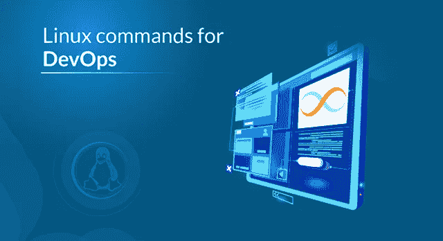
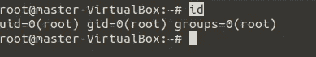
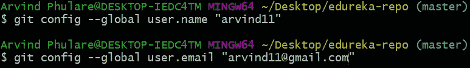
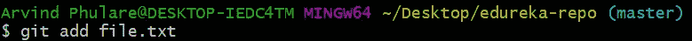

# DevOps 中使用的前 30 个 Linux 命令

> 原文：<https://medium.com/edureka/linux-commands-in-devops-73b5a2bcd007?source=collection_archive---------0----------------------->



Linux Commands in DevOps — Edureka

Linux 基础和脚本是 DevOps 专业人员最基本的技能之一。大多数公司都在 Linux 上运行他们的环境，许多配置管理工具，如 Puppet、Chef 和 Ansible 都在 Linux 上运行它们的主节点。因此，在这篇博客中，我将涵盖整个命令行部分，这是 DevOps 的重要组成部分。我们将在这里讨论的主题如下-

所以让我们开始吧，

1.  什么是 Linux？
2.  Linux 为什么受欢迎？
3.  DevOps 中的 Linux 命令。
4.  外壳脚本
5.  Git 命令

# 什么是 Linux？


Linux 是一个开源的、由社区开发的操作系统，适用于计算机、服务器、大型机、移动设备和嵌入式设备。它支持几乎每一个主要的计算机平台，包括 x86，ARM 等，使其成为最广泛支持的操作系统之一。

Linux 的设计类似于 UNIX，但它已经发展到可以在从电话到超级计算机的各种硬件上运行。每个基于 Linux 的操作系统都包含 Linux 内核——它管理硬件资源——和一组软件包，它们构成了操作系统的其余部分。

# Linux 为什么受欢迎？

Linux 在许多重要方面都不同于其他操作系统。其中一些如下

1.免费的——首先，也许是最重要的，Linux 是免费的。不像 windows，你不必花任何钱去下载和使用它。

2.**开源** — Linux 是开源软件。用于创建 Linux 的代码是免费的，公众可以查看、编辑，并且——对于拥有适当技能的用户——可以做出贡献。

3.**安全**——一旦你在系统上安装了 Linux，就没有必要使用杀毒软件了！Linux 是一个高度安全的系统。此外，全球发展界一直在寻找增强其安全性的方法。每一次升级都让操作系统变得更加安全和健壮。

4.**稳定性和性能** — Linux 提供了非常高的稳定性，即在短时间内不需要重启。你的 Linux 系统很少变慢或者死机。您可以在 Linux 系统上不受任何干扰地工作。Linux 在各种网络和工作站上提供了非常高的性能。

# DevOps 中的 Linux 命令

在本节中，我们将了解在 DevOps 中工作时最常用的 Linux 命令。

## **ls**

这个命令列出了当前工作目录中的所有内容。

***语法:***

```
*$ ls <flag>*
```


## **须藤**

该命令仅执行具有 root/超级用户权限的命令。

***语法:***

```
*$ sudo <command>*
```


## **猫**

该命令可以读取、修改或连接文本文件。它还显示文件内容。

***语法:***

```
*$ cat <flag> {filename}*
```


## grep 考试

该命令在文本文件中搜索特定的字符串/单词。这类似于“Ctrl+F ”,但通过 CLI 执行。

***语法:***

```
*$ grep <flag or element_to_search> {filename}*
```


## **排序**

此命令按字母顺序或数字顺序对搜索结果进行排序。它还对文件、文件内容和目录进行排序。

***语法:***

```
*$ sort <flag> {filename}*
```


## **尾巴**

它是头部命令的补充。tail 命令，顾名思义，打印给定输入的最后 N 个数据。默认情况下，它打印指定文件的最后 10 行。如果您给出了多个文件名，那么每个文件中的数据都以其文件名开头。

***语法:***

```
*tail [OPTION]... [FILE]...*
```

**tail -n 3 state.txt 或 tail -3 state.txt = > -n 表示行数**

tail +25 state.txt

**-c num:** 打印指定文件的最后“num”字节。

## 乔恩

操作系统中的不同用户拥有所有权和权限来确保文件的安全，并限制谁可以修改文件的内容。在 Linux 中，有不同的用户使用该系统:

*   每个*用户*都有一些与之相关的属性，比如用户 ID 和主目录。我们可以将用户添加到一个组中，使管理用户的过程更加容易。
*   一个*组*可以有零个或多个用户。指定的用户与“默认组”相关联。它也可以是系统中其他组的成员。

所有权和权限:为了保护 Linux 中的文件和目录，我们使用权限来控制用户可以对文件或目录做什么。Linux 使用三种类型的权限:

*   **Read:** 该权限允许用户读取文件和目录，它允许用户读取存储在其中的目录和子目录。
*   **写:**该权限允许用户修改和删除文件。此外，它允许用户修改目录的内容(创建、删除和重命名其中的文件)。除非您授予目录的执行权限，否则更改不会影响它们。
*   **执行:**文件的写权限执行文件。例如，如果我们有一个名为 *sh* 的文件，那么除非我们给它执行权限，否则它不会运行。

## **文件权限类型:**

*   **用户:**这种类型的文件权限影响文件的所有者。
*   **组:**这种类型的文件权限影响拥有该文件的组。如果所有者用户在该组中，将应用用户权限，而不是组权限。
*   **其他:这种**类型的文件权限影响系统上的所有其他用户。

**注意:**要查看我们使用的权限:

```
*ls -l*
```

**chown** 命令用来改变文件的所有者或组。每当你想改变所有权，你可以使用 chown 命令。

**语法:**

```
*chown [OPTION]… [OWNER][:[GROUP]] FILE…**chown [OPTION]… –reference=RFILE FILE…*
```

**示例:**更改文件的所有者:

```
*chown owner_name file_name**chown master file1.txt*
```

其中*主*是系统中的另一用户。假设您是名为 user1 的用户，并且想要将所有权更改为 root(其中您的当前目录是 user1)。在语法前使用“sudo”。

```
*sudo chown root file1.txt*
```

## **chmod**

此命令用于更改文件和目录的访问权限。

***语法:***

```
*chmod <permissions of user,group,others> {filename}*
```

4 —读取权限

2 —写权限

1 —执行权限

0 —无权限


## **lsof**

在 Linux/Unix 系统中工作时，可能有几个文件和文件夹正在被使用，其中一些是可见的，一些是不可见的。 **lsof** 命令代表**打开文件列表**。该命令提供了打开的文件列表。基本上，它给出了找出哪个进程打开了哪些文件的信息。它一口气列出了输出控制台中所有打开的文件。

***语法:***

```
*$lsof [option][user name]*
```

## **带示例的选项:**

*   列出所有打开的文件:该命令列出系统中任何进程打开的所有文件。

```
*~$ lsof*
```

*   在这里，您可以看到已打开文件的详细信息。ProcessId、与进程相关联的用户、FD(文件描述符)、文件大小一起给出了关于由命令打开的文件的详细信息、进程 Id、用户、其大小等。
*   **FD:** 表示为文件描述符。
*   **cwd** :当前工作目录。
*   **txt:** 文本文件。
*   **mem** :内存文件。
*   **mmap** :内存映射设备。

**列出一个用户打开的所有文件:**一个系统有多个用户，每个用户有不同的需求，因此他们使用文件和设备。要查找特定用户打开的文件列表，此命令非常有用。

***语法:***

```
*lsof -u username*
```

除此之外，我们还可以在这里看到文件的类型，它们是:

*   **目录:**目录
*   **REG:** 常规文件
*   **CHR:** 字符特殊文件


## **ifconfig**

**ifconfig** (接口配置)命令用于配置驻留内核的网络接口。它在引导时用于根据需要设置接口。之后，通常在调试过程中需要的时候或者需要系统调优的时候使用。此外，此命令用于为接口分配 IP 地址和网络掩码，或者启用或禁用给定的接口。

***语法:***

```
*ifconfig [...OPTIONS] [INTERFACE]*
```

**选项:**

*   **-a :** 该选项用于显示所有可用的接口，即使它们已关闭。

**语法:**

```
*ifconfig -a*
```

**-s :** 显示简短列表，而非详细信息。

***语法:***

```
*ifconfig -s*
```

## **id**

Linux 中的 id 命令用于找出服务器中当前用户或任何其他用户的用户名和组名以及数字 ID(UID 或组 ID)。该命令对于查找下列信息非常有用:

*   用户名和真实用户 id。
*   找出特定用户的 UID。
*   显示与用户关联的 UID 和所有组。
*   列出用户所属的所有组。
*   显示当前用户的安全上下文。

***语法:***

```
*id [OPTION]… [USER]*
```

**选项:**

*   ***-g*** :只打印有效的组 id。
*   ***-G*** :打印所有组 ID。
*   ***-n*** :打印名称而不是数字。
*   ***-r*** :打印真实 ID 而不是数字。
*   ***-u*** :仅打印有效的用户 ID。
*   ***–帮助*** :显示帮助信息并退出。
*   ***–版本*** :显示版本信息并退出。

**注意:**没有任何选项，它打印每组识别信息，即数字 id。

## **例子:**

*   **打印自己的 id，没有任何选项:**

```
*id*
```

输出显示了当前用户 UID 和 GID 的 ID。



*   **查找特定用户 id:** 现在假设我们有一个名为 master 的用户，要查找他的 UID，我们将使用以下命令:

```
*id -u master*
```


*   **获取一个特定用户的 GID:** 再次假设要找到主用户的 GID，我们将使用命令:

```
*id -g master*
```


*   **知道 UID 和与用户名关联的所有组:**在这种情况下，我们将使用用户“master”来查找 UID 和与其关联的所有组，使用命令:

```
*id master*
```


*   **找出用户所属的所有组:**显示用户“master”所属的 UID 和所有组:

```
*id -G master*
```

## **切**

剪切命令用于使用列和分隔符提取文件的一部分。如果您想要列出选定列中的所有内容，请在 cut 命令中使用“-c”标志。例如，让我们从 demo1.txt 文件中选择前两列。

```
*cut -c1-2 demo1.txt*
```


## **sed**

Sed 是一个文本编辑器，可以以非交互方式执行编辑操作。sed 命令从标准输入或文件中获取输入，以对文件执行编辑操作。Sed 是一个非常强大的工具，您可以使用 sed 进行许多文件操作。我将解释您可能想要对文本文件执行的重要操作。

如果希望通过在文件中搜索来替换文件中的文本，可以使用带有替换“s”标志的 sed 命令来搜索特定的模式并对其进行更改。

例如，让我们将 test.txt 文件中的“mikesh”替换为“Mukesh”

```
*sed 's/mikesh/mukesh/' test.txt*
```


## **差异**

diff 命令用于查找两个文件之间的差异。该命令分析文件并打印不相似的行。假设我们有两个文件 test 和 test1。您可以使用以下命令找到这两个文件之间的差异。

***语法—***

```
*diff test.txt test1.txt*
```


## **历史**

历史命令用于查看以前执行的命令。这个特性在 Bourne shell 中是不可用的。Bash 和 Korn 支持这个特性，在这个特性中，执行的每个命令都被视为事件，并与一个事件号相关联，如果需要，可以使用这个事件号来调用和更改它们。这些命令保存在历史文件中。在 Bash shell 中**历史**命令显示了命令的完整列表。

***语法:***

```
*$ history*
```

显示之前执行的有限数量的命令，如下所示:

```
*$ history 10*
```


## **dd**

dd 是一个命令行工具，用于 Unix 和类 Unix 操作系统，其主要目的是转换和复制文件。

*   在 Unix 上，硬件的设备驱动程序(如硬盘驱动器)和特殊设备文件(如/dev/zero 和/dev/random)就像普通文件一样出现在文件系统中。
*   dd 也可以从这些文件中读取和/或向这些文件中写入，前提是该功能在它们各自的驱动程序中实现
*   因此，dd 可用于备份硬盘引导扇区和获取固定数量的随机数据等任务。
*   dd 程序还可以在复制数据时对数据执行转换，包括字节顺序交换以及 ASCII 和 EBCDIC 文本编码之间的相互转换。

**用法:**DD 的命令行语法与许多其他 Unix 程序不同，它使用语法 *option=value* 作为其命令行选项，而不是更标准的 *-option value* 或*-option = value*格式。默认情况下，dd 从 stdin 读取数据并写入 stdout，但是可以使用 if(输入文件)和 of(输出文件)选项来更改这些数据。

# **DD 命令的一些实际例子:**

1.  **备份整个硬盘:**要将一个硬盘的整个副本备份到连接到同一系统的另一个硬盘上，执行 dd 命令，如下所示。在这个 dd 命令示例中，源硬盘的 UNIX 设备名是/dev/hda，目标硬盘的设备名是/dev/hdb。

```
**#** *dd if = /dev/sda of = /dev/sdb*
```

*   *“if”*表示输入文件，“的*表示输出文件。所以 */dev/sda* 的精确副本将在 */dev/sdb* 中提供。*
*   如果有任何错误，上述命令将会失败。如果你给参数*“conv =无错误”*，那么如果有读取错误，它将继续复制。
*   输入文件和输出文件应该非常小心地提到。为了以防万一，您在目标中提到了源设备，反之亦然，您可能会丢失所有数据。

## **找到**

UNIX 中的 **find** 命令是一个用于遍历文件层次结构的命令行实用程序。它可以用来查找文件和目录，并对它们执行后续操作。它支持按文件、文件夹、名称、创建日期、修改日期、所有者和权限进行搜索。通过使用'-exec '，可以对找到的文件或文件夹执行其他 UNIX 命令。

***语法:***

```
$ *find [where to start searching from]**[expression determines what to find] [-options] [what to find]*
```

**选项:**

*   **-exec CMD:** 符合上述条件的被搜索文件，如果命令执行成功，则返回 0 作为其退出状态。
*   **-ok CMD :** 除了首先提示用户之外，它的工作方式与-exec 相同。
*   **-inum N :** 搜索索引节点编号为“N”的文件。
*   **-链接 N :** 搜索带有‘N’个链接的文件。

## **自由**

在 LINUX 中，有一个命令行实用程序可以实现这一点，那就是 **free** 命令，它显示可用的空闲空间总量，以及系统中使用的内存和交换内存量，还有内核使用的缓冲区。

这就是 free command 为你做的。

***语法:***

```
*$free [OPTION]*
```

**选项:**是指兼容自由命令的选项。

因为 free 显示了与你的系统相关的内存的细节，所以它的语法不需要传递任何参数，只需要传递你可以根据自己的意愿使用的选项。

**使用自由命令**

您可以将 free 命令用作:

```
*$free*
```


/*免费命令，没有任何

选项显示使用的

和交换的自由空间

以及物理内存中的 **KB** */

当不使用选项时，free 命令产生如上所示的列输出，其中列:

1.  **total 显示**安装的总内存(MemTotal 和 SwapTotal *e* 存在于/proc/meminfo 中)。
2.  **已用显示**已用内存。
3.  **空闲显示**未使用的内存。
4.  **共享显示**tmpfs 使用的内存(Shmen *e* 存在于/proc/meminfo 中，不可用时显示零)。
5.  **buffers 显示**内核缓冲区使用的内存。
6.  **cache 显示**页面缓存和 Slab 使用的内存(Cached 和 Slab 在/proc/meminfo 中可用)。
7.  **缓冲区/缓存显示**缓冲区和缓存的总和。

**自由命令选项**

*   **-b，— -bytes :** 以字节显示内存。
*   **-k，— -kilo :** 以千字节为单位显示内存量(默认)。
*   **-m，——-mega:**以兆为单位显示内存量。
*   **-g，— -giga :** 以千兆字节为单位显示内存量

## **ssh-keygen**

使用 ssh-keygen 命令生成公钥/私钥对。身份验证密钥允许用户连接到远程系统，而无需提供密码。必须为每个用户单独生成密钥。如果您以 root 用户身份生成密钥对，则只有 root 用户可以使用这些密钥。

以下示例创建 RSA 密钥的公钥和私钥部分:

```
*ssh-keygen -t rsa*
```


使用–t 选项指定要创建的密钥类型。对于协议版本 1，可能的值为“ **rsa1** ，对于协议版本 2，可能的值为“ **dsa** ”、“ **ecdsa** ”或“ **rsa** ”。

您可以选择指定一个密码来加密密钥的私有部分。如果您加密您的个人密钥，您必须在每次使用密钥时提供密码。这可以防止攻击者(他可以访问您的私钥，可以冒充您并访问您可以访问的所有计算机)能够这样做。攻击者仍然需要提供密码短语。

## **ip**

Linux 中的 **ip** 命令出现在 net-tools 中，用于执行几个网络管理任务。此命令用于显示或操作路由、设备和隧道。此命令用于执行多项任务，如为网络接口分配地址或配置网络接口参数。它可以执行其他几项任务，如配置和修改默认和静态路由、建立 IP 隧道、列出 IP 地址和属性信息、修改接口状态、分配、删除和设置 IP 地址和路由。

***语法:***

```
*ip [ OPTIONS ] OBJECT { COMMAND | help }*
```

**选项:**

*   **地址:**该选项用于显示与所有网络设备相关的所有 IP 地址。

```
*ip address*
```


*   **link:** 用于显示链路层信息，获取当前可用的链路层设备的特性。任何加载了驱动程序的网络设备都可以归类为可用设备。

```
*ip link*
```


## **nslookup**

**Nslookup** (代表“名称服务器查找”)是一个从 DNS 服务器获取信息的有用命令。它是一个网络管理工具，用于查询域名系统(DNS)以获取域名或 IP 地址映射或任何其他特定的 DNS 记录。它还用于解决与 DNS 相关的问题。

***语法:***

```
*nslookup [option]*
```

**nslookup 命令的选项:**

```
*nslookup google.com:*
```

nslookup 后跟域名将显示该域的“A 记录”(IP 地址)。使用此命令查找域的地址记录。它查询域名服务器并获得详细信息。


## **卷曲**

curl 是一个命令行工具，使用任何支持的协议(HTTP、FTP、IMAP、POP3、SCP、SFTP、SMTP、TFTP、TELNET、LDAP 或 FILE)与服务器进行数据传输。这个命令是由 Libcurl 提供的。这个工具是自动化的首选，因为它被设计为无需用户交互即可工作。它可以一次传输多个文件。

***语法:***

```
*curl [options] [URL...]*
```

curl 最基本的用法是键入命令，后跟 url。

```
*curl https://www.python.org*
```

**-o :** 用参数中提供的名称将下载的文件保存在本地机器上。

***语法:***

```
*curl -o [file_name] [URL...]*
```

**例如:**

```
*curl -o hello.zip ftp://speedtest.tele2.net/1MB.zip*
```

## **tr**

UNIX 中的 tr 命令是一个用于翻译或删除字符的命令行实用程序。它支持一系列转换，包括大写到小写，挤压重复字符，删除特定字符和基本的查找和替换。它可以与 UNIX 管道一起使用，以支持更复杂的翻译。 **tr 代表翻译。**

***语法:***

```
*$ tr [flag] SET1 [SET2]*
```

**选项**

-c:补充字符串中的字符集，即操作适用于不在给定集合
中的字符-d:从输出中删除第一个集合中的字符。
-s:用单次出现的字符替换集合 1 中列出的重复字符
-t:截断集合 1

# **样本命令**

1.  **如何将小写转换为大写**
    要将小写转换为大写，可以使用 tr 中的预定义集合。


## **iptables**

**iptables**是一个命令行界面，用于为 Netfilter firewall for IPv4 设置和维护表格，包含在 Linux 内核中。防火墙将数据包与这些表中定义的规则进行匹配，然后对可能的匹配采取指定的操作。

*   *表是*一组链条的名称。
*   *链是*规则的集合。
*   *规则*是用于匹配数据包的条件。
*   *目标*是当可能的规则匹配时采取的行动。目标的例子有接受、丢弃、排队。
*   *策略*是在与内置链不匹配的情况下采取的默认动作，可以接受或丢弃。

***语法:***

```
*iptables --table TABLE -A/-C/-D... CHAIN rule --jump Target*
```

## **apt-get**

**apt-get** 是一个命令行工具，帮助处理 Linux 中的包。它的主要任务是从经过验证的源中检索信息和包，以便安装、升级和删除包及其依赖项。这里 APT 代表*高级封装工具*。

***语法:***

```
*apt-get [options] command*
```

**更新:**该命令用于再次从源文件同步包索引文件。您需要在升级之前执行更新。

***语法:***

```
*apt-get update*
```

## **df，du**

df ( *disk free* )命令报告文件系统正在使用的可用磁盘空间量。du ( *disk usage* )命令报告目录树的大小，包括其所有内容和单个文件的大小。

目的是确保你不会超过 80%的门槛。如果您超过了阈值，是时候进行扩展或清理混乱了，因为资源耗尽了，您的应用程序会出现一些变化无常的行为。

要以人类可读的格式检入:

```
*$ sudo df -h*
```


但是在大多数情况下，您希望检查系统的哪个部分消耗了大量磁盘空间。使用以下命令:

```
*$ sudo du -h -d 1 /var/*
```


## **htop**

**Linux 系统中的 htop** 命令是一个命令行实用程序，允许用户实时交互监控系统的重要资源或服务器进程。这个是一个比 top command 更新的程序，它提供了很多对 top command 的改进。它支持鼠标操作，在其输出中使用颜色，并给出关于处理器、内存和交换空间使用情况的可视指示。htop 还打印进程的完整命令行，并允许用户分别垂直和水平滚动进程和命令行。

***语法***

```
*htop <flag>*
```

*   **-d–延迟:**用于显示更新之间的延迟，以十分之一秒为单位。
*   **-C–无色–无色**:以单色模式启动 htop。
*   **-h–帮助:**用于显示帮助信息并退出。
*   **-u–user = USERNAME:**仅用于显示给定用户的进程。

## **ps**

Linux 中的每个进程都有一个惟一的 ID，可以使用命令 ps 来查看。

*   `*$ sudo ps aux*`
*   为所有用户显示流程
*   **u** =显示流程的用户/所有者
*   **x** =也显示未连接到终端的进程


**杀死**

*kill* 命令在 Linux 中(位于/bin/kill)，是一个内置命令，用来手动终止进程。该命令向一个进程发送一个信号，终止该进程。如果用户没有指定任何与删除命令一起发送的信号，则发送默认的*项*信号，终止该过程。

`*kill -l*` **:** 要显示所有可用的信号你可以使用下面的命令选项:

**语法:**


*   负 PID 值用于指示进程组 ID。如果您传递一个进程组 ID，那么该组中的所有进程都将收到该信号。
*   PID 非常特殊，因为它指示除 kill 和 init 之外的所有进程，而 kill 和 init 是系统中所有进程的父进程。
*   要显示正在运行的进程列表，使用命令 *ps* ，这将显示正在运行的进程及其 PID 号。为了指定哪个进程应该接收终止信号，我们需要提供 PID。

**语法:**

```
*$ps*
```

**kill pid:** 展示如何使用带有 *kill* 命令的 *PID* 。

***语法:***

```
*$kill pid*
```

## **远程登录**

Telnet 有助于-

*   连接到远程 Linux 计算机
*   远程运行程序并进行管理

***语法***

*   telnet 主机名= " "或= " "
*   示例:
*   `*telent localhost*`

# 外壳脚本

## 壳牌是什么？

一个操作系统包含许多组件，但是它的两个主要组件是内核和外壳。

你可以把内核看作是计算机的核心。它使得硬件和软件之间的通信成为可能。内核是操作系统最里面的部分，而外壳是最外面的部分。

Linux 操作系统中的 shell 以命令的形式接受用户的输入，对其进行处理，然后给出输出。它作为一个界面，用户通过它来处理程序、命令和脚本。终端访问 shell 并运行命令。

当终端运行时，Shell 会发出一个命令提示符(通常是$)，在这里可以键入您的输入，之后，当您按下 Enter 键时，终端会执行该命令。然后，终端会显示命令的输出。

外壳包裹着操作系统脆弱的内部，保护它免受意外损坏。因此名字叫壳牌。

**Linux 中有两个主要的 shell:**

1.  **Bourne Shell**:这个 Shell 的提示是$及其派生如下:

*   POSIX shell 也称为 sh
*   光辉国际也被称为上海
*   Bourne Again SHell 也被称为 bash(最流行的)

2.**C shell:**%

*   C shell 也称为 csh
*   托普斯-C 壳牌公司也被称为 tcsh

## 什么是 Shell 脚本？

外壳脚本是为外壳编写一系列可以执行的命令。它可以将冗长和重复的命令序列合并成一个简单的脚本。您可以存储这个脚本，并随时执行它。这大大减少了最终用户所需的工作量。

**以下是创建 Shell 脚本的步骤—**

*   使用文本编辑器(如 vi 或任何其他编辑器)创建文件。用扩展名命名脚本文件。嘘
*   以#开始脚本！/bin/sh
*   写点代码。
*   将脚本文件另存为 filename.sh
*   用于执行脚本类型 bash filename.sh

"#!"是一个名为 shebang 的操作符，它将脚本指向解释器的位置。所以，如果我们用“#！/bin/sh "脚本指向 bourne-shell。

我们现在将使用像 vi 这样的编辑器创建一个文件，并用。sh 扩展。复制下面的程序，该程序将用户输入的数字相加并打印出来。然后使用 bash filename.sh 命令运行这个程序。

```
#!/bin/shecho "Enter a number"
read Num
g=$Num# store the sum of
# digits
s=0# use while loop to
# caclulate the sum
# of all digits
while [ $Num -gt 0 ]
do
# get Remainder
k=$(( $Num % 10 ))# get next digit
Num=$(( $Num / 10 ))# calculate sum of
# digit
s=$(( $s + $k ))done
echo "sum of digits of $g is : $s"
```

# Git 命令

## Git 是什么？


Git 是一个免费的开源分布式版本控制系统。这个工具可以快速有效地处理从小到大的项目。Linus Torvalds 在 2005 年创建了它来开发 Linux 内核。Git 拥有大多数团队和个人开发人员需要的功能、性能、安全性和灵活性。


像 Git 这样的工具支持开发和操作团队之间的交流。当您开发一个有大量协作者的大型项目时，在项目中进行更改时，协作者之间的交流非常重要。Git 中的 Commit 消息在团队交流中起着非常重要的作用。我们都部署在版本控制系统中，如 Git。为了在 DevOps 中取得成功，您需要在版本控制中拥有所有的通信。因此，Git 在 DevOps 的成功中起着至关重要的作用。

# Git 命令

## **git 初始化**

**用法**:git init[存储库名称]

该命令创建一个新的存储库。


## **git 配置**

**用法** : `*git config --global user.name “[name]”*`

**用法** : `*git config --global user.email “[email address]”*`

该命令分别设置作者姓名和电子邮件地址。这是关于提交的有用信息。



## **git 克隆**

**用法** : `*git clone [url]*`

此命令允许您从现有 URL 获取存储库的副本。


## **git 添加**

**用法:**

此命令将文件添加到临时区域。



**用法:** `*git add **`

此命令将一个或多个添加到临时区域。


## **git 提交**

**用法:**

该命令在版本历史记录中永久记录或快照文件。


**用法:**

该命令提交您使用 git add 命令添加的任何文件，并且还提交您从那时起更改的任何文件。


## **git 状态**

**用法:** `*git status*`

git status 命令显示工作目录和登台区的状态。这个命令可以让您看到暂存中的变更，那些没有被暂存和没有被 Git 跟踪的变更。


## **git 显示**

**用法:** `*git show [commit]*`

此命令显示指定提交的元数据和内容更改。


## **git rm**

**用法:** `*git rm [file]*`

此命令从您的工作目录中删除文件，并分阶段删除。


## git 遥控器

**用法:** `*git remote add [variable name] [Remote Server Link]*`

该命令将您的本地存储库连接到远程服务器。


## **git 推送**

**用法:**

该命令将主分支提交的更改发送到您的远程存储库。


**用法:** `*git push [variable name] [branch]*`

这个命令将分支提交发送到您的远程存储库。

**用法:**

该命令将所有分支推送到您的远程存储库。

**用法:**

此命令删除远程存储库上的分支。

## **git 拉**

**用法:** `*git pull [Repository Link]*`

该命令获取远程服务器上的更改并将其合并到您的工作目录中。


## **git 分支**

**用法:** `*git branch*`

该命令列出了当前存储库中的所有本地分支。


**用法:** `*git branch [branch name]*`

该命令创建一个新分支。


**用法:**

该命令删除特征分支。


## **git 结帐**

**用法:**

该命令允许您从一个分支切换到另一个分支。


**用法:** `*git checkout -b [branch name]*`

该命令创建一个新分支，并切换到该分支。


## **git 合并**

**用法:** `*git merge [branch name]*`

该命令将指定分支的历史记录合并到当前分支中。


## **git rebase**

**用法:** `*git rebase [branch name]*`

git rebase master —这个命令将把我们所有的工作从当前分支转移到 master。

至此，我们已经结束了关于 DevOps 中 Linux 命令的文章。我试图在这里涵盖尽可能多的命令。这篇文章一定会帮助你开始你的 DevOps 之旅。

如果你想查看更多关于人工智能、Python、道德黑客等市场最热门技术的文章，你可以参考 [Edureka 的官方网站。](https://www.edureka.co/blog/?utm_source=medium&utm_medium=content-link&utm_campaign=linux-commands-in-devops)

请留意本系列中的其他文章，它们将解释 DevOps 的各个方面。

> *1。* [*DevOps 教程*](/edureka/devops-tutorial-89363dac9d3f)
> 
> *2。* [*Git 教程*](/edureka/git-tutorial-da652b566ece)
> 
> *3。* [*詹金斯教程*](/edureka/jenkins-tutorial-68110a2b4bb3)
> 
> *4。* [*Docker 教程*](/edureka/docker-tutorial-9a6a6140d917)
> 
> *5。* [*Ansible 教程*](/edureka/ansible-tutorial-9a6794a49b23)
> 
> *6。* [*木偶教程*](/edureka/puppet-tutorial-848861e45cc2)
> 
> *7。* [*厨师教程*](/edureka/chef-tutorial-8205607f4564)
> 
> *8。* [*Nagios 教程*](/edureka/nagios-tutorial-e63e2a744cc8)
> 
> *9。* [*如何编排 DevOps 工具？*](/edureka/devops-tools-56e7d68994af)
> 
> *10。* [*连续交货*](/edureka/continuous-delivery-5ca2358aedd8)
> 
> *11。* [*持续集成*](/edureka/continuous-integration-615325cfeeac)
> 
> *12。* [*连续部署*](/edureka/continuous-deployment-b03df3e3c44c)
> 
> *13。* [*持续交付 vs 持续部署*](/edureka/continuous-delivery-vs-continuous-deployment-5375642865a)
> 
> *14。* [*CI CD 管道*](/edureka/ci-cd-pipeline-5508227b19ca)
> 
> 15。 [*码头工人撰写*](/edureka/docker-compose-containerizing-mean-stack-application-e4516a3c8c89)
> 
> 16。 [*码头工人群*](/edureka/docker-swarm-cluster-of-docker-engines-for-high-availability-40d9662a8df1)
> 
> *17。* [*Docker 联网*](/edureka/docker-networking-1a7d65e89013)
> 
> *18。* [*天穹*](/edureka/ansible-vault-secure-secrets-f5c322779c77)
> 
> 19。 [*可变角色*](/edureka/ansible-roles-78d48578aca1)
> 
> 20。 [*适用于 AWS*](/edureka/ansible-for-aws-provision-ec2-instance-9308b49daed9)
> 
> *21。* [*詹金斯管道*](/edureka/jenkins-pipeline-tutorial-continuous-delivery-75a86936bc92)
> 
> *22。* [*顶级 Docker 命令*](/edureka/docker-commands-29f7551498a8)
> 
> *23。*[*Git vs GitHub*](/edureka/git-vs-github-67c511d09d3e)
> 
> *24。* [*顶级 Git 命令*](/edureka/git-commands-with-example-7c5a555d14c)
> 
> *25。* [*DevOps 面试问题*](/edureka/devops-interview-questions-e91a4e6ecbf3)
> 
> *26。* [*谁是 DevOps 工程师？*](/edureka/devops-engineer-role-481567822e06)
> 
> *27。* [*DevOps 生命周期*](/edureka/devops-lifecycle-8412a213a654)
> 
> *28。*[*Git Reflog*](/edureka/git-reflog-dc05158c1217)
> 
> *29。*[](/edureka/ansible-provisioning-setting-up-lamp-stack-d8549b38dc59)
> 
> **三十。* [*组织正在寻找的顶尖 DevOps 技能*](/edureka/devops-skills-f6a7614ac1c7)*
> 
> **30。* [*瀑布 vs 敏捷*](/edureka/waterfall-vs-agile-991b14509fe8)*
> 
> **31。* [*詹金斯小抄*](/edureka/jenkins-cheat-sheet-e0f7e25558a3)*
> 
> **32。*[](/edureka/ansible-cheat-sheet-guide-5fe615ad65c0)*
> 
> **33。 [*Ansible 面试问答*](/edureka/ansible-interview-questions-adf8750be54)**
> 
> **34。 [*50 Docker 面试问题*](/edureka/docker-interview-questions-da0010bedb75)**
> 
> **35。 [*敏捷方法论*](/edureka/what-is-agile-methodology-fe8ad9f0da2f)**
> 
> ***36。* [*詹金斯面试问题*](/edureka/jenkins-interview-questions-7bb54bc8c679)**
> 
> **37。 [*Git 面试问题*](/edureka/git-interview-questions-32fb0f618565)**
> 
> **38。 [*Docker 架构*](/edureka/docker-architecture-be79628e076e)**
> 
> **39。 [*Maven 用于构建 Java 应用*](/edureka/maven-tutorial-2e87a4669faf)**
> 
> ***40。* [*詹金斯 vs 竹子*](/edureka/jenkins-vs-bamboo-782c6b775cd5)**
> 
> ***41。* [*Nagios 教程*](/edureka/nagios-tutorial-e63e2a744cc8)**
> 
> ***42。* [*Nagios 面试问题*](/edureka/nagios-interview-questions-f3719926cc67)**
> 
> ***43。* [*DevOps 实时场景*](/edureka/jenkins-x-d87c0271af57)**
> 
> ***44。* [*詹金斯和詹金斯 X 的区别*](/edureka/jenkins-vs-bamboo-782c6b775cd5)**
> 
> ***45。*[*Docker for Windows*](/edureka/docker-for-windows-ed971362c1ec)**
> 
> ***46。*T80*Git vs Github***

***原载于 2019 年 9 月 19 日*[*https://www.edureka.co*](https://www.edureka.co/blog/linux-commands-in-devops/)*。***