# 2021 年 50 大 Linux 面试问题

> 原文：<https://medium.com/edureka/linux-interview-questions-66a5a682e024?source=collection_archive---------2----------------------->

您知道世界上 90%以上最快的计算机都使用 Linux 吗？毫无疑问为什么！Linux 速度快，功能强大，是技术人员的最爱。如果你想成为一名 Linux 管理员，那么这里是你准备面试的合适地方。在本文中，我将讨论一些最常见和最重要的 Linux 面试问题及其答案。

这个 Linux 面试问题博客分为两个部分:A 部分-理论问题和 B 部分-基于场景的问题。我们开始吧！

# A 部分-理论问题

在 Linux 面试问题的这一部分，我们将讨论最常见的理论和概念问题。

## 1.什么是 Linux？

Linux 是基于 Unix 的开源操作系统。Linux 最初是由 Linus Torvalds 引入的。Linux 的主要目的是为那些买不起 Windows、iOS 或 Unix 等操作系统的用户提供免费的低价操作系统。

## 2.Linux 和 Unix 有什么区别？

Linux 和 UNIX 之间的主要区别如下:

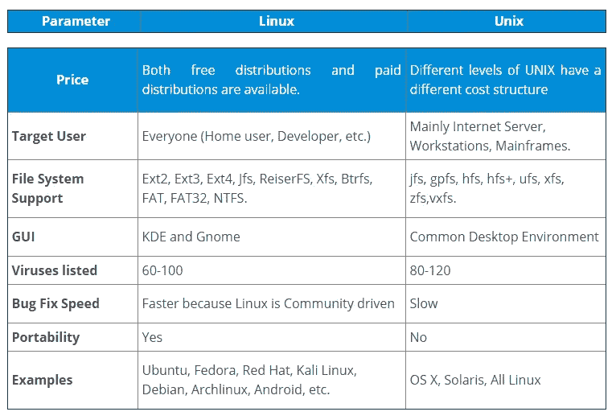

## 3.什么是 Linux 内核？编辑 Linux 内核合法吗？

Linux 内核是指底层系统软件。它用于管理资源并提供用户交互界面。

是的，编辑 Linux 内核是合法的。Linux 是根据通用公共许可证(General Public License)发布的。在 GPL 下发布的任何项目都可以被最终用户修改和编辑。

## 4.LILO 是什么？

**LILO** 代表**Linux**LOader。LILO 是一个 Linux 引导加载程序，它将 Linux 操作系统加载到主内存中开始执行。大多数电脑都带有用于特定版本的 Windows 或 Mac OS 的引导加载程序。所以，当你想使用 Linux OS 的时候，你需要为它安装一个专门的引导加载程序。LILO 就是这样一个引导加载程序。

当计算机启动时，BIOS 进行一些初始测试，并将控制转移到主引导记录。从这里，LILO 加载并启动 Linux 操作系统。

使用 LILO 的好处是它允许快速引导 Linux 操作系统。

## 5.Linux 的基本组件是什么？

Linux 的基本组件是:

*   **内核**:它是操作系统的核心组件，管理操作和硬件。
*   Shell**:Shell 是一个用于执行命令的 Linux 解释器。**
*   **GUI** : **GUI** 代表**图形用户界面**，是用户与系统交互的另一种方式。但与 CLI 不同的是，GUI 由图像、按钮、用于交互的文本框组成。
*   **系统实用程序**:这些是允许用户管理电脑的软件功能。
*   **应用程序**:为完成特定任务而设计的软件程序或功能集。

## 6.Linux 中使用的 Shells 有哪些？

Linux 中最常用的 Shells 是

*   bash:Bourne**A**gain**Sh**ell 是大多数 Linux 发行版的缺省值
*   **ksh:****K**orn**Sh**ell 是一个高级编程语言 shell
*   ell 遵循类似 C 的语法，并提供拼写纠正和作业控制
*   **zsh: Z** **Sh** ell 提供了一些独特的功能，如文件名生成、启动文件、登录/注销观察、关闭注释等。
*   fish: F 友好地**I**interactive**Sh**ell 提供了一些特殊功能，如基于 web 的配置、自动建议，完全可以用干净的脚本编写

## 7.什么是交换空间？

交换空间是 Linux 使用的额外空间，当 RAM 没有足够的空间容纳程序时，它临时容纳并发运行的程序。当你运行一个程序时，它驻留在内存中，这样处理器就可以快速获取数据。假设你正在运行的程序比 RAM 所能容纳的要多，那么这些正在运行的程序就存储在交换空间中。处理器现在将在 RAM 和交换空间中寻找数据。

Linux 使用交换空间作为 RAM 的扩展。

## 8.BASH 和 DOS 有什么区别？

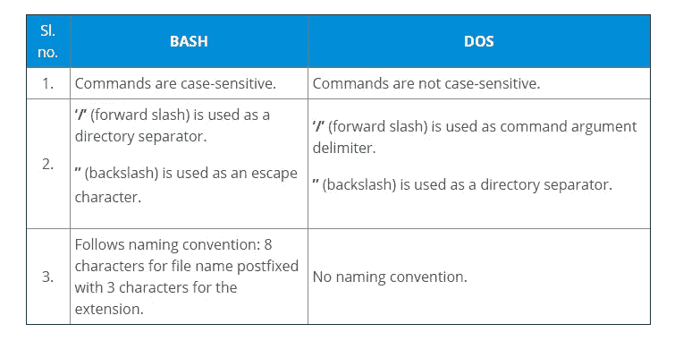

## 9.您将使用什么命令来检查 Linux 使用了多少内存？

*   `free -m`
*   `vmstat`
*   `top`
*   `htop`

## 10.解释 Linux 中的文件权限。

Linux 中有 3 种权限:

1.  **读取**:允许用户打开并读取文件
2.  **写**:允许用户打开和修改文件
3.  **执行**:允许用户运行文件。

您可以使用`**chmod**`命令更改文件或目录的权限。使用 **chmod** 命令有两种模式:

1.  **符号模式**
2.  **绝对模式**

## 符号模式

使用符号模式更改权限的一般语法如下:

`$ chmod <target>(+/-/=)<permission> <filename>`

其中 `<permissions>`可以是**r:read；w:写；x:执行**。

`<target>`可以是 **u:用户；g:组；o:其他；答:全部**

`'+'`用于添加权限

`'-'`用于删除权限

`'='`用于设置权限

例如，如果您要设置权限，使用户可以读取、写入和执行该权限，您的组成员可以读取和执行该权限，而其他人只能读取该权限。

那么这个命令将是:

`$ chmod u=rwx,g=rx,o=r filename`

## 绝对模式

使用绝对模式更改权限的一般语法如下:

`$ chmod <permission> filename`

绝对模式遵循八进制表示。最左边的数字代表用户，中间的数字代表用户组，最右边的数字代表所有人。

下表解释了可以使用的数字的含义及其效果。

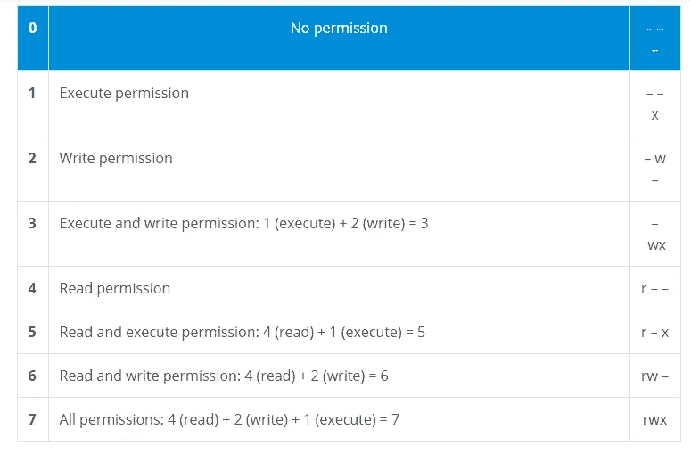

## 11.什么是 inode 和进程 id？

例如，如果您要设置权限，使用户可以读取、写入和执行该权限，您的组成员可以读取和执行该权限，而其他人只能读取该权限。

那么这个命令将是:

`$ chmod 754 filename`

## 11.什么是 inode 和进程 id？

**inode** 是操作系统赋予每个文件的唯一名称。类似地，**进程 id** 是赋予每个进程的唯一 id。

## 12.哪些是 Linux 目录命令？

Linux 中有 5 个主要的目录命令:

**pwd** :显示当前工作目录的路径。

语法:`$ pwd`

**ls** :列出当前工作目录下的所有文件和目录。

语法:`$ ls`

**cd** :用于改变当前工作目录。

语法:`$ cd <path to new directory>`

**mkdir** :创建一个新目录

语法:`$ mkdir <name (and path if required) of new directory>`

**rmdir** :删除一个目录

语法:`$ rmdir <name (and path if required) of directory>`

## 13.什么是虚拟桌面？

虚拟桌面是一种允许用户在屏幕的物理限制之外使用桌面的功能。基本上，虚拟桌面创建一个虚拟屏幕来扩展正常屏幕的限制。

虚拟桌面有两种实施方式:

1.  切换桌面
2.  超大桌面

## 切换桌面

在切换桌面的情况下，您可以创建离散的虚拟桌面来运行程序。在这里，每个虚拟桌面将表现为一个单独的桌面，运行在每个桌面上的程序只能由使用该特定桌面的用户访问。

## 超大桌面

超大桌面不提供独立的虚拟桌面，但它允许用户在比物理屏幕更大的桌面上平移和滚动。

## 14.vi 编辑器有哪些不同的模式？

**vi 编辑器**有三种模式:

1.  **常规/命令模式**:让您查看内容
2.  **插入/编辑模式**:允许您删除或插入内容
3.  **替换模式**:允许您覆盖内容

## 15.什么是守护进程？

守护程序是一种计算机程序，作为后台进程运行，提供基本操作系统中可能没有的功能。守护进程通常用于在后台运行服务，而不直接控制交互式用户。守护进程的目的是处理周期性的请求，然后将请求转发给适当的程序执行。

## 16.Linux 中的进程状态是什么？

流程状态如下:

*   **就绪**:流程创建完毕，准备运行
*   **运行:**流程正在执行
*   **阻塞或等待:**流程正在等待用户的输入
*   **终止或完成:**流程完成执行，或被操作系统终止
*   **僵尸:**进程终止，但信息仍存在于进程表中。

## 17.解释 grep 命令。

Grep 代表**全局正则表达式打印。**grep 命令用于通过基于正则表达式的模式匹配在文件中搜索文本。

**语法** : `grep [options] pattern [files]`

**示例**:

`$ grep -c "linux" interview.txt`

该命令将在“ **interview.txt** ”文件中打印单词“ **linux** ”的计数。

## 18.解释 Linux 中的进程管理系统调用

管理流程的系统调用包括:

*   **fork (** ):用于创建新流程
*   exec() :执行一个新程序
*   **wait()** :等待进程执行完毕
*   **exit()** :退出进程

用于获取进程 ID 的系统调用有:

*   **getpid()** :-获取进程的唯一进程 id
*   **getppid()** :-获取父进程的唯一 id

## 19.解释 Linux 中的“ls”命令

**ls** 命令用于列出指定目录下的文件。一般语法是:

`$ ls <options> <directory>`

例如，如果你想列出**示例**目录中的所有文件，那么命令将如下:

`$ ls Example/`

ls 命令可以使用不同的选项。这些选项提供了有关文件/文件夹的附加信息。例如:

## 20.解释重定向操作符。

重定向操作符用于将特定命令的输出重定向为另一个命令或文件的输入。

有两种使用方法:

**' > '** 覆盖文件现有内容或创建新文件。

**'>'>'**将新内容追加到文件末尾或创建新文件。

假设文件的内容如下:

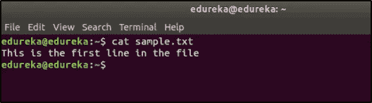

现在，当您使用 **' > '** 重定向操作符时，文件的内容将被覆盖。

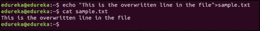

当您使用'>>'时，内容会被附加:

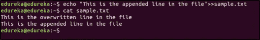

## 21.为什么使用 tar 命令？

**tar** 命令用于提取或创建存档文件。

假设您想从名为 sample.tar.gz 的归档文件中提取所有文件，那么命令将是:

`$ tar -xvzf sample.tar.gz`

假设您想要为存储在/home/linux/路径中的所有文件创建一个归档文件，那么命令将是:

`$ tar -cvzf filename.tar.gz`

其中 **c:创建归档，x:提取，v:详细，f:文件**

## 22.什么是门闩？

锁存器是由定时信号控制的临时存储器件，可以存储 0 或 1。锁存器有两种稳定状态(高输出或 1，低输出或 0)，主要用于存储状态信息。只要锁存器通电，它就可以存储一位数据。

## 23.什么是微处理器？

微处理器是一种执行指令的装置。它是一个单芯片设备，从存储器中取出指令，解码并执行。微处理器可以执行 3 种基本功能:

1.  像加法、减法、乘法和除法这样的数学运算
2.  将数据从一个内存位置移动到另一个
3.  根据条件做出决策，并根据决策跳转到新的不同指令。

## 24.解释正则表达式和 Grep

正则表达式用于搜索具有特定模式的数据。一些用于常规模式的命令有: **tr、sed、vi** 和 **grep。**

正则表达式中使用的一些常见符号有:

。匹配任意 character^匹配字符串的开头$匹配字符串的结尾*匹配零个或多个字符表示特殊字符？精确匹配一个字符

假设文件的内容如下:

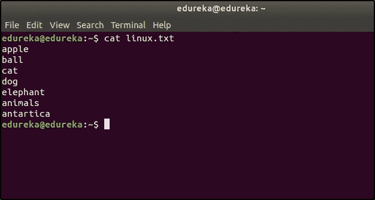

如果您想列出以字符“a”开头的条目，那么命令应该是:

`$ cat linux.txt | grep ^a`

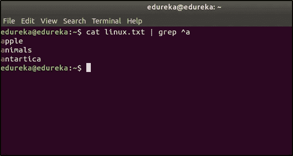

如果您想列出以字符“n”开头的条目，那么命令应该是:

`$ cat linux.txt | grep n`

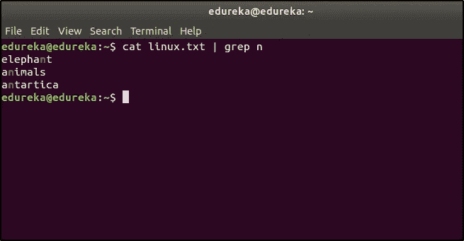

## 25.安装 Linux 最少需要多少磁盘分区？

所需的最小分区数是 2。

一个分区用作存储所有文件的本地文件系统。这包括操作系统文件、应用程序和服务文件以及用户文件。另一个分区用作交换空间，作为 RAM 的扩展内存。

# B 部分—基于情景的问题

面试官会问一些基于场景的问题和理论问题，以检验你有多少实践知识。在这部分 Linux 面试问题中，我们将讨论这样的问题。

## 1.如何在 Linux 下复制一个文件？

您可以在 Linux 中使用 **cp** 命令来复制文件。一般语法是:

`$ cp <source> <destination>`

假设您想从目录 **/new/linux** 中复制一个名为 **questions.txt** 的文件到 **/linux/interview，**中，那么命令将是:

`$ cp questions.txt /new/linux /linux/interview`

## 2.如何在 Linux 中终止一个正在运行的进程？

每个进程都有一个唯一的**进程 id。**要终止进程，我们首先需要找到进程 id。`ps` 命令将列出所有正在运行的进程以及进程 id。然后我们使用`kill`命令来终止该进程。

## 3.如何在 Linux 中重命名文件？

在 Linux 中，没有特定的命令来重命名文件。但是您可以使用复制或移动命令来重命名该文件。

然后删除旧文件。

列出所有进程的命令:

`$ ps`

假设您想要终止的进程的进程 id 是 3849，那么您必须像这样终止它:

`$ kill 3849`

## 3.如何在 Linux 中重命名文件？

在 Linux 中，没有特定的命令来重命名文件。但是您可以使用复制或移动命令来重命名该文件。

**使用移动命令**

`$ mv <oldname> <newname>`

**使用复制命令**

`$ cp <oldname> <newname>`

然后删除旧文件。

`$ rm <oldname>`

## 4.如何将命令的输出写入文件？

您可以使用**重定向**操作符(>)来完成此操作。

语法:`$ (command) > (filename)`

## 5.如何在 Linux 上看到挂载的设备列表？

通过运行以下命令:

`$ mount -l`

## 6.如何在 Linux 中找到一个文件存放的位置？

您可以使用 **locate** 命令找到文件的路径。

假设您想要查找文件名 sample.txt 的位置，那么您的命令应该是:

`$ locate sample.txt`

## 7.如何找到两个配置文件的区别？

为此，您可以使用 **diff** 命令:

`$ diff abc.conf xyz.conf`

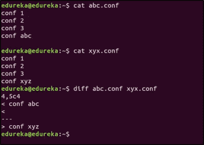

## 8.编写一个 bash 脚本，删除当前目录中包含单词“linux”的所有文件。

`for i in *linux*; do rm $i; done`

## 9.如何在不打开的情况下创建一个文本文件？

**触摸**命令可用于创建一个文本文件，而无需打开它。**触摸命令**将创建一个空文件。语法如下:

`$ touch <filename>`

假设您想要创建一个名为 sample.txt 的文件，那么命令应该是:

`$ touch sample.txt`

## 10.你如何在 Linux 中删除一个目录？

在 Linux 中，有两个命令可以用来删除目录。

*   **rmdir**

`$ rmdir <directory name>`

*   **rm -rf**

`$ rm -rf <directory name>`

**注意**:命令 **rm -rf** 应该小心使用，因为它会在没有任何警告的情况下删除所有数据。

## 11.在 Linux 中，你如何安排一个任务？

Linux 中调度任务有两个命令: **cron** 和 **at。**

cron 命令用于在特定时间重复调度任务。任务存储在 **cron** 文件中，然后使用 **cron** 命令执行。 **cron** 命令从该文件中读取字符串并调度任务。进入 **cron 文件**的字符串语法如下:

`<minute> <hour> <day> <month> <weekday> <command>`

假设您想在每周日下午 4 点运行一个命令，那么字符串应该是:

`0 16 * * 0 <command>`

**at** 命令用于在指定时间仅调度一次任务。

假设您想在今天下午 6 点关闭系统，那么命令应该是:

`$ echo "shutdown now" | at -m 18:00`

## 12.假设您尝试使用 rm 命令删除一个文件，但删除失败。可能的原因是什么？

*   指定给文件的路径或提到的文件名可能是错误的
*   试图删除该文件的用户可能没有删除该文件的权限。

## 13.如何看待一个名为 sample.z 的文件的内容？

**。z** 扩展名表示文件已经被压缩。要查看压缩文件的内容，您可以使用 **zcat** 命令。示例:

`$ zcat sample.z`

## 14.如何安全地将文件复制到软盘上？

按照以下步骤将文件安全地复制到软盘:

1.  安装软盘
2.  复制文件
3.  卸载软盘

如果不卸载软盘，数据可能会损坏。

## 15.如何识别你用的是哪个 shell？

打开终端并运行:

`$ echo $SHELL`

这将打印正在使用的 Shell 的名称。

## 16.如何从您的系统登录到网络中的另一个系统？

**SSH** 可以用于此。语法如下:

`ssh <username>@<ip address>`

假设您想以用户“mike”的身份登录到 IP 地址为 192.168.5.5 的系统，那么命令应该是:

`$ ssh mike@192.168.5.5`

## 17.如何使用 vim 编辑器以只读模式打开文件？

`$ vim -R <filename>`

## 18.如何使用 vim 编辑器在文件中搜索特定的员工 ID？

`$ vim +/<employee id to be searched> <filename>`

## 19.如何使用 vim 编辑器跳转到文件中的特定行？

`$ vim +<line number> <filename>`

## 20.如何将文本文件中的条目按升序排序？

这可以通过使用**排序**命令来完成。

`$ sort sample.txt`

## 21.export 命令是用来做什么的？

**导出**命令用于设置和重新加载环境变量。例如，如果您想要设置 Java 路径，那么命令应该是:

`$ export JAVA_HOME = /home/user/Java/bin`

## 22.你如何检查一个特定的服务是否在运行？

`$ service <servicename> status`

## 23.如何检查所有服务的状态？

`$ service --status-all`

## 24.如何启动和停止服务？

首先:

`$ service <servicename> start`

要停止:

`$ service <servicename> start`

## 25.解释免费命令。

此命令用于显示系统中可用的空闲、已用、交换内存。

典型自由命令输出。输出以字节显示。

`$ free`

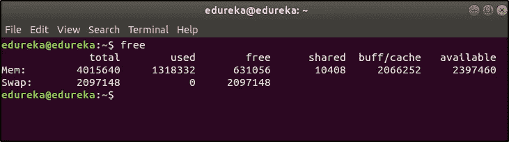

希望这些 Linux 面试问题能帮助你在面试中表现出色。我祝你一切顺利！

如果你想查看更多关于人工智能、DevOps、道德黑客等市场最热门技术的文章，你可以参考 Edureka 的官方网站。请留意本系列中解释操作系统其他方面的其他文章。

> *1。* [*Linux 命令*](/edureka/linux-commands-895d69fa4f07)
> 
> *2。* [*Top 75+ Unix 面试问答*](/edureka/unix-interview-questions-dba26b8a13bc)
> 
> *3。*[*Linux Mint*](/edureka/linux-mint-904d4de15c58)

*原载于 2020 年 6 月 18 日 https://www.edureka.co**的* [*。*](https://www.edureka.co/blog/interview-questions/linux-interview-questions-for-beginners/)