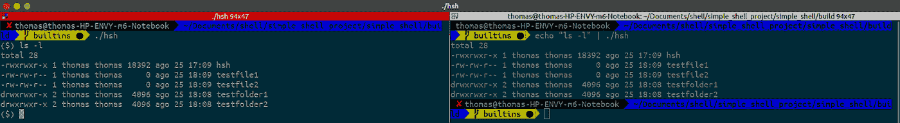
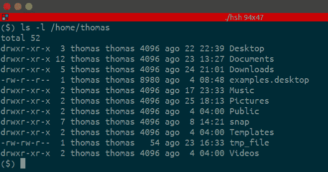
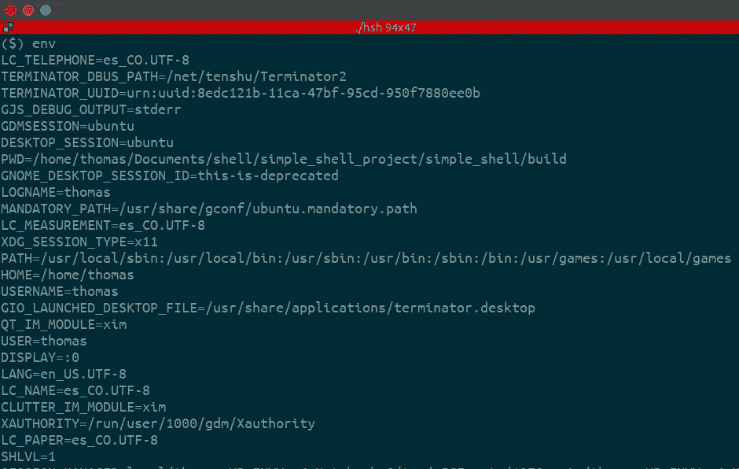
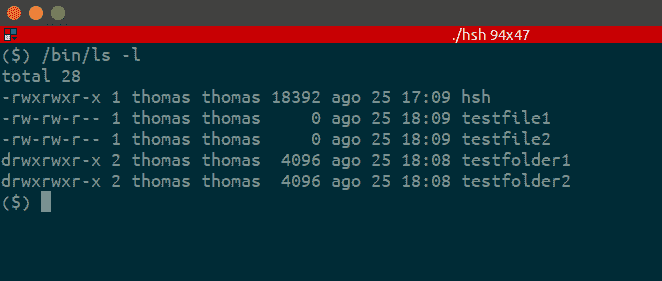
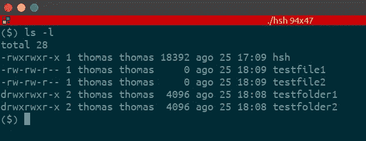
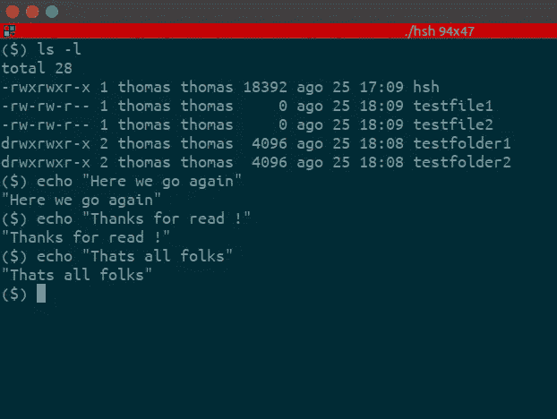

# 引擎盖下的 Linux 外壳！

> 原文：<https://medium.com/quick-code/linux-shell-under-the-hood-e1e9ca6d39f?source=collection_archive---------7----------------------->

Photo by [Sai Kiran Anagani](https://unsplash.com/@_imkiran?utm_source=medium&utm_medium=referral) on [Unsplash](https://unsplash.com?utm_source=medium&utm_medium=referral)

## 什么是 linux shell？

一个 **Shell** 是一个命令行解释器。它以交互和非交互的方式工作(以后不用再担心这个了)。

一个**外壳**为你提供了一个到 Unix 系统的接口。它收集你的输入，并根据输入执行程序。当一个程序完成执行时，它显示该程序的输出。

Shell 是一个我们可以运行命令、程序和 shell 脚本的环境。有不同风格的外壳，就像有不同风格的操作系统一样。每种风格的 shell 都有自己的一套可识别的命令和函数。

## Shell 提示符

提示符(**$)**称为**命令提示符**，由 shell 生成。当提示符显示时，您可以键入命令。

在你按下**回车**后，Shell 读取你的输入。它通过查看您输入的第一个单词来确定您想要执行的命令。单词是一组完整的字符。空格和制表符分隔单词。

# 但是怎么做呢？

## 注意:

*   在这篇博客中，我们将使用自己的 UNIX shell，运行在 ubuntu 的 terminator 上。
*   你可以在这里找到关于如何使用我们的 shell 的详细信息:[https://github.com/thomasmontoya123/simple_shell](https://github.com/thomasmontoya123/simple_shell)。

# 背后的算法:

左边是交互模式，右边是非交互模式。

## 1.检查 shell 应该在交互模式还是非交互模式下工作:

为此，我们使用了 **isatty()** 函数。 **isatty()** 测试 ***fd*** *(文件描述符)*是否为引用终端的打开文件描述符。 **isatty()** 如果 *fd* 是引用终端的打开文件描述符，则返回 1；否则，返回 0，并且设置 *errno* 以指示错误。

## 2.如果外壳应该在交互模式下工作:

显示提示 **($ )** 并等待用户输入。

## 3.用户输入后:

在用户写了一些东西( **ls -l** )之后，我们需要将输入存储在某个地方，为此我们使用了 _getline()函数，它是 getline()函数的实现。

getline()从流中读取一整行，将包含文本的缓冲区地址存储到*lineptr 中。缓冲区以空终止，如果找到换行符，则包含换行符。

如果*lineptr 为 NULL，那么 getline()将分配一个缓冲区来存储该行，该缓冲区应该由用户程序释放。(在这种情况下，忽略*n 中的值)

## 4.多于一个单词的输入:

您可能知道，通常 shell 命令和内置命令都有标志，这些标志是该命令或内置命令的选项。本例中为( **-l** )，表示长格式。用户也可以写下他们想要执行动作的路径。让我们来看一个例子:某个文件夹( **/home/thomas** ) **中长格式( **-l** )的 list ( **ls** )。**

**5。拆分输入:**

为了检查这些选项，我们需要将所有输入拆分成单个单词，因此我们实现了自己的 **strtok()** 函数。

**strtok()** 根据分隔符将整个字符串分割成子字符串(更多内容在逐步过程中)。

函数的作用是:将一个字符串解析成一系列的符号。在第一次调用 **strtok** ()时，要解析的字符串应该在 *str* 中指定。在应该解析相同字符串的每个后续调用中， *str* 应该为空。

*delim* 参数(在本例中为空格)指定了一组字节，用于在解析后的字符串中分隔标记。调用者可以在解析相同字符串的连续调用中在 *delim* 中指定不同的字符串。所以每次 **strtok()** 找到一个分隔符(空格)，字符串就被分割。

用 **_getline()** 我们只得到一个字符串( **ls -l** )。在 **strtok()** 之后，我们得到:

*   字符串 1 = ls。
*   字符串 2 = -l。

**6。分析第一个字符串。**

我们需要检查第一个子串是命令还是内置的，在这种情况下，我们的第一个子串或标记是( **ls** ) 命令。

**内置**是一个命令或函数，从外壳调用，直接在外壳中执行，而不是外壳加载和执行的外部可执行程序(更多内容请参见本文的“关于进程”一节):

**env** 内置示例:

我们将第一个字符串与我们的内置函数进行比较，我们的内置函数是:

*   **cd -** 更改目录。
*   **帮助-** 打印外壳帮助。
*   **退出-** 从外壳中退出。
*   打印环境变量。

正如你看到的 **ls** 不是内置的，现在我们必须找出它是否是一个命令。我们不知道那个命令在哪里(它驻留在 **/bin/ls，** ok 我们知道但是计算机不知道)所以我们需要找到它，为此我们构建了路径管理。路径管理在计算机中搜索该命令。

没有路径管理:

而且我们不想每次都写命令驻留在哪里，因为这很费事！

使用路径管理:

**7。关于过程。**

现在我们准备运行命令…..但是我们不能在同一个 shell **进程**中运行它，所以我们使用 **fork()** 函数创建了一个子进程。

fork() 通过复制调用进程(本例中是 shell)来创建一个新进程。新流程被称为**子流程**(其中 **ls** 将被执行)。调用进程被称为父进程。

子进程和父进程在不同的内存空间中运行。在 fork()时，两个内存空间具有相同的内容。其中一个进程执行的内存写入、文件映射和取消映射不会影响另一个进程。子进程是父进程的精确副本。

成功时，父进程返回子进程的 **PID** (进程 ID)，子进程返回 **0** 。失败时，父进程返回-1，不创建子进程，并适当设置 errno。

**8。执行命令。**

现在我们有了子进程(此时是 shell 的副本)。计算机有运行命令的绿灯。为此，我们使用了 **execve()** 函数。执行()执行*文件名*指向的程序。*文件名*必须是二进制可执行文件。

**execve** ()不返回成功，调用进程的文本、数据、bss 和堆栈被加载的程序覆盖(现在子进程不再是 shell 的副本，命令 **ls -l** 已经被执行到子进程中)

Tadaa 到目前为止，该命令已经成功执行，您应该在屏幕上看到如下内容:

**9。清洁一切**

还记得 **getline()** 和 **strtok()** 函数**吗？我们占用了一些我们不再需要的内存。所以我们必须使用 **free()** 来释放它，系统可以在其他地方使用这些资源**。****

**10。重新开始。**

如果命令不是 **exit，**并且我们在交互模式下工作，我们再次显示提示，过程重新开始。

