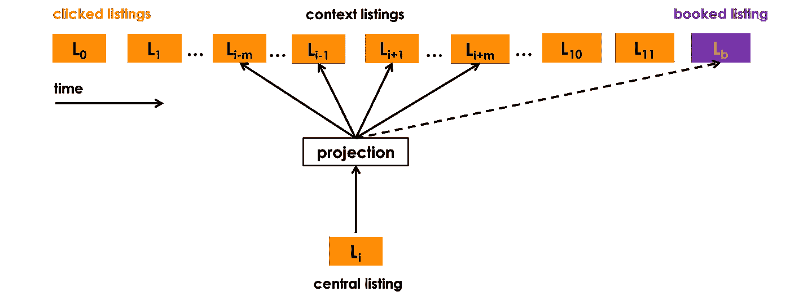
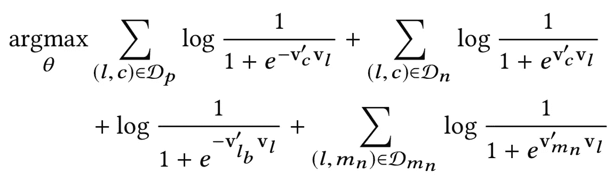
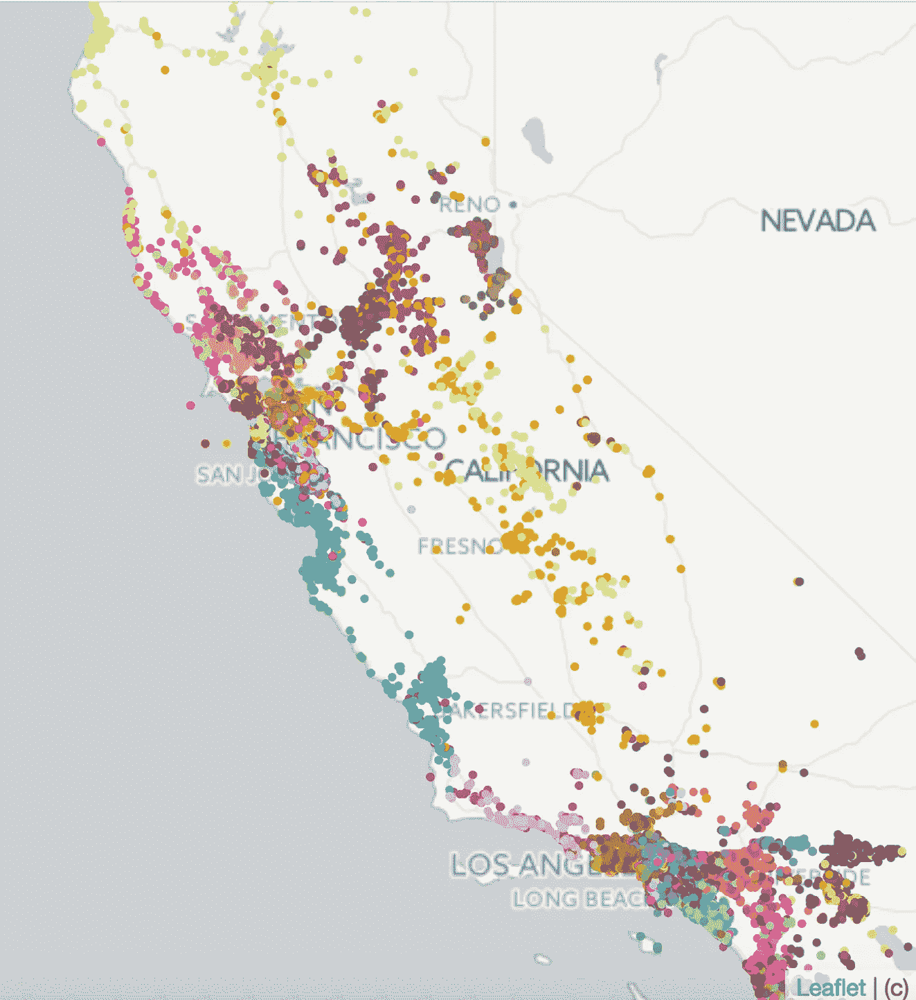
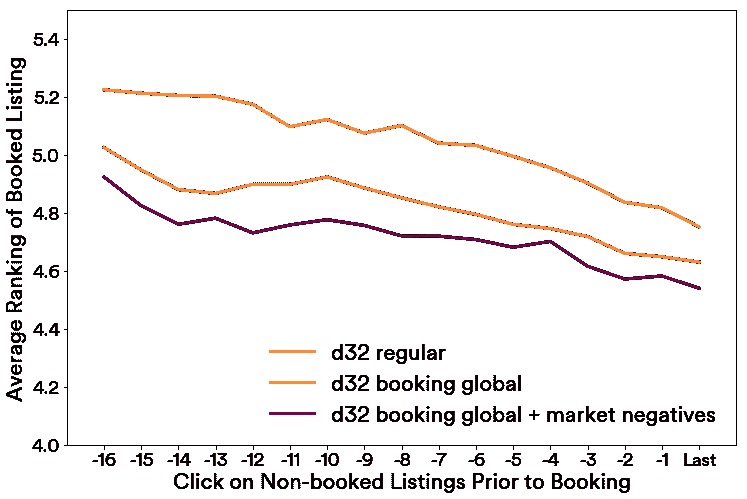
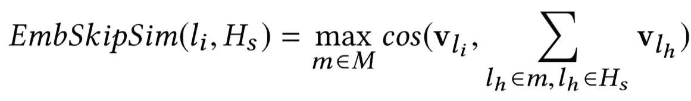
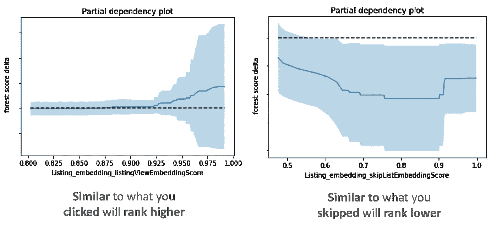

# 在搜索排名中列出嵌入

> 原文：<https://medium.com/airbnb-engineering/listing-embeddings-for-similar-listing-recommendations-and-real-time-personalization-in-search-601172f7603e?source=collection_archive---------0----------------------->

## 相似列表推荐的列表嵌入和搜索排名中的实时个性化

米哈伊洛·格博维奇、程海彬、张清、杨琳、菲利普·西克莱特和马特·琼斯

Airbnb 的 marketplace 包含数百万种不同的房源，潜在的客人可以通过搜索结果来探索这些房源，这些搜索结果是由一个复杂的机器学习模型生成的，该模型使用 100 多个信号来决定如何在搜索页面上对特定的房源进行排名。一旦客人查看了房屋，他们可以通过返回结果或浏览类似的列表转盘继续搜索，其中显示了与当前列表相关的列表推荐。搜索排名和类似的列表共同推动了我们 99%的预订转化。

在这篇博文中，我们描述了一种我们在 Airbnb 开发和部署的列表嵌入技术，目的是改善类似的列表推荐和搜索排名中的实时个性化。嵌入是从搜索会话中学习的 Airbnb 房屋的矢量表示，允许我们测量房源之间的相似性。它们有效地编码了许多列表特征，例如位置、价格、列表类型、架构和列表风格，所有这些仅使用 32 个浮点数。我们相信，用于个性化和推荐的嵌入方法对于 Web 上任何类型的在线市场都是非常强大和有用的。

# **嵌入背景**

在许多自然语言处理(NLP)应用中，将单词表示为高维稀疏向量的经典语言建模方法已经被通过使用神经网络来学习单词嵌入(即单词的低维表示)的神经语言模型所取代。基于在句子中频繁出现在一起的单词也共享更多的统计相关性的假设，通过直接考虑词序和它们的共现来训练网络。随着用于词表示学习的高度可扩展的连续词袋和跳格语言模型的发展，嵌入模型已经显示出在大文本数据上训练后在许多传统语言任务上获得最先进的性能。

最近，嵌入的概念已经从单词表示扩展到 NLP 领域之外的其他应用。来自网络搜索、电子商务和市场领域的研究人员已经认识到，就像可以通过将句子中的单词序列视为上下文来训练单词嵌入一样，可以通过将用户动作序列视为上下文来训练用户动作的嵌入。例子包括学习被点击或购买的物品的[表示或者被点击的](https://arxiv.org/pdf/1606.07154.pdf)的[查询和广告。这些嵌入随后被用于网络上的各种推荐。](https://arxiv.org/pdf/1607.01869.pdf)

# **列表嵌入**

假设给我们一个从 *N* 个用户获得的点击会话的数据集，其中每个会话 s=(L₁,…,Ln)∈ S 被定义为被用户点击的 n 个列表 id 的连续序列。每当两次连续用户单击之间的时间间隔超过 30 分钟时，就会启动新的会话。给定该数据集，目标是学习每个唯一列表 Li 的 32 维实值表示 **v** (Li) ∈ R ，使得相似列表位于嵌入空间的附近。

列表嵌入的维数被设置为 *d = 32* ，因为我们发现这是离线性能(在下一节中讨论)和为了实时相似性计算的目的在搜索机器的 RAM 存储器中存储向量所需的存储器之间的一个很好的折衷。

存在几种不同的训练嵌入的方式。我们将关注一种叫做[负采样](https://papers.nips.cc/paper/5021-distributed-representations-of-words-and-phrases-and-their-compositionality.pdf)的技术。它首先初始化随机向量的嵌入，然后通过以滑动窗口方式读取搜索会话，经由随机梯度下降来更新它们。在每个步骤中，通过将中心列表*的向量推得更靠近在长度为 *m* ( *m* = 5) *、*的窗口内由同一用户在中心列表前后点击的 列表的向量，并将其推得远离 ***负面上下文列表:*** 随机抽样列表(T33)*

**

*为了简洁起见，我们将跳过培训过程的细节，重点解释我们为使这种方法适应我们自己的用例所做的一些修改:*

*   ***使用预订列表作为全局上下文:**我们使用以用户预订列表(紫色列表)结束的会话来调整优化，以便在每一步，我们不仅预测邻近的点击列表，还预测最终预订的列表。当窗口滑动时，一些列表落入或脱离上下文集合，而预订的列表总是作为全局上下文(虚线)保留在其中，并用于更新中央列表向量。*
*   ***适应聚集搜索:**在线旅游预订网站的用户通常只在一个市场内搜索，即他们想呆的地方。结果，对于给定的*中心列表*，正**上下文列表*主要由来自相同市场的列表组成，而负*上下文列表*主要由不来自相同市场的列表组成，因为它们是从整个列表词汇中随机抽样的。我们发现这种不平衡导致学习次优的市场内相似性。为了解决这个问题，我们建议添加一组随机否定 *Dmn，*从中心上市的市场中取样。**

**考虑到上述所有因素，最终优化目标可以表述为**

****

****booking global context + market negatives** optimization formula**

**在哪里**

*   ***l* 是正在更新其向量 **v** (l)的*中央列表***
*   ***Dp* 是一组正的对( *l* ， *c* )，它们表示(*中心列表*，*上下文列表*)元组，这些元组的向量被推向彼此**
*   ***Dn* 是一组负的对( *l* ， *c* )，它们表示(*中心列表*，*随机列表*)元组，这些元组的向量被相互推开**
*   ***lb* 是被视为全局上下文并被推向中央列表向量的预订列表**
*   ***Dmn* 是一组市场否定对( *l* ，mn)，它们代表(*中央列表*，*来自同一市场的随机列表*)元组，这些元组的向量被相互推开**

**使用所描述的优化程序，我们使用超过 *8 亿次搜索点击会话*学习了 Airbnb 上*450 万个活跃列表*的列表嵌入，从而产生了高质量的列表表示。**

****冷启动嵌入。每天都有新的房源由主机创建并在 Airbnb 上发布。此时，这些列表没有嵌入，因为它们没有显示我们的训练数据。为了创建新列表的嵌入，我们找到 3 个地理上最接近的列表，它们确实有嵌入，并且与新列表具有相同的列表类型和价格范围，并计算它们的平均向量。****

# ****嵌入学到了什么？****

****

**为了评估嵌入捕获了列表的哪些特征，我们从几个方面对它们进行了检查。首先，为了评估地理相似性是否被编码，我们对学习到的嵌入进行了 k-means 聚类。左边的图显示了在加利福尼亚产生的 100 个聚类，证实了来自相似位置的列表被聚类在一起。接下来，我们评估了不同类型(整个家庭、私人房间、共享房间)和价格范围的列表之间的平均余弦相似性，并确认了相同类型和价格范围的列表之间的余弦相似性比不同类型和价格范围的列表之间的相似性高得多。因此，我们可以得出结论，这两个列表特征也很好地编码在学习嵌入中。**

**虽然诸如价格的一些列表特征不需要学习，因为它们可以从列表元数据中提取，但是其他类型的列表特征，诸如架构、风格和感觉，以列表特征的形式提取要困难得多。为了评估这些特征，并能够在嵌入空间中进行快速简单的探索，我们开发了一个内部相似性探索工具，在下面的视频中演示。**

**该视频提供了许多嵌入的例子，能够找到相同独特建筑的类似列表，包括船屋、树屋、城堡等。**

# ****上市嵌入线下评估****

**在真实搜索流量上测试推荐应用中的嵌入之前，我们进行了几次离线测试。我们还使用这些测试来比较几个不同的训练嵌入，以实现关于嵌入维度、算法修改的不同想法、训练数据构造、超参数选择等的快速决策。**

**评估经过训练的嵌入的一种方法是，基于用户最近的点击，测试它们在推荐用户将预订的列表方面有多好。**

**更具体地说，假设我们得到了最近点击的列表和需要排序的候选列表，其中包含用户最终预订的列表。通过计算被点击的列表和候选列表的嵌入之间的余弦相似性，我们可以对候选进行排序，并观察预订列表的排序位置。**

**在下图中，我们展示了一个此类评估的结果，其中搜索中的列表根据嵌入空间的相似性进行了重新排名，已预订列表的排名是对导致预订的每次点击进行平均，追溯到预订前的 17 次点击到预订前的最后一次点击。**

****

**我们比较了几个嵌入版本 **1) d32 常规**在没有对[原始嵌入算法](https://papers.nips.cc/paper/5021-distributed-representations-of-words-and-phrases-and-their-compositionality.pdf)、 **2) d32 预订全球**在预订作为全球背景的情况下训练，以及 **3) d32 预订全球+市场否定**在预订作为全球背景和来自相同市场的明确否定(来自我们的公式)的情况下训练。从预订列表一贯较低的平均排名我们可以得出结论， **d32 预订全球+市场负面**优于其他两个嵌入模型。**

# ****使用嵌入的相似列表****

**每个 Airbnb 首页房源页面都包含一个类似的房源转盘，它会推荐与之相似的房源，并在相同的日期提供房源。**

****

**在测试嵌入时，相似列表的现有算法包括调用与给定列表相同位置的主搜索排名模型，然后根据与给定列表相同的价格范围和列表类型进行过滤。**

**我们进行了一个 A/B 测试，其中我们将现有的相似列表算法与我们基于嵌入的解决方案进行了比较，在基于嵌入的解决方案中，相似列表是通过在列表嵌入空间中找到 k 个最近邻居来产生的。更准确地说，给定学习的列表嵌入，通过计算给定列表 *l* 的向量 **v** ( *l* )和来自同一市场的在同一组日期(如果设置了登记和结账日期)可用的所有列表的向量 **v** ( *l* j)之间的余弦相似性，找到给定列表*l*的相似列表。具有最高相似性的 k=12 个列表被显示为相似列表。**

**A/B 测试显示，基于嵌入的解决方案导致相似列表转盘 CTR 增加**21%**和 **4.9%的客人发现了他们最终在相似列表转盘中预订**的列表。**

# ****使用嵌入的搜索中的实时个性化****

**到目前为止，我们已经看到嵌入可以用来有效地计算清单之间的相似性。我们的下一个想法是在搜索排名中利用这一功能进行实时会话个性化，目的是向客人 ***显示更多与我们认为他们自搜索会话开始以来喜欢的*** 相似的列表，以及更少与我们认为他们不喜欢的 ***相似的列表。*****

**为了实现这一点，我们为每个用户收集并实时维护(使用 Kafka)两组短期历史事件:**

1.  *****Hc*** :用户在过去两周内点击的一组列表 id。**

****接下来，每次用户进行搜索时，我们为搜索中返回的每个 ***候选列表*** *lᵢ* 计算 2 个相似性度量。****

*   *******EmbClickSim****:*候选列表嵌入与用户点击的列表嵌入之间的相似度(来自 *Hc* )。******

********

****具体来说，我们计算来自 *Hc* 的市场级质心之间的相似性，并选择最大相似性。例如，如果 *Hc* 包含来自纽约和洛杉矶的列表，这两个市场的列表的嵌入将被平均以形成市场级质心。****

*   *******EmbSkipSim****:*候选列表嵌入与用户跳过的列表嵌入之间的相似性(来自 *Hs*******

********

****接下来引入这两个相似性度量，作为我们的搜索排名机器学习模型在对候选列表进行排名时考虑的附加信号。****

****这是通过首先记录两个嵌入相似性特征以及其他搜索排名特征来完成的，因此我们可以为模型训练创建新的标记数据集，然后继续训练新的排名模型，我们可以在 A/B 测试中针对当前生产排名模型进行测试。****

****为了评估新模型是否如我们预期的那样学会了使用嵌入相似性特征，我们绘制了它们的部分依赖图如下。这些图显示了如果我们固定除了单个特征(我们正在检查的一个特征)之外的所有特征的值，候选列表排名分数会发生什么。****

********

****在左边的子图中可以看到， *EmbClickSim* (列表类似于用户最近点击的列表)的较大值导致较高的模型得分。****

****在右边的子图中可以看到， *EmbSkipSim* (与用户跳过的列表相似的列表，即不喜欢的列表)的较大值导致较低的模型分数。****

****对部分依赖关系图的观察证实了特性行为与我们直观地预期模型将学习的内容相匹配。此外，新的嵌入特征在模型特征重要性排名中名列前茅，我们的*离线* *测试*显示，当嵌入特征被添加到模型中时，保留集的性能指标有所改善。这足以让我们决定继续进行*在线实验*，，该实验取得了成功，并导致在 2017 年夏天推出实时个性化的嵌入功能。****

*****对这类工作感兴趣？我们一直在寻找* [*有才华的人加入我们的数据科学和分析团队*](https://www.airbnb.com/careers/departments/data-science-analytics) *！*****

*****非常感谢整个搜索排名团队*对这个项目的贡献，*戴鹏和卢卡·罗，他们帮助我使用嵌入式技术推出了类似的列表，还有纳文·西瓦南达姆，他们在博客文章*上帮了大忙。****